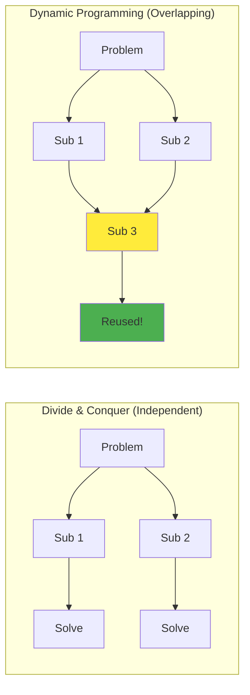
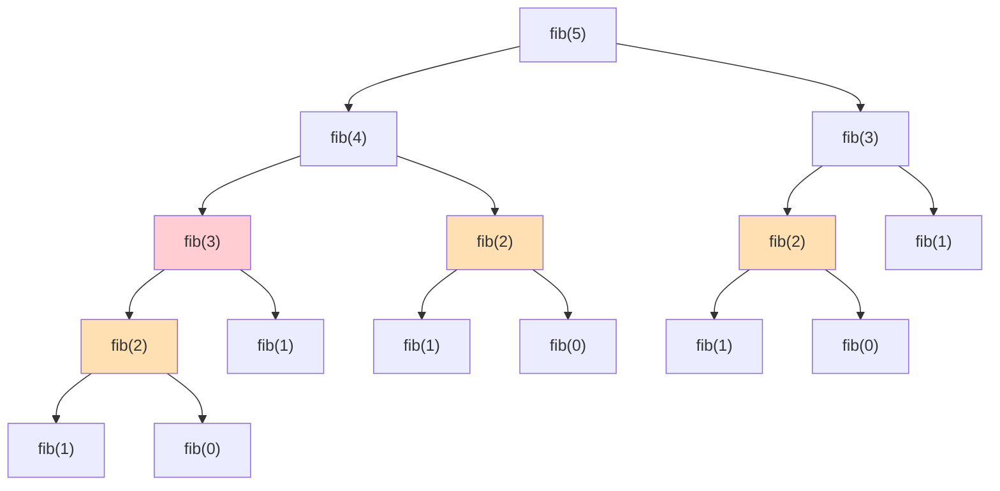
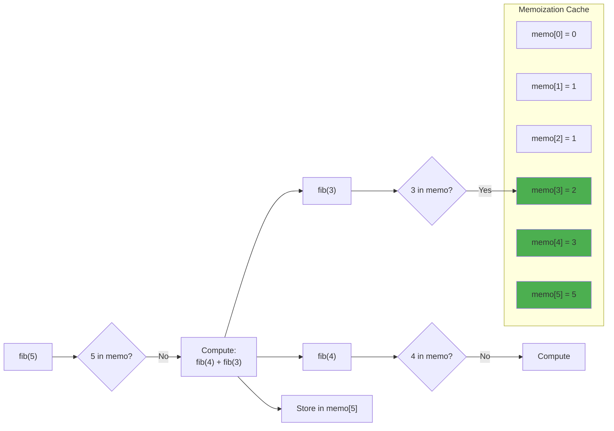

# Dynamic Programming Fundamentals

Dynamic programming (DP) is one of the most powerful algorithm design paradigms, enabling solutions to problems that would otherwise require exponential time. The core insight of dynamic programming is elegantly simple yet profoundly impactful: if a problem can be broken into overlapping subproblems, we can solve each subproblem once and store the result, eliminating redundant computation entirely.

The term "dynamic programming" was coined by Richard Bellman in the 1950s, though the word "programming" here refers to mathematical optimization and planning rather than computer programming in the modern sense. Bellman chose the name partly because it sounded impressive and would help secure research funding—a reminder that even foundational computer science concepts have pragmatic origins.

Dynamic programming finds applications across virtually every domain of computing: from finding shortest paths in networks to sequence alignment in bioinformatics, from natural language processing to financial modeling. Understanding DP is essential for any serious algorithmist because it provides a systematic way to transform brute-force exponential solutions into elegant polynomial-time algorithms.

## Key Characteristics

For dynamic programming to be applicable, a problem must exhibit two fundamental properties that together enable the DP approach to work correctly and efficiently.

### Optimal Substructure

A problem has **optimal substructure** if an optimal solution to the problem can be constructed from optimal solutions to its subproblems. This property is crucial because it guarantees that solving subproblems optimally leads to an optimal overall solution—we never need to consider suboptimal solutions to subproblems.

Consider the shortest path problem: the shortest path from A to C through intermediate point B consists of the shortest path from A to B combined with the shortest path from B to C. If either subpath were suboptimal, we could improve the overall path by substituting a better subpath. This recursive structure is what allows DP to build optimal solutions incrementally.

Not all optimization problems have optimal substructure. The longest simple path problem (finding the longest path that doesn't repeat vertices) lacks this property because the optimal path from A to C might use vertices that prevent the optimal path from C to the destination. Recognizing whether a problem has optimal substructure is often the first step in determining if DP applies.

### Overlapping Subproblems

The second requirement is that the recursive solution involves solving the same subproblems multiple times. This **overlap** is what makes memoization or tabulation worthwhile—if each subproblem were unique, storing solutions would provide no benefit.

The degree of overlap determines how much speedup DP provides. In Fibonacci, the overlap is extreme: computing fib(n) requires computing fib(n-1) and fib(n-2), each of which requires fib(n-2) and fib(n-3), creating an exponential explosion of redundant calculations. DP eliminates this entirely, reducing the number of unique subproblems from exponential to linear.

When both properties exist, DP transforms exponential solutions into polynomial ones—often the difference between algorithms that complete in microseconds versus those that would run longer than the age of the universe.

## DP vs Divide and Conquer

Understanding how DP differs from divide and conquer clarifies when to use each approach and why the distinction matters for algorithm design.



| Aspect | Divide & Conquer | Dynamic Programming |
|--------|-----------------|---------------------|
| Subproblems | Independent | Overlapping |
| Solving | Top-down only | Top-down or bottom-up |
| Storage | No memoization | Memoization table |
| Example | Merge sort | Fibonacci |

Divide and conquer algorithms like merge sort and quicksort divide the input into independent subproblems. When sorting the left half of an array, we don't reuse any work from sorting the right half. This independence means there's no benefit to caching subproblem results.

In contrast, DP problems have substantial overlap. Computing the 10th Fibonacci number requires the 9th, which requires the 8th, and so on. Both paths eventually need the 5th Fibonacci number. Caching ensures we compute it only once, regardless of how many paths lead to that subproblem.

## Classic Example: Fibonacci

The Fibonacci sequence provides the clearest illustration of how DP transforms algorithmic efficiency. Each Fibonacci number is the sum of the two preceding ones: 0, 1, 1, 2, 3, 5, 8, 13, 21, and so on. This simple recurrence conceals surprisingly rich computational challenges.

### Naive Recursion: $O(2^n)$

```python
def fib_naive(n):
    if n <= 1:
        return n
    return fib_naive(n-1) + fib_naive(n-2)
```

The naive recursive implementation directly translates the mathematical definition, but creates a catastrophic performance problem. The call tree branches at every step, creating approximately $2^n$ total calls. Computing fib(40) requires billions of function calls; fib(50) would take years.



The fundamental issue is that fib(5) computes fib(3) **twice**, fib(2) **three times**, and fib(1) **five times**. These redundant calculations compound exponentially as $n$ grows. This is precisely the symptom that indicates DP can help.

### Top-Down with Memoization: $O(n)$

```python
def fib_memo(n, memo={}):
    if n in memo:
        return memo[n]
    if n <= 1:
        return n
    memo[n] = fib_memo(n-1, memo) + fib_memo(n-2, memo)
    return memo[n]
```

Memoization adds a cache that stores each computed result. Before recursing, we check if the answer is already known. This simple modification reduces time complexity from $O(2^n)$ to $O(n)$ because each of the $n$ subproblems is computed exactly once. The trade-off is $O(n)$ space for the cache plus $O(n)$ space for the recursion stack.



### Bottom-Up Tabulation: $O(n)$

```python
def fib_table(n):
    if n <= 1:
        return n
    dp = [0] * (n + 1)
    dp[1] = 1
    for i in range(2, n + 1):
        dp[i] = dp[i-1] + dp[i-2]
    return dp[n]
```

Bottom-up tabulation eliminates recursion entirely by computing values in order from smallest to largest. This approach has the same $O(n)$ time complexity but avoids recursion overhead and stack overflow risks. For large $n$, tabulation is often faster in practice despite the same theoretical complexity.

**DP Table Visualization for fib(6)**:

| i | 0 | 1 | 2 | 3 | 4 | 5 | 6 |
|---|---|---|---|---|---|---|---|
| dp[i] | 0 | 1 | 1 | 2 | 3 | 5 | **8** |
| | ← | ← | ← | ← | ← | ← | ← |

Each cell depends only on the two preceding cells: $\text{dp}[i] = \text{dp}[i-1] + \text{dp}[i-2]$

### Space-Optimized: $O(1)$

```python
def fib_optimized(n):
    if n <= 1:
        return n
    prev, curr = 0, 1
    for _ in range(2, n + 1):
        prev, curr = curr, prev + curr
    return curr
```

Since each Fibonacci number depends only on the two preceding values, we can discard earlier results. This optimization reduces space from $O(n)$ to $O(1)$ while maintaining $O(n)$ time. Not all DP problems allow such aggressive space optimization, but recognizing when it's possible is an important skill.

## DP Design Process

Developing a DP solution follows a systematic process that becomes intuitive with practice. Each step builds on the previous ones, and skipping steps often leads to bugs or suboptimal solutions.

### Step 1: Define the State

The state captures all information needed to describe a subproblem uniquely. Choosing the right state representation is often the hardest part of DP design. Too little information and the recurrence won't be correct; too much and the state space explodes.

**Fibonacci**: State = index n
**Knapsack**: State = (item index, remaining capacity)
**Edit Distance**: State = (position in string 1, position in string 2)

A good state definition should make the recurrence relation natural to express. If you're struggling to write the recurrence, the state may need refinement.

### Step 2: Write the Recurrence

Express how to compute the solution for a state using solutions to smaller states. The recurrence relation is the heart of any DP algorithm.

```
fib(n) = fib(n-1) + fib(n-2)
```

The recurrence should capture all possible ways to reach the current state from smaller states. For optimization problems, this typically involves taking the minimum or maximum over all possibilities.

### Step 3: Identify Base Cases

Base cases are the smallest subproblems with known answers that don't require further recursion. Every path through the recurrence must eventually reach a base case.

```
fib(0) = 0
fib(1) = 1
```

Missing or incorrect base cases are one of the most common sources of DP bugs. Verify that your base cases cover all paths through the recurrence.

### Step 4: Determine Computation Order

For bottom-up DP, subproblems must be computed before they're needed. The computation order follows from the dependencies in the recurrence relation.

For Fibonacci, we compute values in increasing order of n because fib(n) depends on fib(n-1) and fib(n-2). For 2D problems like edit distance, we typically iterate row by row, left to right within each row.

### Step 5: Optimize Space (if possible)

If dp[i] only depends on recent values, we can discard older values and reduce space complexity. This optimization is worth considering once the basic solution works correctly.

## Common DP Patterns

Most DP problems fall into recognizable categories. Learning these patterns helps identify the appropriate state representation and recurrence structure quickly.

### 1D DP: Single Sequence

Single-sequence problems involve making decisions along a linear structure. The state typically includes just the current position.

**Climbing Stairs**: Ways to reach step n taking 1 or 2 steps at a time

```python
def climb_stairs(n):
    if n <= 2:
        return n
    dp = [0] * (n + 1)
    dp[1], dp[2] = 1, 2
    for i in range(3, n + 1):
        dp[i] = dp[i-1] + dp[i-2]
    return dp[n]
```

This pattern applies to coin change, house robber, and many other problems where we traverse a sequence making local decisions.

### 2D DP: Grid Problems

Grid problems involve navigating or optimizing over a two-dimensional space. The state includes coordinates in the grid.

**Unique Paths**: Ways to reach bottom-right of m×n grid moving only right or down

```python
def unique_paths(m, n):
    dp = [[1] * n for _ in range(m)]
    for i in range(1, m):
        for j in range(1, n):
            dp[i][j] = dp[i-1][j] + dp[i][j-1]
    return dp[m-1][n-1]
```

### Subsequence DP

Subsequence problems find optimal subsequences within sequences. The state tracks the current position and possibly characteristics of the subsequence built so far.

**Longest Increasing Subsequence (LIS)**

```python
def length_of_lis(nums):
    n = len(nums)
    dp = [1] * n  # dp[i] = LIS ending at i

    for i in range(1, n):
        for j in range(i):
            if nums[j] < nums[i]:
                dp[i] = max(dp[i], dp[j] + 1)

    return max(dp)
```

### String DP

String problems often involve comparing, transforming, or aligning strings. The state typically tracks positions in one or more strings.

**Edit Distance**: Minimum operations to transform word1 to word2

```python
def edit_distance(word1, word2):
    m, n = len(word1), len(word2)
    dp = [[0] * (n + 1) for _ in range(m + 1)]

    # Base cases
    for i in range(m + 1):
        dp[i][0] = i
    for j in range(n + 1):
        dp[0][j] = j

    for i in range(1, m + 1):
        for j in range(1, n + 1):
            if word1[i-1] == word2[j-1]:
                dp[i][j] = dp[i-1][j-1]
            else:
                dp[i][j] = 1 + min(
                    dp[i-1][j],      # Delete
                    dp[i][j-1],      # Insert
                    dp[i-1][j-1]     # Replace
                )

    return dp[m][n]
```

## Top-Down vs Bottom-Up

Both approaches solve the same problems with the same complexity, but each has practical advantages in different situations.

### Top-Down (Memoization)

Memoization preserves the natural recursive structure and adds caching on top. This approach is often easier to implement because it translates directly from the mathematical recurrence.

**Pros**:
- Natural translation from recursion
- Computes only needed subproblems
- Easier to write for complex state spaces

**Cons**:
- Recursion overhead
- Stack overflow for deep recursion
- Cache lookup overhead

### Bottom-Up (Tabulation)

Tabulation replaces recursion with iteration, filling a table in dependency order. This requires understanding the computation order but eliminates recursion overhead.

**Pros**:
- No recursion overhead
- Can optimize space more easily
- Often faster in practice

**Cons**:
- Must determine correct order
- May compute unneeded subproblems

## State Space Optimization

Once a correct DP solution exists, space optimization can often reduce memory requirements significantly.

### Rolling Array

When dp[i] only depends on dp[i-1], we only need to keep one previous value:

```python
# Before: O(n) space
dp = [0] * n
for i in range(1, n):
    dp[i] = f(dp[i-1])

# After: O(1) space
prev = 0
for i in range(1, n):
    prev = f(prev)
```

### Two Rows for 2D

When dp[i][j] only depends on row i-1, we only need two rows:

```python
# Before: O(m*n) space
dp = [[0] * n for _ in range(m)]

# After: O(n) space
prev = [0] * n
curr = [0] * n
```

## Debugging DP

DP bugs can be subtle and hard to diagnose. A systematic approach helps:

1. **Print the table**: Visualize how values propagate through the DP table
2. **Verify base cases**: Most bugs start with incorrect base cases
3. **Check recurrence on paper**: Trace through a small example by hand
4. **Validate dimensions**: Off-by-one errors are common in DP indices
5. **Test edge cases**: Empty inputs, single elements, and boundary conditions often reveal bugs

Dynamic programming is a skill that improves dramatically with practice. Once you've solved dozens of DP problems, the pattern recognition becomes second nature, and what once seemed like mysterious insight becomes systematic problem-solving.
