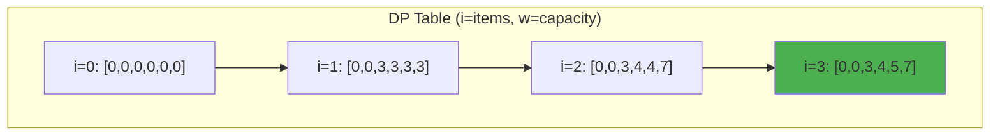

# Classic Dynamic Programming Problems

These fundamental DP problems form the foundation of dynamic programming expertise. Each problem illustrates a common pattern that recurs across countless applications in competitive programming, technical interviews, and real-world software systems. Mastering these problems builds intuition for recognizing DP opportunities and develops the mental models needed to tackle novel problems.

Understanding classic DP problems deeply means more than memorizing solutions—it means understanding why each approach works, recognizing the underlying structure that makes DP applicable, and knowing how to adapt solutions to variations. The problems presented here represent the essential vocabulary of dynamic programming.

## 0/1 Knapsack

The 0/1 Knapsack problem is perhaps the most famous optimization problem in computer science, appearing in resource allocation, investment portfolio optimization, cargo loading, and cryptography. The constraint that each item can be used at most once (hence "0/1"—either take it or don't) distinguishes it from the unbounded variant where items can be reused.

**Problem**: Given items with weights and values, maximize value within weight capacity. Each item used at most once.

The key insight is that for each item, we face a binary choice: include it or exclude it. The optimal solution to the full problem depends on optimal solutions to subproblems considering fewer items or smaller capacity. This optimal substructure, combined with overlapping subproblems (many different combinations require knowing the best value for the same remaining capacity), makes DP the natural approach.

The state captures what we need to make the next decision: which items remain available and how much capacity remains. We define $\text{dp}[i][w]$ as the maximum value achievable using items $0$ through $i-1$ with capacity $w$.

**Recurrence relation**:

$$\text{dp}[i][w] = \begin{cases}
0 & \text{if } i = 0 \text{ or } w = 0 \\
\text{dp}[i-1][w] & \text{if } \text{weight}[i-1] > w \\
\max(\text{dp}[i-1][w], \text{dp}[i-1][w - \text{weight}[i-1]] + \text{value}[i-1]) & \text{otherwise}
\end{cases}$$

```python
def knapsack_01(weights, values, capacity):
    n = len(weights)
    # dp[i][w] = max value using items 0..i-1 with capacity w
    dp = [[0] * (capacity + 1) for _ in range(n + 1)]

    for i in range(1, n + 1):
        for w in range(capacity + 1):
            # Don't take item i-1
            dp[i][w] = dp[i-1][w]
            # Take item i-1 if possible
            if weights[i-1] <= w:
                dp[i][w] = max(dp[i][w],
                              dp[i-1][w - weights[i-1]] + values[i-1])

    return dp[n][capacity]
```

**Time**: $O(n \times W)$, **Space**: $O(n \times W)$ or $O(W)$ with optimization

**DP Table Example** (weights=[2,3,4], values=[3,4,5], capacity=5):



The pseudo-polynomial time complexity deserves attention. While O(n × W) looks polynomial, W is a number, not a count. If W is represented in binary, the algorithm is actually exponential in the input size. This is why 0/1 Knapsack is NP-complete despite having this "efficient" algorithm for practical values of W.

### Space-Optimized Version

Since each row depends only on the previous row, we can reduce space from O(n × W) to O(W). The key insight is iterating capacity in reverse order to avoid overwriting values needed for the current item's calculation.

```python
def knapsack_01_optimized(weights, values, capacity):
    dp = [0] * (capacity + 1)

    for i in range(len(weights)):
        # Traverse backwards to avoid using same item twice
        for w in range(capacity, weights[i] - 1, -1):
            dp[w] = max(dp[w], dp[w - weights[i]] + values[i])

    return dp[capacity]
```

The reverse iteration is crucial: if we iterated forward, dp[w - weights[i]] might already reflect including item i, effectively allowing the same item to be used multiple times.

## Longest Common Subsequence (LCS)

The Longest Common Subsequence problem appears in DNA sequence alignment, file differencing (the `diff` command), version control systems, and plagiarism detection. Unlike substrings, subsequences need not be contiguous—characters can be spread throughout the string as long as their relative order is preserved.

**Problem**: Find longest subsequence common to two strings.

The state represents positions in both strings: $\text{dp}[i][j]$ is the length of the LCS of the first $i$ characters of s1 and the first $j$ characters of s2. The recurrence captures two cases: if the current characters match, we extend the LCS; if not, we take the better of skipping a character from either string.

**Recurrence relation**:

$$\text{dp}[i][j] = \begin{cases}
0 & \text{if } i = 0 \text{ or } j = 0 \\
\text{dp}[i-1][j-1] + 1 & \text{if } s1[i-1] = s2[j-1] \\
\max(\text{dp}[i-1][j], \text{dp}[i][j-1]) & \text{otherwise}
\end{cases}$$

```python
def lcs(s1, s2):
    m, n = len(s1), len(s2)
    dp = [[0] * (n + 1) for _ in range(m + 1)]

    for i in range(1, m + 1):
        for j in range(1, n + 1):
            if s1[i-1] == s2[j-1]:
                dp[i][j] = dp[i-1][j-1] + 1
            else:
                dp[i][j] = max(dp[i-1][j], dp[i][j-1])

    return dp[m][n]
```

**DP Table Visualization** for LCS("ABCD", "ACBD"):

|   | ε | A | C | B | D |
|---|---|---|---|---|---|
| **ε** | 0 | 0 | 0 | 0 | 0 |
| **A** | 0 | **1** | 1 | 1 | 1 |
| **B** | 0 | 1 | 1 | **2** | 2 |
| **C** | 0 | 1 | **2** | 2 | 2 |
| **D** | 0 | 1 | 2 | 2 | **3** |

The bold diagonal shows where characters match. LCS = "ABD" or "ACD" (length 3).

Understanding the recurrence geometrically helps: we're finding a path through an m×n grid where diagonal moves (matching characters) are preferred because they extend the LCS. Horizontal or vertical moves skip characters from one string.

### Reconstructing the Actual Subsequence

Often we need not just the length but the actual subsequence. Backtracking through the DP table recovers the solution by reversing the decisions made during the forward pass.

```python
def lcs_string(s1, s2):
    m, n = len(s1), len(s2)
    dp = [[0] * (n + 1) for _ in range(m + 1)]

    for i in range(1, m + 1):
        for j in range(1, n + 1):
            if s1[i-1] == s2[j-1]:
                dp[i][j] = dp[i-1][j-1] + 1
            else:
                dp[i][j] = max(dp[i-1][j], dp[i][j-1])

    # Backtrack to reconstruct the sequence
    result = []
    i, j = m, n
    while i > 0 and j > 0:
        if s1[i-1] == s2[j-1]:
            result.append(s1[i-1])
            i -= 1
            j -= 1
        elif dp[i-1][j] > dp[i][j-1]:
            i -= 1
        else:
            j -= 1

    return ''.join(reversed(result))
```

The backtracking process mirrors the forward computation: at each cell, we determine which transition produced the current value and follow that path backward.

## Edit Distance (Levenshtein Distance)

Edit distance measures how different two strings are by counting the minimum number of single-character operations needed to transform one into the other. This metric is fundamental to spell checkers, DNA sequence analysis, natural language processing, and fuzzy string matching.

**Problem**: Minimum operations (insert, delete, replace) to transform one string to another.

The state captures how much of each string we've processed: dp[i][j] is the minimum edits to transform the first i characters of s1 into the first j characters of s2. The recurrence considers four possibilities: characters match (no operation needed), delete from s1, insert into s1, or replace a character.

```python
def edit_distance(s1, s2):
    m, n = len(s1), len(s2)
    dp = [[0] * (n + 1) for _ in range(m + 1)]

    # Base cases: transforming to/from empty string
    for i in range(m + 1):
        dp[i][0] = i  # Delete all from s1
    for j in range(n + 1):
        dp[0][j] = j  # Insert all into s1

    for i in range(1, m + 1):
        for j in range(1, n + 1):
            if s1[i-1] == s2[j-1]:
                dp[i][j] = dp[i-1][j-1]  # No operation needed
            else:
                dp[i][j] = 1 + min(
                    dp[i-1][j],      # Delete from s1
                    dp[i][j-1],      # Insert into s1
                    dp[i-1][j-1]     # Replace in s1
                )

    return dp[m][n]
```

The base cases encode an important intuition: transforming a string to empty requires one deletion per character, and transforming empty to a string requires one insertion per character.

## Coin Change

The coin change problem appears in currency systems, making change, and more abstractly in any scenario involving combining quantities with limited denominations. Two variants are common: finding the minimum number of coins (optimization) and counting the number of ways to make change (counting).

**Problem**: Minimum coins to make amount (unlimited supply of each denomination).

Unlike 0/1 Knapsack, we can use each coin unlimited times, which changes the iteration order. The state is simply the remaining amount; for each amount, we try each coin denomination and take the option requiring fewest coins.

```python
def coin_change(coins, amount):
    dp = [float('inf')] * (amount + 1)
    dp[0] = 0

    for i in range(1, amount + 1):
        for coin in coins:
            if coin <= i and dp[i - coin] != float('inf'):
                dp[i] = min(dp[i], dp[i - coin] + 1)

    return dp[amount] if dp[amount] != float('inf') else -1
```

**Counting Ways to Make Change**

The counting variant asks how many different ways can we form the target amount. This is a different question requiring different recurrence—we sum ways rather than minimizing.

```python
def coin_change_ways(coins, amount):
    dp = [0] * (amount + 1)
    dp[0] = 1

    for coin in coins:
        for i in range(coin, amount + 1):
            dp[i] += dp[i - coin]

    return dp[amount]
```

Notice the loop order: we iterate over coins in the outer loop to ensure each combination is counted once. Swapping the loops would count permutations (order matters) rather than combinations.

## Longest Increasing Subsequence (LIS)

The Longest Increasing Subsequence problem finds applications in patience sorting, box stacking, and as a subroutine in more complex algorithms. It exemplifies how the same problem can have solutions of different complexity depending on the approach.

The O(n²) solution is straightforward: for each position, consider all earlier positions and extend the best LIS that ends with a smaller value.

```python
def lis(nums):
    n = len(nums)
    dp = [1] * n  # dp[i] = LIS ending at i

    for i in range(1, n):
        for j in range(i):
            if nums[j] < nums[i]:
                dp[i] = max(dp[i], dp[j] + 1)

    return max(dp)
```

**O(n log n) Solution Using Binary Search**

A more sophisticated approach maintains the smallest ending element for each LIS length. Binary search finds where the current element fits, yielding O(n log n) complexity.

```python
import bisect

def lis_optimized(nums):
    tails = []  # tails[i] = smallest ending element of LIS length i+1

    for num in nums:
        pos = bisect.bisect_left(tails, num)
        if pos == len(tails):
            tails.append(num)
        else:
            tails[pos] = num

    return len(tails)
```

The key insight is that tails is always sorted, enabling binary search. When we encounter a new element, we either extend the longest LIS or improve an existing length by recording a smaller ending value.

## Matrix Chain Multiplication

Matrix chain multiplication optimizes the order of multiplying a sequence of matrices. Since matrix multiplication is associative, different parenthesizations yield the same result but can have vastly different computational costs. This problem introduces interval DP, where subproblems correspond to contiguous ranges.

**Problem**: Minimize scalar multiplications for matrix chain product.

```python
def matrix_chain(dims):
    """dims[i] = rows of matrix i = cols of matrix i-1"""
    n = len(dims) - 1  # Number of matrices
    dp = [[0] * n for _ in range(n)]

    # l = chain length
    for l in range(2, n + 1):
        for i in range(n - l + 1):
            j = i + l - 1
            dp[i][j] = float('inf')
            for k in range(i, j):
                cost = (dp[i][k] + dp[k+1][j] +
                       dims[i] * dims[k+1] * dims[j+1])
                dp[i][j] = min(dp[i][j], cost)

    return dp[0][n-1]
```

The recurrence tries every possible split point k and combines the cost of optimally multiplying the left and right portions with the cost of multiplying the resulting matrices.

## Rod Cutting

Rod cutting is a classic optimization problem: given a rod of length n and a price table, determine the maximum revenue obtainable by cutting and selling pieces. This problem demonstrates how greedy approaches fail—the most valuable cut per unit length might not lead to optimal overall revenue.

```python
def rod_cutting(prices, n):
    """prices[i] = price of rod of length i+1"""
    dp = [0] * (n + 1)

    for i in range(1, n + 1):
        for j in range(1, i + 1):
            if j <= len(prices):
                dp[i] = max(dp[i], prices[j-1] + dp[i-j])

    return dp[n]
```

## Problem Pattern Recognition

Recognizing which pattern a new problem follows is the key skill that transforms DP from mysterious to systematic. The patterns below capture the most common structures.

| Pattern | Example Problems |
|---------|------------------|
| Linear DP | LIS, House Robber, Climbing Stairs |
| Grid DP | Unique Paths, Min Path Sum |
| String DP | LCS, Edit Distance, Palindrome |
| Interval DP | Matrix Chain, Burst Balloons |
| Subset DP | Knapsack, Partition Equal Subset |
| Tree DP | House Robber III, Binary Tree Maximum Path |

## Key Insights for Solving DP Problems

The process of solving any DP problem follows a consistent methodology:

1. **Identify subproblems**: What smaller decisions lead to the optimal solution? What information do we need to make each decision?

2. **Define state clearly**: What do the indices in dp[...] represent? The state should capture exactly what's needed to determine the optimal value.

3. **Write the recurrence**: How do larger problems decompose into smaller ones? The recurrence relation is the heart of the algorithm.

4. **Handle base cases**: What are the trivial subproblems with known answers? Every path through the recurrence must eventually reach a base case.

5. **Optimize space**: Often we only need the previous row or a few recent values. This optimization frequently reduces space by a factor of n.

Through practice with these classic problems, the patterns become instinctive. New problems start to reveal their structure, and the path from problem statement to working implementation becomes clear. The goal is not memorization but deep understanding that transfers to novel situations.
