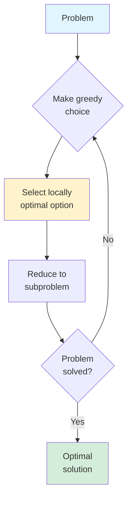
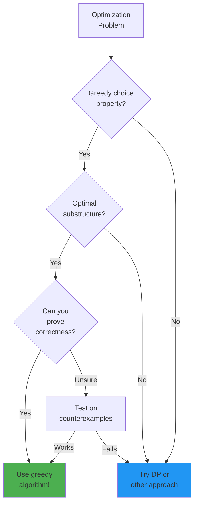

# Greedy Algorithm Design

Greedy algorithms embody a seductively simple strategy: at each decision point, make the choice that looks best right now, and never look back. This myopic approach seems almost too simple to work—surely optimal solutions require global reasoning about all possibilities? Yet for many important problems, greedy algorithms produce optimal results with remarkable efficiency.

The appeal of greedy algorithms lies in their simplicity and speed. Where dynamic programming systematically explores all subproblems, and backtracking exhaustively searches solution spaces, greedy algorithms make one pass through the data, making irrevocable decisions. The challenge is recognizing when this boldness works and when it leads astray. Greedy produces optimal results for activity selection, Huffman coding, and minimum spanning trees, but fails spectacularly for 0/1 knapsack and many coin change variants.

Understanding greedy algorithms means understanding both when they work and why. The key properties are the greedy choice property (a locally optimal choice leads to a globally optimal solution) and optimal substructure (optimal solutions contain optimal solutions to subproblems). When these properties hold, greedy algorithms transform potentially exponential searches into efficient polynomial-time solutions.

## The Greedy Strategy

At each step:
1. Consider available choices
2. Select the one that looks best right now
3. Never reconsider past decisions

**Key question**: Does local optimality lead to global optimality?



## Activity Selection Problem

**Problem**: Given activities with start/end times, select maximum non-overlapping activities.

```python
def activity_selection(activities):
    """activities = [(start, end), ...]"""
    # Sort by end time
    sorted_activities = sorted(activities, key=lambda x: x[1])

    selected = [sorted_activities[0]]
    last_end = sorted_activities[0][1]

    for start, end in sorted_activities[1:]:
        if start >= last_end:
            selected.append((start, end))
            last_end = end

    return selected
```

**Greedy choice**: Always pick activity that ends earliest.

**Why it works**: Earliest-ending activity leaves maximum room for remaining activities.

### Proof of Correctness

Let A = greedy solution, O = optimal solution.

If A ≠ O, let activity a ∈ A be the first where they differ.
- Greedy chose a, optimal chose some activity o
- Since greedy picks earliest end, end(a) ≤ end(o)
- Replacing o with a in O gives valid solution of same size
- Contradiction: O wasn't "more optimal"

## Huffman Coding

**Problem**: Build optimal prefix-free code for characters with given frequencies.

```python
import heapq

def huffman_coding(frequencies):
    """frequencies = {'a': 5, 'b': 9, ...}"""
    # Create min-heap of (frequency, character)
    heap = [[freq, [char, '']] for char, freq in frequencies.items()]
    heapq.heapify(heap)

    while len(heap) > 1:
        lo = heapq.heappop(heap)
        hi = heapq.heappop(heap)

        # Add '0' prefix to lower frequency tree
        for pair in lo[1:]:
            pair[1] = '0' + pair[1]
        # Add '1' prefix to higher frequency tree
        for pair in hi[1:]:
            pair[1] = '1' + pair[1]

        # Merge and push back
        heapq.heappush(heap, [lo[0] + hi[0]] + lo[1:] + hi[1:])

    return {char: code for char, code in heap[0][1:]}
```

**Greedy choice**: Always merge two lowest-frequency nodes.

**Result**: More frequent characters get shorter codes.

## Fractional Knapsack

**Problem**: Fill knapsack of capacity W with items (value, weight) for maximum value. Items can be split.

```python
def fractional_knapsack(capacity, items):
    """items = [(value, weight), ...]"""
    # Sort by value-to-weight ratio
    sorted_items = sorted(items, key=lambda x: x[0]/x[1], reverse=True)

    total_value = 0
    remaining = capacity

    for value, weight in sorted_items:
        if weight <= remaining:
            total_value += value
            remaining -= weight
        else:
            total_value += value * (remaining / weight)
            break

    return total_value
```

**Greedy choice**: Take items with highest value/weight ratio first.

**Note**: Doesn't work for 0/1 knapsack (items can't be split).

## Coin Change (Greedy)

**Problem**: Make change for amount using minimum coins.

```python
def coin_change_greedy(coins, amount):
    """Works for canonical coin systems like US currency"""
    coins = sorted(coins, reverse=True)
    count = 0
    result = []

    for coin in coins:
        while amount >= coin:
            amount -= coin
            count += 1
            result.append(coin)

    return count if amount == 0 else -1
```

**Warning**: Greedy fails for some coin systems!
- Coins = [1, 3, 4], Amount = 6
- Greedy: 4 + 1 + 1 = 3 coins
- Optimal: 3 + 3 = 2 coins

Use DP for general coin change.

## When Greedy Works

### Greedy Choice Property

A locally optimal choice is part of some globally optimal solution.

### Optimal Substructure

After making a greedy choice, the remaining problem has the same structure.

### Decision Flow: Will Greedy Work?



### Matroid Theory

Greedy is optimal for matroids (generalized independence structures):
- Minimum spanning tree (graphic matroid)
- Scheduling with deadlines (scheduling matroid)

## Common Greedy Problems

### Interval Scheduling

| Variant | Greedy Strategy |
|---------|-----------------|
| Max activities | Earliest end time |
| Min rooms | Sort by start, use heap |
| Weighted intervals | DP (greedy fails) |

### Graph Problems

| Problem | Greedy Strategy |
|---------|-----------------|
| MST (Kruskal) | Smallest edge not forming cycle |
| MST (Prim) | Smallest edge to new vertex |
| Dijkstra | Smallest tentative distance |

### Scheduling

```python
def job_sequencing(jobs):
    """jobs = [(deadline, profit), ...]"""
    # Sort by profit (descending)
    jobs = sorted(jobs, key=lambda x: x[1], reverse=True)

    max_deadline = max(job[0] for job in jobs)
    slots = [None] * max_deadline

    total_profit = 0
    for deadline, profit in jobs:
        # Find latest available slot before deadline
        for i in range(deadline - 1, -1, -1):
            if slots[i] is None:
                slots[i] = (deadline, profit)
                total_profit += profit
                break

    return total_profit
```

## Proving Greedy Correctness

### Exchange Argument

1. Consider optimal solution O
2. If O differs from greedy solution G, identify first difference
3. Show we can modify O to match G without losing optimality
4. Repeat until O = G

### Staying Ahead

1. Show greedy solution is "ahead" at each step
2. Define measure of progress
3. Prove greedy's measure ≥ optimal's measure at each step

## Greedy vs Dynamic Programming

| Aspect | Greedy | DP |
|--------|--------|-----|
| Decisions | Irrevocable | Consider all options |
| Time | Usually faster | May be slower |
| Correctness | Must prove | Always finds optimal |
| Implementation | Usually simpler | May be complex |

**Rule of thumb**: Try greedy first, use DP if greedy fails.
