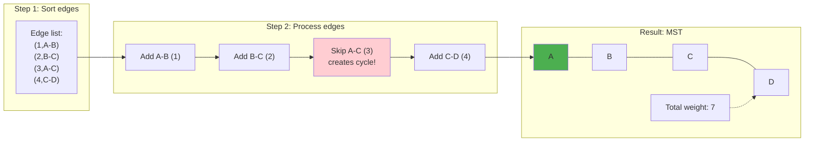
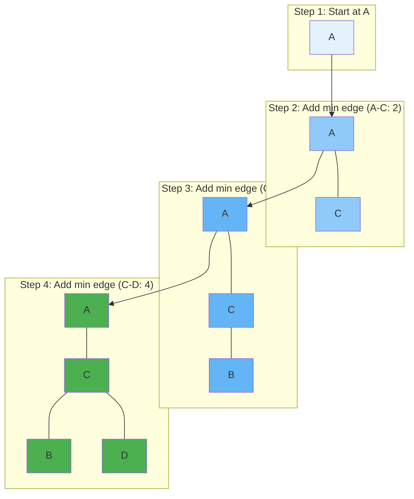

# Minimum Spanning Tree Algorithms

The minimum spanning tree problem asks for the cheapest way to connect all vertices in a weighted graph. This elegantly simple problem has profound practical applications: designing networks (communication, transportation, electrical), clustering data points by similarity, and serving as a subroutine in approximation algorithms for harder problems like the traveling salesman problem.

What makes MST algorithms remarkable is that a greedy approach works perfectly. Unlike many optimization problems where local decisions lead to globally suboptimal solutions, MST algorithms can make locally optimal edge choices and still achieve the global optimum. This is not coincidence but follows from the cut property—a beautiful theoretical result that explains why greedy works for spanning trees.

The two classic MST algorithms, Kruskal's and Prim's, take different approaches but both achieve O(E log V) time complexity. Understanding both reveals different perspectives on the same problem: Kruskal's sorts edges globally and uses union-find, while Prim's grows a tree locally using a priority queue. Each has scenarios where it performs better.

## Problem Definition

Given: Connected, undirected, weighted graph G = (V, E, w)

Find: Tree T ⊆ E that:
1. Connects all vertices (spanning)
2. Minimizes total edge weight Σₑ∈ₜ w(e)

**Properties**:
- MST has exactly |V| - 1 edges (one less than vertices, as any tree has)
- MST is unique if all edge weights are distinct
- Multiple MSTs may exist with equal weights (each with the same total cost)

## Cut Property

The cut property is the theoretical foundation that explains why greedy MST algorithms work. Understanding it provides insight into why we can make irrevocable local decisions and still achieve global optimality.

**Cut**: Partition of vertices into two non-empty sets (S, V-S).

**Crossing edge**: Edge with one endpoint in S, one in V-S.

**Cut Property**: The minimum-weight crossing edge of any cut is in some MST. This powerful result states that if we identify any partition of vertices, the lightest edge spanning that partition must be in some minimum spanning tree.

```
   S        V-S
 ┌────┐   ┌────┐
 │ A──┼───┼─B  │
 │  \ │ 3 │ /  │
 │ 2 \│   │/ 5 │
 │    ┼───┼    │
 │ C──┼ 1 ┼─D  │
 └────┘   └────┘

Minimum crossing edge (weight 1) is in MST
```

Both Kruskal's and Prim's algorithms can be understood as repeatedly applying the cut property. Each iteration identifies a cut, finds the minimum crossing edge, and adds it to the MST. The algorithms differ in how they choose cuts and maintain connectivity information.

## Kruskal's Algorithm

Kruskal's algorithm takes a global view: sort all edges by weight and process them in order, adding each edge that doesn't create a cycle. The key data structure is union-find, which efficiently tracks which vertices are already connected. Two vertices in the same component would form a cycle if connected; two vertices in different components can be safely joined.

**Strategy**: Add edges in order of weight, skip if creates cycle.



```python
def kruskal(vertices, edges):
    """
    edges: list of (weight, u, v)
    Returns: list of MST edges
    """
    edges.sort()  # Sort by weight
    parent = {v: v for v in vertices}
    rank = {v: 0 for v in vertices}

    def find(x):
        if parent[x] != x:
            parent[x] = find(parent[x])  # Path compression
        return parent[x]

    def union(x, y):
        px, py = find(x), find(y)
        if px == py:
            return False
        # Union by rank
        if rank[px] < rank[py]:
            px, py = py, px
        parent[py] = px
        if rank[px] == rank[py]:
            rank[px] += 1
        return True

    mst = []
    for weight, u, v in edges:
        if union(u, v):
            mst.append((u, v, weight))
            if len(mst) == len(vertices) - 1:
                break

    return mst
```

**Correctness**: Each edge added is minimum-weight crossing some cut (the cut separating the two components being joined).

**Complexity**:
- Sorting: $O(E \log E)$
- Union-Find operations: $O(E \times \alpha(V)) \approx O(E)$
- **Total**: $O(E \log E) = O(E \log V)$

## Prim's Algorithm

Prim's algorithm takes a local view: start from any vertex and repeatedly add the minimum-weight edge connecting the current tree to a new vertex. Unlike Kruskal's global edge processing, Prim's maintains a growing tree and considers only edges adjacent to it. This approach resembles Dijkstra's algorithm and uses similar priority queue techniques.

**Strategy**: Grow MST from a starting vertex, always adding minimum-weight edge to a new vertex.



```python
import heapq

def prim(graph, start):
    """
    graph: dict mapping vertex → list of (neighbor, weight)
    Returns: list of MST edges
    """
    mst = []
    visited = {start}
    # Priority queue of (weight, from_vertex, to_vertex)
    edges = [(w, start, v) for v, w in graph[start]]
    heapq.heapify(edges)

    while edges and len(mst) < len(graph) - 1:
        weight, u, v = heapq.heappop(edges)

        if v in visited:
            continue

        visited.add(v)
        mst.append((u, v, weight))

        for next_v, next_w in graph[v]:
            if next_v not in visited:
                heapq.heappush(edges, (next_w, v, next_v))

    return mst
```

**Correctness**: Each added edge is minimum crossing the cut (visited, unvisited).

**Complexity**:
- With binary heap: $O(E \log V)$
- With Fibonacci heap: $O(E + V \log V)$

## Comparison

| Aspect | Kruskal | Prim |
|--------|---------|------|
| Data structure | Union-Find | Priority Queue |
| Edge processing | Global (sorted) | Local (from MST) |
| Better for | Sparse graphs | Dense graphs |
| Parallelizable | Yes (parallel sorting) | Less so |

## Borůvka's Algorithm

**Strategy**: Each iteration, every component adds its cheapest outgoing edge.

```python
def boruvka(vertices, edges):
    parent = {v: v for v in vertices}

    def find(x):
        if parent[x] != x:
            parent[x] = find(parent[x])
        return parent[x]

    def union(x, y):
        px, py = find(x), find(y)
        if px != py:
            parent[px] = py
            return True
        return False

    mst = []
    num_components = len(vertices)

    while num_components > 1:
        # Find cheapest edge for each component
        cheapest = {}
        for w, u, v in edges:
            pu, pv = find(u), find(v)
            if pu != pv:
                if pu not in cheapest or w < cheapest[pu][0]:
                    cheapest[pu] = (w, u, v)
                if pv not in cheapest or w < cheapest[pv][0]:
                    cheapest[pv] = (w, u, v)

        # Add cheapest edges
        for comp, (w, u, v) in cheapest.items():
            if union(u, v):
                mst.append((u, v, w))
                num_components -= 1

    return mst
```

**Complexity**: O(E log V) - at most log V iterations, each O(E).

**Advantage**: Easily parallelizable—each component can find cheapest edge independently.

## Applications

MST algorithms solve problems far beyond their original network design motivation. The key insight is that any problem involving connecting elements at minimum cost can potentially use MST techniques.

### Network Design

Minimum-cost network connecting all nodes:
- Communication networks (minimizing cable installation)
- Road/rail networks (minimizing construction costs)
- Electrical grids (minimizing transmission line costs)

The MST directly models these problems when the goal is to connect all nodes with minimum total cost and no redundancy. Real network design often adds constraints like reliability (requiring multiple paths), which leads to more complex formulations.

### Clustering

**Single-linkage clustering**: Remove k-1 most expensive MST edges to get k clusters.

```python
def mst_clustering(points, k):
    # Build complete graph with distances
    edges = []
    for i, p1 in enumerate(points):
        for j, p2 in enumerate(points[i+1:], i+1):
            dist = distance(p1, p2)
            edges.append((dist, i, j))

    # Get MST
    mst = kruskal(range(len(points)), edges)

    # Remove k-1 heaviest edges
    mst.sort(key=lambda e: e[2], reverse=True)
    for _ in range(k - 1):
        mst.pop(0)

    # Remaining edges define clusters
    return mst
```

### Approximation Algorithms

The MST provides a lower bound for the traveling salesman problem (TSP): any tour visits all vertices and thus contains a spanning tree (remove one edge from the tour). This observation enables a clever 2-approximation for metric TSP.

**TSP Approximation**: MST-based 2-approximation

1. Build MST
2. Double edges to get Eulerian graph
3. Find Eulerian tour
4. Shortcut to skip repeated vertices

Result: Tour ≤ 2 × optimal (for metric TSP). The triangle inequality (required for metric TSP) ensures that shortcuts don't increase total distance.

## Variants

### Maximum Spanning Tree

Negate all weights, then find MST.

### Minimum Spanning Forest

Stop Kruskal when desired number of components reached.

### Steiner Tree

Connect subset of vertices (terminals) with minimum total weight.
NP-hard in general, MST gives 2-approximation.

### Dynamic MST

Maintain MST under edge insertions/deletions.
Various algorithms achieve O(log⁴ n) per update.

## Proofs of Correctness

### Kruskal's Correctness

**Claim**: Every edge added is in some MST.

**Proof**: When edge (u, v) is added, u and v are in different components. This edge is minimum crossing the cut between these components. By cut property, it's in some MST.

### Prim's Correctness

**Claim**: The tree T maintained by Prim is always a subtree of some MST.

**Induction**:
- Base: Single vertex is subtree of any MST.
- Step: Edge added is minimum crossing cut (T, V-T). By cut property, in some MST containing T.
