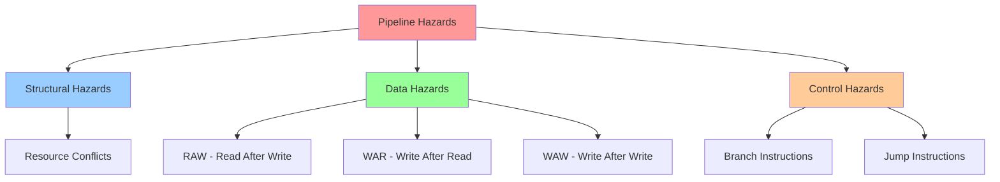

# Pipeline Hazards

**Hazards** are situations that prevent the next instruction from executing in its designated clock cycle. They can cause the pipeline to stall, reducing performance. Understanding hazards is crucial for designing efficient pipelines.

## Types of Hazards



### 1. Structural Hazards

A **structural hazard** occurs when two instructions need the same hardware resource simultaneously.

**Example**: Single memory for instructions and data

```
Clock:      1    2    3    4    5
Instr 1:   IF   ID   EX   MEM  WB
Instr 4:             IF   --   ID   (stall: can't fetch while Instr 1 accesses memory)
```

**Solutions**:
- Separate instruction and data memories (Harvard architecture)
- Duplicate resources
- Pipeline the resource (e.g., pipelined memory)

Most modern processors eliminate structural hazards through resource duplication.

### 2. Data Hazards

A **data hazard** occurs when an instruction depends on the result of a previous instruction that hasn't completed yet.

#### RAW (Read After Write) - True Dependency

```nasm
add $t0, $t1, $t2    ; Writes $t0 in WB (cycle 5)
sub $t3, $t0, $t4    ; Reads $t0 in ID (cycle 3)
```

```
Clock:      1    2    3    4    5
add:       IF   ID   EX   MEM  WB   ($t0 written here)
sub:            IF   ID             ($t0 needed here - not ready!)
```

The `sub` instruction needs `$t0` before `add` has written it.

#### WAR (Write After Read) - Anti-dependency

```nasm
sub $t0, $t1, $t3    ; Reads $t1
add $t1, $t2, $t4    ; Writes $t1
```

In simple in-order pipelines, WAR hazards don't occur (read happens before write in program order).

#### WAW (Write After Write) - Output Dependency

```nasm
add $t0, $t1, $t2    ; Writes $t0
sub $t0, $t3, $t4    ; Also writes $t0
```

In simple pipelines, WAW hazards don't occur. They matter for out-of-order and superscalar processors.

### 3. Control Hazards

A **control hazard** occurs when the pipeline doesn't know which instruction to fetch next, typically due to branches.

```nasm
beq $t0, $t1, target
add $t2, $t3, $t4    ; Fetch this? Or the instruction at target?
```

```
Clock:      1    2    3    4    5
beq:       IF   ID   EX   MEM  WB
add:            IF   ID   EX   MEM  WB  (but should it execute?)
```

The branch decision isn't known until EX (or MEM for some designs), but we've already fetched subsequent instructions.

## Detecting Data Hazards

Hazard detection compares register numbers:

```
RAW hazard exists if:
  (ID/EX.Rs == EX/MEM.Rd) AND EX/MEM.RegWrite
  OR
  (ID/EX.Rt == EX/MEM.Rd) AND EX/MEM.RegWrite
  OR
  (ID/EX.Rs == MEM/WB.Rd) AND MEM/WB.RegWrite
  OR
  (ID/EX.Rt == MEM/WB.Rd) AND MEM/WB.RegWrite
```

Hazard detection logic sits between pipeline stages and monitors for conflicts.

## Handling Data Hazards

### Option 1: Stalling (Pipeline Bubbles)

Insert **NOPs** (no-operations) to wait for data:

```
Clock:      1    2    3    4    5    6    7
add $t0:   IF   ID   EX   MEM  WB
<nop>:          IF   ID   EX   MEM  WB
<nop>:               IF   ID   EX   MEM  WB
sub $t0:                  IF   ID   EX   MEM  WB
```

The `sub` waits until `add` has written `$t0`.

**Cost**: Reduces CPI efficiency. With many dependencies, performance suffers significantly.

### Option 2: Forwarding (Bypassing)

**Forwarding** routes data directly from where it's produced to where it's needed, bypassing the register file.

```
Clock:      1    2    3    4    5
add $t0:   IF   ID   EX   MEM  WB
                     │
                     └──────► Forward result
                              │
sub $t0:        IF   ID   EX  ◄┘
```

The ALU result from `add` is forwarded directly to the `sub`'s EX stage.

**Forwarding paths**:
- EX/MEM → EX (forward from previous instruction's result)
- MEM/WB → EX (forward from two instructions back)

### Option 3: Compiler Scheduling

The compiler reorders instructions to avoid hazards:

**Before**:
```nasm
add $t0, $t1, $t2
sub $t3, $t0, $t4    ; Depends on $t0
```

**After** (reordered):
```nasm
add $t0, $t1, $t2
mul $t5, $t6, $t7    ; Independent - inserted between
sub $t3, $t0, $t4    ; Now $t0 is ready
```

## Load-Use Hazard

Even with forwarding, **loads** require a stall:

```nasm
lw $t0, 0($t1)       ; Data available after MEM
add $t2, $t0, $t3    ; Needs $t0 in EX
```

```
Clock:      1    2    3    4    5    6
lw:        IF   ID   EX   MEM  WB
                          │
                          └──► Can forward here (MEM/WB to EX)
add:            IF   ID   stall  EX   MEM  WB
```

One cycle stall is unavoidable—data isn't available until MEM completes.

**Load-use hazard detection**:
```
if (ID/EX.MemRead AND
    (ID/EX.Rt == IF/ID.Rs OR ID/EX.Rt == IF/ID.Rt))
    stall pipeline
```

## Forwarding Unit Design

```
           ┌─────────────────────────────────────────┐
           │          Forwarding Unit                │
           │                                         │
EX/MEM.Rd ─┼──►┌─────────────────┐                  │
           │   │                 │                  │
MEM/WB.Rd ─┼──►│   Compare &    │──► ForwardA      │
           │   │   Priority     │                  │
ID/EX.Rs ──┼──►│                │──► ForwardB      │
ID/EX.Rt ──┼──►│                │                  │
           │   └─────────────────┘                  │
           │                                         │
EX/MEM.RegWrite ────────────────────────────────────│
MEM/WB.RegWrite ────────────────────────────────────│
           └─────────────────────────────────────────┘
```

**Forwarding control logic**:
```
if (EX/MEM.RegWrite AND EX/MEM.Rd ≠ 0 AND EX/MEM.Rd == ID/EX.Rs)
    ForwardA = 10  (forward from EX/MEM)
else if (MEM/WB.RegWrite AND MEM/WB.Rd ≠ 0 AND MEM/WB.Rd == ID/EX.Rs)
    ForwardA = 01  (forward from MEM/WB)
else
    ForwardA = 00  (use register file)
```

## Control Hazard Solutions

### 1. Stall on Branch

Wait until branch is resolved:

```
Clock:      1    2    3    4    5    6
beq:       IF   ID   EX   MEM  WB
<stall>:        IF   --   --   --
<stall>:             IF   --   --
next:                     IF   ID   EX
```

**Cost**: 3 cycles lost per branch (assuming branch resolved in EX)

### 2. Branch Prediction

**Predict not taken**: Always fetch the next sequential instruction

```
If branch not taken: No penalty
If branch taken: Flush incorrect instructions (1-3 cycles)
```

**Predict taken**: Predict branches as taken (useful for loops)

### 3. Delayed Branch

The instruction after the branch always executes (branch delay slot):

```nasm
beq $t0, $t1, target
add $t2, $t3, $t4    ; Always executes (in delay slot)
```

Compiler fills delay slot with useful work if possible, or NOP if not.

### 4. Branch Target Buffer

Cache recent branch targets and predictions:
- If branch seen before, use cached prediction and target
- Update cache based on actual outcome

## Performance Impact of Hazards

For a simple 5-stage pipeline:

$$\text{CPI} = 1 + \text{stalls}_{\text{per instruction}}$$

$$\text{stalls} = \text{data}_{\text{stalls}} + \text{control}_{\text{stalls}} + \text{structural}_{\text{stalls}}$$

**Typical values**:
- With forwarding: ~0.1 data hazard stalls per instruction
- With simple prediction: ~0.1-0.3 control hazard stalls per instruction
- Total: CPI ≈ 1.2-1.4

## Key Takeaways

- Structural hazards: Resource conflicts (solve by duplication)
- Data hazards: Dependencies between instructions (solve by forwarding)
- Control hazards: Branch decisions unknown (solve by prediction)
- RAW is the most common data hazard; WAR and WAW matter for advanced pipelines
- Forwarding eliminates most data hazard stalls
- Load-use hazards require one stall cycle even with forwarding
- Branch prediction minimizes control hazard penalties
- Effective hazard handling is crucial for pipeline performance
