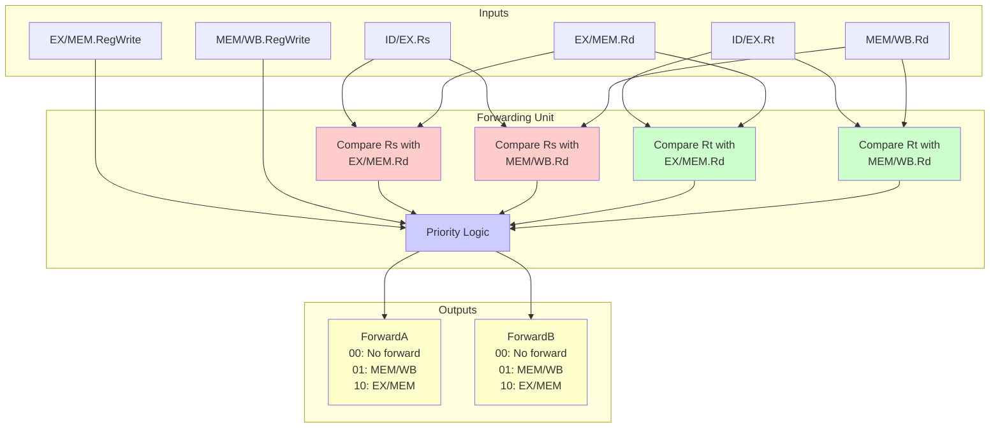

# Data Forwarding (Bypassing)

**Data forwarding**, also called **bypassing**, is a technique that eliminates most data hazard stalls by routing results directly from where they're produced to where they're needed, without waiting for the register file write.

## The Problem Without Forwarding

Consider this instruction sequence:

```nasm
add $t0, $t1, $t2    ; Writes $t0
sub $t3, $t0, $t4    ; Needs $t0
and $t5, $t0, $t6    ; Needs $t0
or  $t7, $t0, $t8    ; Needs $t0
```

Without forwarding, each dependent instruction must wait:

```
Clock:      1    2    3    4    5    6    7    8    9    10
add:       IF   ID   EX   MEM  WB
sub:            IF   --   --   --   ID   EX   MEM  WB
and:                 IF   --   --   --   ID   EX   MEM  WB
or:                       IF   --   --   --   ID   EX   MEM
```

Three stall cycles per dependent instruction!

## Forwarding Solution

With forwarding, results are routed directly:

```
Clock:      1    2    3    4    5    6    7    8
add:       IF   ID   EX   MEM  WB
                     │
sub:            IF   ID   EX   MEM  WB
                          │
and:                 IF   ID   EX   MEM  WB
                               │
or:                       IF   ID   EX   MEM  WB
```

No stalls! Each instruction gets the value it needs via forwarding.

## Forwarding Paths

### Path 1: EX/MEM to EX

Forward the result from the previous instruction's EX stage:

```
              ┌───────────────────────┐
              │                       │
              │   ┌───────────────┐   │
              │   │   EX/MEM      │   │
              │   │   Register    │   │
              │   │               │   │
              │   │  ALU Result ──┼───┘
              │   └───────────────┘
              │
              ▼
         ┌─────────┐
    A ──►│         │
         │   ALU   │──► Result
    B ──►│         │
         └─────────┘
              ▲
              │ Forward from EX/MEM
```

**Use when**: The instruction in EX needs the result from the instruction that just left EX.

### Path 2: MEM/WB to EX

Forward the result from two instructions back:

```
                                  ┌───────────────┐
                                  │   MEM/WB      │
                                  │   Register    │
                                  │               │
                                  │  Result ──────┼────┐
                                  └───────────────┘    │
                                                       │
                                                       │
                    ┌─────────┐                        │
               A ──►│         │                        │
                    │   ALU   │──► Result              │
               B ──►│         │                        │
                    └─────────┘                        │
                         ▲                             │
                         │                             │
                         └─────────────────────────────┘
                           Forward from MEM/WB
```

**Use when**: The instruction in EX needs the result from two instructions ago.

## Datapath with Forwarding

```
                                          ┌────────────────────────────┐
                                          │                            │
                                          │    ┌───────────────────┐   │
                                          │    │     MEM/WB        │   │
                                          │    │    ┌─────────┐    │   │
                                          │    │    │ Result  ├────┼───┘
                                          │    │    └─────────┘    │
                    ┌─────────────────┐   │    │    ┌─────────┐    │
                    │     EX/MEM      │   │    │    │   Rd    │    │
                    │    ┌─────────┐  │   │    │    └─────────┘    │
                    │    │ALUResult├──┼───┤    └───────────────────┘
                    │    └─────────┘  │   │
                    │    ┌─────────┐  │   │
                    │    │   Rd    │  │   │
                    │    └─────────┘  │   │
                    └─────────────────┘   │
                            │             │
                            ▼             │
       ┌─────────────────────────────────────────────────┐
       │               Forwarding Unit                    │
       │                                                  │
       │  Compares Rd fields with Rs, Rt of current      │
       │  instruction and generates ForwardA, ForwardB   │
       └──────────────────────────┬───────────────────────┘
                                  │
                    ┌─────────────┴──────────────┐
                    │                            │
                    ▼                            ▼
              ┌───────────┐              ┌───────────┐
         A ──►│  MUX A    │         B ──►│  MUX B    │
              │           │              │           │
   Reg File ─►│ ForwardA  │  Reg File ──►│ ForwardB  │
              │           │              │           │
   EX/MEM ───►│           │  EX/MEM ────►│           │
              │           │              │           │
   MEM/WB ───►│           │  MEM/WB ────►│           │
              └─────┬─────┘              └─────┬─────┘
                    │                          │
                    ▼                          ▼
                ┌───────────────────────────────────┐
                │               ALU                  │
                └───────────────────────────────────┘
```

## Forwarding Unit Logic



### Input Signals

| Signal | Description |
|--------|-------------|
| ID/EX.Rs | Source register 1 of instruction in EX |
| ID/EX.Rt | Source register 2 of instruction in EX |
| EX/MEM.Rd | Destination register of instruction in MEM |
| EX/MEM.RegWrite | Does MEM instruction write a register? |
| MEM/WB.Rd | Destination register of instruction in WB |
| MEM/WB.RegWrite | Does WB instruction write a register? |

### ForwardA Logic

```
if (EX/MEM.RegWrite
    AND EX/MEM.Rd ≠ 0
    AND EX/MEM.Rd = ID/EX.Rs)
  ForwardA = 10    // Forward from EX/MEM

else if (MEM/WB.RegWrite
    AND MEM/WB.Rd ≠ 0
    AND NOT (EX/MEM.RegWrite AND EX/MEM.Rd ≠ 0
             AND EX/MEM.Rd = ID/EX.Rs)
    AND MEM/WB.Rd = ID/EX.Rs)
  ForwardA = 01    // Forward from MEM/WB

else
  ForwardA = 00    // No forwarding (use register file)
```

### ForwardB Logic

Same as ForwardA but uses ID/EX.Rt instead of ID/EX.Rs.

### Priority Rules

EX/MEM has priority over MEM/WB because it contains the more recent value:

```nasm
add $t0, $t0, $t1    ; First update to $t0
add $t0, $t0, $t2    ; Second update to $t0
add $t3, $t0, $t4    ; Should get second update's value
```

## Forwarding Control Values

| ForwardA/B | Source | Description |
|------------|--------|-------------|
| 00 | ID/EX | Value from register file (no hazard) |
| 01 | MEM/WB | Forward from 2 instructions ago |
| 10 | EX/MEM | Forward from previous instruction |

## Cases Requiring Forwarding

### Case 1: EX Hazard

```nasm
add $t0, $t1, $t2    ; In MEM stage
sub $t3, $t0, $t4    ; In EX stage, needs $t0
```

Forward from EX/MEM.ALUResult to ALU input A.

### Case 2: MEM Hazard

```nasm
add $t0, $t1, $t2    ; In WB stage
nop
sub $t3, $t0, $t4    ; In EX stage, needs $t0
```

Forward from MEM/WB.Result to ALU input A.

### Case 3: Double Data Hazard

```nasm
add $t0, $t1, $t2    ; In WB stage
add $t0, $t0, $t3    ; In MEM stage
add $t0, $t0, $t4    ; In EX stage, needs $t0
```

Forward from EX/MEM (most recent value), not MEM/WB.

## Limitations of Forwarding

### Load-Use Hazard

Forwarding cannot eliminate this hazard:

```nasm
lw $t0, 0($t1)       ; Data available after MEM
add $t2, $t0, $t3    ; Needs $t0 in EX
```

```
Clock:      1    2    3    4    5    6
lw:        IF   ID   EX   MEM  WB
                          │ Data here
add:            IF   ID   ??   EX   MEM  WB
                          │
                     Need it here - too early!
```

One stall cycle is required. The forwarding can then occur from MEM/WB in the next cycle.

### Handling Load-Use

**Hazard detection unit** inserts stall:

```
if (ID/EX.MemRead
    AND ((ID/EX.Rt = IF/ID.Rs) OR (ID/EX.Rt = IF/ID.Rt)))
  Stall pipeline
```

Stall actions:
1. Set ID/EX control signals to NOP (bubble)
2. Prevent PC update
3. Prevent IF/ID register update

## Forwarding Performance Impact

Without forwarding:
```
Many hazards → CPI ≈ 1.5 - 2.0
```

With forwarding:
```
Only load-use hazards cause stalls → CPI ≈ 1.1 - 1.2
```

Forwarding eliminates ~80% of data hazard stalls.

## Implementation Considerations

### Hardware Cost

- Two 3-to-1 multiplexers for ALU inputs
- Comparators for register number matching
- Additional routing for forwarding paths

### Timing

Forwarding adds:
- Mux delay to critical path
- Must complete within clock cycle

### Verification

Forwarding logic is a common source of bugs:
- Must handle all combinations correctly
- Double hazards require careful priority
- Special cases ($zero register, etc.)

## Key Takeaways

- Forwarding routes results directly to where needed
- Two main paths: EX/MEM→EX and MEM/WB→EX
- Forwarding unit compares register numbers to detect hazards
- EX/MEM forwarding has priority over MEM/WB (more recent value)
- Load-use hazards still require one stall cycle
- Forwarding significantly reduces CPI by eliminating most stalls
- Implementation adds muxes and comparators to the datapath
