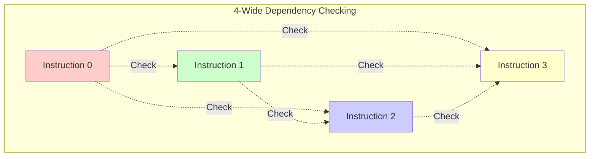
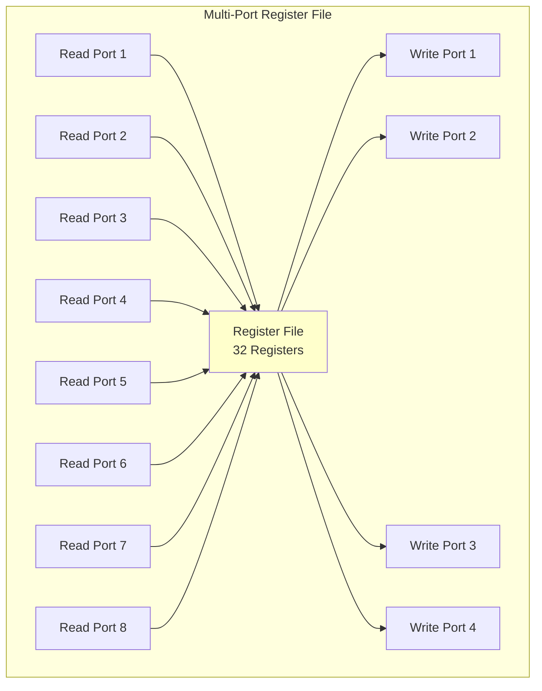

# Superscalar Processors

**Superscalar processors** fetch, decode, and execute multiple instructions per clock cycle. This is the primary hardware mechanism for exploiting instruction-level parallelism, enabling IPC greater than one.

## Superscalar Concept

### Single-Issue vs. Superscalar

```mermaid
gantt
    title Single-Issue Pipeline (IPC = 1)
    dateFormat X
    axisFormat %s

    section Instr 1
    IF  :0, 1
    ID  :1, 1
    EX  :2, 1
    MEM :3, 1
    WB  :4, 1

    section Instr 2
    IF  :1, 1
    ID  :2, 1
    EX  :3, 1
    MEM :4, 1
    WB  :5, 1

    section Instr 3
    IF  :2, 1
    ID  :3, 1
    EX  :4, 1
    MEM :5, 1
    WB  :6, 1
```



**Single-Issue**: IPC = 1 (maximum)

```mermaid
gantt
    title Superscalar 2-Wide Pipeline (IPC = 2)
    dateFormat X
    axisFormat %s

    section Pipe 0
    I1-IF  :0, 1
    I1-ID  :1, 1
    I1-EX  :2, 1
    I1-MEM :3, 1
    I1-WB  :4, 1
    I3-IF  :1, 1
    I3-ID  :2, 1
    I3-EX  :3, 1
    I3-MEM :4, 1
    I3-WB  :5, 1

    section Pipe 1
    I2-IF  :0, 1
    I2-ID  :1, 1
    I2-EX  :2, 1
    I2-MEM :3, 1
    I2-WB  :4, 1
    I4-IF  :1, 1
    I4-ID  :2, 1
    I4-EX  :3, 1
    I4-MEM :4, 1
    I4-WB  :5, 1
```



**Superscalar (2-wide)**: IPC = 2 (maximum)

### Issue Width

Number of instructions issued per cycle:

| Width | Example Processors |
|-------|-------------------|
| 2-wide | ARM Cortex-A53 |
| 4-wide | Intel Core, AMD Zen |
| 6-wide | AMD Zen 3/4 |
| 8-wide | Apple M1/M2 (peak) |

## Superscalar Pipeline

### Wide Fetch

Fetch multiple instructions per cycle:

```
                    Memory
                       │
                       ▼
        ┌──────────────────────────────┐
        │         Fetch Unit           │
        │   Fetch 4-8 instructions     │
        │   (128-256 bits)             │
        └──────────────┬───────────────┘
                       │
        ┌──────┬───────┼───────┬───────┐
        ▼      ▼       ▼       ▼       ▼
      Inst 0  Inst 1  Inst 2  Inst 3
```

**Challenges**:
- Instructions cross cache line boundaries
- Branch targets may not be aligned
- Variable-length instructions (x86)

### Parallel Decode

Decode all fetched instructions:

```
        ┌───────┐ ┌───────┐ ┌───────┐ ┌───────┐
        │Decode │ │Decode │ │Decode │ │Decode │
        │  0    │ │  1    │ │  2    │ │  3    │
        └───┬───┘ └───┬───┘ └───┬───┘ └───┬───┘
            │         │         │         │
            ▼         ▼         ▼         ▼
        ┌──────────────────────────────────────┐
        │      Dependency Check Logic          │
        │   Determine which can execute        │
        └──────────────────────────────────────┘
```

**x86 complexity**: Variable-length instructions require multiple stages.

### Multiple Execution Units

Execute instructions in parallel on separate units:

```
        ┌───────────────────────────────────────────┐
        │            Execution Units                │
        │                                           │
        │  ┌─────┐  ┌─────┐  ┌─────┐  ┌─────┐     │
        │  │ALU 0│  │ALU 1│  │ FPU │  │ AGU │     │
        │  └─────┘  └─────┘  └─────┘  └─────┘     │
        │  ┌─────┐  ┌─────┐  ┌─────┐  ┌─────┐     │
        │  │Branch│ │ MUL │  │Load │  │Store│     │
        │  └─────┘  └─────┘  └─────┘  └─────┘     │
        │                                           │
        └───────────────────────────────────────────┘

AGU = Address Generation Unit
```

## In-Order Superscalar

### Concept

Issue multiple instructions in program order, but only if no dependencies:

```
Instructions:
1: add  $t0, $t1, $t2
2: sub  $t3, $t0, $t4    ← Depends on 1
3: mul  $t5, $t6, $t7
4: and  $t8, $t5, $t9    ← Depends on 3

In-Order Issue:
Cycle 1: Issue 1, 3 (independent, can parallel)
Cycle 2: Issue 2, 4 (after 1, 3 complete)
```

### Dependency Check

For N-wide issue, need $\frac{N(N-1)}{2}$ comparisons:



4-wide superscalar:
- Instruction 0: check against 1, 2, 3
- Instruction 1: check against 2, 3
- Instruction 2: check against 3
- Instruction 3: no check needed

$$\text{Total comparisons} = \frac{4 \times 3}{2} = 6 \text{ per cycle}$$

### Limitations of In-Order

```
Instructions:
1: lw   $t0, 0($a0)      ← Cache miss!
2: add  $t1, $t0, $t2    ← Stalls (depends on 1)
3: sub  $t3, $t4, $t5    ← Stalls (in-order!)
4: mul  $t6, $t7, $t8    ← Stalls (in-order!)

In-order: Everything stalls waiting for load.
Out-of-order: 3 and 4 can execute while waiting.
```

## Execution Unit Design

### Functional Unit Types

```
Unit Type        | Operations                    | Typical Count
-----------------|-------------------------------|---------------
Integer ALU      | add, sub, and, or, xor       | 4-6
Integer MUL      | mul, div                      | 1-2
FP Add           | fadd, fsub                    | 1-2
FP Mul           | fmul, fdiv, sqrt             | 1-2
Load/Store       | lw, sw                        | 2-3
Branch           | beq, bne, j                   | 1-2
```

### Unit Latency and Throughput

```
Operation        | Latency (cycles) | Throughput (per cycle)
-----------------|------------------|------------------------
Integer ADD      | 1                | 4
Integer MUL      | 3                | 1
Integer DIV      | 10-20            | 1/10
FP ADD           | 3-4              | 2
FP MUL           | 4-5              | 2
FP DIV           | 10-15            | 1/10
Load (L1 hit)    | 4-5              | 2
```

### Pipelined Execution Units

```
Multiplication (3-cycle latency, 1-cycle throughput):

Cycle 1: MUL_stage1 ─► result in 3 cycles
Cycle 2: MUL_stage1 ─► result in 3 cycles (new multiply)
         MUL_stage2 ◄── previous multiply
Cycle 3: MUL_stage1 ─► result in 3 cycles (another new)
         MUL_stage2 ◄── second multiply
         MUL_stage3 ◄── first multiply DONE

After initial 3-cycle fill, one result per cycle.
```

## Register File Design

### Multi-Port Register File

Superscalar needs many simultaneous reads/writes:

4-wide superscalar:
$$4 \text{ instructions} \times 2 \text{ source operands} = 8 \text{ read ports}$$
$$4 \text{ instructions} \times 1 \text{ destination} = 4 \text{ write ports}$$

**Total: 8 read, 4 write (expensive!)**



### Register Port Reduction

Techniques to reduce ports:

**Banking**:
```
Split register file into banks
Each bank has fewer ports
Route based on register number
```

**Bypass networks**:
```
Forward results directly to consumers
Reduces read pressure
```

## Superscalar Branch Handling

### Impact of Branches

Branches limit the instruction window:

```
1: add  $t0, $t1, $t2
2: beq  $t0, $zero, skip    ← Branch!
3: sub  $t3, $t4, $t5       ← Can't fetch until branch resolves
4: mul  $t5, $t6, $t7
skip:
5: and  $t8, $t9, $t10
```

### Solutions

**Branch prediction**: Guess outcome, fetch speculatively.

**Delayed branches**: Execute instruction after branch regardless.

**Predicated execution**: Convert branches to conditional execution.

## Real-World Examples

### ARM Cortex-A55 (In-Order, 2-wide)

```
┌──────────────────────────────────────┐
│            Fetch (2-wide)            │
└────────────────┬─────────────────────┘
                 │
┌────────────────┴─────────────────────┐
│           Decode (2-wide)            │
└────────────────┬─────────────────────┘
                 │
    ┌────────────┴────────────┐
    │                         │
┌───┴───┐               ┌─────┴─────┐
│ ALU   │               │Load/Store │
│       │               │           │
└───────┘               └───────────┘
```

Simple, power-efficient, ~1.5 IPC typical.

### AMD Zen 4 (Out-of-Order, 6-wide)

```
Fetch: 32 bytes/cycle
Decode: 4 instructions/cycle
Dispatch: 6 micro-ops/cycle
Execute: 12 execution ports
- 4 ALU
- 2 AGU (Load)
- 2 AGU (Store)
- 3 FP/SIMD
- 1 Branch

Typical IPC: 2-3
```

## Key Takeaways

- Superscalar processors issue multiple instructions per cycle
- Issue width determines maximum parallelism (2-8 typical)
- Parallel decode and dependency checking are required
- Multiple execution units handle different operations
- Register file needs many ports (expensive)
- In-order superscalar is simpler but stalls on long-latency ops
- Branches limit instruction window for superscalar
- Modern CPUs use superscalar + out-of-order for best ILP
- Typical achieved IPC is 1.5-3, well below peak

