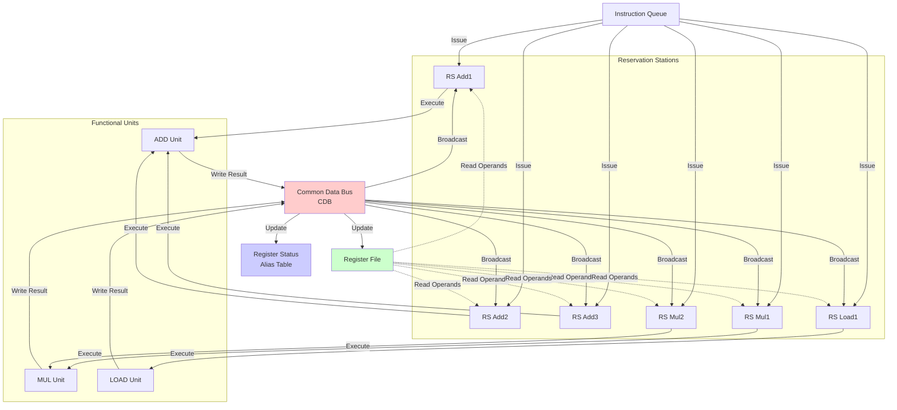
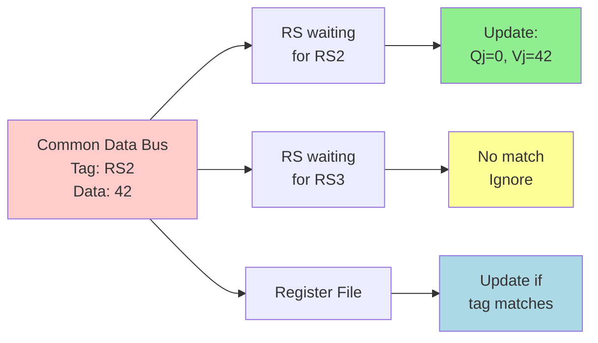

# Dynamic Scheduling and Tomasulo's Algorithm

**Dynamic scheduling** allows instructions to execute out of program order when their operands are ready. This hardware technique, pioneered by Robert Tomasulo at IBM, is the foundation of all modern high-performance processors.

## Motivation for Dynamic Scheduling

### The In-Order Problem

```nasm
div  $t0, $t1, $t2    ; Division takes 20 cycles
add  $t3, $t0, $t4    ; Depends on div - must wait
sub  $t5, $t6, $t7    ; Independent! But stalls in in-order
mul  $t8, $t9, $t10   ; Independent! But stalls in in-order
```

**In-order execution**: Everything waits for slow division.
**Out-of-order**: Execute sub and mul while waiting for div.

### Goals of Dynamic Scheduling

1. Execute instructions as soon as operands are ready
2. Don't stall pipeline for one slow instruction
3. Automatically reorder to hide latencies
4. Eliminate WAR and WAW hazards through renaming

## Tomasulo's Algorithm

### Core Components



### Reservation Station Entry

```
┌─────────────────────────────────────────────────────────────┐
│                 Reservation Station Entry                    │
├────────┬────────┬────────┬────────┬────────┬────────┬───────┤
│  Op    │  Vj    │  Vk    │  Qj    │  Qk    │  Dest  │ Busy  │
├────────┼────────┼────────┼────────┼────────┼────────┼───────┤
│  ADD   │  100   │   -    │   0    │  RS3   │   F4   │   1   │
└────────┴────────┴────────┴────────┴────────┴────────┴───────┘

Op:   Operation to perform
Vj:   Value of first source operand (if ready)
Vk:   Value of second source operand (if ready)
Qj:   Reservation station producing first operand (if not ready)
Qk:   Reservation station producing second operand (if not ready)
Dest: Register to receive result
Busy: Station in use
```

### Register Status Table

Tracks which reservation station will produce each register:

```
┌─────────┬──────────────────────┐
│Register │ Producing Station    │
├─────────┼──────────────────────┤
│   F0    │        -             │
│   F2    │       RS2            │
│   F4    │       RS5            │
│   F6    │        -             │
└─────────┴──────────────────────┘
```

## Algorithm Stages

### Stage 1: Issue

Issue instruction to available reservation station:

```
IF reservation station available THEN
    IF operand in register file AND not being produced THEN
        Copy value to Vj/Vk
        Set Qj/Qk = 0
    ELSE
        Set Qj/Qk = producing station
    ENDIF
    Update register status (this station produces result)
    Mark station busy
ELSE
    Stall (structural hazard)
ENDIF
```

### Stage 2: Execute

Wait for operands, then execute:

```
WHEN Qj = 0 AND Qk = 0 THEN
    Both operands ready
    Send to functional unit
    Execute operation
ENDWHEN
```

### Stage 3: Write Result

Broadcast result on Common Data Bus (CDB):

```
WHEN execution complete THEN
    Put result and RS tag on CDB
    All waiting stations capture result:
        IF Qj matches tag THEN Vj = result, Qj = 0
        IF Qk matches tag THEN Vk = result, Qk = 0
    Register file updated if station matches
    Mark station not busy
ENDWHEN
```

## Detailed Example

### Code Sequence

```nasm
1: ld   F6, 0(R1)
2: ld   F2, 0(R2)
3: mul  F0, F2, F4
4: sub  F8, F6, F2
5: div  F10, F0, F6
6: add  F6, F8, F2
```

### Execution Trace

**After Issue of all instructions**:

```
Reservation Stations:
┌────┬────────┬──────┬──────┬──────┬──────┬──────┬──────┐
│    │  Op    │  Vj  │  Vk  │  Qj  │  Qk  │ Dest │ Busy │
├────┼────────┼──────┼──────┼──────┼──────┼──────┼──────┤
│LD1 │  Load  │R1+0  │      │  0   │      │  F6  │  1   │
│LD2 │  Load  │R2+0  │      │  0   │      │  F2  │  1   │
│ADD1│  Sub   │      │      │ LD1  │ LD2  │  F8  │  1   │
│ADD2│  Add   │      │      │ADD1  │ LD2  │  F6  │  1   │
│MUL1│  Mul   │  F4  │      │  0   │ LD2  │  F0  │  1   │
│MUL2│  Div   │      │      │MUL1  │ LD1  │ F10  │  1   │
└────┴────────┴──────┴──────┴──────┴──────┴──────┴──────┘

Register Status:
F0→MUL1, F2→LD2, F6→ADD2, F8→ADD1, F10→MUL2
```

**After loads complete**:

LD1 broadcasts: All Qj=LD1 get value, Qj=0
LD2 broadcasts: All Qk=LD2 get value, Qk=0

## Register Renaming

### Eliminating False Dependencies

Tomasulo's algorithm provides implicit register renaming:

```nasm
; Original code (WAR hazard on F6)
ld   F6, 0(R1)      ; Write F6
sub  F8, F6, F2     ; Read F6
add  F6, F8, F2     ; Write F6 (WAR with sub)

; With renaming (F6 mapped to different physical locations)
ld   RS1.result → F6_v1
sub  F6_v1, F2 → RS2.result
add  RS2.result, F2 → F6_v2

No hazard! F6_v1 and F6_v2 are different values.
```

### How It Works

```
Instruction       Physical Location     Register Mapping
───────────────────────────────────────────────────────
ld  F6, 0(R1)     RS1.result           F6 → RS1
sub F8, F6, F2    RS2.result           F8 → RS2
add F6, F8, F2    RS3.result           F6 → RS3 (renamed!)

The second write to F6 goes to RS3, not RS1.
Sub still reads from RS1 (original F6).
```

## Common Data Bus (CDB)

### Broadcast Mechanism



### CDB Scaling Issues

For $N$ reservation stations and $M$ registers:

$$\text{Comparators needed} = N + M$$

**4-wide machine**:
- 4 CDBs (one per FU result)
- Each CDB: Compare with ~50 RS + ~100 registers
- Expensive! Limits width.

## Modern Extensions

### Explicit Register Renaming

Modern CPUs use explicit renaming with physical registers:

```
┌─────────────────────────────────────────────────────────────┐
│ Register Alias Table (RAT)                                  │
├─────────────┬────────────────────────────────────────────────┤
│ Arch Reg    │ Physical Register                             │
├─────────────┼────────────────────────────────────────────────┤
│    R0       │     P45                                       │
│    R1       │     P12                                       │
│    R2       │     P78                                       │
│   ...       │     ...                                       │
└─────────────┴────────────────────────────────────────────────┘

Physical register file: 150-300 registers
Architectural registers: 16-32
```

### Reorder Buffer (ROB)

Ensures in-order commit for precise exceptions:

```
┌──────────────────────────────────────────────────────────────┐
│                      Reorder Buffer                          │
├─────┬──────────┬────────┬──────────┬─────────────┬──────────┤
│ Ptr │ Inst     │ Dest   │ Value    │ Complete    │ Exception│
├─────┼──────────┼────────┼──────────┼─────────────┼──────────┤
│  0  │ add r1   │  R1    │   42     │    Yes      │    No    │
│  1  │ ld r2    │  R2    │   --     │    No       │    ?     │
│  2  │ mul r3   │  R3    │   17     │    Yes      │    No    │
└─────┴──────────┴────────┴──────────┴─────────────┴──────────┘
      Head                                              Tail

Commit from head when complete and no exception.
```

## Key Takeaways

- Dynamic scheduling executes instructions when operands are ready
- Tomasulo's algorithm uses reservation stations and CDB
- Register renaming eliminates WAR and WAW hazards
- Three stages: Issue, Execute, Write Result
- CDB broadcasts results to all waiting stations
- Modern CPUs add explicit renaming and reorder buffer
- Enables out-of-order execution while maintaining correctness
- Foundation of all high-performance processors since 1990s
- Automatically finds and exploits ILP

