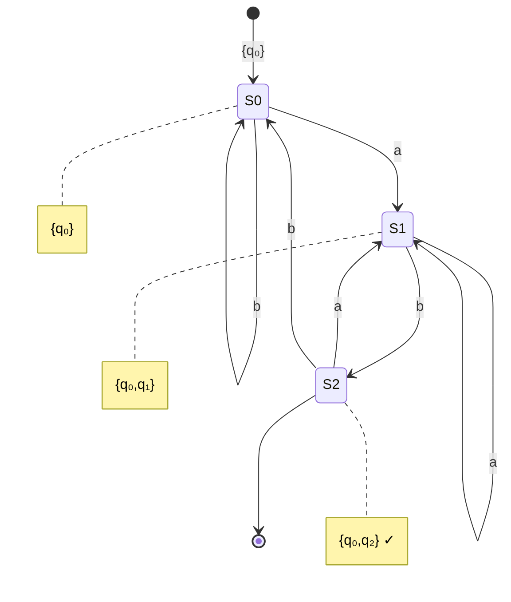

# Subset Construction

The **subset construction** (also called powerset construction) converts any NFA to an equivalent DFA. This algorithm proves that DFAs and NFAs recognize the same class of languages—the regular languages.

## The Key Insight

The main idea is to track the **set of all possible states** the NFA could be in. Each DFA state corresponds to a subset of NFA states.

If the NFA has n states, the DFA might have up to 2ⁿ states (all possible subsets). In practice, many subsets are often unreachable.

## The Algorithm

Given NFA $N = (Q, \Sigma, \delta_N, q_0, F_N)$, construct DFA $D = (Q', \Sigma, \delta_D, q_0', F')$:

1. **States**: $Q' \subseteq \mathcal{P}(Q)$, the power set of $Q$
2. **Start state**: $q_0' = \text{ECLOSE}(\{q_0\})$
3. **Transition function**: For state $S \subseteq Q$ and symbol $a \in \Sigma$:
   $$\delta_D(S, a) = \text{ECLOSE}\left(\bigcup_{q \in S} \delta_N(q, a)\right)$$
4. **Accepting states**: $F' = \{S \in Q' \mid S \cap F_N \neq \emptyset\}$

## Computing ε-Closure

The ε-closure of a set S is computed by:

```
ε-closure(S):
    result = S
    stack = list(S)
    while stack is not empty:
        q = stack.pop()
        for r in δ(q, ε):
            if r not in result:
                result.add(r)
                stack.push(r)
    return result
```

## Lazy Construction

Rather than computing all 2ⁿ states upfront, we build only **reachable states**:

```
subset_construction(N):
    q₀' = ε-closure({q₀})
    Q' = {q₀'}
    worklist = [q₀']

    while worklist is not empty:
        S = worklist.pop()
        for a in Σ:
            T = ε-closure(⋃{δ(q, a) | q ∈ S})
            if T not in Q':
                Q'.add(T)
                worklist.append(T)
            add transition (S, a) → T

    F' = {S ∈ Q' | S ∩ F ≠ ∅}
    return DFA(Q', Σ, δ_D, q₀', F')
```

## Example: Subset Construction

Consider an NFA accepting strings ending in "ab":

**NFA Transition Table:**

| State | a | b | ε |
|-------|---|---|---|
| $q_0$ | $\{q_0, q_1\}$ | $\{q_0\}$ | $\emptyset$ |
| $q_1$ | $\emptyset$ | $\{q_2\}$ | $\emptyset$ |
| $q_2$ | $\emptyset$ | $\emptyset$ | $\emptyset$ |

Accepting state: $F_N = \{q_2\}$

**Subset Construction:**

Starting from $\{q_0\}$, we compute transitions:

- $\delta_D(\{q_0\}, a) = \{q_0, q_1\}$
- $\delta_D(\{q_0\}, b) = \{q_0\}$
- $\delta_D(\{q_0, q_1\}, a) = \{q_0, q_1\}$
- $\delta_D(\{q_0, q_1\}, b) = \{q_0, q_2\}$
- $\delta_D(\{q_0, q_2\}, a) = \{q_0, q_1\}$
- $\delta_D(\{q_0, q_2\}, b) = \{q_0\}$

**Resulting DFA:**



Accepting states: Any containing $q_2$, so $F' = \{\{q_0, q_2\}\}$

## Worst-Case Exponential Blowup

The exponential blowup can actually occur. Consider the NFA for "strings where the nth-from-last symbol is 1." This NFA has n+1 states, but the minimal DFA has 2ⁿ states.

This shows that NFAs can be exponentially more succinct than DFAs for some languages.

## Correctness Proof

**Theorem**: $L(D) = L(N)$

**Proof sketch**: By induction on $|w|$, we show that:

$$
\delta_D^*(q_0', w) = \delta_N^*(q_0, w)
$$

That is, after reading $w$, the DFA is in state $S$ where $S$ is exactly the set of states the NFA could be in.

**Base case** ($w = \varepsilon$): $\delta_D^*(q_0', \varepsilon) = \text{ECLOSE}(\{q_0\}) = \delta_N^*(q_0, \varepsilon)$

**Inductive step**: Assume true for $w$, prove for $wa$. By construction of $\delta_D$, the claim holds.

Since the DFA accepts iff the final state contains an NFA accepting state, and the NFA accepts iff some computation reaches an accepting state, $L(D) = L(N)$. $\square$

## Detailed Worked Example

Let's convert a complete NFA with ε-transitions to a DFA.

**NFA specification** (accepts strings with "aa" or "bb"):

States: $\{q_0, q_1, q_2, q_3, q_4\}$

Transitions:
- $\delta(q_0, \varepsilon) = \{q_1, q_3\}$ (choose either pattern)
- $\delta(q_1, a) = \{q_2\}$
- $\delta(q_2, a) = \{q_4\}$ (found "aa")
- $\delta(q_3, b) = \{q_4\}$
- $\delta(q_4, b) = \{q_4\}$ (found "bb")

Accept state: $F_N = \{q_4\}$

**Step 1**: Compute start state
$$q_0' = \text{ECLOSE}(\{q_0\}) = \{q_0, q_1, q_3\}$$

**Step 2**: Build DFA states incrementally

From $\{q_0, q_1, q_3\}$ on 'a':
- States with 'a' transitions: $q_1 \to q_2$
- $\delta_D(\{q_0, q_1, q_3\}, a) = \text{ECLOSE}(\{q_2\}) = \{q_2\}$

From $\{q_0, q_1, q_3\}$ on 'b':
- States with 'b' transitions: $q_3 \to q_4$
- $\delta_D(\{q_0, q_1, q_3\}, b) = \text{ECLOSE}(\{q_4\}) = \{q_4\}$

From $\{q_2\}$ on 'a':
- $\delta_D(\{q_2\}, a) = \text{ECLOSE}(\{q_4\}) = \{q_4\}$

From $\{q_2\}$ on 'b':
- $\delta_D(\{q_2\}, b) = \text{ECLOSE}(\emptyset) = \emptyset$

From $\{q_4\}$ on 'a' or 'b':
- $\delta_D(\{q_4\}, a) = \emptyset$
- $\delta_D(\{q_4\}, b) = \{q_4\}$

**Resulting DFA**:
- States: $\{\{q_0, q_1, q_3\}, \{q_2\}, \{q_4\}, \emptyset\}$
- Start: $\{q_0, q_1, q_3\}$
- Accept: $\{\{q_4\}\}$ (contains $q_4$)

The dead state $\emptyset$ can be omitted if we allow partial DFAs.

## Handling ε-Transitions Correctly

A common error is forgetting to apply ε-closure **after** following input transitions. The correct two-step process:

1. **Follow input symbol**: $T = \bigcup_{q \in S} \delta_N(q, a)$
2. **Apply ε-closure**: $S' = \text{ECLOSE}(T)$

Missing step 2 produces an incorrect DFA that doesn't match the NFA behavior.

## Optimization: On-the-Fly Construction

Rather than computing all 2^n states upfront, practical implementations build states **on demand**:

```
on_the_fly_subset_construction(N):
    q₀ = ECLOSE({start_of_N})
    reachable = {q₀}
    transitions = {}
    worklist = [q₀]

    while worklist not empty:
        S = worklist.pop()
        for symbol a in Σ:
            T = ECLOSE(⋃{δ(q, a) | q ∈ S})
            transitions[S, a] = T
            if T ∉ reachable:
                reachable.add(T)
                worklist.append(T)

    accept_states = {S ∈ reachable | S ∩ F_N ≠ ∅}
    return DFA(reachable, Σ, transitions, q₀, accept_states)
```

This **lazy evaluation** often produces far fewer than 2^n states.

## State Naming and Representation

In practice, DFA states (which are sets of NFA states) need compact representation:

- **Binary encoding**: If NFA has n states, each DFA state is an n-bit vector
- **Hash tables**: Map state sets to unique identifiers
- **Canonical ordering**: Always store state sets in sorted order for quick comparison

For example, with NFA states $\{q_0, q_1, q_2\}$:
- $\{q_0, q_2\} \rightarrow$ binary 101 $\rightarrow$ decimal 5

## Analysis of State Blowup

**Theorem**: For any n, there exists a language whose minimal NFA has n states but whose minimal DFA requires 2^n states.

**Proof sketch**: The language $L_n = \{w \in \{0,1\}^* \mid \text{the } n\text{th symbol from the end is } 1\}$ requires:

- **NFA**: n+1 states (guess where last n symbols start, verify)
- **DFA**: 2^n states (must remember all possible last n symbols)

This shows the exponential blowup is unavoidable in the worst case.

## Practical Performance

In real applications:

**Regular expression engines**:
- Simple patterns: DFA has ≈ same size as NFA
- Complex patterns with alternation: moderate blowup
- Pathological cases: rarely occur in practice

**Lexical analyzers**:
- Programming language tokens: DFA has 100-1000 states
- Subset construction completes in milliseconds
- Runtime matching is O(n) regardless of regex complexity

## Minimizing After Subset Construction

The DFA from subset construction is often **not minimal**. Standard practice:

1. Build NFA from regex (Thompson's construction)
2. Convert NFA to DFA (subset construction)
3. Minimize DFA (Hopcroft's algorithm)
4. Use minimal DFA for matching

The minimization step can reduce DFA size by 30-50% in typical cases.

## Theoretical Significance

Subset construction proves a fundamental result:

**Theorem** (Rabin-Scott): NFAs and DFAs recognize the same class of languages.

This establishes that nondeterminism does not increase the power of finite automata—only their convenience and succinctness. This contrasts with more powerful models (e.g., pushdown automata) where nondeterminism strictly increases power.

## Practical Considerations

In lexical analyzer generators:
- NFAs are built from regular expressions using Thompson's construction
- Subset construction converts to DFA incrementally (on-the-fly)
- DFA is then minimized using Hopcroft's or Brzozowski's algorithm
- Resulting minimal DFA enables O(n) string matching

The conversion is typically done once at compile time, so exponential worst-case is acceptable for the speed of matching at runtime. Modern lexer generators like flex handle grammars with thousands of patterns efficiently.

## Key Takeaways

- Subset construction converts any NFA to an equivalent DFA
- DFA states represent sets of NFA states reachable simultaneously
- ε-closure must be applied both initially and after each input transition
- Worst-case: DFA may have 2^n states for n-state NFA
- In practice: lazy construction builds only reachable states
- Proves DFAs and NFAs have equal expressive power
- Essential algorithm in compiler construction and pattern matching
- Combined with minimization, produces optimal recognizers for regular languages
