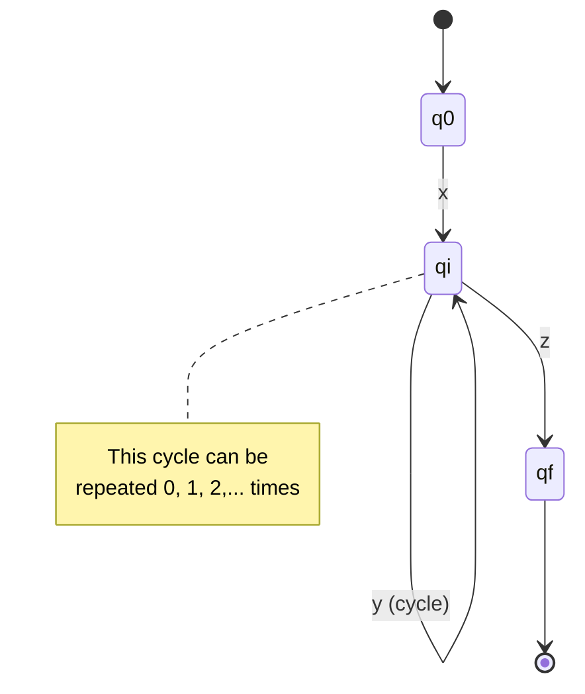

# Pumping Lemma for Regular Languages

The **Pumping Lemma** is a necessary condition for regularity. It provides a powerful technique for proving that certain languages are **not** regular.

## Statement of the Lemma

**Pumping Lemma**: If $L$ is a regular language, then there exists a positive integer $p$ (the pumping length) such that for any string $s \in L$ with $|s| \geq p$, we can write $s = xyz$ where:

1. $|y| > 0$ ($y$ is non-empty)
2. $|xy| \leq p$ ($y$ occurs early in $s$)
3. For all $i \geq 0$, $xy^i z \in L$ ($y$ can be "pumped")

Formally:
$$
L \text{ regular} \implies \exists p > 0 : \forall s \in L \left(|s| \geq p \implies \exists x,y,z : s = xyz \land |y| > 0 \land |xy| \leq p \land \forall i \geq 0 : xy^iz \in L\right)
$$

## Intuition

If $L$ is regular, some DFA $M$ with $p$ states recognizes it. For any string $s$ with $|s| \geq p$, reading $s$ must revisit some state (pigeonhole principle). This creates a cycle that can be traversed any number of times.

### Visualization

## Proof of the Lemma

Let M be a DFA with p states accepting L. Consider s ∈ L with |s| ≥ p.

Reading s, the sequence of states is q₀, q₁, ..., q_n where n ≥ p. By pigeonhole, some state repeats: q_i = q_j for i < j ≤ p.

Let:
- x = s[1..i] (prefix to first occurrence of repeated state)
- y = s[i+1..j] (substring from first to second occurrence)
- z = s[j+1..n] (suffix after second occurrence)

Then:
1. y ≠ ε (since i < j)
2. |xy| ≤ p (since j ≤ p)
3. xy^i z ∈ L (cycling through the repeated state)

## Using the Lemma (Proof by Contradiction)

To prove L is not regular:

1. Assume L is regular
2. Let p be the pumping length (exists by the lemma)
3. Choose a specific string s ∈ L with |s| ≥ p
4. For **all** possible decompositions s = xyz satisfying conditions 1 and 2, show that some xy^i z ∉ L
5. This contradicts the lemma, so L is not regular

**Key**: The adversary chooses p and the decomposition; you choose s and i.

## Example: $L = \{a^n b^n \mid n \geq 0\}$

**Claim**: $L$ is not regular.

**Proof**:
1. Assume $L$ is regular with pumping length $p$
2. Choose $s = a^p b^p \in L$ (note: $|s| = 2p \geq p$)
3. For any decomposition $s = xyz$ with $|xy| \leq p$ and $|y| > 0$:
   - Since $|xy| \leq p$, both $x$ and $y$ consist only of $a$'s
   - Thus $y = a^k$ for some $k > 0$
4. Consider $xy^2z = a^p a^k b^p = a^{p+k} b^p$
5. Since $k > 0$, we have $p + k > p$, so $xy^2z \notin L$
6. This contradicts the pumping lemma!
7. Therefore, $L$ is not regular. $\square$

## Example: L = {ww | w ∈ {a,b}*}

**Claim**: L is not regular.

**Proof**:
1. Assume L is regular with pumping length p
2. Choose s = aᵖbaᵖb ∈ L
3. For any valid decomposition, y = aᵏ for some k > 0
4. xy⁰z = aᵖ⁻ᵏbaᵖb
5. This is not of the form ww (different halves), so xy⁰z ∉ L
6. Contradiction! L is not regular.

## Example: L = {aⁿ | n is prime}

**Claim**: L is not regular.

**Proof**:
1. Assume L is regular with pumping length p
2. Choose s = aⁿ where n > p is prime
3. Let y = aᵏ where k > 0
4. Consider xy^(n+1)z = aⁿ⁺ⁿᵏ = aⁿ⁽¹⁺ᵏ⁾
5. Since n > 1 and k > 0, this is n(1+k) which is composite
6. So xy^(n+1)z ∉ L
7. Contradiction! L is not regular.

## Common Mistakes

1. **Forgetting the constraints**: y must satisfy |y| > 0 and |xy| ≤ p
2. **Not considering all decompositions**: Must argue for all valid xyz
3. **Wrong string choice**: s must be in L and depend on p appropriately
4. **Using pumping lemma to prove regularity**: The lemma is only necessary, not sufficient!

## Limitations

The pumping lemma is a **necessary but not sufficient** condition. Some non-regular languages satisfy the pumping conditions. More powerful tools:
- Myhill-Nerode theorem (gives exact characterization)
- Closure properties
- Kolmogorov complexity arguments

## Detailed Worked Example

**Problem**: Prove $L = \{0^n 1^n 0^n \mid n \geq 0\}$ is not regular.

**Proof**:

1. **Assume** L is regular with pumping length p.

2. **Choose** string $s = 0^p 1^p 0^p \in L$. Note $|s| = 3p \geq p$.

3. **Consider all decompositions** $s = xyz$ where $|xy| \leq p$ and $|y| > 0$:
   - Since $|xy| \leq p$, both x and y consist **only of 0s** from the first block
   - Therefore $y = 0^k$ for some $k > 0$

4. **Pump down** (i=0): Consider $xy^0z = xz = 0^{p-k} 1^p 0^p$
   - This has $p-k$ zeros in the first block (where $k > 0$)
   - But still has $p$ ones and $p$ zeros in the other blocks
   - Pattern is not $0^n 1^n 0^n$ for any n
   - Therefore $xz \notin L$

5. **Contradiction**: The pumping lemma is violated, so L is not regular. $\square$

## Another Worked Example: Palindromes

**Problem**: Prove $L = \{w \in \{a,b\}^* \mid w = w^R\}$ (palindromes) is not regular.

**Proof**:

1. Assume L is regular with pumping length p.

2. Choose $s = a^p b a^p \in L$ (a palindrome with $|s| = 2p + 1 \geq p$).

3. For any decomposition $s = xyz$ where $|xy| \leq p$ and $|y| > 0$:
   - Both x and y consist only of a's from the first block
   - So $y = a^k$ for some $k > 0$

4. Pump up (i=2): $xy^2z = a^{p+k} b a^p$
   - First block has $p+k$ a's
   - Last block has $p$ a's
   - Not a palindrome since $p+k \neq p$
   - Therefore $xy^2z \notin L$

5. Contradiction, so L is not regular. $\square$

## Strategic String Selection

Choosing the right string is crucial. Guidelines:

**1. Ensure $s \in L$**: Your string must actually be in the language!

**2. Depend on p**: Use p in the construction (e.g., $a^p b^p$, not just "aabb")

**3. Force constraints**: Choose s so that constraints $|xy| \leq p$ and $|y| > 0$ limit where y can be
   - This restricts what the adversary can choose

**4. Enable pumping violation**: The string should break when pumped (for some i)

**Bad choices**:
- Constant strings like "aabb" (doesn't use p)
- Strings where any pumping works (defeating your proof)

**Good choices**:
- Strings with critical structure in first p symbols
- Strings where imbalance is created by pumping

## Common Proof Strategies

### Strategy 1: Counting Argument
For languages requiring equal counts:
- Choose string with balanced counts
- Show pumping creates imbalance
- Examples: $\{a^n b^n\}$, $\{a^n b^n c^n\}$

### Strategy 2: Positional Argument
For languages requiring specific positions:
- Choose string where position matters
- Show pumping shifts position
- Examples: $\{ww\}$, $\{a^n b^m \mid n < m\}$

### Strategy 3: Arithmetic Argument
For languages with arithmetic constraints:
- Choose string satisfying constraint
- Show pumping breaks arithmetic property
- Examples: $\{a^{n^2}\}$, $\{a^p \mid p \text{ prime}\}$

## Proving $\{ww \mid w \in \{a,b\}^*\}$ is Not Regular

**Proof**:

1. Assume L is regular with pumping length p.

2. Choose $s = a^p b^p a^p b^p \in L$ (where $w = a^p b^p$).

3. For any $s = xyz$ with $|xy| \leq p$ and $|y| > 0$:
   - $y = a^k$ for some $k > 0$ (in first block)

4. Consider $xy^0z = xz = a^{p-k} b^p a^p b^p$
   - For this to be in L, it must equal $ww$ for some w
   - First half: $a^{p-k} b^p$
   - Second half: $a^p b^p$
   - These are **different** (since $p-k < p$)
   - Not of form $ww$, so $xz \notin L$

5. Contradiction, so L is not regular. $\square$

## Advanced Example: Perfect Squares

**Problem**: Prove $L = \{a^{n^2} \mid n \geq 0\}$ is not regular.

**Proof**:

1. Assume L is regular with pumping length p.

2. Choose $s = a^{p^2} \in L$ with $|s| = p^2 \geq p$.

3. For any decomposition $s = xyz$ where $|xy| \leq p$ and $|y| > 0$:
   - We have $|y| = k$ where $0 < k \leq p$

4. Consider $xy^2z$:
   - Length: $|xy^2z| = p^2 + k$
   - We need: $p^2 < p^2 + k \leq p^2 + p$

5. **Key observation**:
   - Next perfect square after $p^2$ is $(p+1)^2 = p^2 + 2p + 1$
   - But $p^2 + k \leq p^2 + p < p^2 + 2p + 1$
   - So $p^2 + k$ is **not a perfect square**!

6. Therefore $xy^2z \notin L$. Contradiction, so L is not regular. $\square$

## Why the Pumping Lemma is Only Necessary

The pumping lemma gives a **necessary** condition for regularity, not sufficient.

**Counter-example**: Consider
$$L = \{a^i b^j c^k \mid i,j,k \geq 0 \text{ and if } i=1 \text{ then } j=k\}$$

This language **satisfies the pumping lemma** (can choose p=2 and verify all cases), but is **not regular** (can be proven using Myhill-Nerode theorem or closure properties).

**Moral**:
- Pumping lemma can prove **non-regularity**
- It **cannot** prove regularity
- For sufficiency, use: Myhill-Nerode, or construct a DFA/NFA/regex

## Relationship to Myhill-Nerode

The pumping lemma is weaker than the **Myhill-Nerode theorem**:

**Myhill-Nerode**: L is regular iff $\equiv_L$ has finite index.

This is **necessary and sufficient** (iff), while pumping is only necessary (if).

**When to use each**:
- **Pumping lemma**: Quick proofs of non-regularity
- **Myhill-Nerode**: When pumping fails, or when proving regularity

## Common Student Mistakes

### Mistake 1: You choose p
**Wrong**: "Let p = 10. Then for string..."
**Right**: "Let p be the pumping length. For any p, consider..."

The adversary (the pumping lemma) chooses p. You must work for **all** possible p.

### Mistake 2: You choose the decomposition
**Wrong**: "Let y be the first symbol..."
**Right**: "For any decomposition where |xy| ≤ p and |y| > 0..."

The adversary chooses x, y, z. You must show **all** valid decompositions fail.

### Mistake 3: Pumping with wrong i
**Wrong**: Only checking i=2 or i=0
**Right**: Find **some** i where $xy^iz \notin L$

You choose i. Often i=0 or i=2 works, but sometimes you need a different i.

### Mistake 4: String not in L
**Wrong**: Choosing $s = a^p b^{p+1}$ to prove $\{a^n b^n\}$ not regular
**Right**: Choose $s = a^p b^p \in L$

The pumping lemma only applies to strings **in** the language!

## Applications

Non-regularity proofs matter because:

- **Determine appropriate computational models**: If a language isn't regular, you need more powerful automata (PDA, Turing machine)
- **Guide algorithm design**: Knowing limits helps choose right data structures and algorithms
- **Inform language/grammar design**: Design parsers for non-regular languages differently than for regular ones
- **Establish theoretical boundaries**: Understanding what's possible with finite memory
- **Compiler design**: Lexical analysis uses DFAs (regular), parsing uses CFGs (non-regular)
- **Formal verification**: Proving properties about system behaviors

## Key Takeaways

- Pumping lemma is a necessary (but not sufficient) condition for regularity
- Used exclusively for proving languages are NOT regular
- Game-like structure: adversary chooses p and decomposition, you choose s and i
- String choice is critical: must be in L, depend on p, and enable violation
- Common strategies: counting, positional, and arithmetic arguments
- All valid decompositions must fail for your chosen string
- Cannot prove regularity using pumping lemma alone
- Myhill-Nerode theorem provides necessary and sufficient condition
- Essential tool for understanding limitations of finite automata
