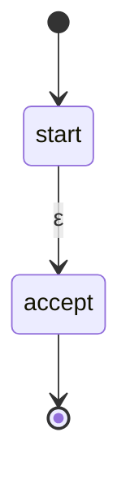
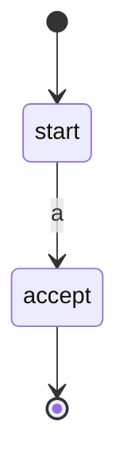
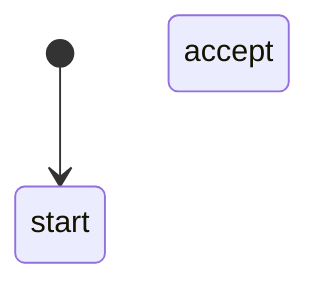
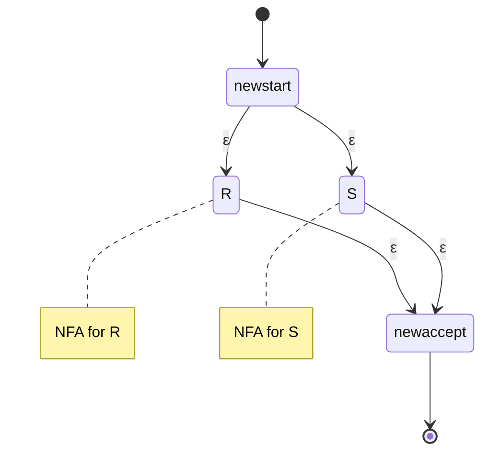
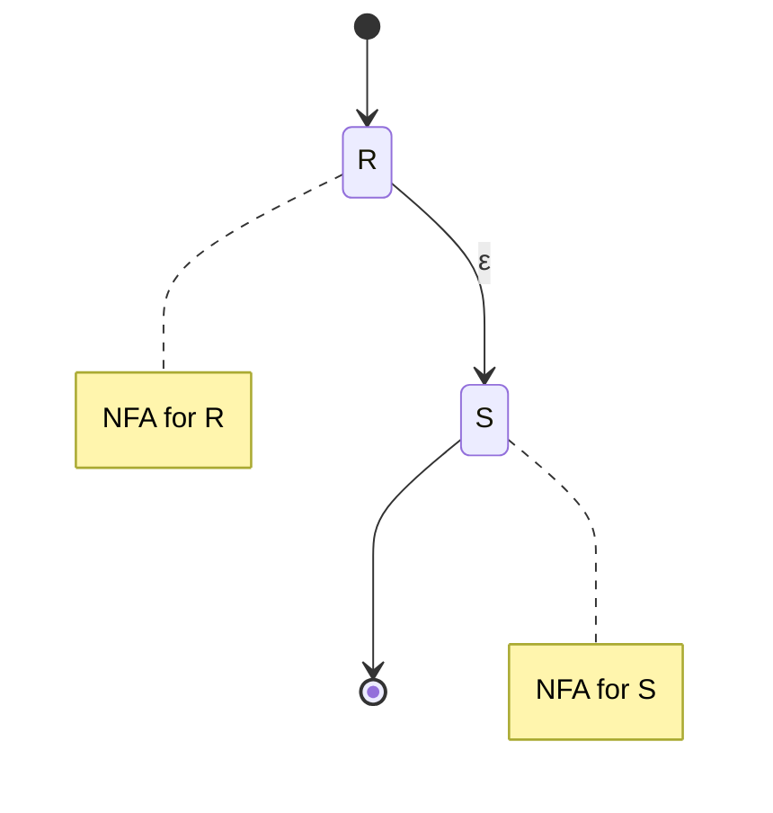
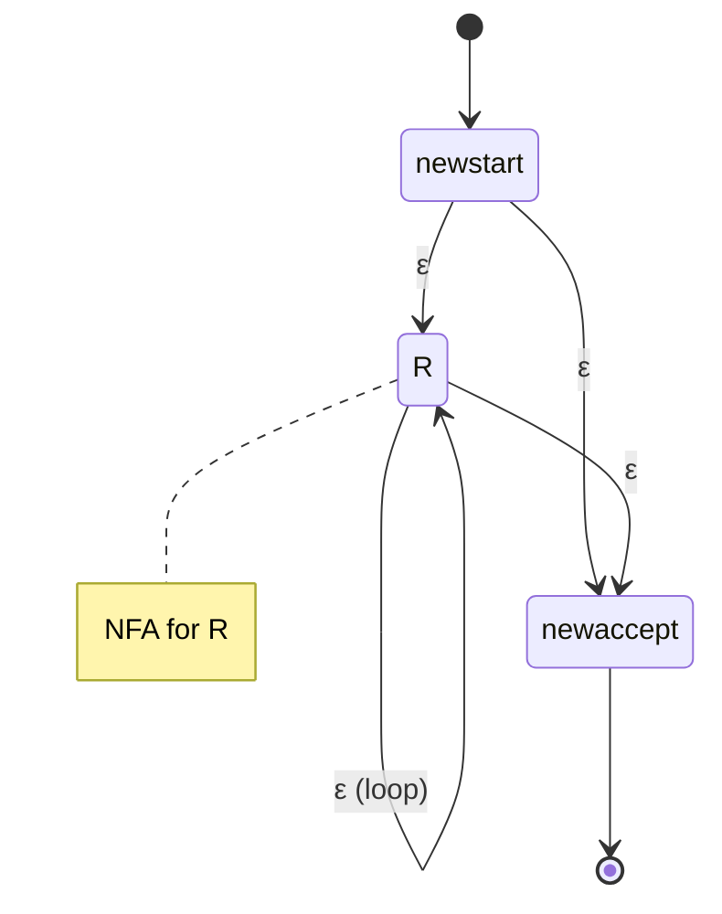

# Regex to NFA Conversion

**Thompson's construction** converts any regular expression to an equivalent NFA. This algorithm is fundamental to regex matching implementations.

## Thompson's Construction

The algorithm builds NFAs inductively, following the structure of the regex. Each construction produces an NFA with:
- Exactly one start state (no incoming transitions)
- Exactly one accept state (no outgoing transitions)
- At most 2n states for an expression of size n

## Base Cases

### Empty String: $\varepsilon$



Single transition on $\varepsilon$.

### Single Symbol: $a$



Single transition labeled with symbol $a$.

### Empty Language: $\emptyset$



No transition connecting start to accept (nothing accepted).

## Recursive Cases

### Union: $R \mid S$

Given NFAs for $R$ and $S$:



New start state with $\varepsilon$-transitions to both sub-NFAs. Both sub-NFAs' accept states connect via $\varepsilon$ to new accept.

### Concatenation: $RS$



Connect $R$'s accept state to $S$'s start state with $\varepsilon$-transition. Overall start is $R$'s start, overall accept is $S$'s accept.

### Kleene Star: $R^*$



Structure allows:
- $\varepsilon$ from new start to $R$'s start (enter loop)
- $\varepsilon$ from $R$'s accept back to $R$'s start (repeat)
- $\varepsilon$ from new start to new accept (accept empty, skip entirely)
- $\varepsilon$ from $R$'s accept to new accept (exit loop)

## Properties of Thompson Construction

1. **Linear size**: NFA has at most 2|R| states for regex R
2. **Simple structure**: Each state has at most two outgoing transitions
3. **ε-transitions only split/merge**: Alphabet transitions are direct
4. **Compositional**: Built from sub-NFAs

## Example: (a|b)*abb

Building bottom-up:

1. NFA for a: s₁ --a--> s₂
2. NFA for b: s₃ --b--> s₄
3. NFA for (a|b): s₀ --ε--> s₁, s₀ --ε--> s₃, s₂ --ε--> s₅, s₄ --ε--> s₅
4. NFA for (a|b)*: add loop and bypass
5. NFA for abb: three consecutive symbol transitions
6. Concatenate all parts

## Converting to DFA

After Thompson's construction, use subset construction:

1. Build NFA using Thompson's construction
2. Apply subset construction to get DFA
3. Optionally minimize the DFA

This three-step process is used in most regex implementations.

## Alternative: Glushkov Construction

Glushkov's construction builds an ε-free NFA:

1. **Mark** positions in regex (each symbol gets unique label)
2. Compute **nullable**, **first**, **last**, **follow** sets
3. Create state for each position plus start state
4. Transitions based on follow relationships

Results in n+1 states for n positions (more compact than Thompson).

## Comparison

| Property | Thompson | Glushkov |
|----------|----------|----------|
| States | ≤ 2n | n+1 |
| ε-transitions | Yes | No |
| Construction | Simpler | More complex |
| Determinization | Same result | Same result |

## Implementation Notes

Thompson's construction is preferred for:
- Simple implementation
- Lazy NFA simulation (no full DFA construction)
- On-the-fly matching

```python
def thompson_concat(nfa1, nfa2):
    # Connect nfa1's accept to nfa2's start with ε
    nfa1.accept.add_epsilon_transition(nfa2.start)
    return NFA(nfa1.start, nfa2.accept)

def thompson_union(nfa1, nfa2):
    new_start = State()
    new_accept = State()
    new_start.add_epsilon_transition(nfa1.start)
    new_start.add_epsilon_transition(nfa2.start)
    nfa1.accept.add_epsilon_transition(new_accept)
    nfa2.accept.add_epsilon_transition(new_accept)
    return NFA(new_start, new_accept)
```

## Regex Derivatives Alternative

Instead of building an automaton, use **Brzozowski derivatives**:

∂_a R gives the regex matching suffixes after reading 'a'

This enables on-the-fly matching without explicit NFA construction.

## Extended Example: Complete Construction

**Problem**: Build NFA for $(a|b)^*abb$ using Thompson's construction.

**Step-by-step construction**:

**1. Build NFA for $a$**:
- States: {s₁, s₂}
- Transitions: s₁ --a--> s₂
- Start: s₁, Accept: {s₂}

**2. Build NFA for $b$**:
- States: {s₃, s₄}
- Transitions: s₃ --b--> s₄
- Start: s₃, Accept: {s₄}

**3. Build NFA for $(a|b)$** (union):
- States: {s₀, s₁, s₂, s₃, s₄, s₅}
- New start s₀: s₀ --ε--> s₁, s₀ --ε--> s₃
- New accept s₅: s₂ --ε--> s₅, s₄ --ε--> s₅
- Total: 6 states

**4. Build NFA for $(a|b)^*$** (star):
- Add new start s₆ and accept s₇
- s₆ --ε--> s₀ (enter)
- s₆ --ε--> s₇ (bypass)
- s₅ --ε--> s₀ (loop back)
- s₅ --ε--> s₇ (exit)
- Total: 8 states

**5. Build NFAs for final $abb$**:
- Three simple 2-state NFAs
- Total: 6 states

**6. Concatenate everything**:
- Connect accepts to starts with ε
- Final NFA: approximately 14 states total

This demonstrates the linear growth: regex size 7 symbols → NFA with ~14 states (2× factor).

## Practical Implementation Details

### State Representation

```python
class State:
    def __init__(self):
        self.transitions = {}  # symbol -> set of states
        self.epsilon_transitions = set()  # ε-transitions
        self.is_accepting = False

class NFA:
    def __init__(self, start, accept):
        self.start = start
        self.accept = accept
```

### Thompson Construction Functions

```python
def thompson_symbol(symbol):
    start = State()
    accept = State()
    accept.is_accepting = True
    start.transitions[symbol] = {accept}
    return NFA(start, accept)

def thompson_star(nfa):
    new_start = State()
    new_accept = State()
    new_accept.is_accepting = True

    # Entry and bypass
    new_start.epsilon_transitions = {nfa.start, new_accept}

    # Loop and exit
    nfa.accept.is_accepting = False
    nfa.accept.epsilon_transitions = {nfa.start, new_accept}

    return NFA(new_start, new_accept)
```

## Performance Analysis

### Construction Time

- **Regex size**: n symbols
- **NFA states**: at most 2n
- **Construction time**: O(n)
- Each operator creates constant number of states

### Matching Performance

Two approaches for matching string w:

**1. Direct NFA simulation**:
- Maintain set of active states
- Time: O(|w| · |Q|) worst case
- Space: O(|Q|)

**2. Convert to DFA first**:
- Subset construction: potentially O(2^|Q|) states
- DFA matching: O(|w|) guaranteed
- Trade-off: construction time vs. query time

### Memory Usage

Thompson NFA is **memory efficient**:
- Linear number of states
- Simple structure (≤2 outgoing edges per state)
- No complex bookkeeping needed

## Comparison with Other Constructions

### Thompson vs. Glushkov vs. Antimirov

| Property | Thompson | Glushkov | Antimirov |
|----------|----------|----------|-----------|
| States | ≤ 2n | n+1 | ≤ n+1 |
| ε-transitions | Yes | No | No |
| Determinism | No | No | Partial |
| Construction | Simplest | Moderate | Complex |
| Best for | Implementation | Theory | Optimization |

### Why Thompson Dominates in Practice

1. **Simplicity**: Easy to implement correctly
2. **Incremental**: Build piece by piece
3. **Compositional**: Mirrors regex structure
4. **Lazy evaluation**: Can stop construction early
5. **Debuggability**: Each subexpression has clear NFA

## Advanced: Optimizations

### Common Optimizations

**1. ε-transition elimination**: Convert to ε-free NFA
- Compute ε-closure for each state
- Add direct transitions

**2. State merging**: Combine equivalent states
- Use bisimulation or DFA minimization
- Reduces state count

**3. On-the-fly construction**: Build NFA as needed
- Don't construct unused parts
- Good for large regexes with short matches

**4. Caching**: Reuse NFAs for common subexpressions
- Particularly useful for repeated patterns
- Reduces construction time

## Applications Beyond Matching

### Lexical Analysis

Compilers combine multiple regexes for different tokens:

```
NFA₁ = thompson(IDENTIFIER regex)
NFA₂ = thompson(NUMBER regex)
NFA₃ = thompson(KEYWORD regex)
NFA_combined = union(NFA₁, NFA₂, NFA₃)
```

Then convert combined NFA to DFA for efficient tokenization.

### Text Search

Search engines use Thompson NFAs with modifications:
- **Anchoring**: start/end of string or line
- **Capturing groups**: remember matched substrings
- **Backreferences**: more powerful than regular (technically context-sensitive)

### Network Intrusion Detection

Match packets against threat signatures:
- Thousands of regex patterns
- Need efficient multi-pattern matching
- Use combined NFA or DFA-based approaches

## Key Takeaways

- **Thompson's construction** converts any regular expression to an NFA with at most 2n states for a regex of size n
- Each subexpression produces an NFA with **exactly one start state** (no incoming transitions) and **one accept state** (no outgoing transitions)
- **Base cases**: ε, single symbols, and ∅ produce simple 2-state NFAs (or just start state for ∅)
- **Union** (R|S) creates new start/accept states with ε-transitions to/from both sub-NFAs (parallel structure)
- **Concatenation** (RS) connects R's accept to S's start with an ε-transition (sequential structure)
- **Kleene star** (R*) adds new start/accept with ε-transitions allowing bypass (zero) and looping (repetition)
- Construction is **compositional and incremental**: build bottom-up following regex structure
- **Linear time and space**: O(n) construction time, O(n) states, very efficient in practice
- **Alternative approaches** exist (Glushkov, Antimirov) with fewer states but more complex construction
- For matching, either simulate NFA directly O(|w|·|Q|) or convert to DFA first for O(|w|) matching
- Thompson NFAs are widely used in **compilers (lexical analysis), text editors, and pattern matching libraries**
- The construction proves that **every regular expression can be recognized by a finite automaton**
