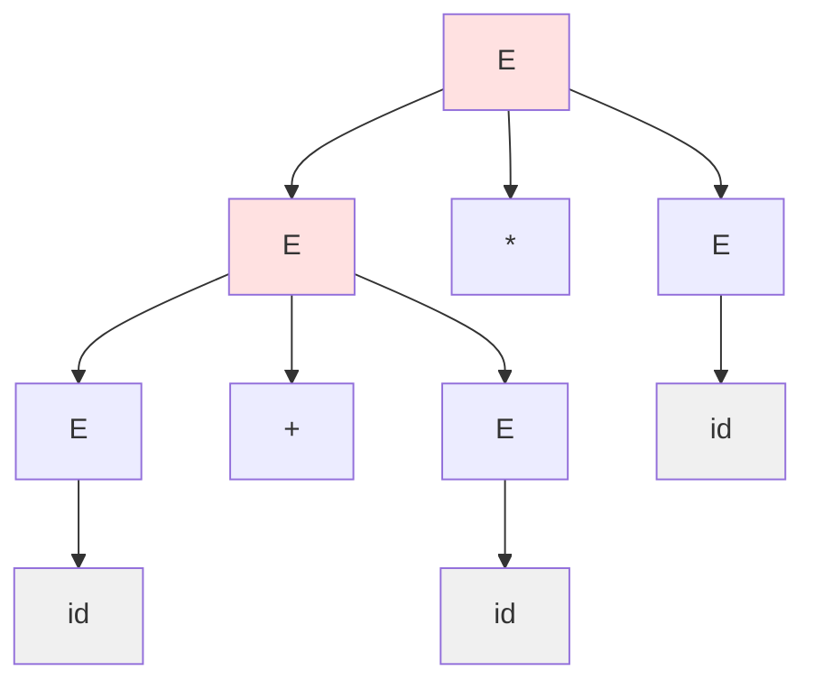
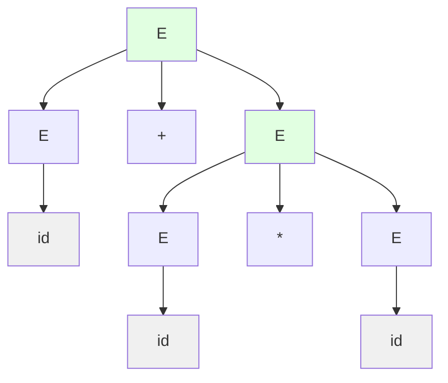
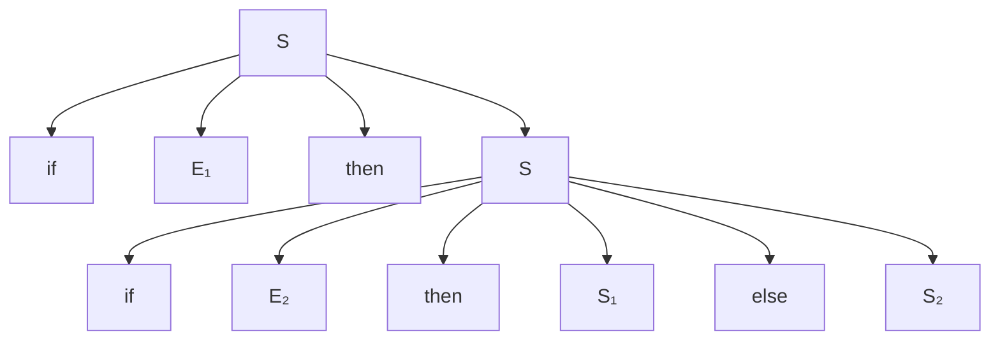
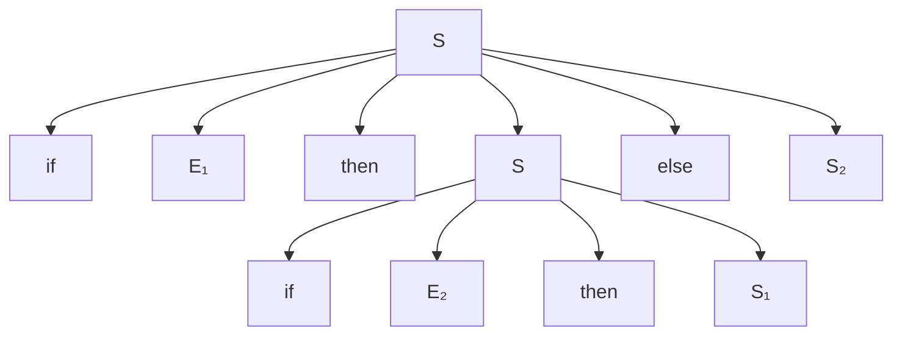

# Ambiguity

A grammar is **ambiguous** if some string has multiple parse trees. Ambiguity causes problems in parsing and interpretation.

## Definition

A CFG $G$ is **ambiguous** if there exists a string $w \in L(G)$ with two or more distinct parse trees.

Equivalently, $w$ has two distinct leftmost derivations (or two distinct rightmost derivations).

Formally:
$$
G \text{ is ambiguous} \iff \exists w \in L(G) : w \text{ has multiple parse trees}
$$

## Classic Example: Dangling Else

Grammar for if-statements:
- S → if E then S else S
- S → if E then S
- S → other

For "if E₁ then if E₂ then S₁ else S₂":
- Parse 1: else binds to inner if
- Parse 2: else binds to outer if

This **dangling else** ambiguity appears in many programming languages.

## Arithmetic Expression Ambiguity

Ambiguous grammar: $E \to E + E \mid E * E \mid \text{id}$

For "id + id * id":

### Parse Tree 1: $(id + id) * id$



### Parse Tree 2: $id + (id * id)$



These give different evaluation results! Tree 1 evaluates to $(id_1 + id_2) \times id_3$, while Tree 2 evaluates to $id_1 + (id_2 \times id_3)$.

## Detecting Ambiguity

**Bad news**: Ambiguity is **undecidable** in general.

No algorithm can determine if an arbitrary CFG is ambiguous.

**Practical approach**: Use grammar patterns known to be unambiguous.

## Removing Ambiguity

### Technique 1: Precedence Levels
Introduce separate variables for different precedence:
```
E → E + T | T
T → T * F | F
F → (E) | id
```
Now * binds tighter than +.

### Technique 2: Associativity
Left-associative: E → E + T
Right-associative: E → T + E

### Technique 3: Disambiguating Rules
Add rules outside grammar to resolve ambiguity:
- "else binds to nearest if"
- "operators left-associate"

## Inherent Ambiguity

Some CFLs are **inherently ambiguous**: every grammar for them is ambiguous.

**Example**: $L = \{a^n b^n c^m d^m \mid n, m \geq 1\} \cup \{a^n b^m c^m d^n \mid n, m \geq 1\}$

Any grammar for $L$ must be ambiguous because strings like $a^n b^n c^n d^n$ belong to both sub-languages and can be parsed in two fundamentally different ways:
- Matching $n$ $a$'s with $n$ $b$'s and $n$ $c$'s with $n$ $d$'s
- Matching $n$ $a$'s with $n$ $d$'s and $n$ $b$'s with $n$ $c$'s

## Ambiguity in Practice

### Parser Generators
Tools like Yacc/Bison:
- Detect ambiguity as shift-reduce conflicts
- Allow explicit resolution rules
- Default: shift on conflict (else binds to nearest if)

### GLR Parsers
Handle ambiguous grammars by:
- Exploring all parses in parallel
- Returning parse forest
- Useful for NLP where ambiguity is natural

## Consequences of Ambiguity

| Context | Issue |
|---------|-------|
| Programming languages | Multiple interpretations |
| Compilers | Which code to generate? |
| Natural language | "I saw the man with binoculars" |
| Security | Parsing inconsistencies |

## Unambiguous Grammar Properties

For unambiguous G:
- Each w ∈ L(G) has exactly one parse tree
- Each w has exactly one leftmost derivation
- Each w has exactly one rightmost derivation
- Parsing produces deterministic result

## Testing for Ambiguity

Heuristics:
- Generate random strings, count parses
- Use grammar analysis tools
- Check for common ambiguous patterns

## Real-World Example: Programming Language If-Then-Else

The dangling else problem is a classic ambiguity issue in programming language design. Let's explore it in depth.

**Ambiguous Grammar**:
```
S → if E then S
  | if E then S else S
  | other
E → condition
```

**Ambiguous String**: `if E₁ then if E₂ then S₁ else S₂`

### Parse Tree 1: Else Binds to Inner If


### Parse Tree 2: Else Binds to Outer If


Most programming languages resolve this by the **"else binds to nearest if"** rule, effectively choosing Parse Tree 1.

## Resolving Dangling Else: Unambiguous Grammar

**Unambiguous Grammar** using matched/unmatched statements:
```
S → M | U
M → if E then M else M | other
U → if E then S
  | if E then M else U
E → condition
```

Where:
- **M** (matched): every if has a matching else
- **U** (unmatched): at least one if without else

This grammar enforces that between `if` and `else`, only matched statements can appear, eliminating ambiguity.

## Detailed Ambiguity: Associativity Issues

Consider an arithmetic grammar without precedence:

**Ambiguous Grammar**: E → E - E | num

**String**: `5 - 3 - 2`

### Left-Associative Parse: (5 - 3) - 2 = 0
```
    E
   /|\
  E - E
 /|\   |
E - E  2
|   |
5   3
```

Evaluates as (5 - 3) - 2 = 2 - 2 = 0

### Right-Associative Parse: 5 - (3 - 2) = 4
```
    E
   /|\
  E - E
  |  /|\
  5 E - E
    |   |
    3   2
```

Evaluates as 5 - (3 - 2) = 5 - 1 = 4

Most programming languages require left associativity for subtraction. The unambiguous grammar is:

```
E → E - T | T
T → num
```

This forces left-associative parsing.

## Common Sources of Ambiguity

### 1. Operator Precedence
Without separate variables for different precedence levels, expressions like `a + b * c` have multiple interpretations.

### 2. Operator Associativity
Without directional recursion, expressions like `a - b - c` can group differently.

### 3. Nested Constructs
Conditional statements, matched parentheses, and nested blocks can create structural ambiguity.

### 4. Optional Components
Grammar rules like `A → aA | A` create ambiguity about when to include optional elements.

## Advanced Example: Natural Language Ambiguity

Natural language exhibits inherent ambiguity. Consider:

**Sentence**: "I saw the man with the telescope"

**Grammar** (simplified):
```
S → NP VP
NP → NP PP | Det N | Pronoun
VP → V NP | VP PP
PP → P NP
```

### Parse 1: Telescope Modifies "Man"
"I saw [the man [with the telescope]]" - The man has a telescope

### Parse 2: Telescope Modifies "Saw"
"I [saw [the man] [with the telescope]]" - I used a telescope to see

Both parses are grammatically valid, creating genuine ambiguity that requires semantic or contextual information to resolve.

## Deterministic Parsing and Ambiguity

Deterministic parsers (like LL and LR) cannot handle ambiguous grammars:

**LL Parsers**:
- Make predictive decisions based on lookahead
- Require unambiguous grammar to choose correct production
- Conflicts indicate ambiguity

**LR Parsers**:
- Build rightmost derivation in reverse
- Shift/reduce conflicts indicate potential ambiguity
- Reduce/reduce conflicts definitely indicate ambiguity

## Tools for Ambiguity Detection

### Parser Generators
- **Yacc/Bison**: Report shift/reduce and reduce/reduce conflicts
- **ANTLR**: Provides warnings about ambiguous alternatives
- **Grammar analyzers**: Specialized tools to detect common ambiguity patterns

### Automated Testing
- Generate strings and count distinct parse trees
- Use exhaustive search for short strings
- Apply heuristics for longer strings

### Formal Methods
- Prove grammar properties using automata theory
- Check for specific ambiguity patterns
- Use decision procedures for restricted grammar classes

## Disambiguation Techniques

### 1. Grammar Rewriting
Transform ambiguous grammar to equivalent unambiguous form:
- Introduce additional variables for precedence levels
- Use directional recursion for associativity
- Split production rules to eliminate conflicts

### 2. Precedence Declarations
External rules specify operator relationships:
```
%left '+' '-'
%left '*' '/'
%right '^'
```

Parser generators use these to resolve conflicts automatically.

### 3. Disambiguation Rules
Programming language specifications include:
- "Longest match" for lexical analysis
- "Else binds to nearest if"
- "Left associativity by default"

### 4. Restricted Grammar Classes
Use grammar forms known to be unambiguous:
- LL(k) grammars
- LR(k) grammars
- Operator precedence grammars

## Impact on Compiler Design

Ambiguity affects multiple compiler phases:

### Lexical Analysis
Ambiguous regular expressions can cause:
- Token boundary confusion
- Multiple token interpretations
- Longest match rule resolves many issues

### Syntax Analysis
Ambiguous CFGs prevent deterministic parsing:
- Parser cannot make unique choices
- Multiple parse trees require resolution
- Performance degrades with backtracking

### Semantic Analysis
Even if syntax is unambiguous, semantic ambiguity can arise:
- Overloaded functions
- Type inference
- Name resolution in nested scopes

## Practical Strategies for Language Designers

When designing a programming language grammar:

1. **Start with unambiguous core**: Use proven patterns for expressions, statements
2. **Test extensively**: Generate test cases, verify single parse
3. **Use parser generator tools**: Let tools detect conflicts
4. **Document disambiguation**: Specify precedence and associativity explicitly
5. **Consider LL(k) or LR(k)**: These classes are unambiguous by construction
6. **Learn from existing languages**: Reuse well-tested grammar patterns

## Key Takeaways

- A grammar is ambiguous if some string has multiple distinct parse trees
- Ambiguity is undecidable in general—no algorithm can detect it for all grammars
- Common sources include operator precedence, associativity, and nested structures
- The dangling else problem is a classic example from programming language design
- Disambiguation techniques include grammar rewriting, precedence declarations, and external rules
- Deterministic parsers (LL, LR) require unambiguous grammars to function correctly
- Some languages are inherently ambiguous—every grammar for them is ambiguous
- Parser generator tools help detect ambiguity through conflict analysis
- Practical language design requires careful attention to grammar structure to avoid ambiguity
- Natural languages often exhibit ambiguity that requires semantic analysis to resolve
