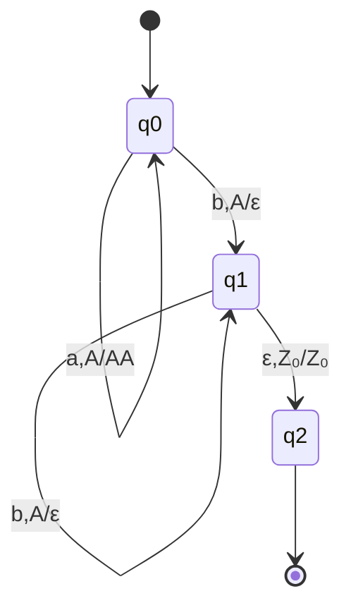

# PDA Definition

A **Pushdown Automaton (PDA)** extends finite automata with a stack, enabling recognition of context-free languages. The stack provides unlimited memory with last-in-first-out access, giving PDAs the power to track nested structures like matching parentheses or balanced brackets.

## Historical Context and Motivation

Pushdown automata were introduced in the 1960s as researchers sought computational models precisely matching the power of context-free grammars. While finite automata could handle regular languages, they lacked the memory needed for nested structures. Adding a stack—the simplest form of unbounded memory with restricted access—proved to be exactly what was needed.

The term "pushdown" comes from the stack operations: items are "pushed down" onto the stack and "popped up" from it. This terminology originated from physical implementations where springs pushed items up as others were removed.

## Intuitive Understanding

Think of a PDA as a finite automaton equipped with an auxiliary memory in the form of a stack (like a stack of plates). The automaton can:
- Read the current input symbol
- Examine the top symbol on the stack
- Based on both, transition to a new state while modifying the stack

The stack enables "remembering" information: push symbols to remember them, pop symbols to verify matches. This is exactly what's needed to recognize languages like {aⁿbⁿ} where we must count a's and match them with b's.

## Formal Definition

A PDA is a 7-tuple $M = (Q, \Sigma, \Gamma, \delta, q_0, Z_0, F)$ where:

- **Q** is a finite set of states
- **Σ** is the input alphabet
- **Γ** is the stack alphabet
- $\delta: Q \times (\Sigma \cup \{\varepsilon\}) \times \Gamma \to \mathcal{P}(Q \times \Gamma^*)$ is the transition function
- $q_0 \in Q$ is the start state
- $Z_0 \in \Gamma$ is the initial stack symbol
- $F \subseteq Q$ is the set of accepting states

## Understanding Transitions

A transition $\delta(q, a, X) = \{(p_1, \gamma_1), (p_2, \gamma_2), \ldots\}$ means:

In state $q$, reading input $a$ (or $\varepsilon$ for no input), with $X$ on top of stack:
- Move to state $p_i$
- Replace $X$ with string $\gamma_i$ ($\gamma_i$ pushed right-to-left)

## Stack Operations

Via the transition function:
- **Push**: $\delta(q, a, X) = \{(p, YX)\}$ — push $Y$ onto stack
- **Pop**: $\delta(q, a, X) = \{(p, \varepsilon)\}$ — remove $X$ from stack
- **Replace**: $\delta(q, a, X) = \{(p, Y)\}$ — replace $X$ with $Y$
- **No change**: $\delta(q, a, X) = \{(p, X)\}$ — keep $X$ on stack

## Configurations

A **configuration** (or instantaneous description) is a triple $(q, w, \gamma)$:
- $q \in Q$: current state
- $w \in \Sigma^*$: remaining input
- $\gamma \in \Gamma^*$: current stack contents (top on left)

## Computation Steps

One step: $(q, aw, X\beta) \vdash (p, w, \alpha\beta)$

if $(p, \alpha) \in \delta(q, a, X)$ where $a \in \Sigma \cup \{\varepsilon\}$

Multiple steps: $\vdash^*$ denotes the reflexive transitive closure

## Example PDA

PDA for $L = \{a^n b^n \mid n \geq 0\}$:

- $Q = \{q_0, q_1, q_2\}$
- $\Sigma = \{a, b\}$
- $\Gamma = \{Z_0, A\}$
- Transitions:
  - $\delta(q_0, a, Z_0) = \{(q_0, AZ_0)\}$ — start pushing
  - $\delta(q_0, a, A) = \{(q_0, AA)\}$ — push more A's
  - $\delta(q_0, b, A) = \{(q_1, \varepsilon)\}$ — start matching
  - $\delta(q_1, b, A) = \{(q_1, \varepsilon)\}$ — match more
  - $\delta(q_1, \varepsilon, Z_0) = \{(q_2, Z_0)\}$ — accept
- $F = \{q_2\}$

### State Diagram

### Computation Example

Input "aabb":

$$
\begin{align*}
(q_0, aabb, Z_0) &\vdash (q_0, abb, AZ_0) && \text{push A} \\
&\vdash (q_0, bb, AAZ_0) && \text{push A} \\
&\vdash (q_1, b, AZ_0) && \text{pop A for b} \\
&\vdash (q_1, \varepsilon, Z_0) && \text{pop A for b} \\
&\vdash (q_2, \varepsilon, Z_0) && \text{accept}
\end{align*}
$$

## Nondeterminism

PDAs are inherently nondeterministic:
- Multiple transitions from same configuration
- Guessing structure of input
- Essential for recognizing some CFLs

## Graphical Notation

Transitions drawn as: q --a, X/γ--> p

Meaning: read a, pop X, push γ, move to p

## Key Differences from DFA

| Feature | DFA | PDA |
|---------|-----|-----|
| Memory | None (states only) | Unbounded stack |
| Determinism | Deterministic | Usually nondeterministic |
| Transitions | Based on state + input | State + input + stack |
| Power | Regular languages | Context-free languages |

## Why the Stack is Essential

The stack provides exactly the right kind of memory for context-free languages:

**LIFO Access**: The last item pushed is the first one accessible. This matches the nested structure of CFLs—the most recently opened parenthesis must be closed first.

**Unbounded Capacity**: The stack can grow arbitrarily large, allowing PDAs to handle strings of any length with arbitrary nesting depth.

**Restricted Access**: Unlike random-access memory, only the top is visible. This restriction exactly matches the power needed for CFLs.

## Equivalence with CFGs

A fundamental theorem states that PDAs recognize exactly the context-free languages:

**Theorem**: A language L is context-free if and only if some PDA recognizes L.

This equivalence is deep: given any CFG, we can construct an equivalent PDA, and vice versa. The construction techniques are covered in subsequent subtopics.

## Practical Applications

PDAs model important real-world systems:
- **Parsers**: Syntax analyzers in compilers use stack-based parsing
- **Expression Evaluation**: Calculator programs use stacks for operator precedence
- **XML/HTML Processing**: Validating properly nested tags requires stack-like memory
- **Programming Language Interpreters**: Function call stacks mirror PDA behavior

## Key Takeaways

- PDAs extend finite automata with a stack for unbounded LIFO memory
- The 7-tuple definition specifies states, alphabets, transitions, and acceptance
- Transitions depend on current state, input symbol, and stack top
- Stack operations (push, pop, replace) are encoded in the transition function
- Nondeterminism is essential—some CFLs require nondeterministic PDAs
- PDAs recognize exactly the context-free languages (equivalent to CFGs)
- Configurations (state, remaining input, stack) describe computation snapshots
