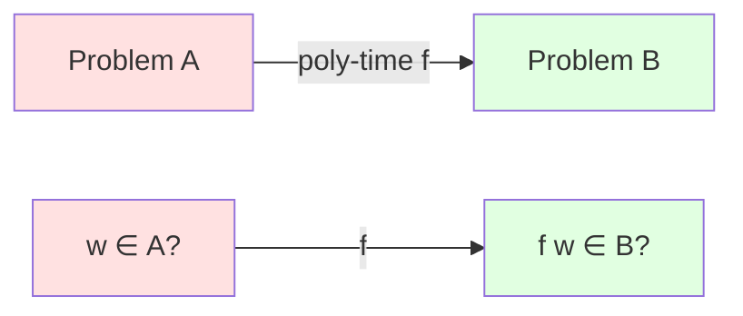
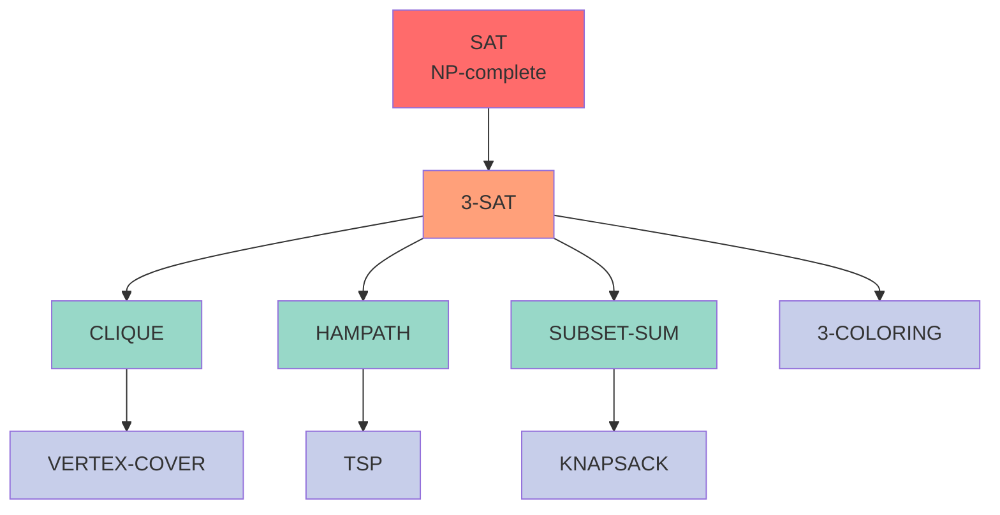
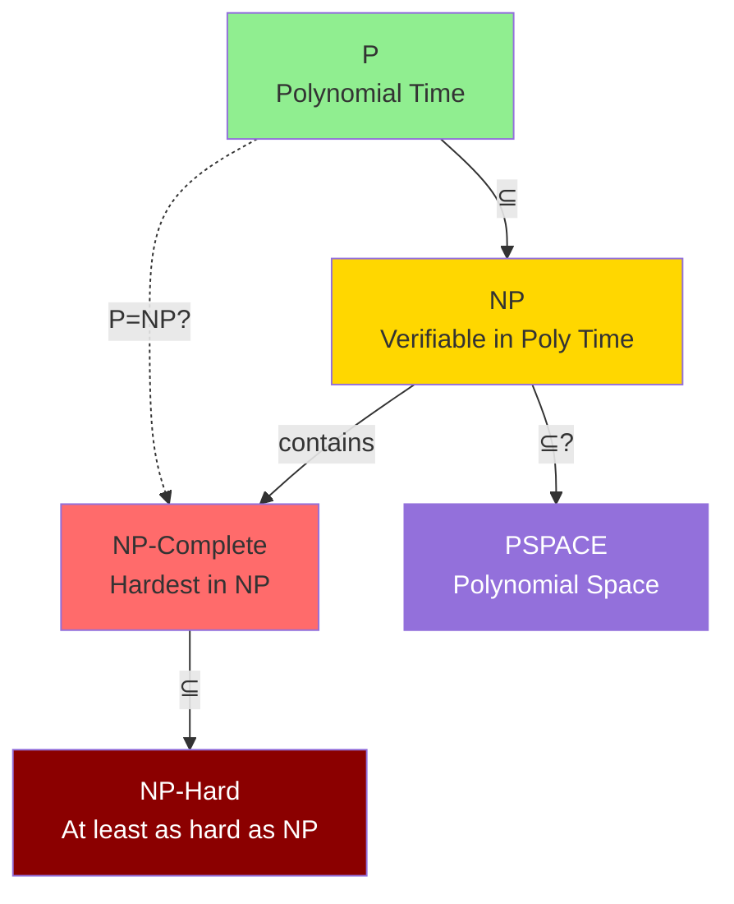

# NP-Completeness

**NP-complete** problems are the "hardest" problems in NP. If any NP-complete problem has a polynomial-time algorithm, then P = NP. This remarkable property makes NP-complete problems central to complexity theory.

The theory of NP-completeness, developed by Cook, Levin, and Karp in the early 1970s, unified thousands of seemingly unrelated problems under a common framework. It provides a practical tool for recognizing computational intractability: when we prove a problem is NP-complete, we have strong evidence that no efficient algorithm exists.

## Definition

A language $L$ is **NP-complete** if:
1. $L \in \mathbf{NP}$ (in NP)
2. For every $A \in \mathbf{NP}$: $A \leq_p L$ (NP-hard)

**NP-hard**: At least as hard as everything in $\mathbf{NP}$.
**NP-complete**: NP-hard and in $\mathbf{NP}$.

## Polynomial-Time Reductions

$A \leq_p B$ ("$A$ reduces to $B$ in polynomial time") if there exists polynomial-time computable $f$ such that:

$$
w \in A \iff f(w) \in B
$$

**Transitivity**: $A \leq_p B$ and $B \leq_p C$ implies $A \leq_p C$.

### Reduction Diagram

If we can solve $B$ in polynomial time, then we can solve $A$ in polynomial time.

## The First NP-Complete Problem

**Cook-Levin Theorem** (1971): SAT is NP-complete.

This groundbreaking theorem, proven independently by Stephen Cook and Leonid Levin, established the first NP-complete problem and founded the entire field of NP-completeness theory.

**Proof idea**: Given any NP problem and any instance, we can encode the computation of the nondeterministic Turing machine (or verifier) as a Boolean formula. The formula is satisfiable if and only if the machine accepts the input. The formula size is polynomial in the input size, and it can be constructed in polynomial time.

The key insight is that we can express the machine's configuration, transition function, and acceptance condition using Boolean logic. A satisfying assignment corresponds to a valid accepting computation path.

## Proving NP-Completeness

To prove $L$ is NP-complete:
1. Show $L \in \mathbf{NP}$ (give polynomial verifier)
2. Show known NP-complete problem reduces to $L$

If SAT $\leq_p L$ and $L \in \mathbf{NP}$, then $L$ is NP-complete.

**Proof template:**
$$
\text{Known NP-complete} \leq_p L \land L \in \mathbf{NP} \implies L \text{ is NP-complete}
$$

## Classic NP-Complete Problems

### SAT (Boolean Satisfiability)
Given Boolean formula $\varphi$, is there a truth assignment making $\varphi$ true?

The first NP-complete problem (Cook-Levin). Despite decades of effort, no polynomial-time algorithm is known.

### 3-SAT
SAT restricted to CNF formulas where each clause has exactly 3 literals.

- $\text{3-SAT} \leq_p \text{SAT}$ (special case)
- $\text{SAT} \leq_p \text{3-SAT}$ (clauses can be converted to 3-literal form)

3-SAT remains NP-complete despite the restriction, and is often easier to reduce from than general SAT.

### CLIQUE
Does graph G have a clique (complete subgraph) of size k?

Reduction: $\text{3-SAT} \leq_p \text{CLIQUE}$. Create vertices for each literal in each clause, connect non-contradictory literals from different clauses.

### VERTEX-COVER
Does graph G have a vertex cover of size k (a set of k vertices touching all edges)?

Reduction: $\text{CLIQUE} \leq_p \text{VERTEX-COVER}$ using the complement relationship. A k-clique in G corresponds to an (n-k)-vertex cover in the complement graph.

### HAMILTONIAN-PATH
Does graph G have a Hamiltonian path (visiting each vertex exactly once)?

Reduction: $\text{3-SAT} \leq_p \text{HAMPATH}$ using gadgets that encode variable assignments and clause satisfaction.

### SUBSET-SUM
Given set S of integers and target t, is there a subset summing to exactly t?

Reduction: $\text{3-SAT} \leq_p \text{SUBSET-SUM}$. Encode variables and clauses as numbers such that a satisfying assignment corresponds to a subset sum.

### TRAVELING SALESMAN (Decision Version)
Given cities with distances, is there a tour of length ≤ k visiting each city once?

Reduction: $\text{HAMPATH} \leq_p \text{TSP}$. Transform the graph into distances, setting edges to weight 1 and non-edges to weight 2.

### GRAPH-COLORING
Can graph G be properly colored with k colors (no adjacent vertices have the same color)?

Reduction: $\text{3-SAT} \leq_p \text{3-COLORING}$. Even 3-coloring is NP-complete, while 2-coloring is in P (bipartiteness testing).

## The Web of Reductions

Cook's theorem established SAT as NP-complete. Thousands of problems have been shown NP-complete by reduction chains:

Each arrow represents a polynomial-time reduction $\leq_p$.

## Consequences of NP-Completeness

If $L$ is NP-complete:
- $L \in \mathbf{P} \implies \mathbf{P} = \mathbf{NP}$
- $L \notin \mathbf{P} \iff \mathbf{P} \neq \mathbf{NP}$ (assuming separation)
- No known polynomial algorithm
- Unlikely to find one

### Complexity Class Hierarchy

## Dealing with NP-Complete Problems

When faced with an NP-complete problem in practice, we have several strategies:

1. **Approximation algorithms**: Find provably near-optimal solutions. For example, the 2-approximation for Vertex Cover guarantees a solution at most twice the optimal size.

2. **Heuristics and metaheuristics**: Fast algorithms without worst-case guarantees but good practical performance. Examples include simulated annealing, genetic algorithms, and local search.

3. **Special cases**: Many NP-complete problems have polynomial-time solutions for restricted inputs. For instance, 3-SAT becomes polynomial for Horn formulas, and Graph Coloring is polynomial for interval graphs.

4. **Parameterized complexity**: Fix certain parameters to obtain efficient algorithms. For example, Vertex Cover is solvable in $O(2^k \cdot n)$ time where k is the cover size.

5. **Randomization**: Accept probabilistic guarantees or use randomized heuristics that work well on average.

6. **Exact exponential algorithms**: Use clever exponential algorithms with small constants or good behavior on practical instances. Modern SAT solvers can handle instances with millions of variables despite worst-case exponential complexity.

## NP-Hard vs NP-Complete

**NP-hard**: As hard as NP (may not be in NP)
**NP-complete**: NP-hard AND in NP

Examples:
- Halting problem: NP-hard, not in NP (undecidable)
- Optimization TSP: NP-hard, not in NP (not decision)
- TSP decision: NP-complete

## Historical Impact

The development of NP-completeness theory in the early 1970s was revolutionary:

- **Unified diverse problems**: Showed that thousands of seemingly unrelated problems from graph theory, logic, number theory, and optimization were fundamentally equivalent in difficulty.
- **Provided practical tools**: Gave computer scientists a systematic way to recognize hard problems and avoid futile searches for efficient algorithms.
- **Shaped algorithm design**: Led to the development of approximation algorithms, parameterized complexity, and other approaches for dealing with intractability.
- **Founded modern complexity theory**: Established the framework for understanding computational hardness and inspired further complexity classes and reductions.
- **Influenced practice**: Modern software development recognizes NP-completeness and designs systems accordingly (e.g., using heuristics for hard optimization problems).

Richard Karp's 1972 paper showing 21 problems were NP-complete was particularly influential, demonstrating the broad applicability of the theory.

## Key Takeaways

- NP-complete problems are the hardest problems in NP—solving any one efficiently would imply P = NP
- A problem is NP-complete if it's in NP and every NP problem reduces to it
- The Cook-Levin Theorem established SAT as the first NP-complete problem
- Thousands of practical problems have been proven NP-complete through polynomial reductions
- NP-completeness provides strong evidence that no efficient algorithm exists
- When facing NP-complete problems, use approximation, heuristics, or special-case algorithms
- NP-hard problems are at least as hard as NP problems but may not be in NP themselves
- The theory unifies disparate problems and guides practical algorithm design
