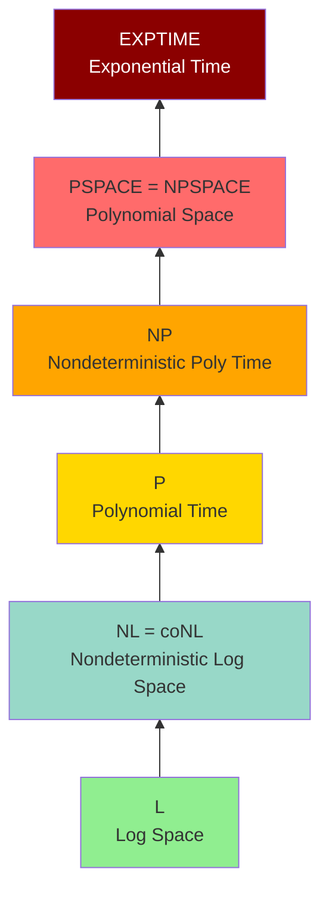

# Space Complexity

**Space complexity** measures memory usage of computation, providing a different but equally important perspective on computational resources. In many practical scenarios, memory constraints are more limiting than time constraints, making space complexity critical for algorithm design.

Space complexity reveals surprising phenomena not present in time complexity. For instance, Savitch's Theorem shows that nondeterminism provides at most a quadratic advantage for space, contrasting sharply with the potentially exponential gap between P and NP for time. Understanding space complexity helps us design memory-efficient algorithms and understand the fundamental relationships between computational resources.

## Definition

For TM $M$ on input $w$, **space used** is the number of distinct tape cells visited.

The **space complexity** of $M$ is function $s: \mathbb{N} \to \mathbb{N}$:

$$
s(n) = \max\{\text{cells } M \text{ uses on input } w : |w| = n\}
$$

## Space Complexity Classes

$$
\mathbf{SPACE}(f(n)) = \{L \mid L \text{ decidable using } O(f(n)) \text{ space}\}
$$

$$
\mathbf{NSPACE}(f(n)) = \{L \mid L \text{ decidable by NTM using } O(f(n)) \text{ space}\}
$$

## Important Classes

### L (Logarithmic Space)
$$
\mathbf{L} = \mathbf{SPACE}(\log n)
$$

This extremely restrictive class uses only logarithmic space—so little that you can't even write down the entire input! To make this meaningful, we use a separate read-only input tape and count only the space on the read-write work tape.

Problems in L include: graph connectivity (reachability), 2-SAT (satisfiability with 2 literals per clause), and many basic graph algorithms. The restriction forces algorithms to be extremely space-efficient, often requiring clever techniques.

### NL (Nondeterministic Log Space)
$$
\mathbf{NL} = \mathbf{NSPACE}(\log n)
$$

Nondeterministic logarithmic space allows "guessing" solutions using only $O(\log n)$ space. Surprisingly, the famous Immerman-Szelepcsényi Theorem proves that $\mathbf{NL} = \mathbf{coNL}$, showing that nondeterministic log space is closed under complement—a result that doesn't hold for time complexity (where $\mathbf{NP} = \mathbf{coNP}$ is unknown).

### PSPACE
$$
\mathbf{PSPACE} = \bigcup_{k} \mathbf{SPACE}(n^k)
$$

PSPACE contains all problems solvable using polynomial space. This is a vast class—it contains both P and NP since polynomial time uses at most polynomial space. Many game-playing and planning problems are PSPACE-complete.

### NPSPACE
$$
\mathbf{NPSPACE} = \bigcup_{k} \mathbf{NSPACE}(n^k)
$$

Nondeterministic polynomial space. By Savitch's Theorem, $\mathbf{NPSPACE} = \mathbf{PSPACE}$, showing that nondeterminism doesn't help much for space complexity.

## Savitch's Theorem

**Theorem**: $\mathbf{NSPACE}(f(n)) \subseteq \mathbf{SPACE}(f(n)^2)$ for $f(n) \geq \log n$

This remarkable result shows that nondeterminism provides at most a quadratic advantage for space complexity. Any nondeterministic computation using $f(n)$ space can be simulated deterministically using only $f(n)^2$ space.

**Proof idea**: To determine if a nondeterministic machine can go from configuration $C_1$ to $C_2$ in $t$ steps, recursively check if there exists an intermediate configuration $C_m$ reachable from $C_1$ in $t/2$ steps and from which $C_2$ is reachable in $t/2$ steps. This divide-and-conquer approach reuses space across recursive calls.

**Corollary**: $\mathbf{NPSPACE} = \mathbf{PSPACE}$

This is striking: for space, nondeterminism essentially doesn't help! This contrasts sharply with time complexity, where the $\mathbf{P}$ vs $\mathbf{NP}$ question remains open and nondeterminism potentially provides exponential advantage.

## Space Hierarchy

**Theorem**: For space-constructible $f(n)$:
$$
\mathbf{SPACE}(f(n)) \subsetneq \mathbf{SPACE}(f(n) \cdot \log f(n))
$$

More space means strictly more power.

## Relationships

$$
\mathbf{L} \subseteq \mathbf{NL} \subseteq \mathbf{P} \subseteq \mathbf{NP} \subseteq \mathbf{PSPACE} \subseteq \mathbf{EXPTIME}
$$

**Known separations:**
- $\mathbf{L} \subsetneq \mathbf{PSPACE}$ (space hierarchy)
- $\mathbf{P} \subsetneq \mathbf{EXPTIME}$ (time hierarchy)

**Unknown:**
- $\mathbf{L}$ vs $\mathbf{NL}$
- $\mathbf{P}$ vs $\mathbf{NP}$
- $\mathbf{NP}$ vs $\mathbf{PSPACE}$

## PSPACE-Complete Problems

A problem is **PSPACE-complete** if:
1. It's in PSPACE
2. Every PSPACE problem reduces to it (in polynomial time)

PSPACE-complete problems are believed to be harder than NP-complete problems, as PSPACE likely contains NP properly.

### TQBF (True Quantified Boolean Formulas)

Given a fully quantified Boolean formula like $\forall x_1 \exists x_2 \forall x_3 \ldots \varphi(x_1, x_2, x_3, \ldots, x_n)$, is the formula true?

TQBF is PSPACE-complete and serves as the canonical PSPACE-complete problem (analogous to SAT for NP-completeness). The alternating quantifiers capture the essence of PSPACE: each quantifier can be evaluated by considering all possibilities, using polynomial space but potentially exponential time.

### Game Problems

Many two-player perfect-information games are PSPACE-complete when generalized to arbitrary board sizes:
- **Generalized Chess**: n×n board with proportionally scaled pieces
- **Generalized Go**: n×n board
- **Generalized Checkers**: n×n board
- **Othello (Reversi)**: n×n board

These games are PSPACE-complete because determining the winner with optimal play requires exploring a game tree that can be traversed in polynomial space (storing the current path) but may require exponential time.

### Planning Problems

AI planning with polynomial-length plans is PSPACE-complete. Given an initial state, goal state, and set of actions, can we reach the goal? This captures many real-world reasoning tasks.

## Log-Space-Complete Problems

Problems complete for logarithmic space classes:

**PATH (directed s-t connectivity)** is NL-complete: Given directed graph G and vertices s and t, is there a path from s to t? This can be solved nondeterministically in log space by guessing a path.

**2-SAT** is NL-complete: Boolean satisfiability with at most 2 literals per clause. Unlike 3-SAT (which is NP-complete), 2-SAT can be solved in NL.

## Time-Space Tradeoffs

There are fundamental relationships between time and space complexity:

**Theorem**: $\mathbf{SPACE}(f(n)) \subseteq \mathbf{TIME}(2^{O(f(n))})$

Space can be "converted" to time, but exponentially. Any computation using $f(n)$ space has at most $2^{O(f(n))}$ possible configurations, so we can simulate it in exponential time by systematically exploring all configurations.

**Theorem**: $\mathbf{TIME}(f(n)) \subseteq \mathbf{SPACE}(f(n))$

Time bounds space linearly. A machine running for $f(n)$ steps can visit at most $f(n)$ cells (one per step), so time provides an upper bound on space.

These relationships help us understand the complexity landscape and explain why, for instance, PSPACE ⊆ EXPTIME.

## Sublinear Space

For space less than $n$ (the input length), we need special considerations:
- Use a **read-only input tape** so we don't count input storage
- Only the **read-write work tape** counts toward space complexity
- This model is crucial for streaming algorithms that process data with limited memory

Sublinear space is particularly relevant for modern big data applications where we can't store entire datasets in memory.

## Immerman-Szelepcsényi Theorem

**Theorem**: $\mathbf{NL} = \mathbf{coNL}$

This surprising result (proven independently by Immerman and Szelepcsényi in 1987) shows that nondeterministic log space is closed under complement.

**Significance**: This means that if we can verify YES instances of a problem in NL, we can also verify NO instances in NL. This is remarkable because the analogous question for time complexity ($\mathbf{NP} = \mathbf{coNP}$?) remains open.

The theorem uses an inductive counting argument to determine the number of reachable vertices in a graph, a technique that works for space but doesn't seem to apply to time.

## Space in Practice

In practical computing, space constraints are often more limiting than time:

- **Memory limitations**: RAM is finite and expensive, especially in embedded systems and mobile devices
- **Cache effects**: Memory access patterns dramatically affect performance; algorithms with good spatial locality run faster
- **Streaming data**: Many modern applications (network monitoring, sensor networks, log analysis) must process data streams that can't be stored in memory
- **Energy efficiency**: Memory access consumes power; space-efficient algorithms can be more energy-efficient

Understanding space complexity helps design algorithms that work within real-world memory constraints. Space-efficient algorithms are particularly valuable in resource-constrained environments.

## Summary: Complexity Landscape

**Containment relationships:**
$$
\mathbf{L} \subseteq \mathbf{NL} \subseteq \mathbf{P} \subseteq \mathbf{NP} \subseteq \mathbf{PSPACE} = \mathbf{NPSPACE} \subseteq \mathbf{EXPTIME}
$$

Many containments are known (like PSPACE = NPSPACE from Savitch's Theorem), but most equality questions remain open (like whether L = NL, P = NP, or NP = PSPACE).

## Key Takeaways

- Space complexity measures memory usage rather than time, often more constraining in practice
- Important space classes include L (logarithmic), NL (nondeterministic log), and PSPACE (polynomial)
- Savitch's Theorem proves that NPSPACE = PSPACE, showing nondeterminism provides at most quadratic advantage for space
- The Space Hierarchy Theorem proves that more space allows solving strictly more problems
- PSPACE-complete problems include TQBF, generalized board games, and planning problems
- The Immerman-Szelepcsényi Theorem proves NL = coNL, contrasting with the open NP vs coNP question
- Time and space have fundamental relationships: time bounds space linearly, space bounds time exponentially
- Sublinear space algorithms are crucial for streaming and big data applications
- Understanding space complexity is essential for designing memory-efficient algorithms in resource-constrained environments
