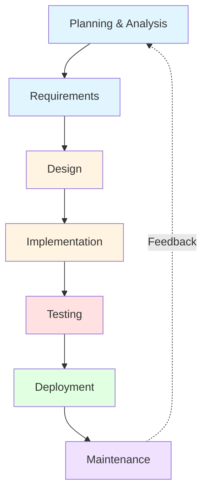

# SDLC Overview and Importance

The Software Development Lifecycle (SDLC) is a systematic process for building software that ensures quality and correctness while meeting customer expectations. Understanding the SDLC is fundamental to professional software development.

## What is the SDLC?

The SDLC is a framework that describes the phases involved in developing, maintaining, and replacing software systems. It provides structure to software projects and helps teams deliver high-quality products efficiently.

### Historical Context

Before formalized SDLCs, software was often developed ad-hoc, leading to:
- Projects running over budget and schedule
- Software that didn't meet user needs
- Difficult-to-maintain code
- High defect rates in production

The recognition of these problems led to the development of systematic approaches starting in the 1960s and 1970s.

## Core Phases

Every SDLC model includes some variation of these fundamental phases:

### 1. Planning and Analysis

This initial phase determines project feasibility and scope:
- **Feasibility Study**: Is the project technically and economically viable?
- **Scope Definition**: What will and won't be included?
- **Resource Planning**: What people, tools, and time are needed?
- **Risk Assessment**: What could go wrong and how do we mitigate it?

### 2. Requirements

Understanding and documenting what the software must do:
- **Functional Requirements**: Specific behaviors and functions
- **Non-Functional Requirements**: Performance, security, usability
- **User Stories/Use Cases**: How users will interact with the system
- **Acceptance Criteria**: How we know requirements are met

### 3. Design

Creating the blueprint for implementation:
- **Architectural Design**: High-level structure and components
- **Detailed Design**: Algorithms, data structures, interfaces
- **Database Design**: Schema and relationships
- **UI/UX Design**: User interface and experience

### 4. Implementation

Translating design into working code:
- **Coding Standards**: Consistent, readable code
- **Code Reviews**: Peer verification of quality
- **Version Control**: Managing code changes
- **Documentation**: Code comments and technical docs

### 5. Testing

Verifying software quality and correctness:
- **Unit Testing**: Individual component testing
- **Integration Testing**: Component interaction testing
- **System Testing**: End-to-end functionality
- **User Acceptance Testing**: Customer validation

### 6. Deployment

Releasing software to production:
- **Environment Setup**: Preparing production infrastructure
- **Migration**: Moving from old to new systems
- **Training**: Educating users on the new system
- **Go-Live**: Actual release to users

### 7. Maintenance

Ongoing support after deployment:
- **Bug Fixes**: Correcting defects found in production
- **Enhancements**: Adding new features
- **Performance Tuning**: Optimizing system performance
- **Technical Debt**: Addressing accumulated shortcuts

## Why SDLC Matters

### Quality Assurance

A structured approach ensures:
- Requirements are understood before coding begins
- Design is reviewed before implementation
- Testing occurs throughout the process
- Documentation exists for future maintainers

### Risk Management

The SDLC helps identify and mitigate risks:
- Early detection of requirements issues
- Design validation before expensive coding
- Test planning that catches defects early
- Controlled deployments that minimize disruption

### Communication

Structured phases facilitate communication:
- Clear deliverables at each phase
- Reviews and approvals involve stakeholders
- Progress can be measured and reported
- Teams share a common vocabulary

### Predictability

Following a defined process enables:
- More accurate project estimation
- Resource allocation planning
- Schedule management
- Budget control

## SDLC Selection Criteria

Choosing the right SDLC model depends on several factors:

| Factor | Considerations |
|--------|----------------|
| Requirements Clarity | Are requirements well-understood upfront? |
| Project Size | Large projects may need more structure |
| Team Experience | Experienced teams can handle less structure |
| Customer Involvement | How available is the customer for feedback? |
| Risk Tolerance | How critical is the project? |
| Time Constraints | How urgent is the deadline? |

## Modern SDLC Trends

Contemporary software development has evolved the traditional SDLC:

### DevOps Integration
- Continuous Integration/Continuous Deployment (CI/CD)
- Infrastructure as Code
- Automated testing and deployment

### Agile Influence
- Shorter iterations
- Continuous customer feedback
- Embracing change rather than resisting it

### Hybrid Approaches
- Combining waterfall planning with agile execution
- Using different models for different project phases
- Tailoring processes to organizational needs

## Summary

The SDLC provides essential structure for software development. While specific implementations vary, the core concept of planned, phased development with quality gates remains fundamental to successful software projects. Modern approaches tend toward more iterative, flexible models while retaining the discipline that the SDLC framework provides.
