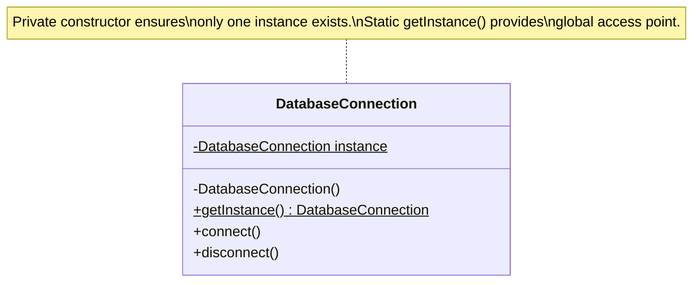
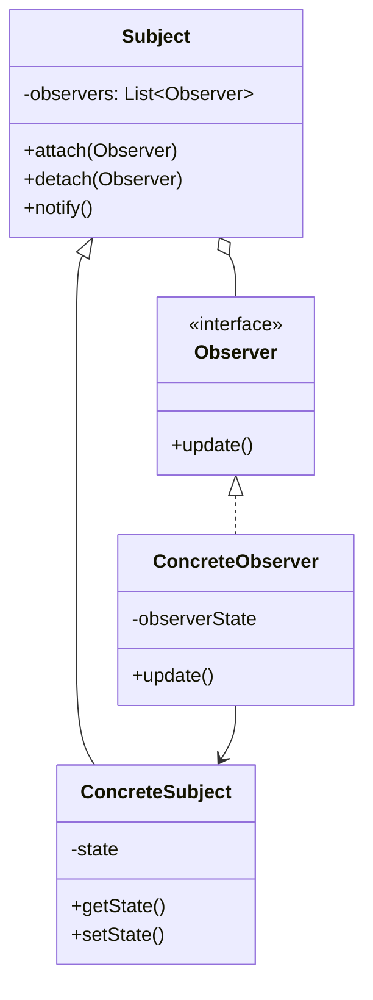
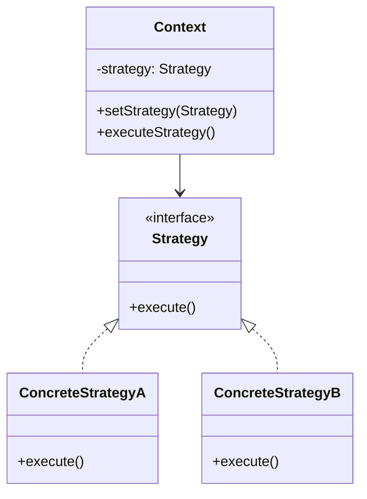

# Class Diagrams

Class diagrams are the most fundamental and widely used UML diagrams. They show the static structure of a system by illustrating classes, their attributes, operations, and relationships. Class diagrams serve as blueprints for object-oriented systems and bridge the gap between analysis, design, and implementation.

## Anatomy of a Class

A class is represented as a rectangle divided into three compartments: name, attributes, and operations.

### Class Notation

```
┌─────────────────────┐
│     ClassName       │  ← Class name (required)
├─────────────────────┤
│ - attribute1: Type  │  ← Attributes (optional)
│ - attribute2: Type  │
├─────────────────────┤
│ + operation1()      │  ← Operations (optional)
│ + operation2(): Type│
└─────────────────────┘
```

### Visibility Modifiers

Visibility indicates who can access attributes and operations:

**+ Public:** Accessible from anywhere
**- Private:** Accessible only within the class
**# Protected:** Accessible within the class and subclasses
**~ Package:** Accessible within the same package

Example:
```
┌─────────────────────┐
│    BankAccount      │
├─────────────────────┤
│ - accountNumber: String
│ - balance: decimal
│ # accountType: String
└─────────────────────┘
│ + deposit(amount: decimal): void
│ + withdraw(amount: decimal): boolean
│ - calculateInterest(): decimal
└─────────────────────┘
```

### Attributes Syntax

Attributes follow the pattern: `visibility name: type [multiplicity] = defaultValue {property}`

**Examples:**
- `- balance: decimal = 0.0`
- `+ customers: Customer[*]` (array of customers)
- `- birthDate: Date {readOnly}` (property constraint)

### Operations Syntax

Operations follow the pattern: `visibility name(parameters): returnType {property}`

**Examples:**
- `+ deposit(amount: decimal): void`
- `+ getBalance(): decimal {query}` (doesn't modify state)
- `- validateInput(data: String): boolean`

### Class Stereotypes

Stereotypes classify classes into specific categories:

**«interface»:** Defines a contract without implementation
**«abstract»:** Cannot be instantiated directly
**«enumeration»:** Defines a fixed set of named values
**«utility»:** Contains only static methods and attributes
**«entity»:** Represents persistent business data
**«control»:** Coordinates and controls other objects
**«boundary»:** Interacts with external actors or systems

Example:
```
┌─────────────────────┐
│   «interface»       │
│   PaymentProcessor  │
├─────────────────────┤
│ + processPayment(amount: decimal): boolean
│ + refund(transactionId: String): boolean
└─────────────────────┘
```

## Relationships Between Classes

Relationships show how classes interact and depend on each other.

### Association

A structural relationship indicating that objects of one class are connected to objects of another class.

```
Customer ────────── Order
   1     places    0..*
```

**Components:**
- **Line:** Solid line connecting classes
- **Role Names:** Labels describing the role each class plays (e.g., "places")
- **Multiplicity:** Numbers indicating how many instances participate

**Multiplicities:**
- `1` - Exactly one
- `0..1` - Zero or one
- `*` or `0..*` - Zero or more
- `1..*` - One or more
- `n..m` - Between n and m (specific range)

### Bidirectional vs. Unidirectional Association

**Bidirectional:** Both classes know about each other (plain line)
```
Student ──────── Course
 0..*   enrolled  0..*
```

**Unidirectional:** Only one class knows about the other (arrow)
```
Order ───────> Product
       contains
```

### Aggregation

A special association representing a "has-a" or "part-of" relationship where parts can exist independently of the whole.

```
Department ◇──── Employee
    1            0..*
```

The hollow diamond is on the "whole" side. Employees can exist without the department.

**Example:** A library has books, but books can exist without the library.

### Composition

A strong aggregation where parts cannot exist independently of the whole. If the whole is destroyed, parts are destroyed too.

```
House ◆──── Room
  1         1..*
```

The filled diamond is on the "whole" side. Rooms cannot exist without the house.

**Example:** A document has pages. If you delete the document, the pages are deleted too.

### Generalization (Inheritance)

Represents an "is-a" relationship where a subclass inherits from a superclass.

```
        Animal
          △
          │
    ┌─────┴─────┐
    │           │
   Dog         Cat
```

The hollow triangle points to the parent class. Subclasses inherit attributes and operations from the parent.

**Example:**
```
┌─────────────────────┐
│      Vehicle        │
├─────────────────────┤
│ - speed: int        │
│ - color: String     │
├─────────────────────┤
│ + accelerate(): void│
└─────────────────────┘
          △
          │
    ┌─────┴─────┐
    │           │
┌───────┐   ┌───────┐
│  Car  │   │ Truck │
├───────┤   ├───────┤
│ doors │   │payload│
└───────┘   └───────┘
```

### Realization (Implementation)

Represents the relationship between an interface and a class that implements it.

```
    «interface»
  PaymentProcessor
          △
          ┆ (dashed line)
          │
   CreditCardProcessor
```

The dashed line with hollow triangle points to the interface.

### Dependency

Indicates that one class uses or depends on another class, typically as a parameter, local variable, or return type.

```
OrderService ┄┄┄> EmailService
           uses
```

A dashed arrow points to the class being used. This is the weakest relationship.

**Example:** OrderService uses EmailService to send confirmation emails, but doesn't store a reference to it.

## Advanced Concepts

### Abstract Classes and Methods

Abstract classes cannot be instantiated and often contain abstract methods that must be implemented by subclasses.

```
┌─────────────────────────┐
│      Shape              │  (italic or {abstract})
├─────────────────────────┤
│ - color: String         │
├─────────────────────────┤
│ + getArea(): double     │  (italic = abstract method)
└─────────────────────────┘
          △
          │
    ┌─────┴─────┐
    │           │
 Circle     Rectangle
```

Abstract class and method names are shown in italics or with {abstract} property.

### Interfaces

Interfaces define contracts without implementation.

```
┌─────────────────────────┐
│    «interface»          │
│    Drawable             │
├─────────────────────────┤
│ + draw(): void          │
│ + erase(): void         │
└─────────────────────────┘
          △
          ┆
     ┌────┴────┐
     │         │
  Circle   Rectangle
```

Classes implementing an interface must provide implementations for all its methods.

### Association Classes

Association classes attach attributes and operations to an association itself.

```
Student ────────── Course
          │
     Enrollment
    ────────────
    grade: char
    semester: String
    ────────────
```

Used when the relationship itself has properties. For example, enrollment has a grade and semester, but these don't belong to Student or Course alone.

### Qualified Associations

Qualifiers reduce multiplicity by using a key to look up associated objects.

```
Bank [accountNumber]───── BankAccount
 1                         0..1
```

The qualifier (in brackets) specifies that given a bank and an account number, you can find at most one account.

### N-ary Associations

Associations involving more than two classes.

```
     Student
        │
        │
    ◇───┼───◇
    │       │
 Project  Professor
```

Diamond connects three classes. Example: Students work on projects supervised by professors.

## Design Patterns in Class Diagrams

Class diagrams effectively illustrate design patterns.

### Singleton Pattern



### Observer Pattern



### Strategy Pattern



## Best Practices

### Choose Appropriate Detail

**Analysis Level:** Focus on concepts and relationships, minimal implementation detail
**Design Level:** Include attributes, key operations, precise multiplicities
**Implementation Level:** Complete with all details, possibly generated from code

### Manage Complexity

**Separate Diagrams:** Create multiple diagrams for different subsystems or perspectives
**Collapse Details:** Hide attributes/operations not relevant to the diagram's purpose
**Use Packages:** Group related classes to reduce clutter
**Focus:** Show only classes relevant to the concept being explained

### Naming Conventions

**Classes:** Nouns or noun phrases in PascalCase (e.g., ShoppingCart)
**Attributes:** Nouns in camelCase (e.g., customerName)
**Operations:** Verbs in camelCase (e.g., calculateTotal())
**Associations:** Verb phrases describing the relationship

### Relationship Guidelines

**Use Composition Sparingly:** Only when parts truly cannot exist independently
**Prefer Aggregation Over Association:** When a clear whole-part relationship exists
**Avoid Bidirectional Associations:** Use unidirectional when one direction suffices
**Show Important Dependencies:** Too many dependency lines create clutter

## Common Mistakes

### Overspecification

Including every attribute and method makes diagrams cluttered and hard to maintain. Focus on important elements.

### Wrong Relationships

**Mistake:** Using inheritance for code reuse rather than "is-a" relationships
**Correct:** Use composition for "has-a" relationships, inheritance for "is-a"

**Mistake:** Confusing aggregation and composition
**Correct:** Composition means parts die with the whole; aggregation means they don't

### Missing Multiplicities

Always specify multiplicities on associations. They communicate important design constraints.

### Inconsistent Abstraction Levels

Mixing high-level concepts with implementation details in the same diagram creates confusion. Maintain consistent abstraction.

## Class Diagrams in Practice

### During Analysis

Identify domain concepts and relationships. Focus on the problem domain, not the solution. Use simple class diagrams with minimal detail.

### During Design

Refine analysis classes, add design classes (controllers, utilities), specify interfaces, and define precise operations and attributes.

### During Implementation

Generate code from class diagrams or reverse-engineer diagrams from code. Keep diagrams synchronized with code for documentation.

### For Documentation

Create high-level architectural class diagrams showing major components and their relationships. Include these in design documents and wikis.

## Conclusion

Class diagrams are essential tools for object-oriented analysis and design. They provide a clear, standardized way to visualize system structure, communicate design decisions, and guide implementation. Mastering class diagrams requires understanding not just the notation, but also when to use different relationships, how much detail to include, and how to organize complex systems into understandable diagrams. When used effectively, class diagrams bridge the gap between abstract design concepts and concrete code, making them invaluable throughout the software development lifecycle.
