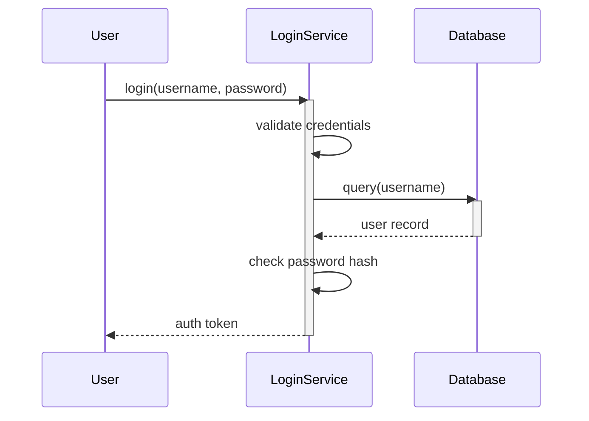
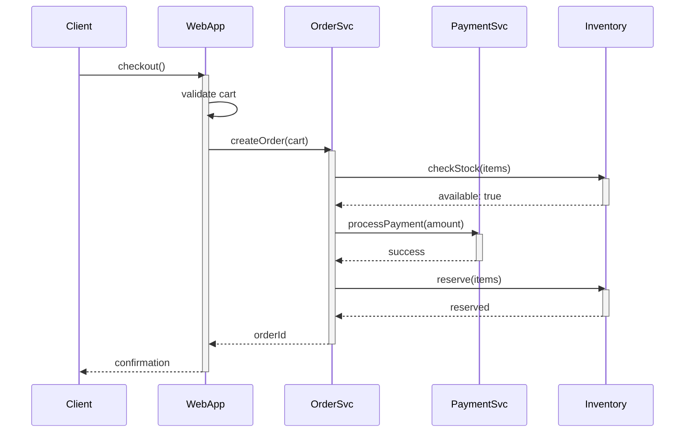
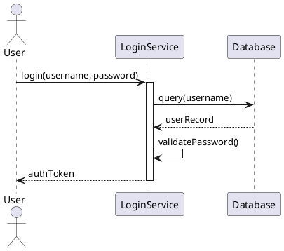

# Sequence Diagrams

Sequence diagrams are behavioral UML diagrams that show how objects interact in a particular scenario, emphasizing the time-ordered sequence of messages between objects. They excel at illustrating complex interactions, making them invaluable for understanding system behavior, designing APIs, and debugging distributed systems.

## Basic Components

### Participants (Lifelines)

Participants represent the objects or actors involved in the interaction. Each participant is shown as a box at the top of the diagram with a dashed vertical line (lifeline) extending downward.

```
┌──────────┐  ┌──────────┐  ┌──────────┐
│  Client  │  │  Server  │  │ Database │
└────┬─────┘  └────┬─────┘  └────┬─────┘
     │             │             │
     ┆             ┆             ┆  ← Lifelines
```

**Participant Types:**
- **Actor:** External user or system (stick figure or box)
- **Object:** Instance of a class (box with underlined name)
- **Anonymous Object:** Just the class name without instance name
- **Boundary/Control/Entity:** Stereotyped objects with special icons

**Naming Conventions:**
- `objectName:ClassName` - Specific object
- `:ClassName` - Anonymous object
- `objectName` - Object without specified class

### Messages

Messages represent communication between participants, shown as arrows between lifelines.

```
     │             │
     │─────────────>  synchronous message (solid arrow)
     │             │
     │┄┄┄┄┄┄┄┄┄┄┄┄>  asynchronous message (dashed arrow)
     │             │
     │<────────────┘  return message (dashed line, open arrow)
```

**Synchronous Messages:** Sender waits for response (solid arrow)
**Asynchronous Messages:** Sender doesn't wait (stick arrow)
**Return Messages:** Optional, showing return from call (dashed line)
**Self Messages:** Object sends message to itself (looping arrow)

### Message Labels

Messages are labeled with the operation name and parameters:

```
methodName(parameter1, parameter2): returnType
```

Examples:
- `login(username, password)`
- `getCustomer(id): Customer`
- `notify()`

### Activation Boxes

Thin rectangles on lifelines represent when an object is active (processing a message).

```
     │
     │─────────────>
     │        ┌──┐
     │        │  │  ← Activation box
     │<───────┴──┘
     │
```

## Simple Sequence Diagram Example

Here's a basic login sequence:



This diagram shows:
1. User sends login credentials to LoginService
2. LoginService queries Database for user
3. Database returns user record
4. LoginService validates password
5. LoginService returns authentication token

## Advanced Features

### Combined Fragments

Combined fragments represent control logic like loops, conditionals, and parallel processing. They're shown as rectangles with a label in the upper-left corner.

#### Alt (Alternative)

Represents if-then-else logic with mutually exclusive paths.

```
     │           │           │
     ├───alt─────┬───────────┤
     │[balance >= amount]    │
     │           │           │
     │  withdraw(amount)     │
     │──────────>│           │
     │           │           │
     ├──────else─┴───────────┤
     │           │           │
     │  showError()          │
     │<──────────│           │
     │           │           │
     └───────────┴───────────┘
```

#### Opt (Optional)

Represents optional behavior that occurs only if a condition is true.

```
     │           │
     ├───opt─────┤
     │[isLoggedIn]
     │           │
     │ getData() │
     │──────────>│
     │           │
     └───────────┘
```

#### Loop

Represents repeated behavior.

```
     │           │           │
     ├───loop────┬───────────┤
     │[for each item]        │
     │           │           │
     │  processItem(item)    │
     │──────────>│           │
     │           │ save(item)│
     │           │──────────>│
     │           │           │
     └───────────┴───────────┘
```

**Loop Variants:**
- `loop(n)` - Execute n times
- `loop(min, max)` - Execute between min and max times
- `loop[condition]` - Execute while condition is true

#### Par (Parallel)

Represents concurrent execution of interactions.

```
     │           │           │
     ├───par─────┬───────────┤
     │           │           │
     │  query1() │           │
     │──────────>│           │
     ├───────────┼───────────┤
     │           │  query2() │
     │           │──────────>│
     └───────────┴───────────┘
```

Both queries execute concurrently.

#### Ref (Reference)

References another sequence diagram, promoting reusability.

```
     │           │
     ├───ref─────┤
     │ Authentication
     │           │
     └───────────┘
```

Points to a separate diagram showing authentication details.

### Creation and Destruction

**Object Creation:** Shown with a message to the object box itself, often labeled «create».

```
     │
     │  «create»
     │──────────────> ┌──────────┐
     │                │NewObject │
     │                └────┬─────┘
     │                     ┆
```

**Object Destruction:** Shown with an X at the end of the lifeline.

```
     │
     │  destroy()
     │──────────────>
     │            ┌──┐
     │            │  │
     │            └──┘
     │             ×  ← Object destroyed
```

### Gates and Lost/Found Messages

**Gate:** Connection point for messages entering or leaving the interaction.

**Lost Message:** Message with unknown recipient (arrow to nowhere).

**Found Message:** Message with unknown sender (arrow from nowhere).

```
     │
    ╱│  ← Found message (unknown source)
   ╱ │
     │──────────> × ← Lost message (unknown destination)
     │
```

## Real-World Examples

### E-commerce Purchase Flow



This diagram shows the complex interaction involving cart validation, order creation, inventory checks, payment processing, and stock reservation.

### Asynchronous Messaging System

```
┌─────────┐  ┌─────────┐  ┌───────────┐  ┌─────────┐
│Publisher│  │MessageQ │  │ Subscriber│  │Database │
└────┬────┘  └────┬────┘  └─────┬─────┘  └────┬────┘
     │            │              │             │
     │publish(msg)│              │             │
     │┄┄┄┄┄┄┄┄┄┄┄>│              │             │
     │            │              │             │
     │         ┌──┴──┐           │             │
     │         │queue│           │             │
     │         └──┬──┘           │             │
     │            │    poll()    │             │
     │            │<┄┄┄┄┄┄┄┄┄┄┄┄┄│             │
     │            │              │             │
     │            │  getMessage()│             │
     │            │┄┄┄┄┄┄┄┄┄┄┄┄┄>│             │
     │            │              │             │
     │            │          ┌───┴───┐         │
     │            │          │process│         │
     │            │          │       │ save()  │
     │            │          │       │────────>│
     │            │          └───┬───┘         │
     │            │              │             │
     │            │    ack()     │             │
     │            │<┄┄┄┄┄┄┄┄┄┄┄┄┄│             │
```

Dashed arrows (┄>) indicate asynchronous messages where the sender doesn't wait for completion.

## Best Practices

### Focus on One Scenario

Each sequence diagram should illustrate a single scenario or use case. Don't try to show all possible paths in one diagram.

**Good:** "Successful user login"
**Bad:** "All login scenarios including failures, timeout, and password reset"

Create separate diagrams for different scenarios or use alt fragments for simple variations.

### Appropriate Level of Detail

**High-Level:** Show major components and key interactions for architectural understanding.

**Detailed:** Show specific method calls with parameters for implementation guidance.

Choose the level appropriate for your audience and purpose.

### Order Participants Logically

Arrange participants to minimize crossing messages:
- Actors on the left
- UI components next
- Business logic in the middle
- Data access on the right
- External systems at the end

### Use Meaningful Names

- Message names should describe the action or intent
- Use domain language, not implementation details
- Include important parameters in message labels

**Good:** `processPayment(cardNumber, amount)`
**Bad:** `method1(param1, param2)`

### Show Return Values Selectively

Only show return messages when:
- The return value is important to understand the flow
- Multiple return paths exist (success vs. error)
- The diagram becomes clearer with explicit returns

Omit trivial returns (void, acknowledgments) to reduce clutter.

### Leverage Combined Fragments

Use alt, opt, and loop fragments to show complex logic without creating separate diagrams. But don't overuse them - too many nested fragments become hard to read.

### Document Timing Constraints

When timing is important, add timing constraints as notes or on messages:

```
     │
     │ getData()
     │──────────────>{t < 100ms}
     │
```

## Common Mistakes

### Too Many Participants

Diagrams with more than 7-8 participants become cluttered. Break complex interactions into multiple diagrams using ref fragments.

### Missing Activation Boxes

Activation boxes show when objects are processing. Their absence makes it unclear when processing occurs.

### Inconsistent Abstraction

Mixing high-level business operations with low-level implementation details confuses readers. Maintain consistent abstraction.

### Overusing Synchronous Messages

Not all interactions are synchronous. Use asynchronous messages for event-driven systems, messaging, and parallel operations.

### Neglecting Error Paths

Real systems have error handling. Use alt fragments to show error scenarios when they're important.

## Tools and Automation

### PlantUML Example

PlantUML uses text to generate sequence diagrams:



### Generate from Code

Some IDEs can generate sequence diagrams from code execution:
- IntelliJ IDEA Ultimate (Sequence Diagram plugin)
- Visual Studio (Architectural tools)
- Eclipse (Trace Compass)

This ensures diagrams reflect actual behavior.

## Sequence Diagrams in Agile

In Agile development, sequence diagrams serve different purposes:

**Story Understanding:** Sketch sequence diagrams to understand complex user stories before implementation.

**Design Discussion:** Create quick sketches during design sessions to explore alternatives.

**Documentation:** Maintain high-level sequence diagrams for critical flows as living documentation.

**Debugging:** Draw sequence diagrams to understand complex bugs involving multiple components.

Keep diagrams lightweight and update them only when they provide value.

## Conclusion

Sequence diagrams excel at showing how objects collaborate over time to accomplish tasks. They make complex interactions understandable, help identify design issues early, and serve as excellent communication tools. Mastering sequence diagrams requires understanding not just the notation, but also when to use them, what level of detail to include, and how to organize interactions clearly. When used judiciously, sequence diagrams bridge the gap between abstract designs and concrete implementations, making them invaluable for both design and documentation.
