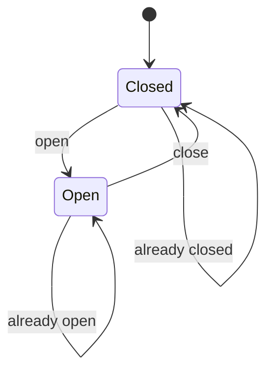
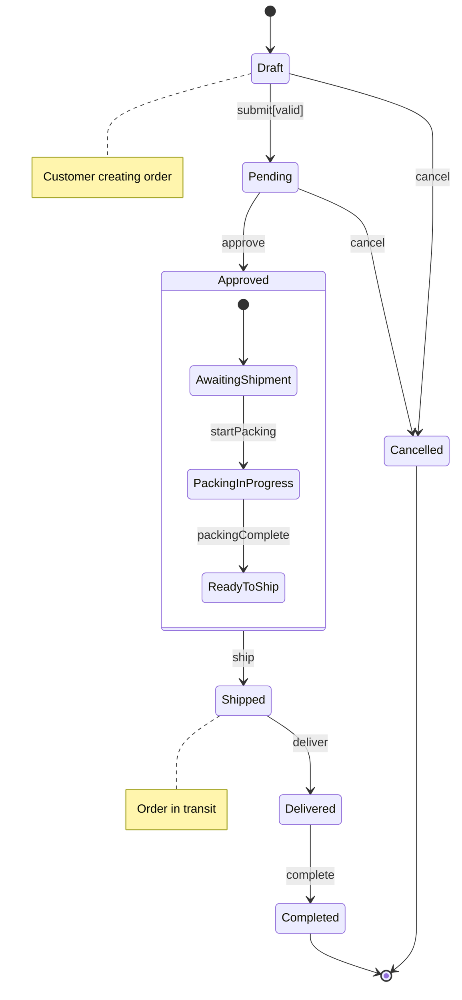
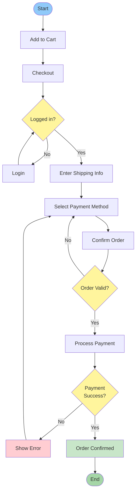

# State and Activity Diagrams

State machine diagrams and activity diagrams model the dynamic behavior of systems. State diagrams focus on how objects respond to events by transitioning between states, while activity diagrams model workflows, algorithms, and business processes. Together, they provide comprehensive tools for modeling system behavior from different perspectives.

## State Machine Diagrams

State machine diagrams (or statecharts) show the states an object can be in and how it transitions between states in response to events. They're essential for modeling reactive systems, user interfaces, and objects with complex lifecycle behavior.

### Core Components

#### States

A state represents a condition or situation during the life of an object. States are shown as rounded rectangles.

```
┌──────────────┐
│   Inactive   │
└──────────────┘
```

**State Name:** Describes the condition (e.g., "Logged In", "Processing", "Waiting")

**Entry Actions:** Operations performed when entering the state
**Exit Actions:** Operations performed when leaving the state
**Do Activities:** Operations performed while in the state

```
┌──────────────────────────┐
│      Processing          │
│─────────────────────────│
│ entry / startTimer()     │
│ do / processData()       │
│ exit / stopTimer()       │
└──────────────────────────┘
```

#### Initial and Final States

**Initial State:** A filled circle indicates where the state machine starts.

**Final State:** A filled circle inside another circle indicates termination.

```
  ●  ← Initial state
  │
  ▼
┌────────┐
│ Active │
└────────┘
  │
  ▼
  ◉  ← Final state
```

#### Transitions

Transitions show how an object moves from one state to another in response to events.

```
State1 ───────> State2
      event[guard]/action
```

**Event:** The trigger that causes the transition
**Guard:** A boolean condition that must be true (in square brackets)
**Action:** An operation performed during the transition (after /)

Examples:
- `buttonPressed` - Simple event
- `timeout[duration > 5]` - Event with guard condition
- `submit/validate()` - Event with action
- `submit[isValid]/save()` - Complete transition specification

#### Self-Transitions

A state can transition to itself, useful for handling events without changing state.

```
┌────────────┐
│   Waiting  │──┐
└────────────┘  │ retry
       ▲        │
       └────────┘
```

### Simple State Machine Example

Here's a state machine for a door:



The door starts closed, opens in response to "open" event, and closes in response to "close" event.

### Complex State Machine Example

A more realistic example for an order processing system:



This shows how an order progresses through various states with different events and transitions.

### Composite States

Composite states contain nested substates, useful for managing complexity.

```
┌────────────────────────────────────┐
│          Active                    │
│                                    │
│    ●                               │
│    │                               │
│    ▼                               │
│  ┌──────────┐  login  ┌──────────┐│
│  │LoggedOut │────────>│ LoggedIn ││
│  └──────────┘         └──────────┘│
│                                    │
└────────────────────────────────────┘
        │
        │ shutdown
        ▼
      ┌──────────┐
      │ Inactive │
      └──────────┘
```

When "shutdown" occurs from anywhere in the Active composite state, the system transitions to Inactive.

### Concurrent States

Objects can be in multiple states simultaneously using regions separated by dashed lines.

```
┌─────────────────────────────────────┐
│           MediaPlayer               │
├─────────────────────────────────────┤
│  ┌────────┐       ┌──────────┐     │
│  │Playing │       │Muted     │     │
│  └────────┘       └──────────┘     │
├─────────────────────────────────────┤
│  ┌────────┐       ┌──────────┐     │
│  │Video   │       │Subtitles │     │
│  │Visible │       │Shown     │     │
│  └────────┘       └──────────┘     │
└─────────────────────────────────────┘
```

The player can be simultaneously playing/paused, muted/unmuted, showing video, and displaying subtitles.

### History States

History states remember which substate was last active before exiting a composite state.

```
┌────────────────────────────────────┐
│          Working                   │
│    ●                               │
│    │                               │
│    ▼                               │
│  ┌──────────┐         ┌──────────┐│
│  │ Editing  │────────>│ Saving   ││
│  └──────────┘         └──────────┘│
│       │  (H)                       │
└───────┼────────────────────────────┘
        │ interrupt
        ▼
    ┌──────────┐
    │ Paused   │
    └──────────┘
        │ resume
        │
```

(H) marks the history state. When resuming, the system returns to whichever state (Editing or Saving) it was in before interruption.

## Activity Diagrams

Activity diagrams model workflows, business processes, and algorithms. They're similar to flowcharts but more powerful, supporting parallelism, object flow, and complex control structures.

### Core Components

#### Actions

Actions are rounded rectangles representing individual steps in a process.

```
┌──────────────────┐
│  Verify Identity │
└──────────────────┘
```

#### Control Flow

Solid arrows show the sequence of actions.

```
┌──────────────┐
│ Action 1     │
└──────────────┘
      │
      ▼
┌──────────────┐
│ Action 2     │
└──────────────┘
```

#### Initial and Final Nodes

**Initial Node:** Filled circle where the activity starts
**Activity Final Node:** Bull's-eye that terminates the entire activity
**Flow Final Node:** Circle with X that terminates one flow (in parallel processes)

```
  ●  ← Initial node

  ◉  ← Activity final node

  ⊗  ← Flow final node
```

#### Decision Nodes

Diamonds represent conditional branching.

```
┌──────────────┐
│ Check Balance│
└──────────────┘
      │
      ▼
      ◇  [balance >= amount]
     ╱ ╲
    ╱   ╲
   ╱     ╲──────> Allow withdrawal
  ╱
 ╱[else]
╱
▼
Deny withdrawal
```

Guards (conditions in brackets) determine which path to follow.

#### Merge Nodes

Diamonds also represent merging of alternative flows.

```
  Allow withdrawal
      │
      ▼
      ◇  ← Merge node
      ▲
      │
  Deny withdrawal
```

#### Fork and Join Nodes

Thick horizontal or vertical bars represent parallel execution.

**Fork:** Splits flow into concurrent paths
**Join:** Synchronizes concurrent paths

```
┌──────────────┐
│ Receive Order│
└──────────────┘
      │
      ▼
  ═══════  ← Fork bar
   ╱  │  ╲
  ╱   │   ╲
 ╱    │    ╲
▼     ▼     ▼
Check   Verify  Calculate
Stock   Payment  Shipping
 │      │       │
 ╲      │      ╱
  ╲     │     ╱
   ╲    │    ╱
    ═══════  ← Join bar
       │
       ▼
   ┌──────────────┐
   │ Process Order│
   └──────────────┘
```

All incoming flows must complete before proceeding from a join.

### Simple Activity Diagram Example

Online shopping checkout process:



### Activity Partitions (Swimlanes)

Swimlanes organize activities by responsible actor or system component.

```
┌─────────────┬─────────────┬──────────────┐
│  Customer   │   System    │   Payment    │
├─────────────┼─────────────┼──────────────┤
│    ●        │             │              │
│    │        │             │              │
│    ▼        │             │              │
│ ┌────────┐  │             │              │
│ │ Browse │  │             │              │
│ └────────┘  │             │              │
│    │        │             │              │
│    ▼        │             │              │
│ ┌────────┐  │             │              │
│ │Add Item│  │             │              │
│ └────────┘  │             │              │
│    │        │             │              │
│    ▼        │             │              │
│ ┌────────┐  │             │              │
│ │Checkout│──┼─────────────────>          │
│ └────────┘  │             │              │
│             │    ▼        │              │
│             │┌─────────┐  │              │
│             ││Calculate│  │              │
│             ││  Total  │  │              │
│             │└─────────┘  │              │
│             │    │        │              │
│             │    ▼────────┼──────>       │
│             │             │    ▼         │
│             │             │┌──────────┐  │
│             │             ││ Process  │  │
│             │             ││ Payment  │  │
│             │             │└──────────┘  │
│             │             │    │         │
│    ◄────────┼─────────────┼────┘         │
│    ▼        │             │              │
│ ┌────────┐  │             │              │
│ │Confirm │  │             │              │
│ └────────┘  │             │              │
│    │        │             │              │
│    ▼        │             │              │
│    ◉        │             │              │
└─────────────┴─────────────┴──────────────┘
```

### Object Flow

Activity diagrams can show how objects are created, modified, and used.

```
┌──────────────┐
│ Create Draft │
└──────────────┘
      │
      ▼
  [Document]
   (draft)
      │
      ▼
┌──────────────┐
│  Edit Doc    │
└──────────────┘
      │
      ▼
  [Document]
  (edited)
      │
      ▼
┌──────────────┐
│  Approve     │
└──────────────┘
      │
      ▼
  [Document]
  (approved)
```

Object states are shown in parentheses below the object name.

### Signals

Activities can send and receive signals (events).

**Send Signal:** Convex pentagon pointing right
**Receive Signal:** Concave pentagon pointing right

```
┌──────────────┐
│Process Order │
└──────────────┘
      │
      ▼
  ┌─────────┐
  │  Send   │  ← Send signal
  │ Invoice │
  └─────────┘
```

### Exception Handlers

Lightning bolt arrows represent exception flows.

```
┌──────────────┐
│Process Payment
└──────────────┘
      │
      │ ⚡ [payment failed]
      ▼
┌──────────────────┐
│ Handle Error     │
└──────────────────┘
```

## When to Use Each Diagram

### Use State Diagrams When

**Object Lifecycle:** Modeling objects with distinct states and complex state-dependent behavior
**Reactive Systems:** Systems that respond to events (UI, protocols, embedded systems)
**State-Dependent Behavior:** When an object's response to an event depends on its current state
**Validation Rules:** Complex validation logic with state-dependent rules

### Use Activity Diagrams When

**Business Processes:** Modeling workflows, approvals, and business processes
**Algorithms:** Documenting complex algorithms and decision logic
**Use Case Realization:** Showing detailed steps to accomplish a use case
**Parallel Processing:** Modeling concurrent activities and synchronization
**Cross-Functional Processes:** Activities involving multiple actors or systems (use swimlanes)

## Best Practices

### State Diagrams

**Focus on Significant States:** Don't model transient or trivial states

**Name States Clearly:** Use meaningful names that describe the condition (Active, not State1)

**Document Guards:** Make guard conditions explicit and unambiguous

**Limit Complexity:** Use composite states to manage complexity, break complex machines into multiple diagrams

**Define Entry/Exit Actions:** Document important actions performed when entering or leaving states

### Activity Diagrams

**One Clear Purpose:** Each diagram should model one workflow or process

**Use Swimlanes:** Clarify responsibilities in cross-functional processes

**Balance Detail:** Too much detail overwhelms; too little provides no value

**Handle All Paths:** Ensure all decision branches lead somewhere

**Show Parallelism:** Use fork/join to show activities that can occur concurrently

## Common Mistakes

### State Diagrams

**Too Many States:** Creates complexity. Look for ways to combine or eliminate states.

**Missing Transitions:** Every state should have exit transitions or be a final state.

**Incomplete Guards:** Guard conditions should be mutually exclusive and complete.

**Wrong Abstraction:** Modeling implementation states instead of conceptual states.

### Activity Diagrams

**Misusing Decision/Merge Nodes:** Decision splits flow; merge combines flow. Don't confuse with fork/join.

**Unbalanced Fork/Join:** Every fork should have a corresponding join.

**Missing Guards:** All outgoing flows from a decision should have guards that cover all cases.

**Sequential Instead of Parallel:** Missing opportunities to show concurrent activities.

## Conclusion

State machine diagrams and activity diagrams complement each other in modeling system behavior. State diagrams excel at showing how individual objects respond to events over their lifetime, while activity diagrams shine at modeling processes, workflows, and algorithms. Understanding when to use each diagram type, and how to use them effectively, enables you to model complex behavior clearly and communicate designs effectively. Together with structural diagrams like class diagrams, these behavioral diagrams provide comprehensive documentation of system architecture and behavior.
