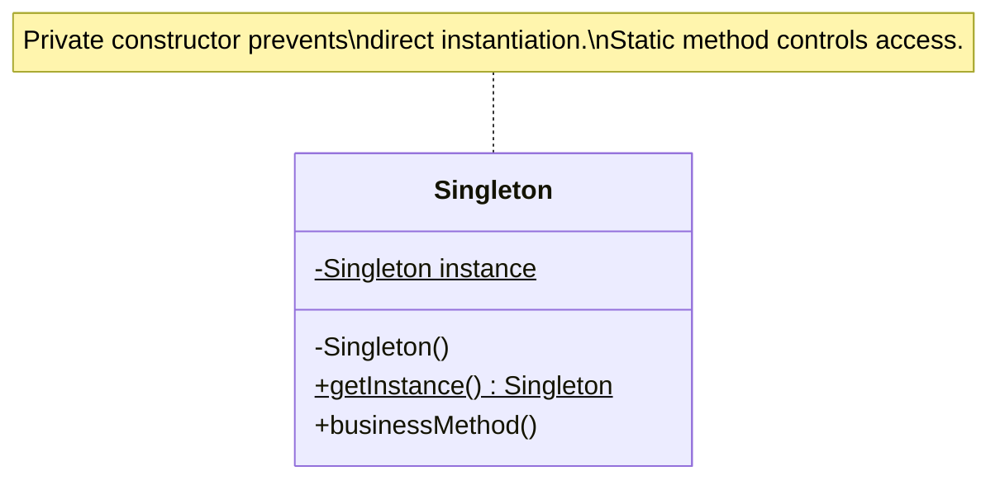
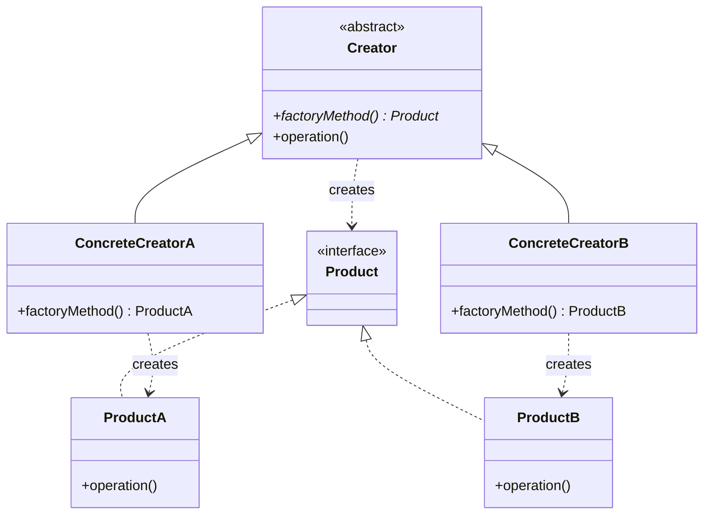

# Creational Design Patterns

Creational patterns provide various object creation mechanisms, increasing flexibility and reuse of existing code. These patterns abstract the instantiation process, making systems independent of how objects are created, composed, and represented.

## Overview of Creational Patterns

Creational patterns address the question: "How do we create objects?" While the simple answer might be "use the new keyword," creational patterns recognize that object creation can involve complexity that shouldn't be exposed to client code.

### Why Creational Patterns Matter

- **Encapsulation of Creation Logic**: Hide complex instantiation details
- **Flexibility**: Easy to change what gets created without modifying client code
- **Control**: Manage when and how objects are created
- **Reduced Coupling**: Clients depend on abstractions, not concrete classes

## Singleton Pattern

The Singleton pattern ensures a class has only one instance and provides a global access point to it.



### When to Use

- Exactly one instance of a class is needed
- The instance must be accessible from multiple parts of the application
- Creation should be lazy (only when needed)

### Implementation in Python

```python
class Logger:
    """Singleton logger ensuring only one instance exists"""
    _instance = None
    _lock = None  # In production, use threading.Lock() for thread safety

    def __new__(cls):
        if cls._instance is None:
            cls._instance = super().__new__(cls)
            cls._instance._initialized = False
        return cls._instance

    def __init__(self):
        if self._initialized:
            return
        self._initialized = True
        self.log_level = "INFO"
        self.logs = []

    def log(self, message, level="INFO"):
        entry = f"[{level}] {message}"
        self.logs.append(entry)
        print(entry)

# Usage
logger1 = Logger()
logger1.log("Application started")

logger2 = Logger()
logger2.log("Processing request")

print(logger1 is logger2)  # True
print(len(logger1.logs))   # 2 - same instance
```

### JavaScript Implementation

```javascript
class ConfigurationManager {
    constructor() {
        if (ConfigurationManager.instance) {
            return ConfigurationManager.instance;
        }

        this.config = {
            apiUrl: 'https://api.example.com',
            timeout: 5000
        };

        ConfigurationManager.instance = this;
    }

    get(key) {
        return this.config[key];
    }

    set(key, value) {
        this.config[key] = value;
    }
}

// Usage
const config1 = new ConfigurationManager();
const config2 = new ConfigurationManager();

console.log(config1 === config2);  // true
```

### Consequences

**Benefits**:
- Controlled access to the sole instance
- Reduced namespace pollution
- Permits refinement of operations and representation

**Drawbacks**:
- Can make unit testing difficult
- Hidden dependencies (global state)
- May violate Single Responsibility Principle

## Factory Method Pattern

The Factory Method defines an interface for creating an object but lets subclasses decide which class to instantiate. It lets a class defer instantiation to subclasses.



### When to Use

- A class can't anticipate the type of objects it needs to create
- A class wants its subclasses to specify objects it creates
- You want to localize the knowledge of which class to create

### Implementation in Python

```python
from abc import ABC, abstractmethod

# Product interface
class Document(ABC):
    @abstractmethod
    def open(self):
        pass

    @abstractmethod
    def save(self):
        pass

# Concrete products
class PDFDocument(Document):
    def open(self):
        return "Opening PDF document"

    def save(self):
        return "Saving PDF document"

class WordDocument(Document):
    def open(self):
        return "Opening Word document"

    def save(self):
        return "Saving Word document"

# Creator
class Application(ABC):
    def create_document(self, doc_type):
        """Factory method"""
        doc = self._make_document(doc_type)
        doc.open()
        return doc

    @abstractmethod
    def _make_document(self, doc_type):
        pass

# Concrete creator
class DocumentApplication(Application):
    def _make_document(self, doc_type):
        if doc_type == "pdf":
            return PDFDocument()
        elif doc_type == "word":
            return WordDocument()
        else:
            raise ValueError(f"Unknown document type: {doc_type}")

# Usage
app = DocumentApplication()
pdf_doc = app.create_document("pdf")
word_doc = app.create_document("word")

print(pdf_doc.save())  # "Saving PDF document"
```

## Builder Pattern

The Builder pattern separates the construction of a complex object from its representation, allowing the same construction process to create different representations.

### When to Use

- Object creation involves many steps
- Need different representations of the object being constructed
- Want to isolate complex construction code from business logic

### Implementation in Python

```python
class Pizza:
    def __init__(self):
        self.size = None
        self.cheese = False
        self.pepperoni = False
        self.mushrooms = False
        self.olives = False

    def __str__(self):
        toppings = []
        if self.cheese: toppings.append("cheese")
        if self.pepperoni: toppings.append("pepperoni")
        if self.mushrooms: toppings.append("mushrooms")
        if self.olives: toppings.append("olives")

        return f"{self.size} pizza with {', '.join(toppings)}"

class PizzaBuilder:
    def __init__(self):
        self.pizza = Pizza()

    def set_size(self, size):
        self.pizza.size = size
        return self  # Return self for method chaining

    def add_cheese(self):
        self.pizza.cheese = True
        return self

    def add_pepperoni(self):
        self.pizza.pepperoni = True
        return self

    def add_mushrooms(self):
        self.pizza.mushrooms = True
        return self

    def add_olives(self):
        self.pizza.olives = True
        return self

    def build(self):
        return self.pizza

# Usage with method chaining
pizza = (PizzaBuilder()
         .set_size("large")
         .add_cheese()
         .add_pepperoni()
         .add_mushrooms()
         .build())

print(pizza)  # "large pizza with cheese, pepperoni, mushrooms"
```

### JavaScript Implementation

```javascript
class EmailBuilder {
    constructor() {
        this.email = {
            to: [],
            cc: [],
            subject: '',
            body: '',
            attachments: []
        };
    }

    setSubject(subject) {
        this.email.subject = subject;
        return this;
    }

    addRecipient(recipient) {
        this.email.to.push(recipient);
        return this;
    }

    addCC(recipient) {
        this.email.cc.push(recipient);
        return this;
    }

    setBody(body) {
        this.email.body = body;
        return this;
    }

    addAttachment(file) {
        this.email.attachments.push(file);
        return this;
    }

    build() {
        return this.email;
    }
}

// Usage
const email = new EmailBuilder()
    .setSubject('Meeting Tomorrow')
    .addRecipient('john@example.com')
    .addRecipient('jane@example.com')
    .addCC('manager@example.com')
    .setBody('Please join us for the meeting at 2 PM')
    .build();

console.log(email);
```

## Prototype Pattern

The Prototype pattern creates new objects by copying existing objects (prototypes) rather than creating new instances from scratch.

### When to Use

- Object creation is expensive
- You need to avoid rebuilding complex objects
- System should be independent of how products are created

### Implementation in Python

```python
import copy

class GameCharacter:
    def __init__(self, name, health, armor, weapons):
        self.name = name
        self.health = health
        self.armor = armor
        self.weapons = weapons  # List of weapon objects

    def clone(self):
        """Create a deep copy of this character"""
        return copy.deepcopy(self)

    def __str__(self):
        return f"{self.name}: HP={self.health}, Armor={self.armor}"

# Create prototype
warrior_prototype = GameCharacter(
    name="Warrior",
    health=100,
    armor=50,
    weapons=["Sword", "Shield"]
)

# Clone and customize
warrior1 = warrior_prototype.clone()
warrior1.name = "Warrior1"

warrior2 = warrior_prototype.clone()
warrior2.name = "Warrior2"
warrior2.health = 120  # Modify clone

print(warrior1)  # "Warrior1: HP=100, Armor=50"
print(warrior2)  # "Warrior2: HP=120, Armor=50"
print(warrior1 is warrior2)  # False - different objects
```

## Abstract Factory Pattern

The Abstract Factory provides an interface for creating families of related or dependent objects without specifying their concrete classes.

### When to Use

- System should be independent of how its products are created
- System should be configured with one of multiple families of products
- Family of related product objects is designed to be used together

### Implementation in Python

```python
from abc import ABC, abstractmethod

# Abstract products
class Button(ABC):
    @abstractmethod
    def render(self):
        pass

class Checkbox(ABC):
    @abstractmethod
    def render(self):
        pass

# Concrete products - Windows
class WindowsButton(Button):
    def render(self):
        return "Rendering Windows button"

class WindowsCheckbox(Checkbox):
    def render(self):
        return "Rendering Windows checkbox"

# Concrete products - Mac
class MacButton(Button):
    def render(self):
        return "Rendering Mac button"

class MacCheckbox(Checkbox):
    def render(self):
        return "Rendering Mac checkbox"

# Abstract factory
class GUIFactory(ABC):
    @abstractmethod
    def create_button(self):
        pass

    @abstractmethod
    def create_checkbox(self):
        pass

# Concrete factories
class WindowsFactory(GUIFactory):
    def create_button(self):
        return WindowsButton()

    def create_checkbox(self):
        return WindowsCheckbox()

class MacFactory(GUIFactory):
    def create_button(self):
        return MacButton()

    def create_checkbox(self):
        return MacCheckbox()

# Client code
def create_ui(factory: GUIFactory):
    button = factory.create_button()
    checkbox = factory.create_checkbox()

    print(button.render())
    print(checkbox.render())

# Usage
import platform

if platform.system() == "Windows":
    factory = WindowsFactory()
else:
    factory = MacFactory()

create_ui(factory)
```

## Choosing the Right Creational Pattern

| Pattern | Use When |
|---------|----------|
| **Singleton** | Need exactly one instance globally accessible |
| **Factory Method** | Subclasses should decide which class to instantiate |
| **Abstract Factory** | Need to create families of related objects |
| **Builder** | Construction process is complex with many steps |
| **Prototype** | Creating new instances by copying is more efficient |

## Summary

Creational patterns provide flexible approaches to object creation. The Singleton ensures single instances, Factory Method and Abstract Factory delegate creation decisions, Builder constructs complex objects step-by-step, and Prototype creates objects through cloning. Choosing the right pattern depends on your specific creation needs and constraints.
