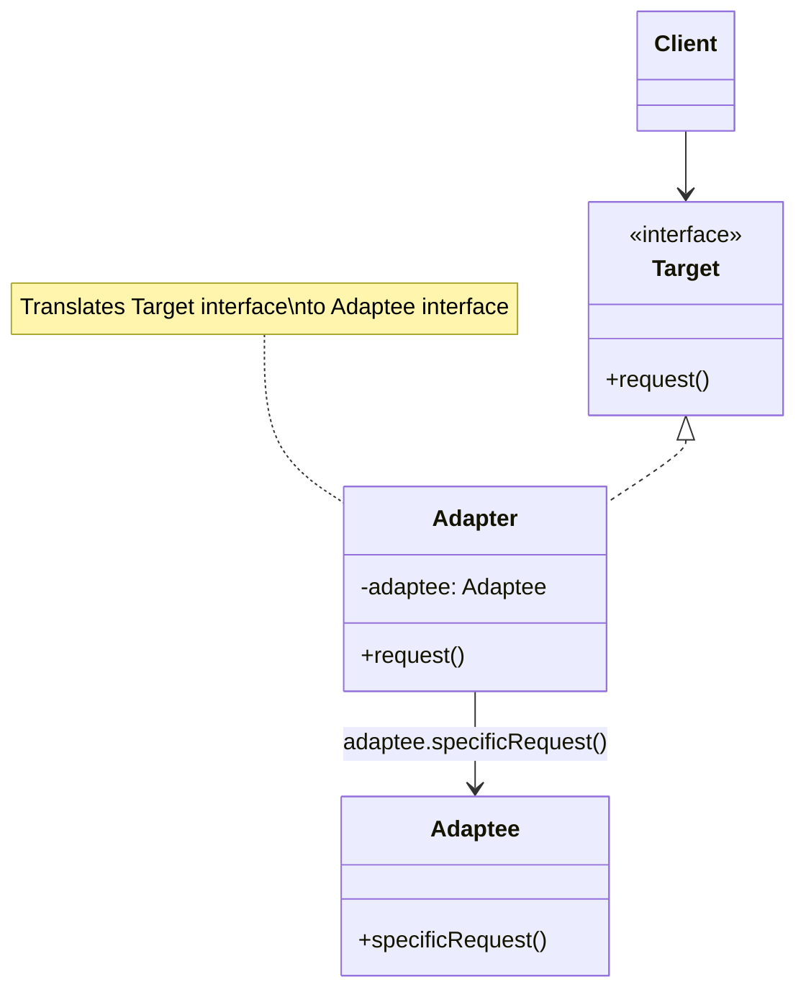
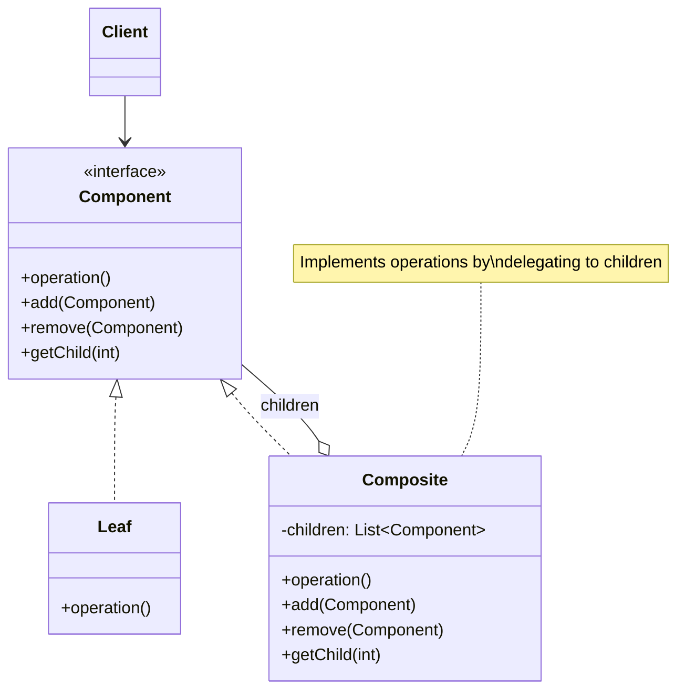
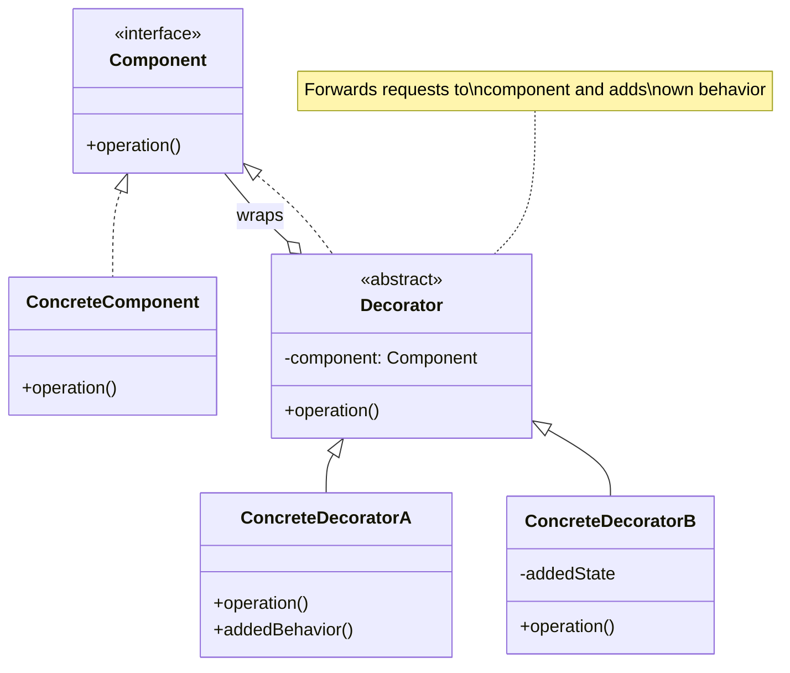

# Structural Design Patterns

Structural patterns deal with object composition, creating relationships between entities to form larger, more complex structures. These patterns help ensure that when one part of a system changes, the entire structure doesn't need to change.

## Overview of Structural Patterns

Structural patterns focus on how classes and objects are composed to form larger structures. They use inheritance to compose interfaces and define ways to compose objects to obtain new functionality.

### Why Structural Patterns Matter

- **Flexibility**: Compose objects in different ways to achieve new functionality
- **Simplification**: Simplify relationships between entities
- **Decoupling**: Reduce dependencies between components
- **Reusability**: Create reusable compositions of objects

## Adapter Pattern

The Adapter pattern converts the interface of a class into another interface that clients expect. It lets classes work together that couldn't otherwise because of incompatible interfaces.



### When to Use

- Want to use an existing class with an incompatible interface
- Need to create a reusable class that cooperates with unrelated classes
- Need to use several existing subclasses but can't adapt their interface by subclassing

### Implementation in Python

```python
# Target interface that client expects
class MediaPlayer:
    def play(self, audio_type, filename):
        pass

# Adaptee - incompatible interface
class VLCPlayer:
    def play_vlc(self, filename):
        print(f"Playing VLC file: {filename}")

class MP4Player:
    def play_mp4(self, filename):
        print(f"Playing MP4 file: {filename}")

# Adapter
class MediaAdapter(MediaPlayer):
    def __init__(self, audio_type):
        if audio_type == "vlc":
            self.player = VLCPlayer()
        elif audio_type == "mp4":
            self.player = MP4Player()

    def play(self, audio_type, filename):
        if audio_type == "vlc":
            self.player.play_vlc(filename)
        elif audio_type == "mp4":
            self.player.play_mp4(filename)

# Client using the adapter
class AudioPlayer(MediaPlayer):
    def play(self, audio_type, filename):
        if audio_type == "mp3":
            print(f"Playing MP3 file: {filename}")
        elif audio_type in ["vlc", "mp4"]:
            adapter = MediaAdapter(audio_type)
            adapter.play(audio_type, filename)
        else:
            print(f"Invalid format: {audio_type}")

# Usage
player = AudioPlayer()
player.play("mp3", "song.mp3")      # Direct support
player.play("vlc", "movie.vlc")     # Using adapter
player.play("mp4", "video.mp4")     # Using adapter
```

### JavaScript Implementation

```javascript
// Old interface
class OldPrinter {
    printOldFormat(text) {
        return `OLD FORMAT: ${text}`;
    }
}

// Target interface
class ModernPrinter {
    print(document) {
        throw new Error("Must implement print method");
    }
}

// Adapter
class PrinterAdapter extends ModernPrinter {
    constructor(oldPrinter) {
        super();
        this.oldPrinter = oldPrinter;
    }

    print(document) {
        // Convert document to format expected by old printer
        const text = document.content;
        return this.oldPrinter.printOldFormat(text);
    }
}

// Usage
const oldPrinter = new OldPrinter();
const adapter = new PrinterAdapter(oldPrinter);

const document = { content: "Hello, World!" };
console.log(adapter.print(document));  // "OLD FORMAT: Hello, World!"
```

## Bridge Pattern

The Bridge pattern decouples an abstraction from its implementation so that the two can vary independently. It's useful when both the abstractions and implementations may have multiple variations.

### When to Use

- Want to avoid permanent binding between abstraction and implementation
- Both abstractions and implementations should be extensible by subclassing
- Changes in implementation shouldn't impact clients
- Want to share implementation among multiple objects

### Implementation in Python

```python
from abc import ABC, abstractmethod

# Implementation interface
class DrawingAPI(ABC):
    @abstractmethod
    def draw_circle(self, x, y, radius):
        pass

# Concrete implementations
class DrawingAPI1(DrawingAPI):
    def draw_circle(self, x, y, radius):
        print(f"API1: Circle at ({x},{y}) with radius {radius}")

class DrawingAPI2(DrawingAPI):
    def draw_circle(self, x, y, radius):
        print(f"API2: Drawing circle at ({x},{y}), radius={radius}")

# Abstraction
class Shape(ABC):
    def __init__(self, drawing_api):
        self.drawing_api = drawing_api

    @abstractmethod
    def draw(self):
        pass

    @abstractmethod
    def resize(self, factor):
        pass

# Refined abstraction
class Circle(Shape):
    def __init__(self, x, y, radius, drawing_api):
        super().__init__(drawing_api)
        self.x = x
        self.y = y
        self.radius = radius

    def draw(self):
        self.drawing_api.draw_circle(self.x, self.y, self.radius)

    def resize(self, factor):
        self.radius *= factor

# Usage
circle1 = Circle(5, 10, 20, DrawingAPI1())
circle2 = Circle(8, 12, 15, DrawingAPI2())

circle1.draw()  # API1: Circle at (5,10) with radius 20
circle2.draw()  # API2: Drawing circle at (8,12), radius=15

circle1.resize(2)
circle1.draw()  # API1: Circle at (5,10) with radius 40
```

## Composite Pattern

The Composite pattern composes objects into tree structures to represent part-whole hierarchies. It lets clients treat individual objects and compositions uniformly.



### When to Use

- Want to represent part-whole hierarchies of objects
- Want clients to ignore the difference between compositions and individual objects
- Structure can be represented as a tree

### Implementation in Python

```python
from abc import ABC, abstractmethod

# Component
class FileSystemComponent(ABC):
    @abstractmethod
    def get_size(self):
        pass

    @abstractmethod
    def display(self, indent=0):
        pass

# Leaf
class File(FileSystemComponent):
    def __init__(self, name, size):
        self.name = name
        self.size = size

    def get_size(self):
        return self.size

    def display(self, indent=0):
        print("  " * indent + f"File: {self.name} ({self.size} bytes)")

# Composite
class Directory(FileSystemComponent):
    def __init__(self, name):
        self.name = name
        self.children = []

    def add(self, component):
        self.children.append(component)

    def remove(self, component):
        self.children.remove(component)

    def get_size(self):
        return sum(child.get_size() for child in self.children)

    def display(self, indent=0):
        print("  " * indent + f"Directory: {self.name}")
        for child in self.children:
            child.display(indent + 1)

# Usage
root = Directory("root")

home = Directory("home")
file1 = File("document.txt", 1024)
file2 = File("image.png", 2048)

home.add(file1)
home.add(file2)

var = Directory("var")
log = File("system.log", 4096)
var.add(log)

root.add(home)
root.add(var)

root.display()
print(f"\nTotal size: {root.get_size()} bytes")

# Output:
# Directory: root
#   Directory: home
#     File: document.txt (1024 bytes)
#     File: image.png (2048 bytes)
#   Directory: var
#     File: system.log (4096 bytes)
#
# Total size: 7168 bytes
```

## Decorator Pattern

The Decorator pattern attaches additional responsibilities to an object dynamically. Decorators provide a flexible alternative to subclassing for extending functionality.



### When to Use

- Want to add responsibilities to individual objects dynamically
- Want to withdraw responsibilities from objects
- Extension by subclassing is impractical

### Implementation in Python

```python
from abc import ABC, abstractmethod

# Component interface
class Coffee(ABC):
    @abstractmethod
    def get_cost(self):
        pass

    @abstractmethod
    def get_description(self):
        pass

# Concrete component
class SimpleCoffee(Coffee):
    def get_cost(self):
        return 2.0

    def get_description(self):
        return "Simple coffee"

# Decorator base class
class CoffeeDecorator(Coffee):
    def __init__(self, coffee):
        self._coffee = coffee

    def get_cost(self):
        return self._coffee.get_cost()

    def get_description(self):
        return self._coffee.get_description()

# Concrete decorators
class Milk(CoffeeDecorator):
    def get_cost(self):
        return self._coffee.get_cost() + 0.5

    def get_description(self):
        return self._coffee.get_description() + ", milk"

class Sugar(CoffeeDecorator):
    def get_cost(self):
        return self._coffee.get_cost() + 0.2

    def get_description(self):
        return self._coffee.get_description() + ", sugar"

class WhippedCream(CoffeeDecorator):
    def get_cost(self):
        return self._coffee.get_cost() + 0.7

    def get_description(self):
        return self._coffee.get_description() + ", whipped cream"

# Usage - composing decorators
coffee = SimpleCoffee()
print(f"{coffee.get_description()}: ${coffee.get_cost()}")

coffee_with_milk = Milk(coffee)
print(f"{coffee_with_milk.get_description()}: ${coffee_with_milk.get_cost()}")

fancy_coffee = WhippedCream(Sugar(Milk(SimpleCoffee())))
print(f"{fancy_coffee.get_description()}: ${fancy_coffee.get_cost()}")

# Output:
# Simple coffee: $2.0
# Simple coffee, milk: $2.5
# Simple coffee, milk, sugar, whipped cream: $3.4
```

### JavaScript Implementation

```javascript
// Component
class Text {
    constructor(content) {
        this.content = content;
    }

    render() {
        return this.content;
    }
}

// Decorators
class BoldDecorator {
    constructor(text) {
        this.text = text;
    }

    render() {
        return `<b>${this.text.render()}</b>`;
    }
}

class ItalicDecorator {
    constructor(text) {
        this.text = text;
    }

    render() {
        return `<i>${this.text.render()}</i>`;
    }
}

class UnderlineDecorator {
    constructor(text) {
        this.text = text;
    }

    render() {
        return `<u>${this.text.render()}</u>`;
    }
}

// Usage
let text = new Text("Hello, World!");
console.log(text.render());  // "Hello, World!"

text = new BoldDecorator(text);
console.log(text.render());  // "<b>Hello, World!</b>"

text = new ItalicDecorator(text);
console.log(text.render());  // "<i><b>Hello, World!</b></i>"
```

## Facade Pattern

The Facade pattern provides a unified interface to a set of interfaces in a subsystem. It defines a higher-level interface that makes the subsystem easier to use.

### When to Use

- Want to provide a simple interface to a complex subsystem
- Need to layer your subsystem
- Want to decouple subsystem from clients

### Implementation in Python

```python
# Complex subsystem classes
class CPU:
    def freeze(self):
        print("CPU: Freezing processor")

    def jump(self, position):
        print(f"CPU: Jumping to position {position}")

    def execute(self):
        print("CPU: Executing instructions")

class Memory:
    def load(self, position, data):
        print(f"Memory: Loading data '{data}' at position {position}")

class HardDrive:
    def read(self, sector, size):
        return f"Data from sector {sector}, size {size}"

# Facade
class ComputerFacade:
    def __init__(self):
        self.cpu = CPU()
        self.memory = Memory()
        self.hard_drive = HardDrive()

    def start(self):
        """Simplified interface for starting computer"""
        print("Computer starting up...")
        self.cpu.freeze()
        boot_data = self.hard_drive.read(0, 1024)
        self.memory.load(0, boot_data)
        self.cpu.jump(0)
        self.cpu.execute()
        print("Computer started successfully!")

# Usage - client only needs to know about facade
computer = ComputerFacade()
computer.start()

# Instead of:
# cpu = CPU()
# memory = Memory()
# hard_drive = HardDrive()
# cpu.freeze()
# boot_data = hard_drive.read(0, 1024)
# memory.load(0, boot_data)
# cpu.jump(0)
# cpu.execute()
```

## Proxy Pattern

The Proxy pattern provides a surrogate or placeholder for another object to control access to it.

### When to Use

- Need lazy initialization (virtual proxy)
- Need access control (protection proxy)
- Need to perform something before/after the request (logging, caching)
- Need a local representative for a remote object (remote proxy)

### Implementation in Python

```python
from abc import ABC, abstractmethod

# Subject interface
class Image(ABC):
    @abstractmethod
    def display(self):
        pass

# Real subject
class RealImage(Image):
    def __init__(self, filename):
        self.filename = filename
        self._load_from_disk()

    def _load_from_disk(self):
        print(f"Loading image from disk: {self.filename}")

    def display(self):
        print(f"Displaying image: {self.filename}")

# Proxy
class ImageProxy(Image):
    def __init__(self, filename):
        self.filename = filename
        self._real_image = None

    def display(self):
        # Lazy initialization - only load when needed
        if self._real_image is None:
            self._real_image = RealImage(self.filename)
        self._real_image.display()

# Usage
print("Creating image proxies (no loading yet)...")
image1 = ImageProxy("photo1.jpg")
image2 = ImageProxy("photo2.jpg")

print("\nDisplaying image1 first time (will load):")
image1.display()

print("\nDisplaying image1 second time (already loaded):")
image1.display()

print("\nDisplaying image2 first time (will load):")
image2.display()

# Output:
# Creating image proxies (no loading yet)...
#
# Displaying image1 first time (will load):
# Loading image from disk: photo1.jpg
# Displaying image: photo1.jpg
#
# Displaying image1 second time (already loaded):
# Displaying image: photo1.jpg
#
# Displaying image2 first time (will load):
# Loading image from disk: photo2.jpg
# Displaying image: photo2.jpg
```

## Choosing the Right Structural Pattern

| Pattern | Use When |
|---------|----------|
| **Adapter** | Need to make incompatible interfaces work together |
| **Bridge** | Want to decouple abstraction from implementation |
| **Composite** | Need to represent part-whole hierarchies as trees |
| **Decorator** | Want to add responsibilities dynamically |
| **Facade** | Need to simplify a complex subsystem |
| **Proxy** | Need to control access or add lazy initialization |

## Summary

Structural patterns provide different ways to compose objects and classes into larger structures. The Adapter makes incompatible interfaces work together, Bridge separates abstraction from implementation, Composite treats individual and composite objects uniformly, Decorator adds responsibilities dynamically, Facade simplifies complex subsystems, and Proxy controls access to objects. Understanding these patterns helps you create flexible, maintainable object compositions.
