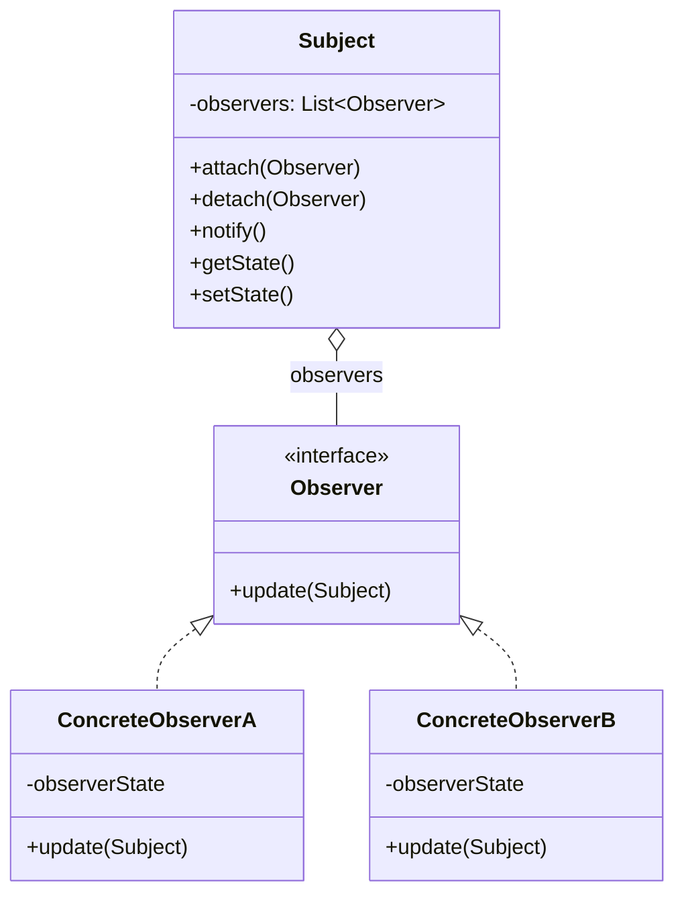
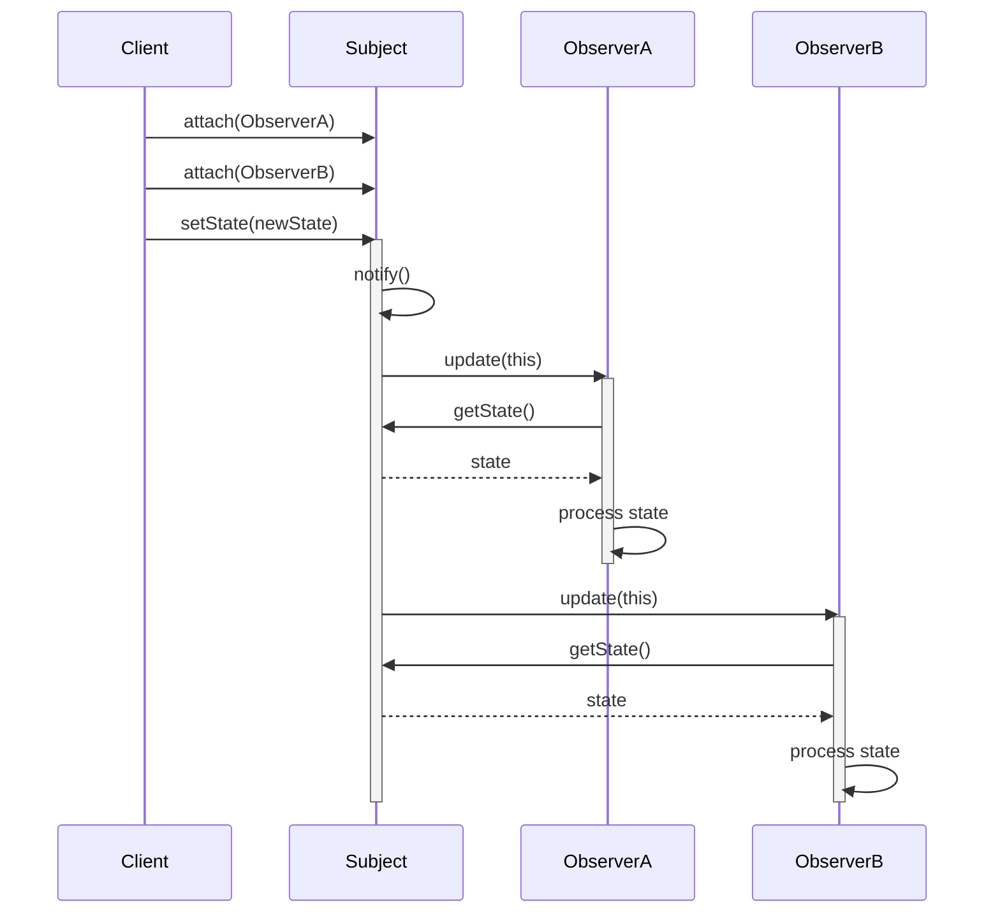
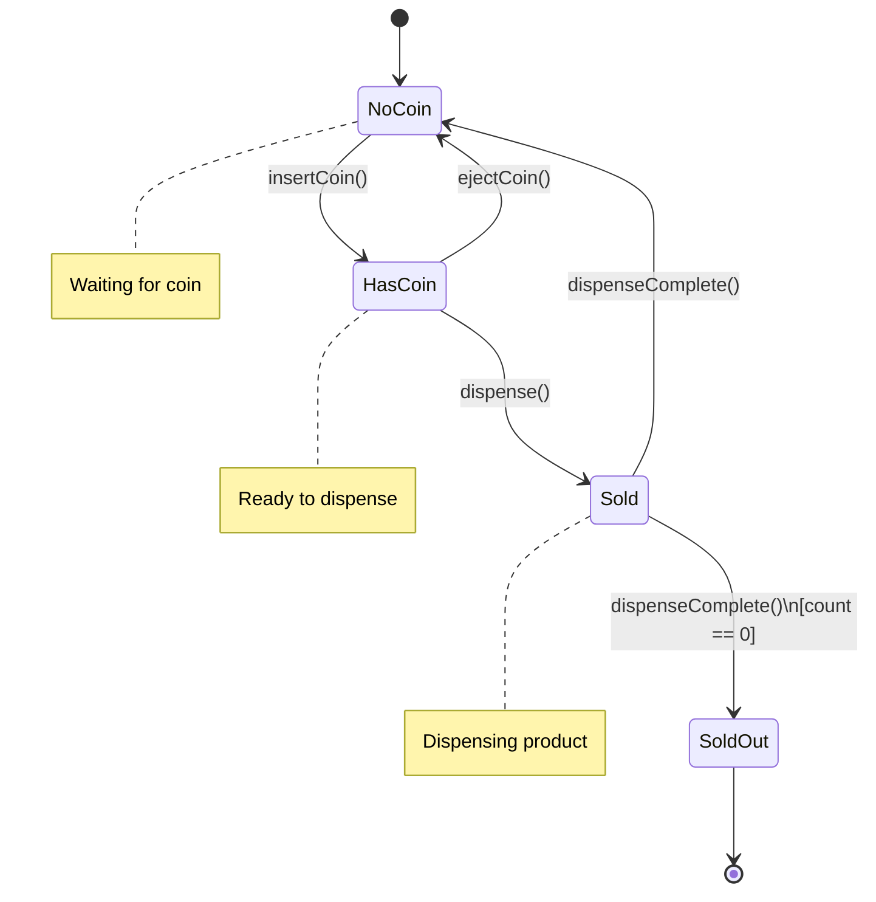

# Behavioral Design Patterns

Behavioral patterns are concerned with algorithms and the assignment of responsibilities between objects. They describe not just patterns of objects or classes but also the patterns of communication between them, characterizing complex control flow.

## Overview of Behavioral Patterns

Behavioral patterns focus on communication between objects, how they interact and distribute responsibility. These patterns shift focus from the flow of control to the way objects are interconnected.

### Why Behavioral Patterns Matter

- **Flexible Communication**: Define clear communication protocols between objects
- **Responsibility Distribution**: Distribute responsibilities in maintainable ways
- **Loose Coupling**: Reduce dependencies between communicating objects
- **Extensibility**: Make it easier to add new behaviors

## Observer Pattern

The Observer pattern defines a one-to-many dependency between objects so that when one object changes state, all its dependents are notified and updated automatically.



**Interaction Sequence:**



### When to Use

- An abstraction has two aspects, one dependent on the other
- A change to one object requires changing others, and you don't know how many
- An object should be able to notify other objects without assuming what those objects are

### Implementation in Python

```python
from abc import ABC, abstractmethod

# Subject
class Subject:
    def __init__(self):
        self._observers = []
        self._state = None

    def attach(self, observer):
        """Add an observer"""
        if observer not in self._observers:
            self._observers.append(observer)

    def detach(self, observer):
        """Remove an observer"""
        self._observers.remove(observer)

    def notify(self):
        """Notify all observers of state change"""
        for observer in self._observers:
            observer.update(self)

    def set_state(self, state):
        """Change state and notify observers"""
        self._state = state
        self.notify()

    def get_state(self):
        return self._state

# Observer interface
class Observer(ABC):
    @abstractmethod
    def update(self, subject):
        pass

# Concrete observers
class EmailNotifier(Observer):
    def update(self, subject):
        state = subject.get_state()
        print(f"Email Notification: State changed to {state}")

class SMSNotifier(Observer):
    def update(self, subject):
        state = subject.get_state()
        print(f"SMS Alert: New state is {state}")

class LogObserver(Observer):
    def update(self, subject):
        state = subject.get_state()
        print(f"[LOG] State updated: {state}")

# Usage
subject = Subject()

email_notifier = EmailNotifier()
sms_notifier = SMSNotifier()
log_observer = LogObserver()

subject.attach(email_notifier)
subject.attach(sms_notifier)
subject.attach(log_observer)

subject.set_state("Processing")
# Output:
# Email Notification: State changed to Processing
# SMS Alert: New state is Processing
# [LOG] State updated: Processing

subject.detach(sms_notifier)
subject.set_state("Completed")
# Output:
# Email Notification: State changed to Completed
# [LOG] State updated: Completed
```

### JavaScript Implementation

```javascript
class NewsPublisher {
    constructor() {
        this.subscribers = [];
        this.latestNews = null;
    }

    subscribe(subscriber) {
        this.subscribers.push(subscriber);
    }

    unsubscribe(subscriber) {
        this.subscribers = this.subscribers.filter(sub => sub !== subscriber);
    }

    publish(news) {
        this.latestNews = news;
        this.subscribers.forEach(subscriber => subscriber.notify(news));
    }
}

class Subscriber {
    constructor(name) {
        this.name = name;
    }

    notify(news) {
        console.log(`${this.name} received news: ${news}`);
    }
}

// Usage
const publisher = new NewsPublisher();

const subscriber1 = new Subscriber("Alice");
const subscriber2 = new Subscriber("Bob");

publisher.subscribe(subscriber1);
publisher.subscribe(subscriber2);

publisher.publish("Breaking: New design pattern discovered!");
// Output:
// Alice received news: Breaking: New design pattern discovered!
// Bob received news: Breaking: New design pattern discovered!
```

## Strategy Pattern

The Strategy pattern defines a family of algorithms, encapsulates each one, and makes them interchangeable. Strategy lets the algorithm vary independently from clients that use it.

### When to Use

- Many related classes differ only in their behavior
- Need different variants of an algorithm
- Algorithm uses data that clients shouldn't know about
- Class defines many behaviors as multiple conditional statements

### Implementation in Python

```python
from abc import ABC, abstractmethod

# Strategy interface
class PaymentStrategy(ABC):
    @abstractmethod
    def pay(self, amount):
        pass

# Concrete strategies
class CreditCardPayment(PaymentStrategy):
    def __init__(self, card_number, cvv):
        self.card_number = card_number
        self.cvv = cvv

    def pay(self, amount):
        print(f"Paid ${amount} using Credit Card ending in {self.card_number[-4:]}")

class PayPalPayment(PaymentStrategy):
    def __init__(self, email):
        self.email = email

    def pay(self, amount):
        print(f"Paid ${amount} using PayPal account {self.email}")

class CryptocurrencyPayment(PaymentStrategy):
    def __init__(self, wallet_address):
        self.wallet_address = wallet_address

    def pay(self, amount):
        print(f"Paid ${amount} using Crypto wallet {self.wallet_address[:8]}...")

# Context
class ShoppingCart:
    def __init__(self):
        self.items = []
        self.payment_strategy = None

    def add_item(self, item, price):
        self.items.append((item, price))

    def set_payment_strategy(self, strategy):
        self.payment_strategy = strategy

    def checkout(self):
        total = sum(price for _, price in self.items)
        if self.payment_strategy:
            self.payment_strategy.pay(total)
        else:
            print("Please select a payment method")

# Usage
cart = ShoppingCart()
cart.add_item("Laptop", 999.99)
cart.add_item("Mouse", 29.99)

# Pay with credit card
cart.set_payment_strategy(CreditCardPayment("1234567890123456", "123"))
cart.checkout()  # Paid $1029.98 using Credit Card ending in 3456

# Change strategy to PayPal
cart.set_payment_strategy(PayPalPayment("user@example.com"))
cart.checkout()  # Paid $1029.98 using PayPal account user@example.com
```

## Command Pattern

The Command pattern encapsulates a request as an object, thereby letting you parameterize clients with different requests, queue or log requests, and support undoable operations.

### When to Use

- Need to parameterize objects with operations
- Need to queue operations, schedule their execution, or execute them remotely
- Need to support undo/redo operations
- Need to structure a system around high-level operations built on primitive operations

### Implementation in Python

```python
from abc import ABC, abstractmethod

# Command interface
class Command(ABC):
    @abstractmethod
    def execute(self):
        pass

    @abstractmethod
    def undo(self):
        pass

# Receiver
class TextEditor:
    def __init__(self):
        self.text = ""

    def write(self, text):
        self.text += text

    def delete(self, length):
        self.text = self.text[:-length]

    def get_text(self):
        return self.text

# Concrete commands
class WriteCommand(Command):
    def __init__(self, editor, text):
        self.editor = editor
        self.text = text

    def execute(self):
        self.editor.write(self.text)

    def undo(self):
        self.editor.delete(len(self.text))

class DeleteCommand(Command):
    def __init__(self, editor, length):
        self.editor = editor
        self.length = length
        self.deleted_text = ""

    def execute(self):
        text = self.editor.get_text()
        self.deleted_text = text[-self.length:]
        self.editor.delete(self.length)

    def undo(self):
        self.editor.write(self.deleted_text)

# Invoker
class CommandHistory:
    def __init__(self):
        self.history = []

    def execute(self, command):
        command.execute()
        self.history.append(command)

    def undo(self):
        if self.history:
            command = self.history.pop()
            command.undo()

# Usage
editor = TextEditor()
history = CommandHistory()

# Execute commands
history.execute(WriteCommand(editor, "Hello "))
print(editor.get_text())  # "Hello "

history.execute(WriteCommand(editor, "World"))
print(editor.get_text())  # "Hello World"

history.execute(DeleteCommand(editor, 5))
print(editor.get_text())  # "Hello "

# Undo operations
history.undo()
print(editor.get_text())  # "Hello World"

history.undo()
print(editor.get_text())  # "Hello "
```

### JavaScript Implementation

```javascript
// Command interface
class Command {
    execute() {}
    undo() {}
}

// Receiver
class Light {
    turnOn() {
        console.log("Light is ON");
    }

    turnOff() {
        console.log("Light is OFF");
    }
}

// Concrete commands
class LightOnCommand extends Command {
    constructor(light) {
        super();
        this.light = light;
    }

    execute() {
        this.light.turnOn();
    }

    undo() {
        this.light.turnOff();
    }
}

class LightOffCommand extends Command {
    constructor(light) {
        super();
        this.light = light;
    }

    execute() {
        this.light.turnOff();
    }

    undo() {
        this.light.turnOn();
    }
}

// Invoker
class RemoteControl {
    constructor() {
        this.history = [];
    }

    submit(command) {
        command.execute();
        this.history.push(command);
    }

    undo() {
        const command = this.history.pop();
        if (command) {
            command.undo();
        }
    }
}

// Usage
const light = new Light();
const remote = new RemoteControl();

remote.submit(new LightOnCommand(light));   // Light is ON
remote.submit(new LightOffCommand(light));  // Light is OFF
remote.undo();                              // Light is ON
```

## State Pattern

The State pattern allows an object to alter its behavior when its internal state changes. The object will appear to change its class.



### When to Use

- Object behavior depends on its state and must change at runtime
- Operations have large, multipart conditional statements that depend on the object's state

### Implementation in Python

```python
from abc import ABC, abstractmethod

# State interface
class State(ABC):
    @abstractmethod
    def insert_coin(self, machine):
        pass

    @abstractmethod
    def eject_coin(self, machine):
        pass

    @abstractmethod
    def dispense(self, machine):
        pass

# Concrete states
class NoCoinState(State):
    def insert_coin(self, machine):
        print("Coin inserted")
        machine.set_state(machine.has_coin_state)

    def eject_coin(self, machine):
        print("No coin to eject")

    def dispense(self, machine):
        print("Insert coin first")

class HasCoinState(State):
    def insert_coin(self, machine):
        print("Coin already inserted")

    def eject_coin(self, machine):
        print("Coin ejected")
        machine.set_state(machine.no_coin_state)

    def dispense(self, machine):
        print("Dispensing product...")
        machine.set_state(machine.sold_state)

class SoldState(State):
    def insert_coin(self, machine):
        print("Please wait, dispensing in progress")

    def eject_coin(self, machine):
        print("Too late, already dispensing")

    def dispense(self, machine):
        print("Product dispensed")
        if machine.count > 0:
            machine.count -= 1
            machine.set_state(machine.no_coin_state)
        else:
            print("Out of stock")
            machine.set_state(machine.sold_out_state)

class SoldOutState(State):
    def insert_coin(self, machine):
        print("Machine is sold out")

    def eject_coin(self, machine):
        print("No coin to eject")

    def dispense(self, machine):
        print("Machine is sold out")

# Context
class VendingMachine:
    def __init__(self, count):
        self.count = count
        self.no_coin_state = NoCoinState()
        self.has_coin_state = HasCoinState()
        self.sold_state = SoldState()
        self.sold_out_state = SoldOutState()

        if count > 0:
            self.state = self.no_coin_state
        else:
            self.state = self.sold_out_state

    def set_state(self, state):
        self.state = state

    def insert_coin(self):
        self.state.insert_coin(self)

    def eject_coin(self):
        self.state.eject_coin(self)

    def dispense(self):
        self.state.dispense(self)

# Usage
machine = VendingMachine(2)

machine.insert_coin()  # Coin inserted
machine.dispense()     # Dispensing product... Product dispensed

machine.insert_coin()  # Coin inserted
machine.eject_coin()   # Coin ejected

machine.dispense()     # Insert coin first

machine.insert_coin()  # Coin inserted
machine.dispense()     # Dispensing product... Product dispensed, Out of stock

machine.insert_coin()  # Machine is sold out
```

## Template Method Pattern

The Template Method pattern defines the skeleton of an algorithm in a method, deferring some steps to subclasses. It lets subclasses redefine certain steps of an algorithm without changing the algorithm's structure.

### When to Use

- Want to implement the invariant parts of an algorithm once and leave it to subclasses to implement variable behavior
- Common behavior among subclasses should be factored and localized
- Control subclass extensions

### Implementation in Python

```python
from abc import ABC, abstractmethod

# Abstract class
class DataParser(ABC):
    def parse(self, filepath):
        """Template method - defines the algorithm skeleton"""
        data = self.read_file(filepath)
        parsed_data = self.parse_data(data)
        validated_data = self.validate_data(parsed_data)
        self.process_data(validated_data)

    def read_file(self, filepath):
        """Common implementation"""
        print(f"Reading file: {filepath}")
        return f"raw_data_from_{filepath}"

    @abstractmethod
    def parse_data(self, data):
        """Must be implemented by subclasses"""
        pass

    def validate_data(self, data):
        """Hook method - can be overridden"""
        print("Performing default validation")
        return data

    @abstractmethod
    def process_data(self, data):
        """Must be implemented by subclasses"""
        pass

# Concrete classes
class CSVParser(DataParser):
    def parse_data(self, data):
        print("Parsing CSV data")
        return f"csv_parsed_{data}"

    def process_data(self, data):
        print(f"Processing CSV: {data}")

class JSONParser(DataParser):
    def parse_data(self, data):
        print("Parsing JSON data")
        return f"json_parsed_{data}"

    def validate_data(self, data):
        """Override the hook method"""
        print("Performing JSON-specific validation")
        return data

    def process_data(self, data):
        print(f"Processing JSON: {data}")

# Usage
print("=== CSV Parser ===")
csv_parser = CSVParser()
csv_parser.parse("data.csv")

print("\n=== JSON Parser ===")
json_parser = JSONParser()
json_parser.parse("data.json")

# Output:
# === CSV Parser ===
# Reading file: data.csv
# Parsing CSV data
# Performing default validation
# Processing CSV: csv_parsed_raw_data_from_data.csv
#
# === JSON Parser ===
# Reading file: data.json
# Parsing JSON data
# Performing JSON-specific validation
# Processing JSON: json_parsed_raw_data_from_data.json
```

## Choosing the Right Behavioral Pattern

| Pattern | Use When |
|---------|----------|
| **Observer** | Need to notify multiple objects about state changes |
| **Strategy** | Have multiple algorithms for a specific task |
| **Command** | Need to parameterize objects with operations or support undo |
| **State** | Object behavior changes based on internal state |
| **Template Method** | Have algorithm skeleton with variable steps |

## Summary

Behavioral patterns define how objects interact and communicate. The Observer pattern enables one-to-many notifications, Strategy encapsulates interchangeable algorithms, Command encapsulates requests as objects, State manages state-dependent behavior, and Template Method defines algorithm skeletons. These patterns promote loose coupling and make systems more flexible and maintainable by clearly defining communication protocols and responsibility distribution.
