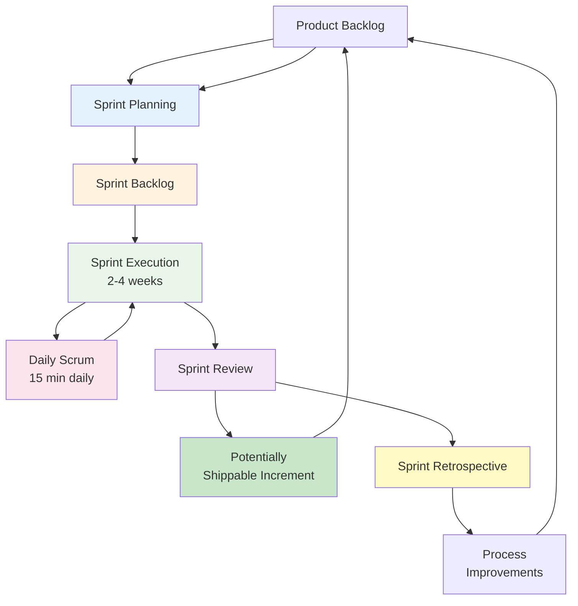
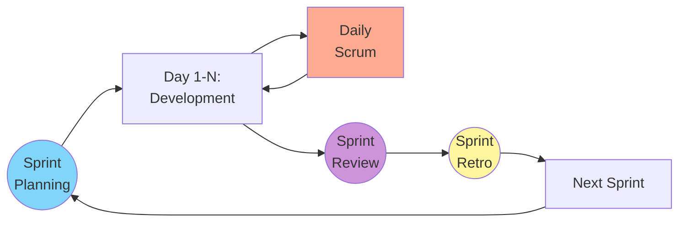

# Scrum Framework

Scrum is one of the most widely adopted Agile frameworks, providing a structured yet flexible approach to managing complex software development projects. Originally formalized in the 1990s by Ken Schwaber and Jeff Sutherland, Scrum has become synonymous with Agile development in many organizations.

## Understanding Scrum

Scrum is built on the principles of empiricism, which asserts that knowledge comes from experience and making decisions based on what is observed. The framework implements an iterative, incremental approach to optimize predictability and control risk. Three pillars support every implementation of empirical process control: transparency, inspection, and adaptation.

**Transparency** requires that significant aspects of the process be visible to those responsible for the outcome. This includes a common language shared by all participants and a common definition of "done" for completed work.

**Inspection** involves regularly examining Scrum artifacts and progress toward goals to detect undesirable variances. However, inspection should not be so frequent that it gets in the way of the work itself.

**Adaptation** means that when inspection reveals aspects of the process deviate outside acceptable limits, adjustments must be made as soon as possible to minimize further deviation.

## Scrum Roles

Scrum defines three specific roles, each with distinct responsibilities that contribute to the team's success.

### Product Owner

The Product Owner is responsible for maximizing the value of the product resulting from the work of the Development Team. This single person (not a committee) owns the Product Backlog and is accountable for:

- Clearly expressing Product Backlog items and ordering them to best achieve goals and missions
- Ensuring the Development Team understands items in the Product Backlog to the level needed
- Making decisions about what goes into each Sprint and what gets deferred
- Accepting or rejecting work results at the Sprint Review

The Product Owner must have the authority to make decisions and must be available to the team. While they may delegate some work, they remain accountable for the backlog. For the Product Owner to succeed, the entire organization must respect their decisions and avoid overriding them.

### Scrum Master

The Scrum Master is responsible for promoting and supporting Scrum by helping everyone understand Scrum theory, practices, rules, and values. They serve the team in several ways:

- Facilitating Scrum events as requested or needed
- Coaching the Development Team in self-organization and cross-functionality
- Helping the Development Team create high-value products
- Removing impediments to the Development Team's progress
- Protecting the team from outside interruptions and distractions

The Scrum Master also serves the Product Owner by helping find techniques for effective Product Backlog management, facilitating Scrum events, and helping the Product Owner understand product planning in an empirical environment.

Importantly, the Scrum Master is not a project manager. They do not assign tasks or make decisions for the team. Instead, they enable the team to make their own decisions and improve their own processes.

### Development Team

The Development Team consists of professionals who do the work of delivering a potentially releasable increment of "done" product at the end of each Sprint. Development Teams have the following characteristics:

- **Self-organizing**: No one tells the Development Team how to turn Product Backlog into increments of potentially releasable functionality
- **Cross-functional**: The team collectively has all the skills necessary to create a product increment
- **No titles**: Individual team members may have specialized skills, but accountability belongs to the Development Team as a whole
- **No sub-teams**: Regardless of domains requiring special skills, there are no sub-teams dedicated to particular areas like testing or architecture

Optimal Development Team size is small enough to remain nimble but large enough to complete significant work within a Sprint. Fewer than three members decreases interaction and results in smaller productivity gains. More than nine members requires too much coordination and generates too much complexity for an empirical process.

## Scrum Events

Scrum prescribes five events that create regularity and minimize the need for undefined meetings. All events are time-boxed, meaning they have a maximum duration that cannot be exceeded.

**Scrum Sprint Cycle:**

### Sprint

The Sprint is a time-boxed period, usually 2-4 weeks, during which a "done", useable, and potentially releasable product increment is created. Sprints have consistent durations throughout a development effort. A new Sprint starts immediately after the conclusion of the previous Sprint.

During the Sprint:
- No changes are made that would endanger the Sprint Goal
- Quality goals do not decrease
- Scope may be clarified and renegotiated between the Product Owner and Development Team as more is learned

A Sprint can be cancelled if the Sprint Goal becomes obsolete, but this should be rare as Sprints are short enough that the cost of continuing rarely exceeds the cost of cancellation.

### Sprint Planning

Sprint Planning initiates the Sprint by laying out the work to be performed. This collaborative work involves the entire Scrum Team and answers two key questions:

**What can be delivered in the increment?** The Development Team forecasts functionality to be developed during the Sprint. The Product Owner discusses the objective and the Product Backlog items that, if completed, would achieve the Sprint Goal.

**How will the chosen work get done?** The Development Team decides how it will build this functionality into a "done" product increment. The Product Backlog items selected for this Sprint plus the plan for delivering them is called the Sprint Backlog.

Sprint Planning is time-boxed to a maximum of eight hours for a one-month Sprint. For shorter Sprints, the event is usually shorter.

### Daily Scrum

The Daily Scrum is a 15-minute time-boxed event for the Development Team to synchronize activities and create a plan for the next 24 hours. The meeting happens at the same time and place each day to reduce complexity.

Each team member typically shares:
- What did I do yesterday that helped the Development Team meet the Sprint Goal?
- What will I do today to help the Development Team meet the Sprint Goal?
- Do I see any impediment that prevents me or the Development Team from meeting the Sprint Goal?

The Daily Scrum is not a status meeting for management. It is an internal team meeting that optimizes collaboration and performance by inspecting work since the last Daily Scrum and forecasting upcoming Sprint work.

### Sprint Review

The Sprint Review occurs at the end of the Sprint to inspect the increment and adapt the Product Backlog if needed. The Scrum Team and stakeholders collaborate about what was done in the Sprint. This is an informal meeting, not a status report, focused on demonstrating working software and getting feedback.

The Product Owner explains what Product Backlog items have been "done" and what has not been "done". The Development Team discusses what went well during the Sprint, what problems it ran into, and how those problems were solved. The team demonstrates the work and answers questions about the increment.

The result is a revised Product Backlog that defines the probable Product Backlog items for the next Sprint, and the overall product release timeline and budget are reviewed based on progress to date.

### Sprint Retrospective

The Sprint Retrospective provides an opportunity for the Scrum Team to inspect itself and create a plan for improvements to be enacted during the next Sprint. It occurs after the Sprint Review and prior to the next Sprint Planning, time-boxed to three hours for a one-month Sprint.

The Scrum Master encourages the team to improve its development process and practices to make it more effective and enjoyable for the next Sprint. During each Retrospective, the team inspects how the last Sprint went regarding people, relationships, process, and tools, and identifies major items that went well and potential improvements.

The team creates a plan for implementing improvements to the way it works. The Retrospective gives the team dedicated time to focus on what needs improvement while things are fresh in everyone's mind.

## Scrum Artifacts

Scrum's artifacts represent work or value to provide transparency and opportunities for inspection and adaptation.

### Product Backlog

The Product Backlog is an ordered list of everything that is known to be needed in the product. It is the single source of requirements for any changes to be made to the product. The Product Owner is responsible for the Product Backlog, including its content, availability, and ordering.

The Product Backlog is never complete. The earliest development of it lays out the initially known and best-understood requirements. The Product Backlog evolves as the product and the environment in which it will be used evolves. It is dynamic, constantly changing to identify what the product needs to be appropriate, competitive, and useful.

### Sprint Backlog

The Sprint Backlog is the set of Product Backlog items selected for the Sprint, plus a plan for delivering the product increment and realizing the Sprint Goal. It is a forecast by the Development Team about what functionality will be in the next increment and the work needed to deliver that functionality.

The Sprint Backlog makes visible all the work that the Development Team identifies as necessary to meet the Sprint Goal. To ensure continuous improvement, it includes at least one high priority process improvement identified in the previous Retrospective.

### Increment

The Increment is the sum of all the Product Backlog items completed during a Sprint and the value of the increments of all previous Sprints. At the end of a Sprint, the new Increment must be "done", meaning it must be in useable condition regardless of whether the Product Owner decides to release it.

## Implementing Scrum Successfully

Successful Scrum implementation requires commitment from the entire organization, not just the Scrum Team. Common challenges include:

- **Resistance to transparency**: Scrum makes problems visible, which can be uncomfortable for organizations used to hiding issues
- **Difficulty estimating**: Teams need time to develop their ability to forecast what can be completed in a Sprint
- **Incomplete Product Owner engagement**: When Product Owners cannot dedicate sufficient time, the team suffers from lack of direction
- **Inadequate Definition of Done**: Without a clear, shared understanding of what "done" means, quality suffers

Organizations see the greatest benefits from Scrum when they embrace its principles fully rather than cherry-picking practices. Scrum is designed as a complete framework, and removing elements typically diminishes its effectiveness.
