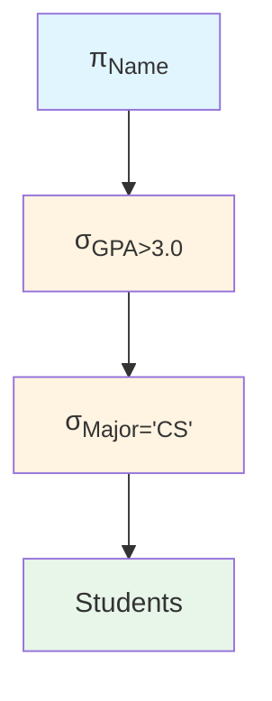
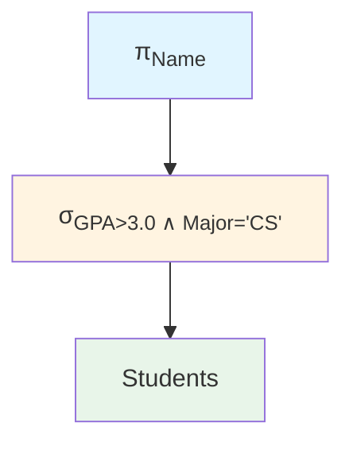
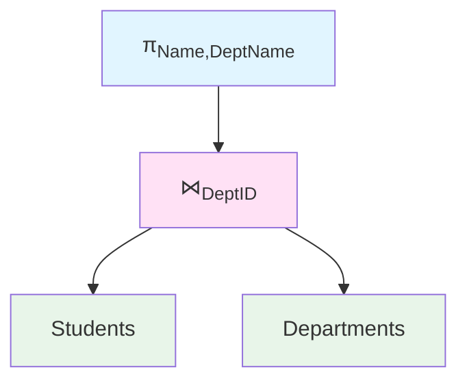

# Relational Algebra

Relational algebra is a procedural query language that forms the theoretical foundation for SQL. Understanding it helps you write better queries and optimize database operations.

## Fundamental Operations

Relational algebra has six fundamental operations. All other operations can be derived from these.

### Selection (σ)

Filters rows based on a condition (horizontal partitioning):

$$\sigma_{\text{condition}}(R)$$

Example:
$$\text{Students} = \{(101, \text{Alice}, 3.5), (102, \text{Bob}, 2.8), (103, \text{Carol}, 3.9)\}$$

$$\sigma_{\text{GPA}>3.0}(\text{Students}) = \{(101, \text{Alice}, 3.5), (103, \text{Carol}, 3.9)\}$$

**SQL equivalent**:
```sql
SELECT * FROM Students WHERE GPA > 3.0;
```

Conditions can use:
- Comparison: $=$, $\neq$, $<$, $>$, $\leq$, $\geq$
- Logical operators: AND ($\land$), OR ($\lor$), NOT ($\neg$)

$$\sigma_{\text{GPA}>3.0 \land \text{Major}='\text{CS}'}(\text{Students})$$

### Projection (π)

Selects specific columns (vertical partitioning):

$$\pi_{\text{attributes}}(R)$$

Example:
$$\text{Students} = \{(101, \text{Alice}, 3.5), (102, \text{Bob}, 2.8)\}$$

$$\pi_{\text{Name},\text{GPA}}(\text{Students}) = \{(\text{Alice}, 3.5), (\text{Bob}, 2.8)\}$$

**SQL equivalent**:
```sql
SELECT Name, GPA FROM Students;
```

**Important**: Projection eliminates duplicates (relations are sets):

$$\pi_{\text{Major}}(\text{Students}) \text{ -- Returns distinct majors only}$$

### Union (∪)

Combines tuples from two union-compatible relations:

$$R \cup S$$

**Union compatibility**: Same number of attributes with compatible domains

Example:
$$\text{CSStudents} = \{(101, \text{Alice}), (102, \text{Bob})\}$$
$$\text{MathStudents} = \{(102, \text{Bob}), (103, \text{Carol})\}$$

$$\text{CSStudents} \cup \text{MathStudents} = \{(101, \text{Alice}), (102, \text{Bob}), (103, \text{Carol})\}$$

**SQL equivalent**:
```sql
SELECT * FROM CSStudents UNION SELECT * FROM MathStudents;
```

### Set Difference (−)

Tuples in first relation but not in second:

$$R - S$$

Example:
$$\text{CSStudents} - \text{MathStudents} = \{(101, \text{Alice})\}$$

Students in CS but not in Math

**SQL equivalent**:
```sql
SELECT * FROM CSStudents EXCEPT SELECT * FROM MathStudents;
```

### Cartesian Product (×)

All combinations of tuples from two relations:

$$R \times S$$

Example:
$$\text{Students} = \{(1, \text{Alice}), (2, \text{Bob})\}$$
$$\text{Courses} = \{(\text{CS101}, \text{Intro}), (\text{CS201}, \text{Algo})\}$$

$$\text{Students} \times \text{Courses} = \{$$
$$(1, \text{Alice}, \text{CS101}, \text{Intro}),$$
$$(1, \text{Alice}, \text{CS201}, \text{Algo}),$$
$$(2, \text{Bob}, \text{CS101}, \text{Intro}),$$
$$(2, \text{Bob}, \text{CS201}, \text{Algo})\}$$

If R has $n$ tuples and S has $m$ tuples, then $R \times S$ has $n \times m$ tuples.

**SQL equivalent**:
```sql
SELECT * FROM Students, Courses;  -- Implicit cross join
SELECT * FROM Students CROSS JOIN Courses;
```

### Rename (ρ)

Changes relation or attribute names:

$$\rho_{\text{NewName}}(R) \text{ -- Rename relation}$$
$$\rho_{(A_1,A_2,...)}(R) \text{ -- Rename attributes}$$
$$\rho_{\text{NewName}(A_1,A_2,...)}(R) \text{ -- Rename both}$$

Example:
$$\rho_{S(\text{ID},\text{StudentName})}(\text{Students})$$

Rename to S with attributes ID and StudentName. Useful for self-joins and resolving ambiguity.

## Derived Operations

### Intersection (∩)

Tuples in both relations:

$$R \cap S = R - (R - S)$$

Example:
$$\text{CSStudents} \cap \text{MathStudents} = \{(102, \text{Bob})\}$$

Students in both CS and Math

**SQL equivalent**:
```sql
SELECT * FROM CSStudents INTERSECT SELECT * FROM MathStudents;
```

### Natural Join (⋈)

Combines relations on common attributes, eliminating duplicate columns:

$$R \bowtie S$$

Example:
$$\text{Students}(\text{StudentID}, \text{Name}, \text{DeptID})$$
$$\text{Departments}(\text{DeptID}, \text{DeptName})$$

$$\text{Students} \bowtie \text{Departments} \text{ -- Join on DeptID}$$

Natural join steps:
1. Cartesian product: $R \times S$
2. Select rows where common attributes are equal
3. Project to eliminate duplicate columns

**SQL equivalent**:
```sql
SELECT * FROM Students NATURAL JOIN Departments;
```

### Theta Join (⋈_θ)

Join with arbitrary condition:

$$R \bowtie_\theta S = \sigma_\theta(R \times S)$$

Example:
$$\text{Employees} \bowtie_{\text{Salary}>\text{ManagerSalary}} \text{Managers}$$

### Equijoin

Theta join with equality condition (most common):

$$\text{Students} \bowtie_{\text{Students.DeptID}=\text{Departments.DeptID}} \text{Departments}$$

**SQL equivalent**:
```sql
SELECT * FROM Students s JOIN Departments d ON s.DeptID = d.DeptID;
```

### Left/Right/Full Outer Join

Include non-matching tuples with NULLs:

$$\text{Students} \; ⟕ \; \text{Departments} \text{ -- Left outer join}$$
$$\text{Students} \; ⟖ \; \text{Departments} \text{ -- Right outer join}$$
$$\text{Students} \; ⟗ \; \text{Departments} \text{ -- Full outer join}$$

```sql
SELECT * FROM Students s LEFT JOIN Departments d ON s.DeptID = d.DeptID;
```

### Division (÷)

"For all" queries—tuples in R that are associated with all tuples in S:

$$R \div S$$

Example:
$$\text{Enrollment}(\text{StudentID}, \text{CourseID})$$
$$\text{RequiredCourses}(\text{CourseID})$$

$$\text{Enrollment} \div \text{RequiredCourses}$$

Returns students enrolled in ALL required courses.

Division definition:
$$R(A, B) \div S(B) = \pi_A(R) - \pi_A((\pi_A(R) \times S) - R)$$

**SQL equivalent**:
```sql
SELECT DISTINCT StudentID FROM Enrollment e1
WHERE NOT EXISTS (
    SELECT CourseID FROM RequiredCourses
    EXCEPT
    SELECT CourseID FROM Enrollment e2 WHERE e2.StudentID = e1.StudentID
);
```

## Query Examples

### Example 1: Simple Selection and Projection

Find names of students with GPA above 3.5:

$$\pi_{\text{Name}}(\sigma_{\text{GPA}>3.5}(\text{Students}))$$

```sql
SELECT Name FROM Students WHERE GPA > 3.5;
```

### Example 2: Join Query

Find names of students and their department names:

$$\pi_{\text{Name},\text{DeptName}}(\text{Students} \bowtie \text{Departments})$$

```sql
SELECT s.Name, d.DeptName
FROM Students s JOIN Departments d ON s.DeptID = d.DeptID;
```

### Example 3: Set Operation

Find students taking CS101 or CS201:

$$\pi_{\text{StudentID}}(\sigma_{\text{CourseID}='\text{CS101}'}(\text{Enrollment})) \cup \pi_{\text{StudentID}}(\sigma_{\text{CourseID}='\text{CS201}'}(\text{Enrollment}))$$

```sql
SELECT StudentID FROM Enrollment WHERE CourseID = 'CS101'
UNION
SELECT StudentID FROM Enrollment WHERE CourseID = 'CS201';
```

### Example 4: Self-Join

Find pairs of students in the same department:

$$\rho_{S1}(\text{Students}) \bowtie_{S1.\text{DeptID} = S2.\text{DeptID} \land S1.\text{ID} < S2.\text{ID}} \rho_{S2}(\text{Students})$$

```sql
SELECT S1.Name, S2.Name
FROM Students S1, Students S2
WHERE S1.DeptID = S2.DeptID AND S1.StudentID < S2.StudentID;
```

### Example 5: Division

Find students enrolled in all courses offered by the CS department:

$$(\pi_{\text{StudentID},\text{CourseID}}(\text{Enrollment})) \div (\pi_{\text{CourseID}}(\sigma_{\text{Dept}='\text{CS}'}(\text{Courses})))$$

## Query Trees

Relational algebra expressions can be represented as trees to visualize query execution:



**Query**: Find names of CS students with GPA > 3.0

**Optimized version** (combining selections):



**Join tree example**:



Query optimizers transform these trees to find efficient execution plans.

## Algebraic Laws

### Selection Laws

**Cascade**:
$$\sigma_{c_1 \land c_2}(R) = \sigma_{c_1}(\sigma_{c_2}(R))$$

**Commutative**:
$$\sigma_{c_1}(\sigma_{c_2}(R)) = \sigma_{c_2}(\sigma_{c_1}(R))$$

### Projection Laws

**Cascade**:
$$\pi_{L_1}(\pi_{L_2}(R)) = \pi_{L_1}(R) \text{ if } L_1 \subseteq L_2$$

**Selection-Projection**:
$$\pi_L(\sigma_c(R)) = \sigma_c(\pi_L(R)) \text{ if } c \text{ uses only } L \text{ attributes}$$

### Join Laws

**Commutative**:
$$R \bowtie S = S \bowtie R$$

**Associative**:
$$(R \bowtie S) \bowtie T = R \bowtie (S \bowtie T)$$

### Pushing Selection Down

$$\sigma_c(R \bowtie S) = (\sigma_c(R)) \bowtie S \text{ (if } c \text{ involves only } R\text{'s attributes)}$$

This optimization reduces the size of intermediate results by filtering early.

## Relational Algebra vs SQL

| Relational Algebra | SQL |
|--------------------|-----|
| $\sigma_{\text{condition}}(R)$ | WHERE condition |
| $\pi_{\text{attributes}}(R)$ | SELECT attributes |
| $R \times S$ | FROM R, S or CROSS JOIN |
| $R \bowtie S$ | JOIN or NATURAL JOIN |
| $R \cup S$ | UNION |
| $R - S$ | EXCEPT |
| $R \cap S$ | INTERSECT |
| $\rho_{\text{NewName}}(R)$ | AS NewName |

Understanding relational algebra helps you:
1. Write correct SQL queries
2. Understand query execution plans
3. Optimize database performance
4. Design better schemas

