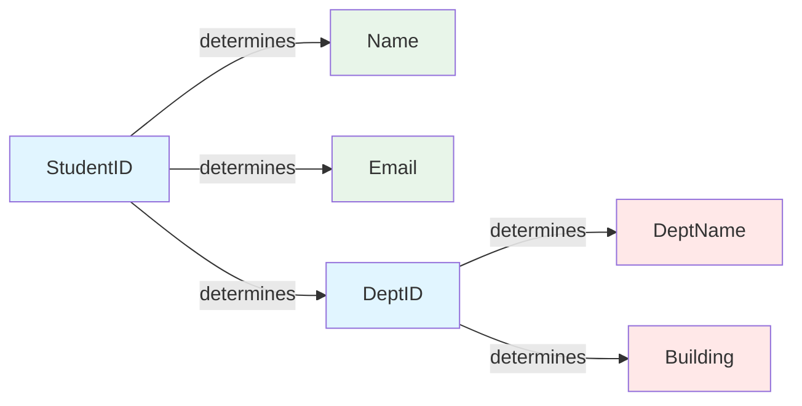
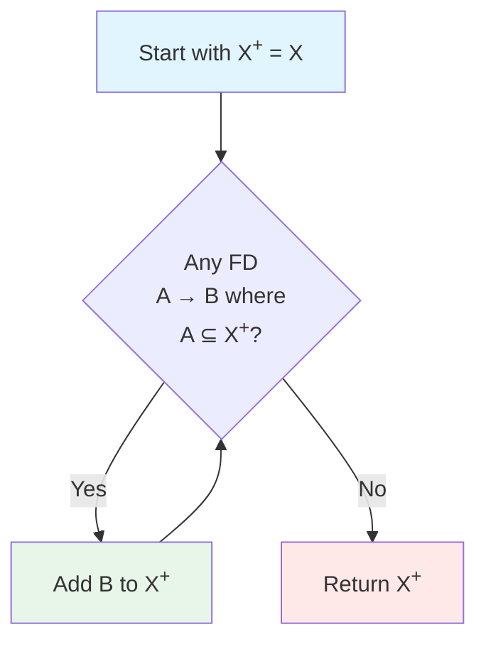
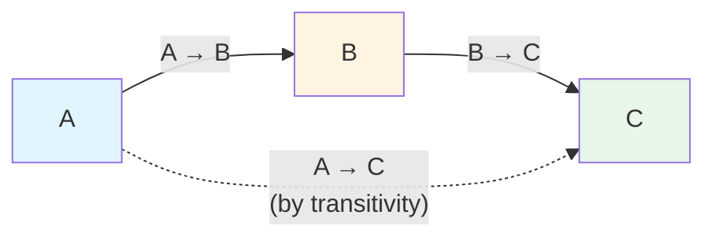
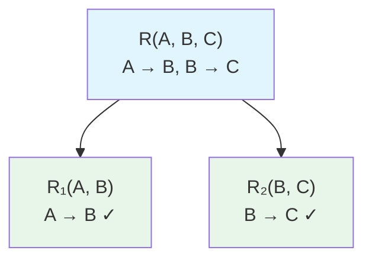
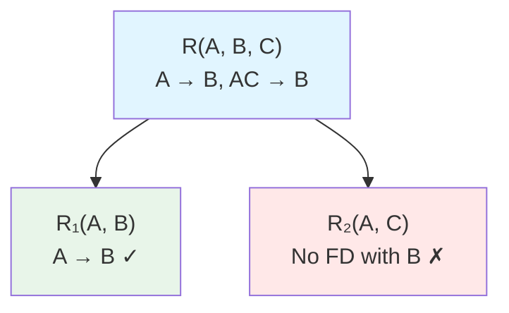

# Functional Dependencies

Functional dependencies (FDs) are constraints that describe relationships between attributes. They form the foundation of normalization theory.

## Definition

A functional dependency $X \rightarrow Y$ means: if two tuples have the same values for attributes X, they must have the same values for attributes Y.

$$X \rightarrow Y$$

"$X$ determines $Y$" or "$Y$ is functionally dependent on $X$"

**Formal notation**: For relation $R$ with attributes $X$ and $Y$:

$$X \rightarrow Y \text{ holds in } R \iff \forall t_1, t_2 \in R: t_1[X] = t_2[X] \Rightarrow t_1[Y] = t_2[Y]$$

### Examples

$$\text{StudentID} \rightarrow \text{StudentName}$$
Same StudentID always has same StudentName

$$\{\text{CourseID}, \text{Semester}\} \rightarrow \text{InstructorID}$$
Same course in same semester has same instructor

$$\text{EmployeeID} \rightarrow \{\text{Name}, \text{DeptID}, \text{Salary}\}$$
Employee ID determines all employee attributes

### Visualization

Functional dependencies can be visualized as dependency diagrams:



In this diagram:
- Blue nodes are determinants (left side of FDs)
- Green nodes depend on StudentID
- Red nodes depend on DeptID (transitive dependency)


## Identifying Functional Dependencies

### From Business Rules

Business Rule: "Each order is placed by exactly one customer"
$$\text{OrderID} \rightarrow \text{CustomerID}$$

Business Rule: "An employee can only belong to one department"
$$\text{EmployeeID} \rightarrow \text{DeptID}$$

Business Rule: "Product prices are determined by product, not by order"
$$\text{ProductID} \rightarrow \text{Price}$$

### From Data Analysis

Relation: $\text{StudentCourse}(\text{StudentID}, \text{CourseID}, \text{Semester}, \text{Grade}, \text{InstructorID})$

Analyze: Can the same (StudentID, CourseID, Semester) have different grades?

If no: $\{\text{StudentID}, \text{CourseID}, \text{Semester}\} \rightarrow \text{Grade}$

Analyze: Does InstructorID depend on StudentID?

If no: $\text{StudentID} \not\rightarrow \text{InstructorID}$ (not a dependency)

### Common Patterns

Primary key determines all attributes:
$$\text{PK} \rightarrow \text{all other attributes}$$

Foreign key determines attributes of referenced table (via join):
$$\text{FK} \rightarrow \text{referenced attributes}$$

Derived attributes:
$$\text{BirthDate} \rightarrow \text{Age (computed)}$$

Natural dependencies:
$$\text{ZipCode} \rightarrow \{\text{City}, \text{State}\}$$
$$\text{ISBN} \rightarrow \{\text{Title}, \text{Author}, \text{Publisher}\}$$

## Trivial Dependencies

A dependency $X \rightarrow Y$ is **trivial** if $Y \subseteq X$:

$$\{\text{StudentID}, \text{Name}\} \rightarrow \text{StudentID} \text{ -- Trivial}$$
$$\{A, B, C\} \rightarrow \{A, B\} \text{ -- Trivial}$$
$$\text{StudentID} \rightarrow \text{StudentID} \text{ -- Trivial}$$

Trivial dependencies always hold and aren't interesting for normalization.

## Closure of Attributes

The **closure** $X^+$ is the set of all attributes functionally determined by $X$.

### Computing Closure

**Algorithm**:
1. Start with $X^+ = X$
2. For each FD: $A \rightarrow B$ where $A \subseteq X^+$
   Add $B$ to $X^+$
3. Repeat until no change



### Example

Relation: $R(A, B, C, D, E)$

FDs: $A \rightarrow B$, $B \rightarrow C$, $CD \rightarrow E$, $E \rightarrow A$

**Find** $\{A\}^+$:
1. Start: $\{A\}^+ = \{A\}$
2. $A \rightarrow B$ applies: $\{A\}^+ = \{A, B\}$
3. $B \rightarrow C$ applies: $\{A\}^+ = \{A, B, C\}$
4. No more FDs apply with just $\{A, B, C\}$
5. Result: $\{A\}^+ = \{A, B, C\}$

**Find** $\{A, D\}^+$:
1. Start: $\{A, D\}^+ = \{A, D\}$
2. $A \rightarrow B$: $\{A, D\}^+ = \{A, B, D\}$
3. $B \rightarrow C$: $\{A, D\}^+ = \{A, B, C, D\}$
4. $CD \rightarrow E$: $\{A, D\}^+ = \{A, B, C, D, E\}$
5. $E \rightarrow A$: already have A
6. Result: $\{A, D\}^+ = \{A, B, C, D, E\}$ = all attributes

### Using Closure

**Key identification**: $X$ is a superkey if $X^+$ = all attributes

From example above:
- $\{A\}^+ = \{A, B, C\} \neq \text{all} \Rightarrow A$ is not a key
- $\{A, D\}^+ = \{A, B, C, D, E\} = \text{all} \Rightarrow \{A, D\}$ is a superkey

## Armstrong's Axioms

Three inference rules for deriving all implied FDs:

### Reflexivity (Trivial)

If $Y \subseteq X$, then $X \rightarrow Y$

$$\{A, B, C\} \rightarrow \{A, B\}$$
$$\{A, B\} \rightarrow A$$

### Augmentation

If $X \rightarrow Y$, then $XZ \rightarrow YZ$

Given: $A \rightarrow B$

Then: $AC \rightarrow BC$, $AD \rightarrow BD$, $ABC \rightarrow BC$, etc.

### Transitivity

If $X \rightarrow Y$ and $Y \rightarrow Z$, then $X \rightarrow Z$

Given: $A \rightarrow B$ and $B \rightarrow C$

Then: $A \rightarrow C$



### Derived Rules

From the axioms, we can derive:

**Union**: If $X \rightarrow Y$ and $X \rightarrow Z$, then $X \rightarrow YZ$

**Decomposition**: If $X \rightarrow YZ$, then $X \rightarrow Y$ and $X \rightarrow Z$

**Pseudotransitivity**: If $X \rightarrow Y$ and $WY \rightarrow Z$, then $WX \rightarrow Z$

## Minimal Cover (Canonical Cover)

A minimal set of FDs equivalent to the original set:

### Properties

1. Every RHS has single attribute
2. No redundant FDs
3. No redundant attributes on LHS

### Algorithm

**Step 1**: Decompose - Split RHS to single attributes
$$A \rightarrow BC \text{ becomes } A \rightarrow B, A \rightarrow C$$

**Step 2**: Remove redundant FDs

For each FD $X \rightarrow A$:
- Remove it temporarily
- If $A \in X^+$ using remaining FDs, it's redundant

**Step 3**: Remove redundant LHS attributes

For each FD $XY \rightarrow A$:
- If $A \in X^+$, then $Y$ is redundant (keep $X \rightarrow A$)

### Example

**Given**: $A \rightarrow BC$, $B \rightarrow C$, $AB \rightarrow C$, $AC \rightarrow D$

**Step 1** - Decompose:
$$A \rightarrow B, A \rightarrow C, B \rightarrow C, AB \rightarrow C, AC \rightarrow D$$

**Step 2** - Remove redundant FDs:
- $A \rightarrow C$: Remove, check if $C \in \{A\}^+$
  - $\{A\}^+ = \{A, B\}$ using $A \rightarrow B$
  - $\{A\}^+ = \{A, B, C\}$ using $B \rightarrow C$
  - Yes, $C$ is in closure, so $A \rightarrow C$ is redundant

- $AB \rightarrow C$: Remove, check if $C \in \{A,B\}^+$
  - Already know $B \rightarrow C$, so yes, redundant

Remaining: $A \rightarrow B$, $B \rightarrow C$, $AC \rightarrow D$

**Step 3** - Remove redundant LHS attributes:
- $AC \rightarrow D$: Check if $C$ is redundant
  - Is $D \in \{A\}^+$? $\{A\}^+ = \{A, B, C\}$, no $D$
  - $C$ is not redundant

**Minimal cover**: $\{A \rightarrow B, B \rightarrow C, AC \rightarrow D\}$

## Dependency Preservation

When decomposing a relation, we want to preserve all FDs:

**Example**: $R(A, B, C)$ with FDs: $A \rightarrow B$, $B \rightarrow C$

Decompose to: $R_1(A, B)$ and $R_2(B, C)$

Check: Can we enforce both FDs?
- $A \rightarrow B$: Yes, within $R_1$ ✓
- $B \rightarrow C$: Yes, within $R_2$ ✓

FDs are preserved!



### Non-Preserved Example

$R(A, B, C)$ with FDs: $A \rightarrow B$, $AC \rightarrow B$

Decompose to: $R_1(A, B)$ and $R_2(A, C)$

Check:
- $A \rightarrow B$: Yes, within $R_1$ ✓
- $AC \rightarrow B$: No! $A$ and $C$ are in $R_2$, $B$ is in $R_1$ ✗
  Must join to check this constraint

FD not preserved (requires join to enforce)



## Practical Applications

### Schema Design

```sql
-- Bad: Redundant data from FD violation
Orders(OrderID, CustomerID, CustomerName, CustomerAddress)
-- CustomerID → CustomerName, CustomerAddress
-- Customer info repeated in every order

-- Good: Normalize based on FDs
Orders(OrderID, CustomerID)
Customers(CustomerID, CustomerName, CustomerAddress)
```

### Constraint Enforcement

```sql
-- FD: ZipCode → City
-- Enforce with separate table or check constraint

CREATE TABLE ZipCodes (
    ZipCode CHAR(5) PRIMARY KEY,
    City VARCHAR(100) NOT NULL
);

CREATE TABLE Addresses (
    AddressID INTEGER PRIMARY KEY,
    Street VARCHAR(200),
    ZipCode CHAR(5) REFERENCES ZipCodes(ZipCode)
    -- City derived from ZipCode via join
);
```

