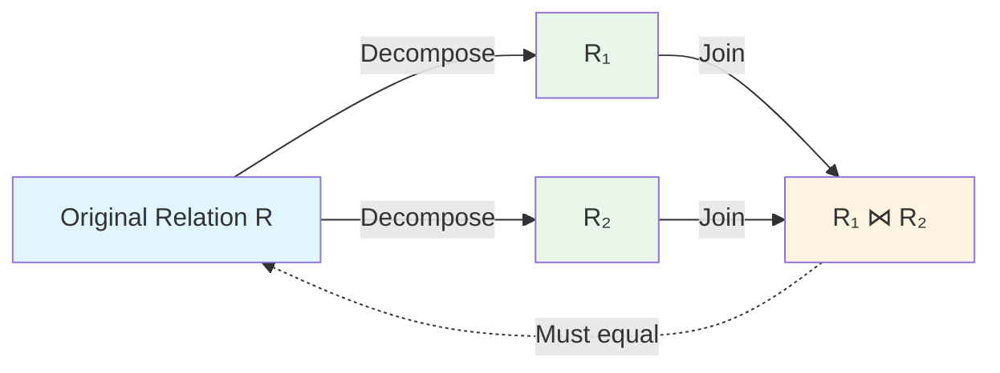
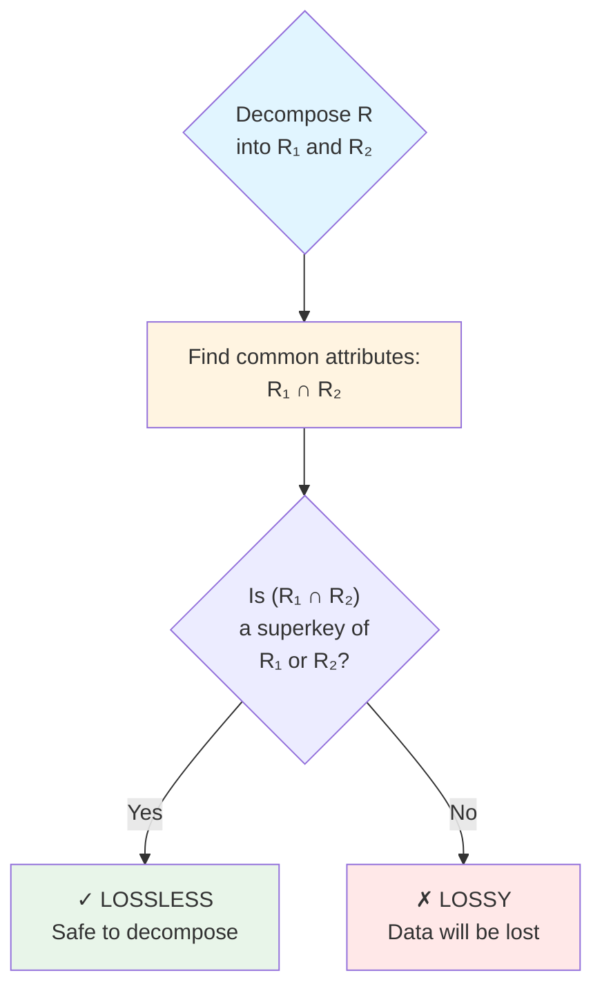
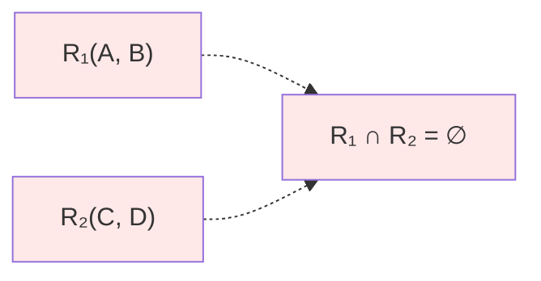
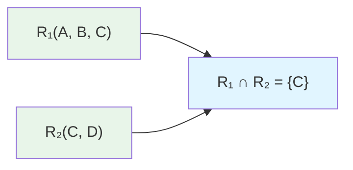
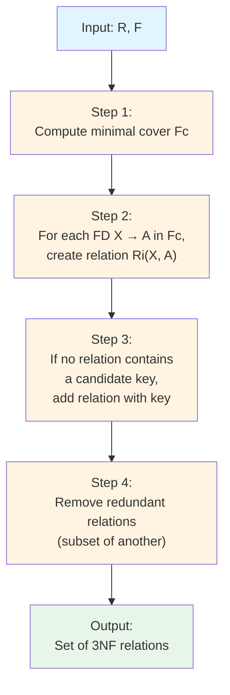
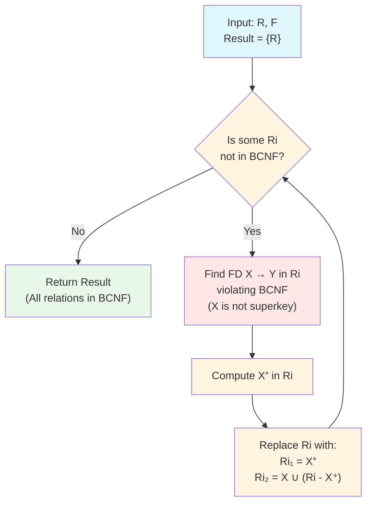
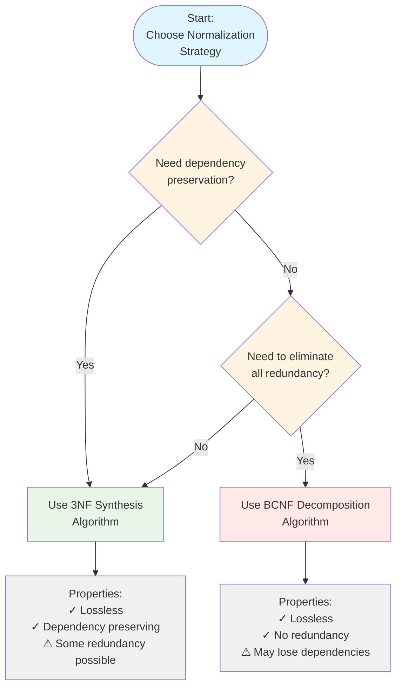

# Decomposition Algorithms

Decomposition transforms a relation into multiple smaller relations to achieve desired normal forms. Understanding decomposition properties ensures data integrity is preserved.

## Lossless Join Decomposition

### Definition

A decomposition is **lossless** (or lossless-join) if the original relation can be perfectly reconstructed by joining the decomposed relations.

$$R \text{ decomposed into } R_1 \text{ and } R_2 \text{ is lossless iff:}$$
$$R = R_1 \bowtie R_2 \text{ (natural join)}$$



### Testing for Lossless Join

For decomposition into two relations $R_1$ and $R_2$:

**Lossless if and only if**:
$$(R_1 \cap R_2) \rightarrow R_1 \text{ OR } (R_1 \cap R_2) \rightarrow R_2$$

**The common attributes must be a superkey of at least one relation.**



### Example Analysis

Relation: $R(A, B, C, D)$ with FDs: $A \rightarrow B$, $C \rightarrow D$

**Decomposition 1**: $R_1(A, B)$, $R_2(C, D)$



Common: $R_1 \cap R_2 = \emptyset$

**Result**: ✗ **LOSSY** (no common attributes)

---

**Decomposition 2**: $R_1(A, B, C)$, $R_2(C, D)$



Common: $R_1 \cap R_2 = \{C\}$

Check: $C \rightarrow D$ means $C$ is key in $R_2$ ✓

**Result**: ✓ **LOSSLESS**

---

**Decomposition 3**: $R_1(A, B)$, $R_2(A, C, D)$

Common: $R_1 \cap R_2 = \{A\}$

Check: $A \rightarrow B$ means $A$ is key in $R_1$ ✓

**Result**: ✓ **LOSSLESS**

### Why Losslessness Matters

```
Original: Employee(EmpID, Name, DeptID, DeptName)
Data: (1, 'Alice', 10, 'Sales'), (2, 'Bob', 10, 'Sales')

Lossy decomposition: R1(EmpID, Name), R2(DeptID, DeptName)
R1: (1, 'Alice'), (2, 'Bob')
R2: (10, 'Sales')

Join result: Cannot reconstruct! Lost EmpID-DeptID relationship.

Lossless decomposition: R1(EmpID, Name, DeptID), R2(DeptID, DeptName)
R1: (1, 'Alice', 10), (2, 'Bob', 10)
R2: (10, 'Sales')

Join result: Original data perfectly reconstructed.
```

## Dependency Preservation

### Definition

A decomposition is **dependency preserving** if all functional dependencies can be checked without joining tables.

```
For decomposition {R1, R2, ..., Rn}:
(F1 ∪ F2 ∪ ... ∪ Fn)⁺ = F⁺

Where Fi = FDs that only involve attributes of Ri
```

### Testing Dependency Preservation

```
R(A, B, C) with FDs: A → B, B → C, A → C

Decomposition: R1(A, B), R2(B, C)

Check each FD:
- A → B: A, B both in R1 ✓ Preserved
- B → C: B, C both in R2 ✓ Preserved
- A → C: Derived from A → B → C ✓ Preserved (transitively)

Result: Dependency preserving
```

### Non-Preserving Example

```
R(A, B, C) with FDs: A → B, AB → C

Decomposition to BCNF: R1(A, B), R2(A, C)

Check each FD:
- A → B: Both in R1 ✓
- AB → C: A in both, B in R1, C in R2 ✗
  Cannot check without joining!

Result: NOT dependency preserving
```

### Trade-offs

```
Sometimes we must choose:

BCNF + Lossless + Dependency Preserving
   ↓
Not always possible!

Options:
1. Accept 3NF (always achievable with both properties)
2. Accept BCNF without dependency preservation
3. Add triggers/constraints to enforce lost FDs
```

## 3NF Decomposition Algorithm

### Synthesis Algorithm

Produces lossless, dependency-preserving 3NF decomposition:

**Algorithm**: 3NF Synthesis

**Input**: Relation $R$, set of FDs $F$



**Output**: Set of relations in 3NF

### Step-by-Step Example

```
R(A, B, C, D, E) with FDs:
A → BC
C → D
BD → E

Step 1: Minimal cover
Already minimal (single attributes on RHS, no redundancy)

Step 2: Create relations
From A → BC: R1(A, B, C)  -- or R1(A, B), R2(A, C)
From C → D: R3(C, D)
From BD → E: R4(B, D, E)

Actually, decompose RHS:
A → B: R1(A, B)
A → C: R2(A, C)
C → D: R3(C, D)
BD → E: R4(B, D, E)

Step 3: Check for candidate key
Find candidate key of R:
{A}⁺ = {A, B, C, D} (missing E)
{A, D}⁺ = {A, B, C, D, E} ✓ candidate key

No relation contains {A, D}
Add R5(A, D)

Step 4: Combine where possible
R1(A, B), R2(A, C) share A → combine to R1(A, B, C)

Final: R1(A, B, C), R3(C, D), R4(B, D, E), R5(A, D)
```

### Merging Relations

```
Relations with same LHS can merge:

From minimal cover:
A → B
A → C
A → D

Instead of: R1(A, B), R2(A, C), R3(A, D)
Create: R1(A, B, C, D)

Same determinant = same relation
```

## BCNF Decomposition Algorithm

### Decomposition Algorithm

**Algorithm**: BCNF Decomposition

**Input**: Relation $R$, set of FDs $F$



**Steps**:
1. Result = {R}
2. While some $R_i$ in Result is not in BCNF:
   - a. Find FD $X \rightarrow Y$ in $R_i$ violating BCNF ($X$ is not a superkey)
   - b. Compute $X^+$ in $R_i$
   - c. Replace $R_i$ with:
     - $R_{i1} = X^+$ (attributes determined by X)
     - $R_{i2} = X \cup (R_i - X^+)$ (remaining + X)
3. Return Result

### Example Decomposition

```
R(A, B, C, D) with FDs:
AB → C
C → D
D → B

Step 1: Check if R is BCNF
Candidate keys: Need to find...
{A}⁺ = {A}
{AB}⁺ = {A, B, C, D} ✓ candidate key
{AC}⁺ = {A, C, D, B} ✓ candidate key

Check FDs:
- AB → C: AB is superkey ✓
- C → D: C is not superkey ✗ VIOLATION
- D → B: D is not superkey ✗ VIOLATION

Step 2: Decompose on C → D
C⁺ = {C, D, B}
R1 = (C, D, B) with FDs: C → D, D → B
R2 = (A, C) with FDs: none from original

Step 3: Check R1(C, D, B)
Keys: {C}
- C → D: C is key ✓
- D → B: D is not key ✗ VIOLATION

Step 4: Decompose R1 on D → B
D⁺ in R1 = {D, B}
R1a = (D, B)
R1b = (C, D)

Final: R1a(D, B), R1b(C, D), R2(A, C)

Verify all BCNF:
- R1a(D, B): D → B, D is key ✓
- R1b(C, D): C → D, C is key ✓
- R2(A, C): No non-trivial FDs ✓
```

### Lossless Guarantee

```
BCNF algorithm always produces lossless decomposition:

Each split is based on FD X → Y where X is common attribute:
- R1 contains X (and X⁺)
- R2 contains X (and remaining)

Common = X, and X is key in R1 (since R1 = X⁺)
Therefore each split is lossless
Composition of lossless splits = lossless
```

## Choosing Decomposition Strategy

### Decision Framework

**Requirement Analysis**:
1. Is data integrity critical? → Must be lossless
2. Must all FDs be locally enforceable? → Need dependency preservation
3. How important is eliminating redundancy? → Affects NF choice

**Decision Tree**:



### Practical Comparison

```
3NF Synthesis:
+ Always dependency preserving
+ Always lossless (if done correctly)
- May have some redundancy
- May require more tables

BCNF Decomposition:
+ Eliminates all FD-based redundancy
+ Always lossless
- May lose dependency preservation
- May require triggers for lost FDs

4NF/5NF:
+ Handles MVD/JD anomalies
- Rarely needed in practice
- Complex to implement
```

### Real-World Guidelines

```
1. Start with BCNF attempt
2. If dependency lost is critical:
   - Consider 3NF instead
   - Or add triggers/application logic

3. Document any denormalization:
   - Why BCNF not used
   - What redundancy exists
   - How consistency maintained

4. Review with DBA for:
   - Performance implications
   - Maintenance burden
   - Query complexity
```

## Multi-Relation Decomposition

### Chase Algorithm

For testing losslessness of multi-way decomposition:

```
Algorithm: Chase Test
Input: R, decomposition D = {R1, ..., Rn}, FDs F

1. Create tableau with n rows (one per Ri)
2. For each row i, attribute j:
   - If Aj ∈ Ri: put aj (distinguished)
   - Else: put bij (subscripted)

3. Repeat until no change:
   For each FD X → Y in F:
     If two rows agree on X:
       Make them agree on Y
       (prefer distinguished symbols)

4. If any row is all distinguished: LOSSLESS
   Otherwise: LOSSY
```

### Chase Example

```
R(A, B, C, D), D = {R1(A,B), R2(B,C), R3(C,D)}
FDs: A → B, B → C, C → D

Initial tableau:
     A    B    C    D
R1:  a    b    c₁   d₁
R2:  a₂   b    c    d₂
R3:  a₃   b₃   c    d

Apply A → B: rows with same A should have same B
(No effect - only R1 has distinguished A)

Apply B → C: R1 and R2 have same B
Make C same: R1 gets c (distinguished wins)
     A    B    C    D
R1:  a    b    c    d₁
R2:  a₂   b    c    d₂
R3:  a₃   b₃   c    d

Apply C → D: R1, R2, R3 have same C
Make D same: All get d
     A    B    C    D
R1:  a    b    c    d
R2:  a₂   b    c    d
R3:  a₃   b₃   c    d

R1 is all distinguished → LOSSLESS
```

## Decomposition Quality Metrics

### Measuring Decomposition Quality

```
Metrics:
1. Number of relations created
2. Total attributes (sum across relations)
3. Key complexity (composite key sizes)
4. Query join depth (typical queries)
5. Update complexity (how many tables to update)

Example comparison:
Original: R(A, B, C, D, E)

Decomposition 1: {(A,B,C), (C,D,E)}
- 2 relations
- 6 total attributes
- Keys: simple
- Joins: 1 for full data

Decomposition 2: {(A,B), (B,C), (C,D), (D,E)}
- 4 relations
- 8 total attributes
- Keys: simple
- Joins: 3 for full data
```

### Practical Validation

```sql
-- Verify lossless decomposition
-- Original should equal join of decomposed

-- Count comparison
SELECT COUNT(*) FROM Original;
SELECT COUNT(*) FROM R1 NATURAL JOIN R2 NATURAL JOIN R3;

-- Data comparison
SELECT * FROM Original
EXCEPT
SELECT * FROM R1 NATURAL JOIN R2 NATURAL JOIN R3;

-- Should return empty (no differences)
```

