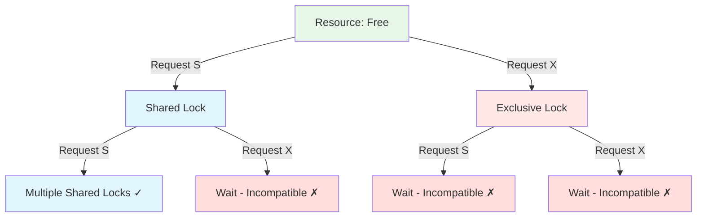
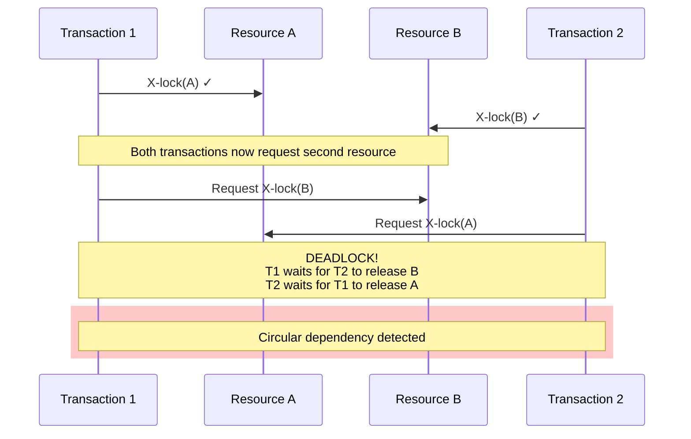
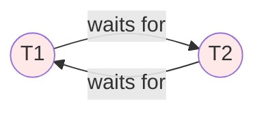
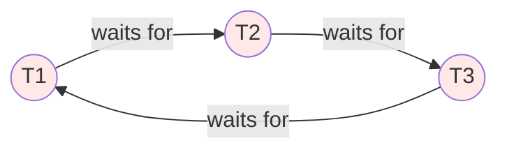
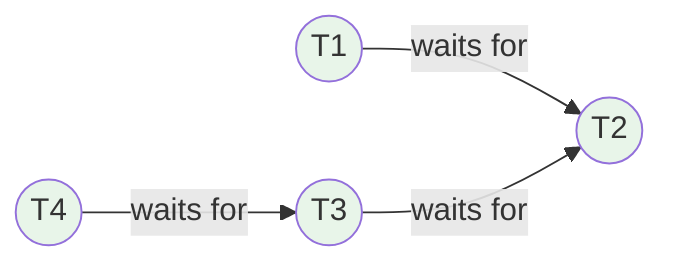
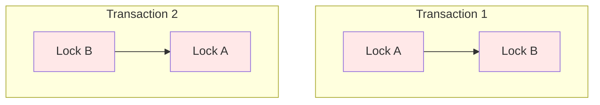
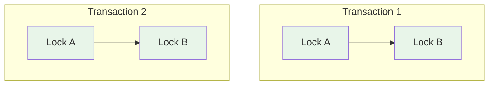

# Locking and Deadlocks

Locks are the primary mechanism for enforcing isolation in database systems. Understanding lock types, granularity, and deadlock handling is essential for database programming.

## Lock Types

### Shared Locks (S)

```
Purpose: Allow concurrent reads
Compatibility: Multiple transactions can hold S locks on same resource

T1: S-lock(A)  -- Granted
T2: S-lock(A)  -- Granted (compatible)
T1: Read A    -- OK
T2: Read A    -- OK

T3: X-lock(A)  -- Blocked (incompatible with S)
```

### Exclusive Locks (X)

```
Purpose: Exclusive access for writes
Compatibility: No other locks allowed

T1: X-lock(A)  -- Granted
T2: S-lock(A)  -- Blocked
T3: X-lock(A)  -- Blocked

Only T1 can access A until lock released
```

### Lock Compatibility Matrix

Lock compatibility determines whether two transactions can hold locks simultaneously:

| **Held** ↓ / **Requested** → | **None** | **Shared (S)** | **Exclusive (X)** |
|------------------------------|----------|----------------|-------------------|
| **None** | ✓ | ✓ | ✓ |
| **Shared (S)** | ✓ | ✓ | ✗ |
| **Exclusive (X)** | ✓ | ✗ | ✗ |

**Key rules**:
- Multiple **Shared** locks are compatible (multiple readers)
- **Exclusive** locks are incompatible with everything (single writer)
- No lock held: any lock can be granted



### Update Locks (U)

```
Purpose: Prevent deadlock in read-then-write pattern
Behavior: Like S initially, converts to X for write

T1: U-lock(A)  -- Granted
T2: S-lock(A)  -- Granted (U compatible with S)
T3: U-lock(A)  -- Blocked (only one U allowed)

T1: Convert U to X  -- T2 must release first

Prevents: S-S-X deadlock pattern
```

### Intent Locks

```
Purpose: Signal intention to lock at finer granularity
Types: IS (Intent Shared), IX (Intent Exclusive), SIX

Example hierarchy:
Database → Table → Page → Row

To X-lock a row:
1. IS-lock on database
2. IS-lock on table
3. IS-lock on page
4. X-lock on row

Other transactions know row-level locks exist
by checking intent locks at higher levels
```

## Lock Granularity

### Row-Level Locks

```sql
-- Lock specific rows
SELECT * FROM Accounts WHERE ID = 1 FOR UPDATE;
-- X-lock on row with ID=1

-- Other rows accessible
SELECT * FROM Accounts WHERE ID = 2;  -- Not blocked
```

### Page-Level Locks

```
Lock unit: Data page (typically 8KB)
Locks multiple rows at once

Pros:
- Less memory for lock management
- Good for range scans

Cons:
- May lock more than needed
- Reduces concurrency
```

### Table-Level Locks

```sql
-- Explicit table lock
LOCK TABLE Orders IN EXCLUSIVE MODE;

-- Implicit with DDL
ALTER TABLE Orders ADD COLUMN NewCol INT;
-- Requires table-level lock
```

### Granularity Trade-offs

```
Fine (Row)          Coarse (Table)
    ←─────────────────→

More concurrency    Less concurrency
More lock overhead  Less lock overhead
More memory         Less memory
Better for OLTP     Better for batch
```

### Lock Escalation

```
Process: Automatically convert many fine-grained locks to
         fewer coarse-grained locks

Example:
1000 row locks on TableA
  → Database escalates to 1 table lock

Threshold varies by DBMS:
- SQL Server: ~5000 locks per object
- Configurable in most systems

-- SQL Server: Disable escalation for table
ALTER TABLE MyTable SET (LOCK_ESCALATION = DISABLE);
```

## Two-Phase Locking (2PL)

### Protocol

```
Phase 1 (Growing): Acquire locks, never release
Phase 2 (Shrinking): Release locks, never acquire

Transaction:
┌────────────────────────────────────────┐
│ ←─ Growing Phase ─→│←─ Shrinking ─→    │
│  S(A) S(B) X(C)    │ U(C) U(A) U(B)    │
└────────────────────────────────────────┘
                   Lock Point
```

### Strict 2PL

```
Hold all locks until commit/abort
Most databases use this variant

Transaction:
┌────────────────────────────────────────┐
│ ←─ Growing Phase ─→│                   │
│  S(A) X(B) S(C)    │      COMMIT       │
│                    │    Release all    │
└────────────────────────────────────────┘

Guarantees:
- Serializability
- Cascadeless schedules (no cascading aborts)
```

### 2PL Drawback

```
2PL can cause deadlocks:

T1: X-lock(A), needs X-lock(B)
T2: X-lock(B), needs X-lock(A)

Both blocked → Deadlock

2PL guarantees serializability but not deadlock-freedom
```

## Deadlocks

### Definition and Example

**Circular wait**: T1 waits for T2, T2 waits for T1



**Timeline**:
1. T1 acquires lock on A ✓
2. T2 acquires lock on B ✓
3. T1 requests lock on B (waits for T2)
4. T2 requests lock on A (waits for T1)
5. **Deadlock**: circular wait detected

### Detection: Wait-For Graph

**Wait-for graph** is used to detect deadlocks:
- **Node** for each transaction
- **Edge** T1 → T2 if T1 waits for T2
- **Cycle** in graph = deadlock

**Example 1**: Simple deadlock (cycle detected)



$$\text{Cycle: } T1 \rightarrow T2 \rightarrow T1 \text{ (DEADLOCK!)}$$

**Example 2**: Complex deadlock (3 transactions)



$$\text{Cycle: } T1 \rightarrow T2 \rightarrow T3 \rightarrow T1 \text{ (DEADLOCK!)}$$

**Example 3**: No deadlock (no cycle)



No cycle detected - transactions will eventually complete

### Resolution: Victim Selection

```
When deadlock detected, abort one transaction (victim)

Criteria for victim selection:
1. Transaction age (younger = victim)
2. Amount of work done (less = victim)
3. Resources held (fewer = victim)
4. Priority settings

-- SQL Server: Set deadlock priority
SET DEADLOCK_PRIORITY LOW;  -- Make this session victim
SET DEADLOCK_PRIORITY HIGH; -- Protect this session
```

### Prevention Strategies

**1. Lock ordering**: Always acquire locks in same order

**Bad** (deadlock possible):


**Good** (no deadlock):


Both transactions follow the same order (alphabetical): A then B

**2. Lock timeout**: Give up waiting after timeout
```sql
SET LOCK_TIMEOUT 5000;  -- 5 seconds
```

**3. Nowait**: Fail immediately if lock unavailable
```sql
SELECT * FROM Orders FOR UPDATE NOWAIT;
```

**4. Try-lock pattern**:
```sql
IF TRY_LOCK(resource)
  -- Got lock, proceed
ELSE
  -- Retry later or different approach
```

### Deadlock in Practice

```sql
-- SQL Server: View deadlock information
SELECT * FROM sys.dm_tran_locks;
SELECT * FROM sys.dm_os_waiting_tasks;

-- Enable deadlock trace
DBCC TRACEON (1204, 1222, -1);

-- PostgreSQL: View locks
SELECT * FROM pg_locks;
SELECT * FROM pg_stat_activity WHERE waiting = true;

-- MySQL: View engine status
SHOW ENGINE INNODB STATUS;
```

## Optimistic Locking

### Concept

```
No locks during transaction
Check for conflicts at commit time
Abort and retry if conflict detected

Good when:
- Read-heavy workload
- Low conflict probability
- Retries acceptable
```

### Version-Based Implementation

```sql
-- Add version column
ALTER TABLE Products ADD Version INT DEFAULT 1;

-- Read (no lock)
SELECT ProductID, Name, Price, Version
FROM Products WHERE ProductID = 1;
-- Returns: (1, 'Widget', 10.00, 5)

-- Application modifies data...

-- Write with version check
UPDATE Products
SET Name = 'New Widget', Price = 12.00, Version = Version + 1
WHERE ProductID = 1 AND Version = 5;

-- Check result
IF @@ROWCOUNT = 0 THEN
    -- Conflict: another transaction modified the row
    -- Retry transaction
END IF;
```

### Timestamp-Based

```sql
-- Use last-modified timestamp
ALTER TABLE Products ADD LastModified TIMESTAMP;

-- Read
SELECT *, LastModified FROM Products WHERE ID = 1;

-- Update
UPDATE Products
SET Name = 'New Name', LastModified = CURRENT_TIMESTAMP
WHERE ID = 1 AND LastModified = @original_timestamp;
```

## Lock Hints (SQL Server)

### Common Hints

```sql
-- NOLOCK: Read without acquiring locks
SELECT * FROM Orders WITH (NOLOCK);
-- May read uncommitted data (dirty read)

-- ROWLOCK: Force row-level locking
UPDATE Orders WITH (ROWLOCK)
SET Status = 'Shipped' WHERE OrderID = 1;

-- UPDLOCK: Acquire update lock for read
SELECT * FROM Inventory WITH (UPDLOCK)
WHERE ProductID = 1;
-- Prevents others from getting update lock

-- XLOCK: Acquire exclusive lock for read
SELECT * FROM Accounts WITH (XLOCK)
WHERE AccountID = 1;
-- Full exclusive access

-- HOLDLOCK: Hold lock until transaction ends
SELECT * FROM Orders WITH (HOLDLOCK)
WHERE CustomerID = 5;
-- Equivalent to SERIALIZABLE for this table
```

### PostgreSQL Locking

```sql
-- Row-level locks
SELECT * FROM accounts WHERE id = 1 FOR UPDATE;
SELECT * FROM accounts WHERE id = 1 FOR SHARE;
SELECT * FROM accounts WHERE id = 1 FOR NO KEY UPDATE;
SELECT * FROM accounts WHERE id = 1 FOR KEY SHARE;

-- Skip locked rows
SELECT * FROM tasks WHERE status = 'pending'
FOR UPDATE SKIP LOCKED
LIMIT 1;
-- Great for task queues
```

## Best Practices

### Minimize Lock Duration

```sql
-- Bad: Long transaction holds locks
BEGIN;
SELECT * FROM inventory FOR UPDATE;
-- Complex processing taking 30 seconds...
UPDATE inventory SET ...;
COMMIT;

-- Better: Prepare outside transaction
-- Calculate everything first
DECLARE @new_quantity INT = ...;

BEGIN;
UPDATE inventory SET quantity = @new_quantity WHERE id = @id;
COMMIT;
```

### Consistent Lock Ordering

```sql
-- Define ordering (e.g., by table name, then primary key)

-- Both transactions use same order:
BEGIN;
LOCK accounts IN ACCESS EXCLUSIVE MODE;
LOCK orders IN ACCESS EXCLUSIVE MODE;
-- Operations...
COMMIT;
```

### Monitor and Alert

```sql
-- Create alert for long-running locks
SELECT
    blocking.pid AS blocking_pid,
    blocking.query AS blocking_query,
    blocked.pid AS blocked_pid,
    blocked.query AS blocked_query,
    now() - blocked.query_start AS blocked_duration
FROM pg_stat_activity blocked
JOIN pg_stat_activity blocking
    ON blocking.pid = ANY(pg_blocking_pids(blocked.pid))
WHERE blocked.wait_event_type = 'Lock';
```

