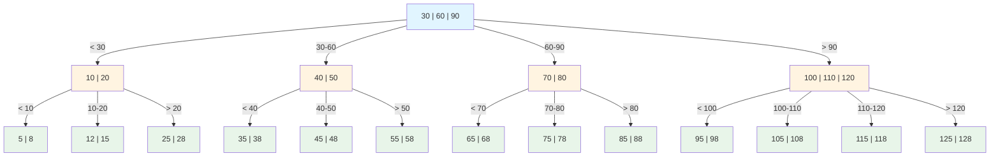
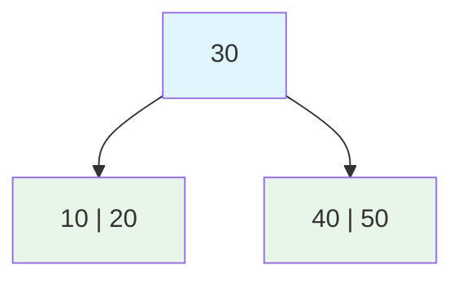
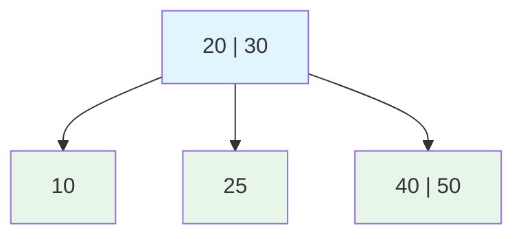
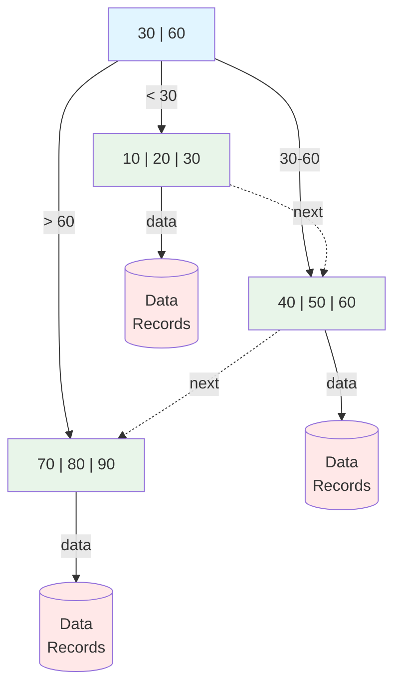

# B-Tree Structure

B-trees are the most important data structure in database systems. Understanding their structure and operations is fundamental to database performance tuning.

## B-Tree Properties

### Definition

A B-tree of order m (minimum degree t) has these properties:

```
1. Every node has at most m children
2. Every non-leaf node (except root) has at least ⌈m/2⌉ children
3. Root has at least 2 children (if not leaf)
4. All leaves appear at the same level
5. A non-leaf node with k children contains k-1 keys
```

### Example Structure

B-tree of order 4 (max 4 children, 3 keys per node):



Key properties:
- **Blue node**: Root (internal node with keys and pointers)
- **Orange nodes**: Internal nodes (guide searches, contain keys)
- **Green nodes**: Leaf nodes (contain actual data pointers)
- All leaves appear at the same level (balanced)

### Why B-Trees for Databases

Disk-optimized structure:
- Node size matches disk page (4KB, 8KB, 16KB)
- Minimizes disk I/O
- High fanout reduces tree height

**Example calculation**:
- Page size: 8KB
- Key size: 8 bytes
- Pointer size: 8 bytes
- Keys per node: ~500

For 1 billion rows:
$$\text{Height} = \log_{500}(1,000,000,000) \approx 4$$

**Only 4 disk reads to find any row!**

Comparison with binary tree:
$$\text{Binary tree height} = \log_2(1,000,000,000) \approx 30 \text{ disk reads}$$

## B-Tree Operations

### Search

```
Search for key K in B-tree:

1. Start at root
2. For current node:
   - Find position where K would be
   - If K found, return
   - If at leaf, K not in tree
   - Otherwise, follow appropriate child pointer
3. Repeat until found or leaf reached

Time complexity: O(log n)
Disk reads: O(height) = O(log_m n)
```

### Search Example

```
Search for 45:

        [30|60]
       /   |   \
  [10|20] [40|50] [70|80]

Step 1: Root [30|60]
  30 < 45 < 60 → follow middle pointer

Step 2: Node [40|50]
  40 < 45 < 50 → if leaf, check data
  45 not found

If we had [40|45|50], 45 would be found
```

### Insert

```
Insert key K:

1. Search for leaf where K should go
2. If leaf has room, insert K in sorted position
3. If leaf is full (overflow):
   a. Split leaf into two nodes
   b. Move median key up to parent
   c. If parent overflows, recursively split

This maintains balance—tree grows from root
```

### Insert Example

Insert 25 into B-tree (order 3, max 2 keys per node):

**Before insertion**:


**Step 1**: Find leaf for 25 → goes to [10|20]

**Step 2**: Insert 25 → [10|20|25] **OVERFLOW!** (max 2 keys)

**Step 3**: Split and promote median (20):



Tree maintains balance - all leaves at same level

### Delete

```
Delete key K:

Case 1: K in leaf with enough keys
  Simply remove K

Case 2: K in leaf at minimum
  Borrow from sibling or merge nodes

Case 3: K in internal node
  Replace with predecessor/successor
  Then delete from leaf

Ensures minimum fill maintained
```

### Delete Example

```
Delete 30 from:

       [20|30]
      /   |   \
   [10] [25] [40|50]

Step 1: 30 is in internal node
Step 2: Replace with predecessor (25) or successor (40)
Step 3: Using predecessor:

       [20|25]
      /   |   \
   [10] [EMPTY] [40|50]

Step 4: Handle underflow by merging or redistribution
```

## B+ Trees

### Structure

B+ tree: Variant used by most databases

Key differences from B-tree:
1. All data pointers in leaves only
2. Internal nodes contain only keys (guides)
3. Leaves linked in sorted order
4. Keys may be duplicated in internal nodes



- **Blue**: Internal nodes (keys only, no data)
- **Green**: Leaf nodes (keys + data pointers)
- **Red**: Actual data records
- **Dashed arrows**: Linked list for range scans

### B+ Tree Advantages

```
1. More keys per internal node
   - Higher fanout
   - Lower tree height
   - Fewer disk reads for searches

2. Sequential access efficient
   - Leaves linked
   - Range queries traverse leaf chain
   - No need to revisit internal nodes

3. Consistent leaf access
   - Every search reaches leaf
   - Predictable I/O
```

### Range Query Optimization

```
B+ tree range query: WHERE Age BETWEEN 25 AND 35

       [30|60]
      /   |   \
 [10|20|25] → [30|32|35] → [40|50|55] → [60|70|80]

1. Search for 25 → reach first leaf
2. Scan leaf chain until 35
3. Follow links, no internal node access

B-tree would require:
- Multiple tree traversals
- Or complex in-order traversal
```

## Database Implementation Details

### Node Structure

```
Page/Block Layout (8KB example):

┌─────────────────────────────────────────┐
│ Header (24 bytes)                       │
│  - Page type, level, entry count        │
│  - Previous/next page pointers          │
├─────────────────────────────────────────┤
│ Entry 1: [Key1 (varies)] [Pointer1 (8)] │
│ Entry 2: [Key2 (varies)] [Pointer2 (8)] │
│ ...                                     │
│ Entry N: [KeyN (varies)] [PointerN (8)] │
├─────────────────────────────────────────┤
│ Free Space                              │
└─────────────────────────────────────────┘

Entries may be fixed or variable length
```

### Fill Factor

```
Fill factor: How full to make pages on creation

Fill factor 100%:
[A|B|C|D|E|F|G|H]  ← Page full
Insert I → Split immediately!

Fill factor 70%:
[A|B|C|D|E|  |  |  ]  ← 30% free
Insert F, G, H → No splits needed

Trade-off:
- High fill: Better read performance, more splits
- Low fill: Better insert performance, more space
```

### Leaf vs Internal Nodes

```
Internal Node:
┌─────────────────────────────────────┐
│ P0 | K1 | P1 | K2 | P2 | K3 | P3   │
└─────────────────────────────────────┘
  ↓     ↓     ↓     ↓
 <K1  K1-K2  K2-K3  ≥K3

Leaf Node (B+ tree):
┌─────────────────────────────────────────────┐
│ K1|RID1 | K2|RID2 | K3|RID3 | ... | Next→  │
└─────────────────────────────────────────────┘
  RID = Row Identifier (page, slot)
```

## B-Tree Variations

### B* Tree

```
More aggressive balancing:
- Minimum 2/3 full (vs 1/2 for B-tree)
- Delay splits by redistributing to siblings
- Better space utilization
- More complex algorithms
```

### Bulk Loading

```
Building B-tree from scratch (sorted data):

1. Sort input data
2. Create leaf pages left-to-right
3. Build internal nodes bottom-up

Much faster than individual inserts
Used in: CREATE INDEX, database restore
```

### Concurrent B-Trees

```
Challenge: Multiple transactions accessing tree

Naive: Lock entire tree
  - Terrible concurrency

B-link trees:
  - Add sibling pointers at each level
  - Allows concurrent search during split
  - Only lock current and parent node

Latch crabbing:
  - Acquire child latch before releasing parent
  - Safe traversal without full locks
```

## Performance Characteristics

### Complexity Analysis

| Operation | Time Complexity | Disk I/O |
|-----------|----------------|----------|
| Search | $O(\log n)$ | $O(\log_m n)$ |
| Insert | $O(\log n)$ | $O(\log_m n)$ |
| Delete | $O(\log n)$ | $O(\log_m n)$ |
| Range($k$) | $O(\log n + k)$ | $O(\log_m n + k/m)$ |

Where:
- $n$ = number of records
- $m$ = branching factor (keys per node)
- $k$ = number of results in range

### Typical Heights

```
Records     | Fanout 100 | Fanout 500
------------|------------|------------
10,000      | 3 levels   | 2 levels
1,000,000   | 4 levels   | 3 levels
100,000,000 | 5 levels   | 4 levels
10 billion  | 6 levels   | 5 levels

Most database queries: 2-4 disk reads for index lookup
```

### Space Requirements

**Index overhead calculation**:

Given:
- Key size: 8 bytes (INT64)
- Pointer size: 8 bytes
- Node overhead: 24 bytes
- Page size: 8192 bytes

Calculations:
$$\text{Usable space} = 8192 - 24 = 8168 \text{ bytes}$$
$$\text{Entries per leaf} = \frac{8168}{8 + 8} \approx 510$$

For 1M rows:
$$\text{Leaf pages} = \frac{1,000,000}{510} \approx 2000 \text{ pages}$$
$$\text{Internal pages} = \frac{2000}{510} \approx 4 \text{ pages} + 1 \text{ root}$$
$$\text{Total} \approx 2005 \text{ pages} \approx 16 \text{ MB}$$

**Index size** $\approx$ 2% of data size (for this example)

