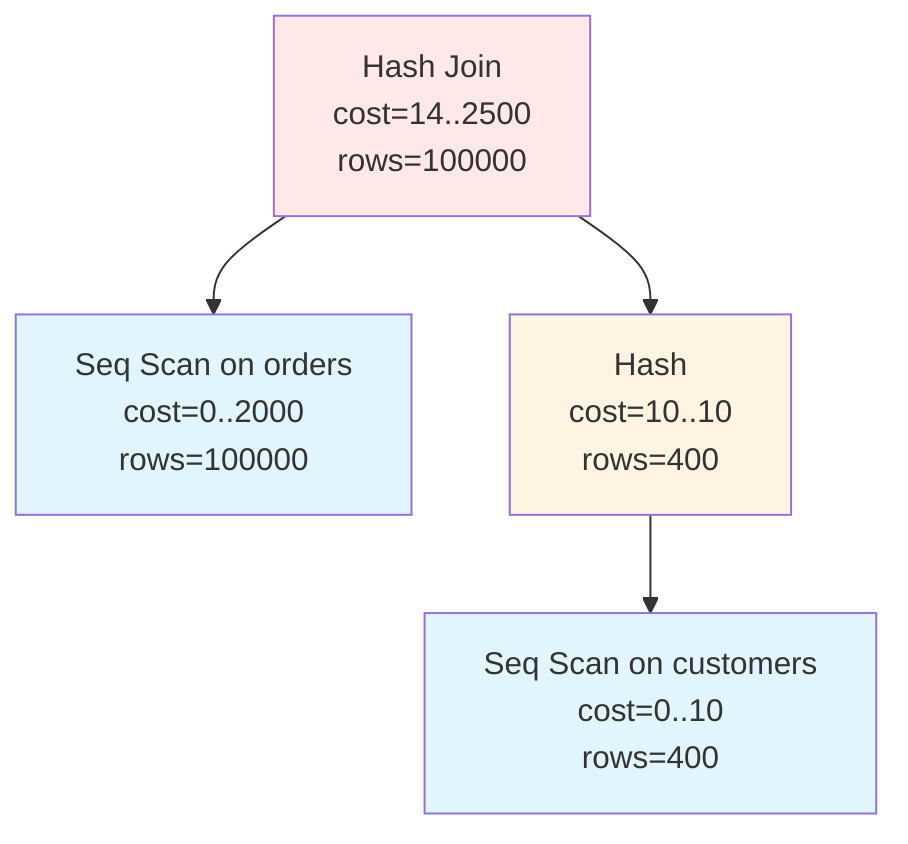
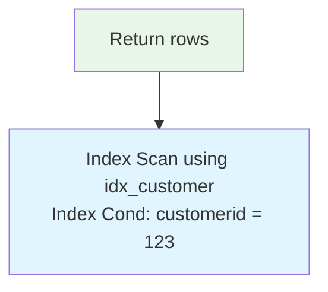
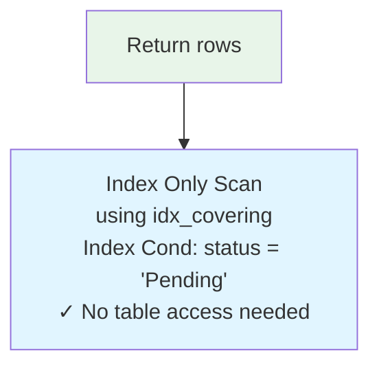
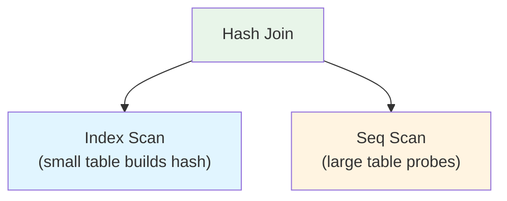
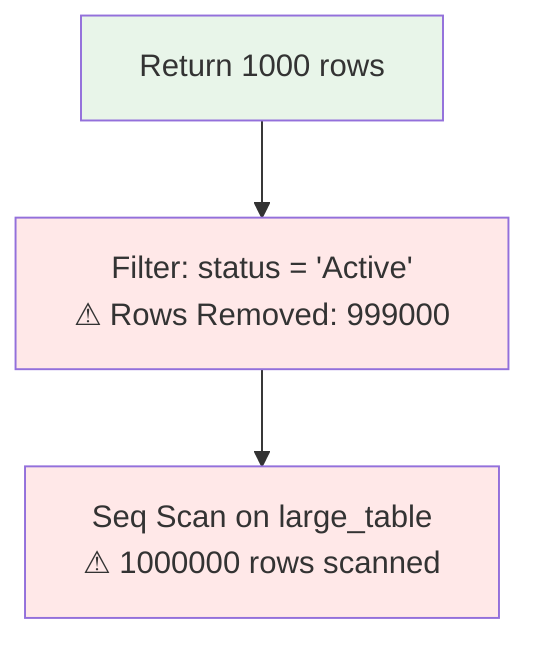
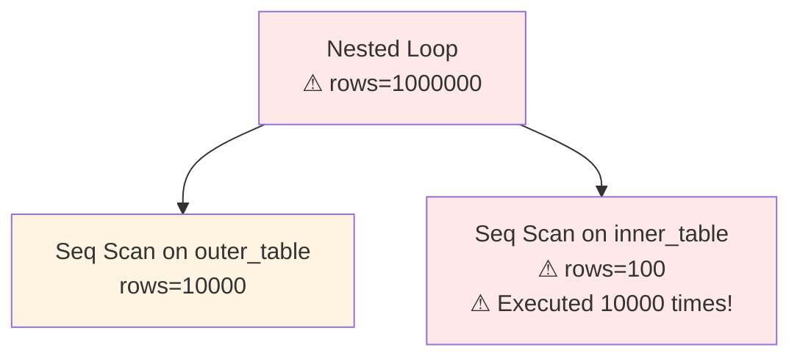
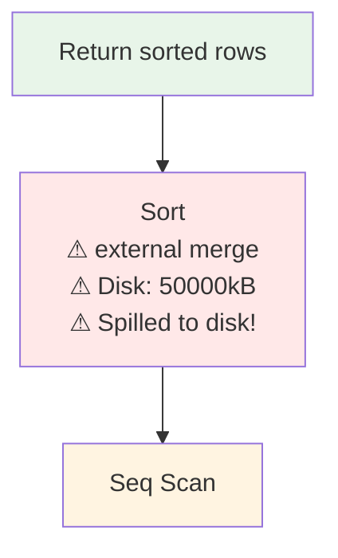
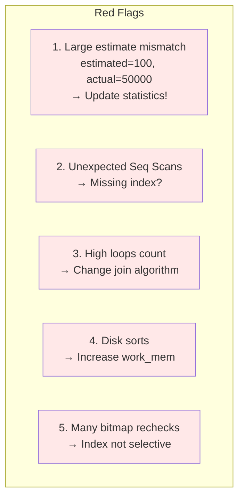
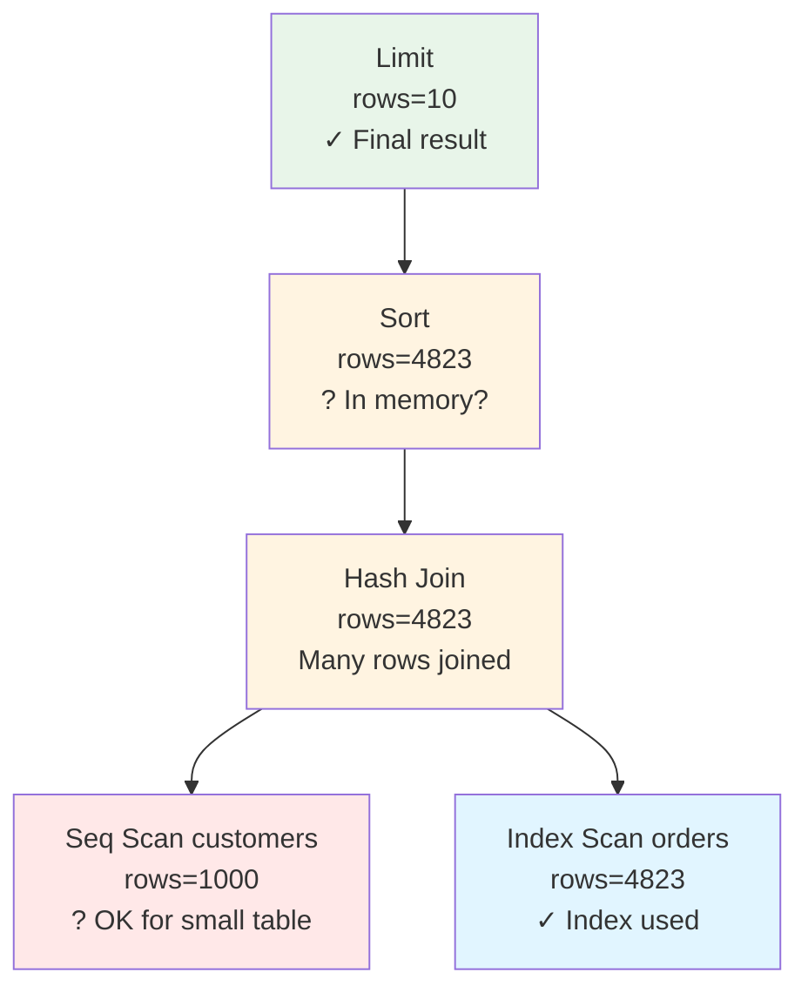

# Execution Plans

Execution plans reveal how the database executes queries. Reading and understanding plans is essential for performance troubleshooting.

## Viewing Execution Plans

### EXPLAIN Command

```sql
-- Basic plan (no execution)
EXPLAIN SELECT * FROM Orders WHERE CustomerID = 123;

-- Plan with execution statistics
EXPLAIN ANALYZE SELECT * FROM Orders WHERE CustomerID = 123;

-- PostgreSQL: Detailed output
EXPLAIN (ANALYZE, BUFFERS, FORMAT TEXT)
SELECT * FROM Orders WHERE CustomerID = 123;

-- MySQL
EXPLAIN SELECT * FROM Orders WHERE CustomerID = 123;
EXPLAIN FORMAT=JSON SELECT ...;

-- SQL Server
SET SHOWPLAN_TEXT ON;
-- or graphical plan in SSMS
```

### Plan Output Formats

```sql
-- PostgreSQL text format
EXPLAIN SELECT * FROM Employees WHERE DeptID = 10;

Seq Scan on employees  (cost=0.00..12.50 rows=5 width=44)
  Filter: (deptid = 10)

-- JSON format (more detail)
EXPLAIN (FORMAT JSON) SELECT ...;

-- XML format
EXPLAIN (FORMAT XML) SELECT ...;
```

## Reading Plan Components

### Cost Estimates

```
Seq Scan on orders  (cost=0.00..1250.00 rows=50000 width=100)
                         │        │        │        │
                   startup cost    │    estimated    │
                              total cost    rows    row width

startup cost: Time before first row returned
total cost: Time for all rows (in arbitrary units)
rows: Estimated row count
width: Average row size in bytes
```

### Actual vs Estimated

```sql
EXPLAIN ANALYZE SELECT * FROM Orders WHERE Status = 'Pending';

Seq Scan on orders  (cost=0.00..1250.00 rows=50 width=100)
                    (actual time=0.015..15.234 rows=4823 loops=1)
                              │          │        │        │
                         first row   total time  actual  iterations
                            time                  rows

-- rows=50 estimated vs rows=4823 actual
-- Significant misestimate! Statistics may be stale
```

### Plan Node Types

```
Common Scan Nodes:
- Seq Scan: Sequential table scan
- Index Scan: Index lookup + table fetch
- Index Only Scan: Index-only (covering)
- Bitmap Index Scan: Build row bitmap from index
- Bitmap Heap Scan: Fetch rows from bitmap

Common Join Nodes:
- Nested Loop: For each outer row, scan inner
- Hash Join: Build hash table, probe
- Merge Join: Merge sorted inputs

Other Nodes:
- Sort: External/in-memory sort
- Aggregate: Grouping/aggregation
- Limit: Row count limit
- Gather: Parallel worker collection
```

## Plan Analysis

### Sequential Scan Analysis

```sql
EXPLAIN ANALYZE SELECT * FROM Orders WHERE Total > 1000;

Seq Scan on orders  (cost=0.00..22500.00 rows=75000 width=100)
                    (actual time=0.020..145.234 rows=78234 loops=1)
  Filter: (total > 1000)
  Rows Removed by Filter: 921766

-- Questions to ask:
-- 1. Is there an index on Total? Should there be?
-- 2. How many rows match? (78234/1000000 = 7.8%)
-- 3. At 7.8% selectivity, index might help
```

### Index Scan Analysis

```sql
EXPLAIN ANALYZE SELECT * FROM Orders WHERE CustomerID = 123;

Index Scan using idx_customer on orders
    (cost=0.43..8.45 rows=1 width=100)
    (actual time=0.025..0.030 rows=5 loops=1)
  Index Cond: (customerid = 123)

-- Very efficient:
-- - Low cost (8.45 vs potentially thousands)
-- - Index condition pushed down
-- - Few rows returned
```

### Join Analysis

```sql
EXPLAIN ANALYZE
SELECT c.Name, o.OrderDate
FROM Customers c
JOIN Orders o ON c.CustomerID = o.CustomerID;

Hash Join  (cost=14.00..2500.00 rows=100000 width=50)
           (actual time=1.234..89.456 rows=100000 loops=1)
  Hash Cond: (o.customerid = c.customerid)
  -> Seq Scan on orders o
       (cost=0.00..2000.00 rows=100000 width=16)
       (actual time=0.010..25.000 rows=100000 loops=1)
  -> Hash
       (cost=10.00..10.00 rows=400 width=42)
       (actual time=0.500..0.500 rows=400 loops=1)
     -> Seq Scan on customers c
          (cost=0.00..10.00 rows=400 width=42)
          (actual time=0.005..0.200 rows=400 loops=1)
```

**Visualized as a tree**:



**Reading the tree**:
1. Start at bottom: Scan customers (400 rows) and orders (100,000 rows)
2. Build hash table from customers (smaller table)
3. Probe hash table with orders
4. Result: 100,000 matched rows

## Common Plan Patterns

### Good Patterns

**Index Seek + Key Lookup**:



**Index Only Scan (covering index)**:



**Efficient Hash Join**:



### Warning Patterns

**Filter after Seq Scan** (missing index?):



**Nested Loop with large inner** (inefficient):



**Sort on large dataset** (memory spill):



### Performance Red Flags

**Watch for these warning signs**:



**Common issues and solutions**:

| **Issue** | **Symptom** | **Solution** |
|-----------|-------------|--------------|
| Stale statistics | Estimate mismatch | Run `ANALYZE` |
| Missing index | Seq Scan on large table | Create appropriate index |
| Wrong join type | Nested loop with large inner | Force hash/merge join |
| Memory pressure | External sort | Increase `work_mem` |
| Non-selective index | Bitmap recheck | Consider composite index |

## EXPLAIN Options

### PostgreSQL Options

```sql
-- ANALYZE: Actually execute query
EXPLAIN ANALYZE SELECT ...;

-- BUFFERS: Show buffer cache hits/misses
EXPLAIN (ANALYZE, BUFFERS) SELECT ...;
-- Output: Buffers: shared hit=100 read=50

-- TIMING: Include timing (default with ANALYZE)
EXPLAIN (ANALYZE, TIMING OFF) SELECT ...;

-- VERBOSE: Show output columns, table aliases
EXPLAIN VERBOSE SELECT ...;

-- COSTS: Show cost estimates (default ON)
EXPLAIN (COSTS OFF) SELECT ...;

-- SETTINGS: Show non-default settings
EXPLAIN (SETTINGS) SELECT ...;
```

### MySQL Options

```sql
-- Basic explain
EXPLAIN SELECT ...;

-- Extended information
EXPLAIN EXTENDED SELECT ...;

-- JSON format (more detail)
EXPLAIN FORMAT=JSON SELECT ...;

-- Analyze (MySQL 8.0+)
EXPLAIN ANALYZE SELECT ...;
```

### SQL Server Options

```sql
-- Estimated plan (no execution)
SET SHOWPLAN_TEXT ON;
SET SHOWPLAN_ALL ON;
SET SHOWPLAN_XML ON;

-- Actual plan (with execution)
SET STATISTICS PROFILE ON;
SET STATISTICS XML ON;

-- Live query statistics
-- Available in SSMS
```

## Plan Caching

### Query Plan Cache

```sql
-- PostgreSQL: View cached plans
SELECT * FROM pg_prepared_statements;

-- SQL Server: View plan cache
SELECT
    cp.plan_handle,
    st.text AS query_text,
    cp.usecounts,
    cp.size_in_bytes
FROM sys.dm_exec_cached_plans cp
CROSS APPLY sys.dm_exec_sql_text(cp.plan_handle) st;
```

### Parameter Sniffing

```sql
-- Problem: Plan optimized for first parameter value

-- First call: CustomerID = 1 (1000 orders)
-- Plan chosen: Hash Join

-- Later call: CustomerID = 999999 (5 orders)
-- Same plan used: Hash Join (overkill!)

-- Solutions:
-- 1. OPTION (RECOMPILE)
SELECT * FROM Orders WHERE CustomerID = @id OPTION (RECOMPILE);

-- 2. OPTIMIZE FOR hint
SELECT * FROM Orders WHERE CustomerID = @id
OPTION (OPTIMIZE FOR (@id = 1));

-- 3. Plan guides
```

## Practical Plan Reading

### Step-by-Step Analysis

**How to read execution plan trees**:
1. Start from bottom (data sources)
2. Move up through transformations
3. Note row count changes at each step
4. Check estimated vs actual

**Example analysis**:



**Questions to ask**:
- Why seq scan on customers? → Probably OK, small table (1000 rows)
- Is 4823 orders expected? → Check estimate vs actual
- Sort on 4823 rows → In memory or spilled to disk?
- Could we add `ORDER BY` to index to avoid sort?

### Documentation Template

```
Query: [Description]
Execution Time: X ms
Rows Returned: Y

Plan Summary:
- Primary access path: [Index/Seq scan on table]
- Join type: [Hash/Nested/Merge]
- Major operations: [Sort, Aggregate, etc.]

Bottlenecks Identified:
- [Description of slow operations]

Recommendations:
- [Index suggestions]
- [Query rewrites]
- [Configuration changes]
```

