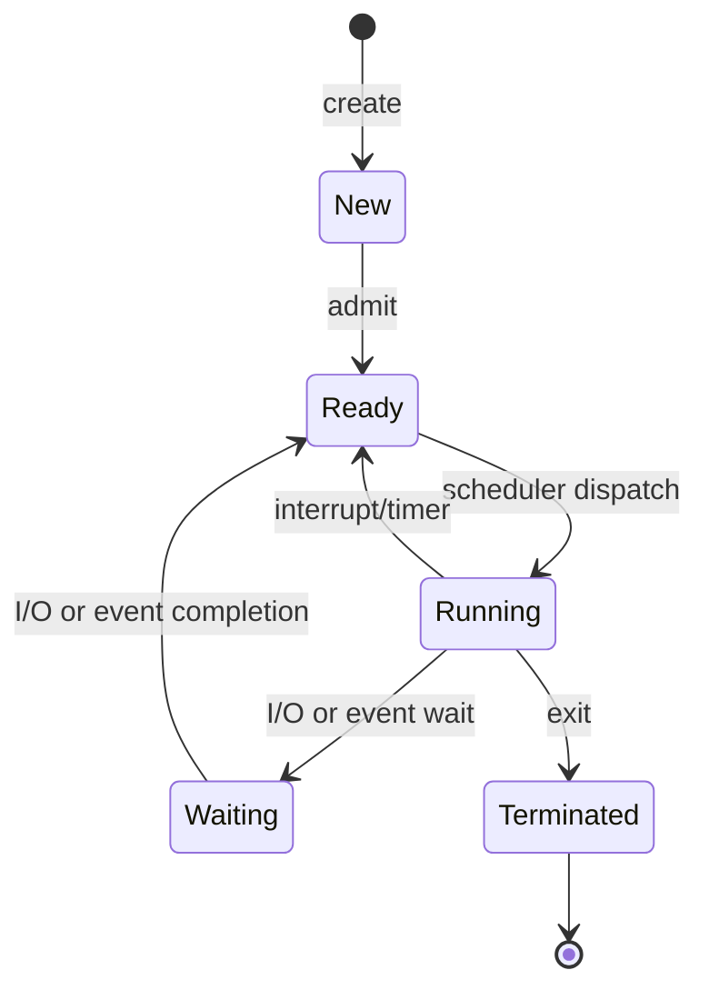

# The Process Concept

Understanding what a process is and how it differs from a program is fundamental to operating systems. This subtopic explores the process abstraction and its lifecycle.

## What is a Process?

A **process** is a program in execution. While a program is a passive entity—a file containing instructions stored on disk—a process is an active entity with a program counter specifying the next instruction to execute and a set of associated resources.

### Process Memory Layout

A process in memory consists of multiple sections:

```
+------------------+  High Address
|      Stack       |  ← Function calls, local variables
|        ↓         |
|                  |
|        ↑         |
|       Heap       |  ← Dynamically allocated memory
+------------------+
|       Data       |  ← Global variables
+------------------+
|       Text       |  ← Program code
+------------------+  Low Address
```

**Text Section**: Contains the executable code. This section is typically read-only and shared among processes running the same program.

**Data Section**: Contains global and static variables. Divided into initialized data (variables with explicit initial values) and uninitialized data (BSS segment, initialized to zero).

**Heap**: Used for dynamic memory allocation during runtime. Grows upward toward higher addresses as memory is allocated with `malloc()` or `new`.

**Stack**: Contains temporary data such as function parameters, return addresses, and local variables. Grows downward toward lower addresses as functions are called.

## Process States

During its lifetime, a process transitions through several states:



### State Descriptions

**New**: The process is being created. The operating system allocates resources and initializes data structures.

**Ready**: The process is waiting to be assigned to a processor. All processes in this state are maintained in a ready queue.

**Running**: Instructions are being executed. On a single-processor system, only one process can be in this state at a time.

**Waiting (Blocked)**: The process is waiting for some event to occur, such as I/O completion, signal receipt, or synchronization with another process.

**Terminated**: The process has finished execution. The operating system reclaims resources but may retain some information (exit status) for the parent process.

## Process vs Program

| Aspect | Program | Process |
|--------|---------|---------|
| Nature | Passive entity | Active entity |
| Storage | Stored on disk | Resides in memory |
| Lifetime | Permanent until deleted | Temporary, exists during execution |
| Components | Code and data | Code, data, stack, heap, PCB |
| Multiple instances | Same program | Can create multiple processes |

A single program can have multiple processes. For example, multiple users running the same text editor creates multiple processes, each with its own process state and memory allocation, but all sharing the same text section.

## Process Creation

Processes are created through system calls. In Unix/Linux:

```c
#include <unistd.h>
#include <stdio.h>

int main() {
    pid_t pid = fork();  // Create child process

    if (pid < 0) {
        // Fork failed
        perror("Fork failed");
        return 1;
    } else if (pid == 0) {
        // Child process
        printf("Child: PID = %d, Parent PID = %d\n",
               getpid(), getppid());
        execlp("/bin/ls", "ls", NULL);  // Replace with new program
    } else {
        // Parent process
        printf("Parent: PID = %d, Child PID = %d\n",
               getpid(), pid);
        wait(NULL);  // Wait for child to complete
    }
    return 0;
}
```

### fork() System Call

The `fork()` system call creates a new process by duplicating the calling process:
- Child gets copy of parent's address space
- Both processes continue execution after fork
- fork() returns 0 to child, child's PID to parent, -1 on error

### exec() Family

The `exec()` family of functions replaces the current process image with a new program:
- `execl()`, `execv()`, `execle()`, `execve()`, etc.
- Old process image is destroyed
- PID remains the same

## Process Termination

Processes terminate voluntarily by calling `exit()` or involuntarily when killed:

```c
// Voluntary termination
exit(0);  // Normal termination with success status

// Parent waiting for child
int status;
pid_t child_pid = wait(&status);
if (WIFEXITED(status)) {
    printf("Child exited with status %d\n", WEXITSTATUS(status));
}
```

### Orphan and Zombie Processes

**Zombie Process**: A process that has terminated but whose parent hasn't called `wait()`. The PCB remains to hold exit status.

**Orphan Process**: A process whose parent terminated before it. Orphans are adopted by the init process (PID 1).

## Summary

The process is the fundamental unit of execution in an operating system:
- Processes have distinct memory regions: text, data, heap, and stack
- Processes transition through states: new, ready, running, waiting, terminated
- Programs become processes when loaded into memory and executed
- Processes are created with fork() and can load new programs with exec()
- Proper termination handling prevents zombie and orphan processes
