# First-Come First-Served and Shortest Job First

FCFS and SJF are fundamental scheduling algorithms. This subtopic covers their implementation, characteristics, and analysis.

## First-Come, First-Served (FCFS)

The simplest scheduling algorithm: processes are served in arrival order.

### FCFS Implementation

```c
typedef struct {
    int pid;
    int arrival_time;
    int burst_time;
    int completion_time;
    int waiting_time;
    int turnaround_time;
} Process;

void fcfs_schedule(Process* processes, int n) {
    // Sort by arrival time
    qsort(processes, n, sizeof(Process), compare_arrival);

    int current_time = 0;

    for (int i = 0; i < n; i++) {
        // If CPU is idle, advance to process arrival
        if (current_time < processes[i].arrival_time) {
            current_time = processes[i].arrival_time;
        }

        processes[i].completion_time = current_time + processes[i].burst_time;
        processes[i].turnaround_time = processes[i].completion_time - processes[i].arrival_time;
        processes[i].waiting_time = processes[i].turnaround_time - processes[i].burst_time;

        current_time = processes[i].completion_time;
    }
}
```

### FCFS Example

| Process | Arrival | Burst |
|---------|---------|-------|
| P1 | 0 | 24 |
| P2 | 1 | 3 |
| P3 | 2 | 3 |

```mermaid
gantt
    title FCFS Scheduling
    dateFormat X
    axisFormat %s

    section CPU
    P1 :0, 24
    P2 :24, 27
    P3 :27, 30
```



**Calculation Formulas:**

For each process $i$:
- Waiting Time: $W_i = T_{start} - T_{arrival}$
- Turnaround Time: $TAT_i = T_{completion} - T_{arrival}$

Results:
- P1: $W = 0 - 0 = 0$, $TAT = 24 - 0 = 24$
- P2: $W = 24 - 1 = 23$, $TAT = 27 - 1 = 26$
- P3: $W = 27 - 2 = 25$, $TAT = 30 - 2 = 28$

Average Metrics:

$$\bar{W} = \frac{0 + 23 + 25}{3} = 16 \text{ ms}$$

$$\overline{TAT} = \frac{24 + 26 + 28}{3} = 26 \text{ ms}$$

### FCFS Characteristics

**Advantages:**
- Simple to implement
- No starvation
- Non-preemptive (good for batch)

**Disadvantages:**
- Convoy effect: Short processes wait for long ones
- Poor average waiting time
- Not suitable for time-sharing

## Shortest Job First (SJF)

Select the process with the smallest next CPU burst.

### Non-preemptive SJF

```c
void sjf_nonpreemptive(Process* processes, int n) {
    int completed = 0;
    int current_time = 0;
    bool* done = calloc(n, sizeof(bool));

    while (completed < n) {
        int shortest = -1;
        int min_burst = INT_MAX;

        // Find shortest job that has arrived
        for (int i = 0; i < n; i++) {
            if (!done[i] && processes[i].arrival_time <= current_time) {
                if (processes[i].burst_time < min_burst) {
                    min_burst = processes[i].burst_time;
                    shortest = i;
                }
            }
        }

        if (shortest == -1) {
            current_time++;  // CPU idle
            continue;
        }

        processes[shortest].completion_time = current_time + processes[shortest].burst_time;
        processes[shortest].turnaround_time =
            processes[shortest].completion_time - processes[shortest].arrival_time;
        processes[shortest].waiting_time =
            processes[shortest].turnaround_time - processes[shortest].burst_time;

        current_time = processes[shortest].completion_time;
        done[shortest] = true;
        completed++;
    }

    free(done);
}
```

### Non-preemptive SJF Example

| Process | Arrival | Burst |
|---------|---------|-------|
| P1 | 0 | 7 |
| P2 | 2 | 4 |
| P3 | 4 | 1 |
| P4 | 5 | 4 |

```mermaid
gantt
    title Non-preemptive SJF Scheduling
    dateFormat X
    axisFormat %s

    section CPU
    P1 :0, 7
    P3 :7, 8
    P2 :8, 12
    P4 :12, 16
```



At $t=7$: P1 completes. Available: P2 (burst 4), P3 (burst 1) → Select P3 (shortest)

At $t=8$: P3 completes. Available: P2 (burst 4), P4 (burst 4) → Select P2 (arrived first)

Results:
- P1: $W = 0$, $TAT = 7$
- P2: $W = 8 - 2 = 6$, $TAT = 12 - 2 = 10$
- P3: $W = 7 - 4 = 3$, $TAT = 8 - 4 = 4$
- P4: $W = 12 - 5 = 7$, $TAT = 16 - 5 = 11$

$$\bar{W} = \frac{0 + 6 + 3 + 7}{4} = 4 \text{ ms}$$

$$\overline{TAT} = \frac{7 + 10 + 4 + 11}{4} = 8 \text{ ms}$$

### Shortest Remaining Time First (SRTF)

Preemptive version of SJF:

```c
void srtf_schedule(Process* processes, int n) {
    int* remaining = malloc(n * sizeof(int));
    for (int i = 0; i < n; i++) {
        remaining[i] = processes[i].burst_time;
    }

    int completed = 0;
    int current_time = 0;
    int shortest = -1;

    while (completed < n) {
        int min_remaining = INT_MAX;
        shortest = -1;

        // Find process with shortest remaining time
        for (int i = 0; i < n; i++) {
            if (processes[i].arrival_time <= current_time &&
                remaining[i] > 0 &&
                remaining[i] < min_remaining) {
                min_remaining = remaining[i];
                shortest = i;
            }
        }

        if (shortest == -1) {
            current_time++;
            continue;
        }

        remaining[shortest]--;
        current_time++;

        if (remaining[shortest] == 0) {
            processes[shortest].completion_time = current_time;
            processes[shortest].turnaround_time =
                processes[shortest].completion_time - processes[shortest].arrival_time;
            processes[shortest].waiting_time =
                processes[shortest].turnaround_time - processes[shortest].burst_time;
            completed++;
        }
    }

    free(remaining);
}
```

### SRTF Example

| Process | Arrival | Burst |
|---------|---------|-------|
| P1 | 0 | 8 |
| P2 | 1 | 4 |
| P3 | 2 | 9 |
| P4 | 3 | 5 |

Gantt Chart:
```
|P1|-- P2 --|-- P4 --|---- P1 ----|---- P3 ----|
0  1        5       10           17           26
```

- At t=0: P1 starts (only arrived)
- At t=1: P2 arrives with burst 4 < remaining 7, preempts P1
- At t=5: P4 (burst 5) < P1 (remaining 7) and P3 (burst 9)
- At t=10: P1 (remaining 7) < P3 (remaining 9)
- At t=17: P3 runs

Results:
- Average Wait = 6.5, Average Turnaround = 13

## Burst Time Estimation

SJF requires knowing burst time in advance. Use **exponential averaging** to predict the next CPU burst:

$$\tau_{n+1} = \alpha \cdot t_n + (1 - \alpha) \cdot \tau_n$$

Where:
- $\tau_{n+1}$ = predicted next burst
- $t_n$ = actual length of $n$th CPU burst
- $\tau_n$ = predicted value for $n$th burst
- $\alpha$ = weighting factor ($0 \leq \alpha \leq 1$), typically $\alpha = 0.5$

**Expanding the formula:**

$$\tau_{n+1} = \alpha \cdot t_n + (1-\alpha) \alpha \cdot t_{n-1} + (1-\alpha)^2 \alpha \cdot t_{n-2} + \ldots + (1-\alpha)^n \alpha \cdot t_0 + (1-\alpha)^{n+1} \tau_0$$

```c
double estimate_next_burst(double actual_burst, double previous_estimate, double alpha) {
    return alpha * actual_burst + (1 - alpha) * previous_estimate;
}

// Example with α = 0.5
double alpha = 0.5;
double estimate = 10;  // Initial guess τ₀

// After bursts: 6, 4, 6, 4, 13, 13, 13
// τ₁ = 0.5×6  + 0.5×10 = 8
// τ₂ = 0.5×4  + 0.5×8  = 6
// τ₃ = 0.5×6  + 0.5×6  = 6
// τ₄ = 0.5×4  + 0.5×6  = 5
// τ₅ = 0.5×13 + 0.5×5  = 9
// τ₆ = 0.5×13 + 0.5×9  = 11
// τ₇ = 0.5×13 + 0.5×11 = 12
```

## Comparison

| Metric | FCFS | SJF (Non-preemptive) | SRTF |
|--------|------|----------------------|------|
| Optimal for waiting time | No | Yes (if all arrive at once) | Yes |
| Starvation possible | No | Yes | Yes |
| Preemption overhead | None | None | Yes |
| Implementation | Simple | Moderate | Complex |
| Burst prediction | Not needed | Needed | Needed |

## Summary

FCFS and SJF represent fundamental scheduling approaches:
- FCFS is simple but suffers from convoy effect
- SJF minimizes average waiting time
- SRTF preempts for even shorter processes
- SJF requires burst time prediction
- Both non-preemptive versions are unsuitable for interactive systems
