# Round Robin Scheduling

Round Robin (RR) is a preemptive scheduling algorithm designed for time-sharing systems. This subtopic covers RR implementation, time quantum selection, and performance analysis.

## Round Robin Concept

Each process gets a small unit of CPU time (time quantum), typically 10-100 ms. After the quantum expires, the process is preempted and added to the end of the ready queue.

```
Ready Queue (circular):
    ┌───┐   ┌───┐   ┌───┐   ┌───┐
    │ P1│ → │ P2│ → │ P3│ → │ P4│ ─┐
    └───┘   └───┘   └───┘   └───┘  │
      ↑                            │
      └────────────────────────────┘
```

## Round Robin Implementation

```c
#include <stdio.h>
#include <stdlib.h>
#include <stdbool.h>

typedef struct {
    int pid;
    int arrival_time;
    int burst_time;
    int remaining_time;
    int completion_time;
    int waiting_time;
    int turnaround_time;
} Process;

typedef struct Node {
    int process_index;
    struct Node* next;
} Node;

typedef struct {
    Node* front;
    Node* rear;
} Queue;

void enqueue(Queue* q, int idx) {
    Node* node = malloc(sizeof(Node));
    node->process_index = idx;
    node->next = NULL;

    if (q->rear == NULL) {
        q->front = q->rear = node;
    } else {
        q->rear->next = node;
        q->rear = node;
    }
}

int dequeue(Queue* q) {
    if (q->front == NULL) return -1;

    Node* temp = q->front;
    int idx = temp->process_index;
    q->front = q->front->next;

    if (q->front == NULL) {
        q->rear = NULL;
    }

    free(temp);
    return idx;
}

void round_robin(Process* processes, int n, int quantum) {
    Queue ready = {NULL, NULL};
    bool* in_queue = calloc(n, sizeof(bool));
    int current_time = 0;
    int completed = 0;

    // Initialize remaining time
    for (int i = 0; i < n; i++) {
        processes[i].remaining_time = processes[i].burst_time;
    }

    // Add processes that arrive at time 0
    for (int i = 0; i < n; i++) {
        if (processes[i].arrival_time == 0) {
            enqueue(&ready, i);
            in_queue[i] = true;
        }
    }

    while (completed < n) {
        int idx = dequeue(&ready);

        if (idx == -1) {
            // CPU idle, advance time
            current_time++;
            // Check for newly arrived processes
            for (int i = 0; i < n; i++) {
                if (!in_queue[i] && processes[i].arrival_time <= current_time &&
                    processes[i].remaining_time > 0) {
                    enqueue(&ready, i);
                    in_queue[i] = true;
                }
            }
            continue;
        }

        // Execute for quantum or remaining time
        int exec_time = (processes[idx].remaining_time < quantum)
                        ? processes[idx].remaining_time
                        : quantum;

        processes[idx].remaining_time -= exec_time;
        current_time += exec_time;

        // Check for newly arrived processes
        for (int i = 0; i < n; i++) {
            if (!in_queue[i] && processes[i].arrival_time <= current_time &&
                processes[i].remaining_time > 0) {
                enqueue(&ready, i);
                in_queue[i] = true;
            }
        }

        if (processes[idx].remaining_time > 0) {
            // Process not finished, add back to queue
            enqueue(&ready, idx);
        } else {
            // Process completed
            processes[idx].completion_time = current_time;
            processes[idx].turnaround_time =
                processes[idx].completion_time - processes[idx].arrival_time;
            processes[idx].waiting_time =
                processes[idx].turnaround_time - processes[idx].burst_time;
            completed++;
        }
    }

    free(in_queue);
}
```

## Round Robin Example

| Process | Arrival | Burst |
|---------|---------|-------|
| P1 | 0 | 5 |
| P2 | 1 | 3 |
| P3 | 2 | 1 |
| P4 | 3 | 2 |
| P5 | 4 | 3 |

With time quantum $q = 2$:

```mermaid
gantt
    title Round Robin Scheduling (q=2)
    dateFormat X
    axisFormat %s

    section CPU
    P1 :0, 2
    P2 :2, 4
    P3 :4, 5
    P4 :5, 7
    P1 :7, 9
    P2 :9, 10
    P5 :10, 12
    P1 :12, 13
    P5 :13, 14
```



**Execution trace:**

| Time | Process | Remaining After | Event |
|------|---------|-----------------|-------|
| 0-2 | P1 | 3 | Time quantum expired |
| 2-4 | P2 | 1 | Time quantum expired |
| 4-5 | P3 | 0 | Process completes |
| 5-7 | P4 | 0 | Process completes |
| 7-9 | P1 | 1 | Time quantum expired |
| 9-10 | P2 | 0 | Process completes |
| 10-12 | P5 | 1 | Time quantum expired |
| 12-13 | P1 | 0 | Process completes |
| 13-14 | P5 | 0 | Process completes |

**Results:**

| Process | Completion | Turnaround | Waiting |
|---------|------------|------------|---------|
| P1 | 13 | 13 | 8 |
| P2 | 10 | 9 | 6 |
| P3 | 5 | 3 | 2 |
| P4 | 7 | 4 | 2 |
| P5 | 14 | 10 | 7 |

$$\overline{TAT} = \frac{13 + 9 + 3 + 4 + 10}{5} = 7.8 \text{ ms}$$

$$\bar{W} = \frac{8 + 6 + 2 + 2 + 7}{5} = 5.0 \text{ ms}$$

## Time Quantum Selection

The time quantum significantly affects performance:

### Small Quantum

```
Quantum = 1 (very small)
Process burst = 10

Context switches: 10 (one per unit)
Overhead: High
Response: Good
```

### Large Quantum

```
Quantum = 100 (very large)
Process bursts: 10, 5, 8

Behavior: Degenerates to FCFS
Context switches: 3 (one per process)
Overhead: Low
Response: Poor
```

### Rule of Thumb

- 80% of CPU bursts should be shorter than the time quantum
- Typical values: 10-100 ms
- Consider context switch overhead (typically 10 μs - 1 ms)

```c
// Analyzing quantum selection
void analyze_quantum(Process* processes, int n, int* results, int num_quantums) {
    for (int q = 1; q <= num_quantums; q++) {
        // Reset processes
        for (int i = 0; i < n; i++) {
            processes[i].remaining_time = processes[i].burst_time;
        }

        int context_switches = 0;
        // Run simulation counting switches
        // ...

        results[q] = context_switches;
    }
}
```

## Context Switch Overhead

The total execution time includes context switch overhead:

$$T_{total} = T_{CPU} + (n_{switches} \times t_{switch})$$

Where:
- $T_{total}$ = total time including overhead
- $T_{CPU}$ = pure CPU execution time
- $n_{switches}$ = number of context switches
- $t_{switch}$ = time for one context switch

**Example calculation:**

Given:
- 4 processes, each with burst time $b = 10$
- Time quantum $q = 4$
- Context switch time $t_{switch} = 0.5$

Without overhead: $T_{CPU} = 4 \times 10 = 40$ time units

Number of switches: Each process needs $\lceil \frac{10}{4} \rceil = 3$ time slices

Total switches: $n_{switches} \approx 10$

With overhead:

$$T_{total} = 40 + (10 \times 0.5) = 45 \text{ time units}$$

$$\text{Overhead \%} = \frac{5}{45} \times 100\% = 11.1\%$$

**Quantum vs Overhead trade-off:**

$$\text{Overhead \%} \approx \frac{t_{switch}}{q} \times 100\%$$

Smaller $q$ → more responsive but higher overhead

## Round Robin Variations

### Weighted Round Robin

Processes get different quantum sizes based on priority:

```c
void weighted_round_robin(Process* processes, int n) {
    // High priority gets more quantum
    for (int i = 0; i < n; i++) {
        int quantum = BASE_QUANTUM * processes[i].priority_weight;
        // Execute for this quantum
    }
}
```

### Selfish Round Robin

New processes start with lower priority, gradually increase:

```c
typedef struct {
    Process proc;
    int active_priority;
} SRRProcess;

void selfish_rr_tick(SRRProcess* p, double a, double b) {
    if (p->in_queue) {
        p->active_priority += a;  // Waiting processes
    }
    // Running process gets b (typically a > b)
}
```

## Comparison with Other Algorithms

| Metric | FCFS | SJF | RR |
|--------|------|-----|-----|
| Average Wait | High | Optimal | Moderate |
| Response Time | Poor | Poor/Good | Good |
| Starvation | No | Yes | No |
| Overhead | None | Moderate | Quantum-dependent |
| Fairness | Poor | Poor | Good |

## Implementation in Linux

Linux uses the Completely Fair Scheduler (CFS), which provides RR-like behavior with dynamic time slices:

```c
// Simplified CFS concept
struct sched_entity {
    u64 vruntime;  // Virtual runtime
    // Lower vruntime = higher priority
};

// Time slice based on weight
unsigned int sched_slice(struct cfs_rq *cfs_rq,
                         struct sched_entity *se) {
    // Proportional to weight
    return calc_delta_fair(sched_period, se);
}
```

## Summary

Round Robin provides fair CPU sharing:
- Each process gets fixed time quantum
- Preemption ensures no process monopolizes CPU
- Time quantum affects performance significantly
- Good for interactive systems with response time requirements
- Context switch overhead must be considered
- Many variations exist for different requirements
