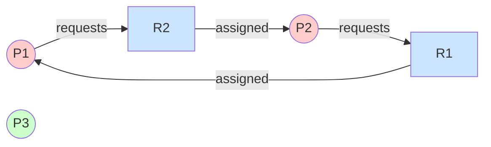
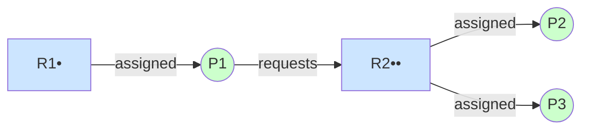

# Deadlock Concepts

Deadlock is a fundamental problem in operating systems where processes are blocked forever waiting for resources. This subtopic covers deadlock definition, system model, and characterization.

## System Model

An operating system consists of:

### Resources

Finite number of resources distributed among processes:
- **Physical**: CPU cycles, memory, I/O devices, printers
- **Logical**: Files, semaphores, mutexes, database records

### Resource Types

```
Resource type Ri has Wi instances:
- R1: Printers (3 instances)
- R2: Memory blocks (100 instances)
- R3: Mutex locks (1 instance each)
```

### Resource Usage Protocol

1. **Request**: Process requests resource; may block if unavailable
2. **Use**: Process operates on resource
3. **Release**: Process releases resource

```c
// Example with semaphore
sem_wait(&resource);    // Request
// Use resource          // Use
sem_post(&resource);    // Release
```

## What is Deadlock?

**Deadlock** occurs when a set of processes are blocked, each waiting for a resource held by another process in the set.

```
Process P1: holds R1, waits for R2
Process P2: holds R2, waits for R1

Neither can proceed → DEADLOCK
```

### Real-World Analogy

```
Traffic gridlock:
     ↓
   ┌───┐
→ │ A │ →
   └───┘
     ↑

All cars waiting for the car ahead to move.
No car can move → gridlock.
```

### Code Example

```c
pthread_mutex_t m1 = PTHREAD_MUTEX_INITIALIZER;
pthread_mutex_t m2 = PTHREAD_MUTEX_INITIALIZER;

void* thread1(void* arg) {
    pthread_mutex_lock(&m1);
    sleep(1);
    pthread_mutex_lock(&m2);  // Blocked - thread2 holds m2
    pthread_mutex_unlock(&m2);
    pthread_mutex_unlock(&m1);
    return NULL;
}

void* thread2(void* arg) {
    pthread_mutex_lock(&m2);
    sleep(1);
    pthread_mutex_lock(&m1);  // Blocked - thread1 holds m1
    pthread_mutex_unlock(&m1);
    pthread_mutex_unlock(&m2);
    return NULL;
}
```

## Four Necessary Conditions

For deadlock to occur, all four conditions must hold simultaneously:

### 1. Mutual Exclusion

At least one resource must be held in a non-shareable mode.

```
Resource R can only be held by one process at a time.

Process A: [====holds R====]
Process B:     [waits][waits]...
```

### 2. Hold and Wait

A process holding resources can request additional resources.

```c
// Process holds lock1, requests lock2
pthread_mutex_lock(&lock1);  // Holds lock1
// ... do something ...
pthread_mutex_lock(&lock2);  // Requests lock2 while holding lock1
```

### 3. No Preemption

Resources cannot be forcibly taken from processes.

```
Process holds resource → resource cannot be taken away
Must wait for process to voluntarily release
```

### 4. Circular Wait

There exists a circular chain of processes, each waiting for a resource held by the next.

```
P1 → R1 (held by P2)
P2 → R2 (held by P3)
P3 → R3 (held by P1)

Circular chain: P1 → P2 → P3 → P1
```

## Resource Allocation Graph

A directed graph representing resource allocation state:

### Components

- **Process nodes**: Circles (P1, P2, ...)
- **Resource nodes**: Rectangles with dots (instances)
- **Request edge**: Pi → Rj (Pi requesting Rj)
- **Assignment edge**: Rj → Pi (instance of Rj assigned to Pi)

### Example Graph: Deadlock Scenario



**Analysis:**
- P1 holds R1, requests R2
- P2 holds R2, requests R1
- **CYCLE EXISTS**: $P_1 \to R_2 \to P_2 \to R_1 \to P_1$
- With single-instance resources: Cycle $\Rightarrow$ Deadlock

### No Deadlock Example



**Analysis:**
- R2 has 2 instances (shown as R2••)
- P1 can get R2 from available instance
- No circular wait $\Rightarrow$ No deadlock

### Graph Representation

```c
typedef struct {
    int n_processes;
    int n_resources;
    int** request;      // request[i][j] = 1 if Pi requests Rj
    int** allocation;   // allocation[i][j] = 1 if Pi holds Rj instance
    int* available;     // available[j] = instances of Rj available
} RAGraph;

void init_graph(RAGraph* g, int n_proc, int n_res) {
    g->n_processes = n_proc;
    g->n_resources = n_res;
    g->request = malloc(n_proc * sizeof(int*));
    g->allocation = malloc(n_proc * sizeof(int*));
    for (int i = 0; i < n_proc; i++) {
        g->request[i] = calloc(n_res, sizeof(int));
        g->allocation[i] = calloc(n_res, sizeof(int));
    }
    g->available = calloc(n_res, sizeof(int));
}
```

## Deadlock Detection Using Graph

### Single Instance Resources

If each resource type has one instance:
**Cycle in graph ⟺ Deadlock**

```c
bool has_cycle(RAGraph* g) {
    // Build adjacency list
    // Use DFS to detect cycle
    // ...
    return found_cycle;
}
```

### Multiple Instance Resources

Cycle necessary but not sufficient for deadlock.

```
R1 has 2 instances, R2 has 2 instances

P1 holds R1[0], requests R2
P2 holds R2[0], requests R1
P3 holds R1[1], R2[1]

Cycle exists: P1 → R2 → P2 → R1 → P1
But P3 can finish, releasing resources → no deadlock
```

## Deadlock vs Starvation

| Aspect | Deadlock | Starvation |
|--------|----------|------------|
| Definition | Circular wait | Indefinite postponement |
| Progress | No process in set progresses | Other processes progress |
| Resolution | Must break cycle | Wait long enough |
| Detection | Graph analysis | Timing analysis |

```
Deadlock:
P1 waits for P2
P2 waits for P1
→ Neither proceeds

Starvation:
P1 keeps getting resources
P2 always delayed
→ P1 proceeds, P2 never does
```

## Handling Deadlock

Four general approaches:

### 1. Prevention

Ensure at least one necessary condition cannot hold.

```
Design system so deadlock impossible
Example: Always acquire locks in same order
```

### 2. Avoidance

Dynamically examine resource allocation state.

```
Before granting: Will this lead to unsafe state?
If yes: Deny request
Example: Banker's Algorithm
```

### 3. Detection and Recovery

Allow deadlocks, detect them, and recover.

```
Periodically run detection algorithm
If deadlock found: Kill process or preempt resources
```

### 4. Ignore (Ostrich Algorithm)

Pretend deadlocks don't happen.

```
If deadlocks are rare and cost of prevention high
Just reboot when system hangs
Used by most general-purpose OS
```

## Cost-Benefit Analysis

```
                    │ Prevention │ Avoidance │ Detection │ Ignore
────────────────────┼────────────┼───────────┼───────────┼────────
Implementation cost │   High     │   High    │  Medium   │  None
Runtime overhead    │   Low      │   High    │  Medium   │  None
Resource utilization│   Low      │  Medium   │   High    │  High
Deadlock possible   │    No      │    No     │   Yes*    │  Yes
Recovery needed     │    No      │    No     │   Yes     │ Manual

* Detected and recovered
```

## Summary

Deadlock is a serious concurrency issue:
- Processes blocked forever in circular wait
- Requires mutual exclusion, hold-and-wait, no preemption, circular wait
- Resource allocation graphs visualize the problem
- Cycle detection identifies potential deadlock
- Single instance: cycle = deadlock
- Multiple instances: need more sophisticated analysis
- Four approaches: prevent, avoid, detect/recover, ignore
- Each has trade-offs in overhead and resource utilization
