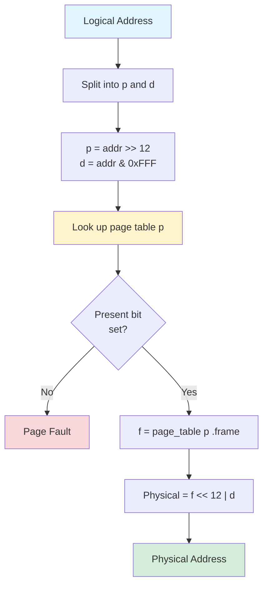

# Paging

Paging is a memory management scheme that eliminates external fragmentation by using fixed-size blocks. This subtopic covers basic paging concepts and page table structures.

## Paging Concept

Memory divided into fixed-size blocks:
- **Frames**: Physical memory blocks
- **Pages**: Logical memory blocks
- Page size = Frame size (typically 4KB)

```
Logical Memory:          Physical Memory:
┌───────────────┐        ┌───────────────┐
│   Page 0      │        │   Frame 0     │ (OS)
├───────────────┤        ├───────────────┤
│   Page 1      │───────→│   Frame 1     │ Page 2
├───────────────┤        ├───────────────┤
│   Page 2      │─┐      │   Frame 2     │ Page 0
├───────────────┤ │      ├───────────────┤
│   Page 3      │ │  ┌──→│   Frame 3     │ Page 1
└───────────────┘ │  │   ├───────────────┤
                  └──┼──→│   Frame 4     │ (Free)
                     │   ├───────────────┤
                     └──→│   Frame 5     │ Page 3
                         └───────────────┘
```

## Address Translation

### Logical Address Structure

For a 32-bit address space with 4KB pages:

$$\text{Logical Address} = \underbrace{\text{Page Number}}_{20 \text{ bits}} \; || \; \underbrace{\text{Offset}}_{12 \text{ bits}}$$

**Bit breakdown:**

```
┌──────────────────────┬──────────────┐
│  Page Number (20)    │ Offset (12)  │
└──────────────────────┴──────────────┘
 31                 12  11            0

Page number: p = 0 to 2^20 - 1 = 1,048,575
Offset: d = 0 to 2^12 - 1 = 4,095
```

**Address space calculations:**

$$\text{Page size} = 2^{12} = 4096 \text{ bytes} = 4 \text{ KB}$$

$$\text{Number of pages} = \frac{2^{32}}{2^{12}} = 2^{20} = 1,048,576 \text{ pages}$$

$$\text{Address space} = 2^{32} = 4 \text{ GB}$$

### Translation Process



**Translation formula:**

$$\text{Physical Address} = f \times \text{page\_size} + d$$

Where:
- $f$ = frame number from page table[$p$]
- $d$ = offset from logical address
- $p$ = page number from logical address

**Example:**

```c
// Logical address translation
typedef struct {
    uint32_t page_number;
    uint32_t offset;
} LogicalAddress;

typedef struct {
    uint32_t frame_number;
    uint32_t offset;
} PhysicalAddress;

PhysicalAddress translate(LogicalAddress logical, PageTable* pt) {
    PhysicalAddress physical;

    // Look up frame in page table
    physical.frame_number = pt->entries[logical.page_number].frame;
    physical.offset = logical.offset;  // Offset unchanged

    return physical;
}

// Concrete example:
// Logical address: 8292 (decimal)
// Binary: 0000 0000 0000 0000 0010 0000 0110 0100
// p = 8292 >> 12 = 2 (page 2)
// d = 8292 & 0xFFF = 100 (offset 100)
// Page table: page_table[2].frame = 5
// Physical address = (5 << 12) | 100 = 20480 + 100 = 20580
```

## Page Table

### Basic Structure

```c
typedef struct {
    uint32_t frame : 20;      // Frame number
    uint32_t present : 1;     // In memory?
    uint32_t read_write : 1;  // Writable?
    uint32_t user_super : 1;  // User accessible?
    uint32_t accessed : 1;    // Recently accessed?
    uint32_t dirty : 1;       // Been modified?
    uint32_t reserved : 7;
} PageTableEntry;

typedef struct {
    PageTableEntry entries[1 << 20];  // 2^20 entries
} PageTable;
```

### Page Table Entry (PTE) Bits

```
┌─────────────────────────────────────────────────────────┐
│ Frame Number │ Reserved │ D │ A │ U/S │ R/W │ P │
├──────────────┼──────────┼───┼───┼─────┼─────┼───┤
│   20 bits    │  7 bits  │ 1 │ 1 │  1  │  1  │ 1 │
└─────────────────────────────────────────────────────────┘

P (Present): Page in physical memory
R/W: Read (0) or Read/Write (1)
U/S: User (1) or Supervisor only (0)
A (Accessed): Page has been read
D (Dirty): Page has been written
```

### Page Table Base Register (PTBR)

```c
// Each process has its own page table
// PTBR points to current process's page table

void context_switch(Process* new_process) {
    // Save old PTBR
    old_process->ptbr = get_ptbr();

    // Load new PTBR
    set_ptbr(new_process->ptbr);
}
```

## Address Translation Hardware

### Memory Management Unit (MMU)

```
             Logical Address
                   │
                   ↓
    ┌──────────────────────────────┐
    │       Page Number │ Offset   │
    └──────────────────────────────┘
              │              │
              ↓              │
    ┌─────────────────┐     │
    │   Page Table    │     │
    │   (in memory)   │     │
    └─────────────────┘     │
              │              │
              ↓              │
         Frame Number       │
              │              │
              ↓              ↓
    ┌──────────────────────────────┐
    │      Frame Number │ Offset   │
    └──────────────────────────────┘
                   │
                   ↓
             Physical Address
```

### Translation Example

```c
// 32-bit system, 4KB pages

#define PAGE_SIZE 4096
#define PAGE_SHIFT 12
#define PAGE_MASK 0xFFF

uint32_t translate_address(uint32_t logical_addr,
                          PageTableEntry* page_table) {
    // Extract page number and offset
    uint32_t page_num = logical_addr >> PAGE_SHIFT;
    uint32_t offset = logical_addr & PAGE_MASK;

    // Look up page table
    PageTableEntry pte = page_table[page_num];

    // Check present bit
    if (!pte.present) {
        page_fault(page_num);  // Handle page fault
    }

    // Construct physical address
    uint32_t physical_addr = (pte.frame << PAGE_SHIFT) | offset;

    return physical_addr;
}
```

## Paging Example

```
Process with 16KB logical space, 4KB pages:

Logical Memory:
┌────────────────────┐ 0
│   Page 0 (code)    │
├────────────────────┤ 4KB
│   Page 1 (data)    │
├────────────────────┤ 8KB
│   Page 2 (heap)    │
├────────────────────┤ 12KB
│   Page 3 (stack)   │
└────────────────────┘ 16KB

Page Table:
┌───────┬───────┬───┐
│ Page  │ Frame │ P │
├───────┼───────┼───┤
│   0   │   2   │ 1 │  ← Page 0 in Frame 2
│   1   │   5   │ 1 │  ← Page 1 in Frame 5
│   2   │   1   │ 1 │  ← Page 2 in Frame 1
│   3   │   7   │ 1 │  ← Page 3 in Frame 7
└───────┴───────┴───┘

Physical Memory (32KB):
┌────────────────────┐ Frame 0 (OS)
├────────────────────┤ Frame 1 - Page 2
├────────────────────┤ Frame 2 - Page 0
├────────────────────┤ Frame 3 (Free)
├────────────────────┤ Frame 4 (Free)
├────────────────────┤ Frame 5 - Page 1
├────────────────────┤ Frame 6 (Free)
├────────────────────┤ Frame 7 - Page 3
└────────────────────┘
```

## Free Frame Management

### Frame Table

```c
typedef struct {
    bool allocated;
    int pid;        // Which process (if allocated)
    int page_num;   // Which page (if allocated)
} FrameEntry;

FrameEntry frame_table[TOTAL_FRAMES];

int allocate_frame() {
    for (int i = 0; i < TOTAL_FRAMES; i++) {
        if (!frame_table[i].allocated) {
            frame_table[i].allocated = true;
            return i;
        }
    }
    return -1;  // No free frame
}

void free_frame(int frame_num) {
    frame_table[frame_num].allocated = false;
    frame_table[frame_num].pid = -1;
}
```

### Free Frame List

```c
typedef struct FrameNode {
    int frame_number;
    struct FrameNode* next;
} FrameNode;

FrameNode* free_frame_list = NULL;

int allocate_frame_list() {
    if (free_frame_list == NULL) {
        return -1;  // No free frames
    }

    FrameNode* node = free_frame_list;
    free_frame_list = node->next;
    int frame = node->frame_number;
    free(node);
    return frame;
}

void free_frame_list(int frame_num) {
    FrameNode* node = malloc(sizeof(FrameNode));
    node->frame_number = frame_num;
    node->next = free_frame_list;
    free_frame_list = node;
}
```

## Advantages of Paging

### No External Fragmentation

```
Any free frame can be used:

Before:              After allocating 3 pages:
┌────────────┐       ┌────────────┐
│ Frame 0 ██ │       │ Frame 0 ██ │
├────────────┤       ├────────────┤
│ Frame 1    │ ←───  │ Frame 1 P0 │ Page 0
├────────────┤       ├────────────┤
│ Frame 2 ██ │       │ Frame 2 ██ │
├────────────┤       ├────────────┤
│ Frame 3    │ ←───  │ Frame 3 P1 │ Page 1
├────────────┤       ├────────────┤
│ Frame 4    │ ←───  │ Frame 4 P2 │ Page 2
└────────────┘       └────────────┘

Non-contiguous allocation - no fragmentation problem!
```

### Easy Sharing

```
Process A and B share same code page:

Process A Table:        Process B Table:
Page 0 → Frame 5       Page 0 → Frame 5  (same!)
Page 1 → Frame 2       Page 1 → Frame 7

Frame 5 contains shared library code
```

### Memory Protection

```c
// Each page has protection bits
PageTableEntry pte;
pte.read_write = 0;  // Read-only (code pages)
pte.user_super = 1;  // User accessible

// Hardware checks on every access
void check_access(PageTableEntry pte, AccessType type) {
    if (type == WRITE && !pte.read_write) {
        trap(PROTECTION_FAULT);
    }
    if (in_user_mode() && !pte.user_super) {
        trap(PROTECTION_FAULT);
    }
}
```

## Internal Fragmentation

Pages may have unused space at the end of the last page:

**Example:**

Process needs $4100$ bytes with page size $s = 4096$ bytes:

$$\text{Pages needed} = \left\lceil \frac{4100}{4096} \right\rceil = \left\lceil 1.00098 \right\rceil = 2 \text{ pages}$$

$$\text{Allocated} = 2 \times 4096 = 8192 \text{ bytes}$$

$$\text{Wasted (internal fragmentation)} = 8192 - 4100 = 4092 \text{ bytes}$$

**Average internal fragmentation:**

Assuming process sizes are uniformly distributed, the last page is on average half full:

$$\text{Average internal fragmentation} = \frac{s}{2}$$

For 4KB pages: Average waste $= \frac{4096}{2} = 2048$ bytes per process

**Total fragmentation for $n$ processes:**

$$\text{Total waste} \approx n \times \frac{s}{2}$$

### Page Size Trade-offs

```
Smaller pages:
+ Less internal fragmentation
- Larger page tables
- More TLB misses

Larger pages:
+ Smaller page tables
+ Better TLB coverage
- More internal fragmentation

Typical sizes: 4KB, 2MB (huge pages), 1GB (gigantic)
```

## Summary

Paging eliminates external fragmentation:
- Logical memory divided into fixed-size pages
- Physical memory divided into same-size frames
- Page table maps pages to frames
- Address = page number + offset
- MMU performs translation on every memory access
- Frame tables track free/allocated frames
- Internal fragmentation limited to last page
- Enables easy sharing and protection
- Foundation for virtual memory systems
