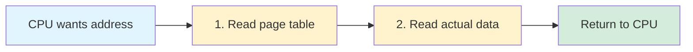

# Translation Lookaside Buffer (TLB)

The TLB is a hardware cache for page table entries. This subtopic covers TLB operation, management, and performance implications.

## The Memory Access Problem

Without caching, every memory access requires multiple memory accesses:

**Single-level page table:**



Time per access: $t_{access} = 2 \times t_{memory}$

**Multi-level page table (4 levels):**

Time per access: $t_{access} = 5 \times t_{memory}$ (4 page table levels + 1 data)

With $t_{memory} = 100$ ns:
- Single-level: $200$ ns per access
- 4-level: $500$ ns per access

This overhead is unacceptable!

## TLB Concept

The TLB caches recent page-to-frame translations:

```
┌─────────────────────────────────────────────────────────┐
│                    CPU                                  │
│  ┌─────────────────────────────────────────────────┐   │
│  │           TLB (small, fast cache)               │   │
│  │  ┌──────────┬──────────┬─────┬─────┬─────┬───┐ │   │
│  │  │ VPN      │ Frame    │ V   │ P   │ D   │ A │ │   │
│  │  ├──────────┼──────────┼─────┼─────┼─────┼───┤ │   │
│  │  │ 0x12345  │ 0x789    │ 1   │ 1   │ 0   │ 1 │ │   │
│  │  │ 0x12346  │ 0x100    │ 1   │ 1   │ 1   │ 1 │ │   │
│  │  │ 0x00001  │ 0x050    │ 1   │ 0   │ 0   │ 1 │ │   │
│  │  │ ...      │ ...      │ ... │ ... │ ... │...│ │   │
│  │  └──────────┴──────────┴─────┴─────┴─────┴───┘ │   │
│  └─────────────────────────────────────────────────┘   │
└─────────────────────────────────────────────────────────┘
           │
           ↓ (TLB miss only)
    ┌─────────────────┐
    │   Page Table    │
    │   (in memory)   │
    └─────────────────┘
```

## TLB Entry Structure

```c
typedef struct {
    uint32_t vpn;         // Virtual page number (key)
    uint32_t frame;       // Physical frame (value)
    bool valid;           // Entry is valid
    bool dirty;           // Page modified
    uint8_t asid;         // Address space ID
    uint8_t permissions;  // R/W/X bits
} TLBEntry;
```

## TLB Operation

### Address Translation with TLB

```c
uint32_t translate_with_tlb(uint32_t virtual_addr) {
    uint32_t vpn = virtual_addr >> PAGE_SHIFT;
    uint32_t offset = virtual_addr & PAGE_MASK;

    // Check TLB (parallel associative lookup)
    TLBEntry* entry = tlb_lookup(vpn);

    if (entry != NULL && entry->valid) {
        // TLB hit
        tlb_hits++;
        return (entry->frame << PAGE_SHIFT) | offset;
    }

    // TLB miss - walk page table
    tlb_misses++;
    uint32_t frame = page_table_lookup(vpn);

    // Update TLB
    tlb_insert(vpn, frame);

    return (frame << PAGE_SHIFT) | offset;
}
```

### TLB Lookup (Hardware)

```
Virtual Address: VPN | Offset
                  │
                  ↓
           TLB (parallel compare)
           ┌────┬────┬────┬────┐
           │E0  │E1  │E2  │...│  Compare VPN with all entries
           └────┴────┴────┴────┘
             │    │    │
         ────────────────────
         │    Compare    │
         └───────┬───────┘
                 │
            Hit? │ Miss?
                 │
         ┌───────┴───────┐
         ↓               ↓
    Return frame    Walk page table
```

## TLB Hit Ratio

### Calculating Effective Access Time

Let:
- $\epsilon$ = TLB lookup time (e.g., 1 ns)
- $m$ = memory access time (e.g., 100 ns)
- $\alpha$ = TLB hit ratio (e.g., 0.99)

**Without TLB:**

$$t_{no\_TLB} = m + m = 2m$$

Each access requires: page table lookup + data access

**With TLB:**

TLB hit: $\epsilon + m$ (TLB lookup + data access)

TLB miss: $\epsilon + m + m$ (TLB lookup + page table + data)

**Effective Access Time (EAT):**

$$\text{EAT} = \alpha(\epsilon + m) + (1-\alpha)(\epsilon + 2m)$$

Simplifying:

$$\text{EAT} = \epsilon + m + (1-\alpha)m = \epsilon + m(2-\alpha)$$

**Example calculation:**

Given: $\epsilon = 1$ ns, $m = 100$ ns, $\alpha = 0.99$

$$\text{EAT} = 1 + 100(2 - 0.99) = 1 + 100(1.01) = 102 \text{ ns}$$

**Speedup:**

$$\text{Speedup} = \frac{2m}{\text{EAT}} = \frac{200}{102} \approx 1.96\times$$

**Hit ratio impact:**

| Hit Ratio ($\alpha$) | EAT (ns) | Speedup |
|---------------------|----------|---------|
| 0% | 201 | 1.00× |
| 50% | 151 | 1.32× |
| 80% | 121 | 1.65× |
| 90% | 111 | 1.80× |
| 95% | 106 | 1.89× |
| 99% | 102 | 1.96× |
| 99.9% | 101.1 | 1.98× |

Even small improvements in $\alpha$ significantly reduce EAT!

### Why High Hit Ratio?

**Locality of reference:**
- Temporal: Recently accessed pages likely accessed again
- Spatial: Nearby addresses likely on same page

```
// This loop accesses same few pages repeatedly
for (int i = 0; i < 1000000; i++) {
    array[i % 100] += 1;  // Same pages over and over
}
```

## TLB Management

### TLB Flush

When to invalidate TLB entries:

```c
// Context switch - new process, different mappings
void context_switch(Process* new) {
    save_current_state();

    // Flush entire TLB
    tlb_flush_all();

    // Or use ASID to avoid flush
    set_asid(new->asid);

    load_state(new);
}
```

### Address Space Identifiers (ASID)

Tag TLB entries with process ID to avoid flushing:

```
TLB Entry with ASID:
┌──────┬──────────┬───────┬───────┐
│ ASID │   VPN    │ Frame │ Flags │
├──────┼──────────┼───────┼───────┤
│  5   │ 0x1000   │ 0x200 │ ...   │  ← Process 5
│  7   │ 0x1000   │ 0x300 │ ...   │  ← Process 7 (same VPN!)
│  5   │ 0x2000   │ 0x400 │ ...   │  ← Process 5
└──────┴──────────┴───────┴───────┘
```

```c
typedef struct {
    uint8_t asid;
    uint32_t vpn;
    uint32_t frame;
    bool valid;
} ASIDTLBEntry;

ASIDTLBEntry* tlb_lookup_asid(uint8_t asid, uint32_t vpn) {
    for (int i = 0; i < TLB_SIZE; i++) {
        if (tlb[i].valid &&
            tlb[i].asid == asid &&
            tlb[i].vpn == vpn) {
            return &tlb[i];
        }
    }
    return NULL;
}
```

### TLB Shootdown

In multiprocessor systems, TLBs must be synchronized:

```c
// CPU 0 changes page table
void unmap_page(uint32_t vpn) {
    // Update page table
    page_table[vpn].present = false;

    // Invalidate local TLB
    tlb_invalidate(vpn);

    // Signal other CPUs
    for (int cpu = 1; cpu < num_cpus; cpu++) {
        send_ipi(cpu, TLB_SHOOTDOWN, vpn);
    }

    // Wait for acknowledgment
    wait_for_acks();
}

// Other CPUs receive IPI
void handle_tlb_shootdown(uint32_t vpn) {
    tlb_invalidate(vpn);
    send_ack();
}
```

## TLB Organization

### Fully Associative

Any entry can hold any mapping:

```
+ Flexible
+ Best hit rate
- Expensive (parallel comparators)
- Typically small (32-128 entries)
```

### Set Associative

Entries divided into sets:

```
4-way set associative, 64 entries:
16 sets × 4 entries per set

VPN → Hash → Set index
Within set: parallel compare

+ Balance cost and flexibility
+ Common choice
```

### Direct Mapped

Each VPN maps to exactly one entry:

```
Entry index = VPN mod TLB_SIZE

+ Simple, fast
- Conflicts common
- Rarely used for TLB
```

## Multiple TLB Levels

Modern CPUs have TLB hierarchy:

```
┌─────────────────────────────────────────┐
│               CPU Core                   │
│  ┌───────────────────────────────────┐  │
│  │  L1 ITLB (instructions): 64 entries│  │
│  │  L1 DTLB (data): 64 entries        │  │
│  └───────────────────────────────────┘  │
│                    │                     │
│                Miss│                     │
│                    ↓                     │
│  ┌───────────────────────────────────┐  │
│  │  L2 STLB (shared): 1536 entries   │  │
│  └───────────────────────────────────┘  │
└─────────────────────────────────────────┘
                     │
                 Miss│
                     ↓
              Page Table Walk
```

## Huge Pages and TLB

Larger pages = better TLB coverage:

```
4KB pages:
  64 TLB entries × 4KB = 256KB coverage

2MB huge pages:
  64 TLB entries × 2MB = 128MB coverage

1GB gigantic pages:
  64 TLB entries × 1GB = 64GB coverage!
```

### Linux Huge Pages

```c
// Allocate huge pages
void* ptr = mmap(NULL, size,
                 PROT_READ | PROT_WRITE,
                 MAP_PRIVATE | MAP_ANONYMOUS | MAP_HUGETLB,
                 -1, 0);

// Transparent Huge Pages (THP)
// Kernel automatically uses huge pages when beneficial
```

## Performance Monitoring

### TLB Statistics

```bash
# Linux perf
perf stat -e dTLB-loads,dTLB-load-misses,iTLB-loads,iTLB-load-misses ./program

# Example output:
#    10,000,000  dTLB-loads
#        50,000  dTLB-load-misses  # 0.5% miss rate
```

### Optimizing for TLB

```c
// Bad: Random access causes TLB misses
for (int i = 0; i < n; i++) {
    access(array[random() % size]);
}

// Good: Sequential access, good TLB reuse
for (int i = 0; i < n; i++) {
    access(array[i]);
}

// Good: Block processing within pages
for (int block = 0; block < n; block += BLOCK_SIZE) {
    for (int i = block; i < block + BLOCK_SIZE; i++) {
        process(array[i]);
    }
}
```

## Software-Managed TLB

Some architectures (MIPS, SPARC) have software-managed TLB:

```c
// TLB miss triggers exception
void tlb_miss_handler() {
    // Software walks page table
    uint32_t vpn = get_faulting_vpn();
    uint32_t frame = page_table_walk(vpn);

    // Software loads TLB
    tlb_write(vpn, frame, permissions);

    // Return from exception
    return_from_exception();
}
```

**Advantages:**
- OS has full control
- Can implement any policy

**Disadvantages:**
- Exception overhead
- Slower than hardware walk

## Summary

The TLB is critical for paging performance:
- Caches page table entries for fast translation
- High hit ratio (>99%) due to locality
- ASID avoids TLB flush on context switch
- Multi-core systems need TLB shootdown
- Multiple levels (L1/L2) and types (I/D)
- Huge pages improve TLB coverage
- Software-managed on some architectures
- Critical for system performance
