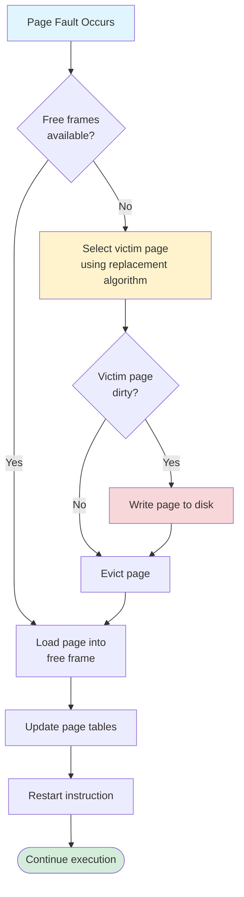
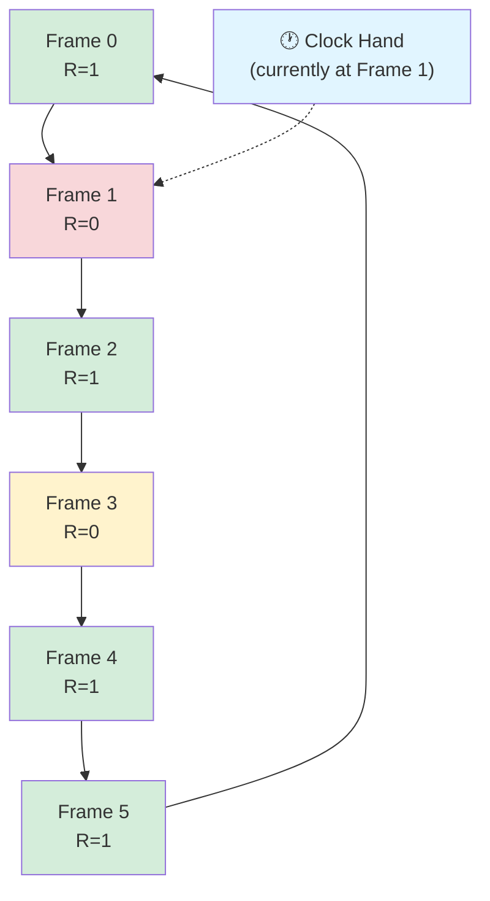

# Page Replacement Algorithms

When memory is full, page replacement algorithms decide which page to evict. This subtopic covers FIFO, Optimal, LRU, and approximation algorithms.

## The Page Replacement Problem

When a page fault occurs and no free frames:



**Goal:** Minimize page faults to reduce disk I/O

**Page fault rate:**

$$p = \frac{\text{number of page faults}}{\text{total memory references}}$$

**Effective access time (EAT):**

$$\text{EAT} = (1-p) \times t_{mem} + p \times t_{page\_fault}$$

Where:
- $t_{mem}$ = memory access time (e.g., 100 ns)
- $t_{page\_fault}$ = page fault service time (e.g., 8 ms)

## Reference String

Sequence of page accesses for analysis:

```
Access: 0x1234, 0x1238, 0x5678, 0x1240, 0x9ABC
Page size: 4KB

Reference string: 1, 1, 5, 1, 9
(page numbers accessed)
```

## FIFO (First-In, First-Out)

Replace the oldest page in memory:

```c
#define NUM_FRAMES 3

typedef struct {
    int pages[NUM_FRAMES];
    int next_replace;  // Index to replace
} FIFOBuffer;

int fifo_replace(FIFOBuffer* buf, int new_page) {
    int victim = buf->pages[buf->next_replace];
    buf->pages[buf->next_replace] = new_page;
    buf->next_replace = (buf->next_replace + 1) % NUM_FRAMES;
    return victim;
}
```

### FIFO Example

```
Reference: 7, 0, 1, 2, 0, 3, 0, 4, 2, 3, 0, 3, 2
Frames: 3

Step   Ref   Frame 0   Frame 1   Frame 2   Fault?
1      7     7         -         -         Yes
2      0     7         0         -         Yes
3      1     7         0         1         Yes
4      2     2         0         1         Yes (evict 7)
5      0     2         0         1         No
6      3     2         3         1         Yes (evict 0)
7      0     2         3         0         Yes (evict 1)
8      4     4         3         0         Yes (evict 2)
9      2     4         2         0         Yes (evict 3)
10     3     4         2         3         Yes (evict 0)
11     0     0         2         3         Yes (evict 4)
12     3     0         2         3         No
13     2     0         2         3         No

Total faults: 10
```

### Belady's Anomaly

More frames can cause MORE faults with FIFO:

```
Reference: 1, 2, 3, 4, 1, 2, 5, 1, 2, 3, 4, 5

3 frames: 9 page faults
4 frames: 10 page faults!

This shouldn't happen intuitively.
```

## Optimal Algorithm (OPT)

Replace page that won't be used for longest time:

```c
int optimal_replace(int* pages, int num_frames,
                   int* ref_string, int current_pos, int total_refs) {
    int farthest = -1;
    int victim = 0;

    for (int i = 0; i < num_frames; i++) {
        // Find when this page will be used next
        int next_use = total_refs;  // Assume never

        for (int j = current_pos + 1; j < total_refs; j++) {
            if (ref_string[j] == pages[i]) {
                next_use = j;
                break;
            }
        }

        if (next_use > farthest) {
            farthest = next_use;
            victim = i;
        }
    }

    return victim;
}
```

### Optimal Example

```
Reference: 7, 0, 1, 2, 0, 3, 0, 4, 2, 3, 0, 3, 2
Frames: 3

Step   Ref   Frames      Fault?   Reason
1      7     7,-,-       Yes
2      0     7,0,-       Yes
3      1     7,0,1       Yes
4      2     2,0,1       Yes      7 used farthest (never)
5      0     2,0,1       No
6      3     2,0,3       Yes      1 used farthest
7      0     2,0,3       No
8      4     4,0,3       Yes      2 used farthest
9      2     4,0,2       Yes      3 used farthest
10     3     3,0,2       Yes      4 used farthest (never)
11     0     3,0,2       No
12     3     3,0,2       No
13     2     3,0,2       No

Total faults: 9 (minimum possible)
```

**Problem**: Requires future knowledge (impossible in practice)
**Use**: Benchmark for other algorithms

## LRU (Least Recently Used)

Replace page not used for longest time:

```c
typedef struct {
    int page;
    int last_access_time;
} LRUEntry;

int lru_replace(LRUEntry* frames, int num_frames) {
    int min_time = INT_MAX;
    int victim = 0;

    for (int i = 0; i < num_frames; i++) {
        if (frames[i].last_access_time < min_time) {
            min_time = frames[i].last_access_time;
            victim = i;
        }
    }

    return victim;
}

void lru_access(LRUEntry* frames, int num_frames,
                int page, int current_time) {
    for (int i = 0; i < num_frames; i++) {
        if (frames[i].page == page) {
            frames[i].last_access_time = current_time;
            return;
        }
    }
}
```

### LRU Example

```
Reference: 7, 0, 1, 2, 0, 3, 0, 4, 2, 3, 0, 3, 2
Frames: 3

Step   Ref   Frames      Fault?   Reason
1      7     7,-,-       Yes
2      0     7,0,-       Yes
3      1     7,0,1       Yes
4      2     2,0,1       Yes      7 LRU (last@1)
5      0     2,0,1       No       (0 updated)
6      3     2,0,3       Yes      1 LRU (last@3)
7      0     2,0,3       No
8      4     4,0,3       Yes      2 LRU (last@4)
9      2     4,0,2       Yes      3 LRU (last@6)
10     3     4,3,2       Yes      0 LRU (last@7)
11     0     0,3,2       Yes      4 LRU (last@8)
12     3     0,3,2       No
13     2     0,3,2       No

Total faults: 10
```

### LRU Implementation Challenges

**Hardware counter:**
```c
// Each memory access increments global counter
// Each page entry stores counter value when accessed
// Expensive: 64-bit counter per page
```

**Stack implementation:**
```c
// Doubly-linked list of pages
// Move accessed page to top
// Bottom = LRU
// Expensive: Update on every access
```

## LRU Approximations

### Reference Bit (Clock Algorithm)

```c
typedef struct {
    int page;
    bool reference_bit;  // Set on access
} ClockEntry;

int clock_pointer = 0;

int clock_replace(ClockEntry* frames, int num_frames) {
    while (true) {
        if (!frames[clock_pointer].reference_bit) {
            // Found victim
            int victim = clock_pointer;
            clock_pointer = (clock_pointer + 1) % num_frames;
            return victim;
        }

        // Give second chance
        frames[clock_pointer].reference_bit = false;
        clock_pointer = (clock_pointer + 1) % num_frames;
    }
}
```

### Clock Algorithm Visualization

The clock hand sweeps through pages, giving second chances:



**Algorithm steps:**

1. Check current frame's reference bit
2. If $R = 0$: Select as victim
3. If $R = 1$: Set $R = 0$ (give second chance), advance clock
4. Repeat until victim found

**Worst case:** All reference bits are 1
- Makes full circle clearing all bits
- Returns to starting point
- Selects that page (now $R = 0$)
- Time: $O(n)$ where $n$ = number of frames

### Enhanced Clock (NRU)

Consider both reference and dirty bits:

```c
typedef struct {
    bool reference;  // R bit
    bool dirty;      // M bit (modified)
} PageBits;

// Priority classes:
// (0,0) - not referenced, not modified (best victim)
// (0,1) - not referenced, modified
// (1,0) - referenced, not modified
// (1,1) - referenced, modified (worst victim)

int enhanced_clock_replace(PageBits* pages, int num_pages) {
    // Scan for class (0,0)
    for (int i = 0; i < num_pages; i++) {
        if (!pages[i].reference && !pages[i].dirty) {
            return i;
        }
    }

    // Scan for class (0,1), clearing R bits
    for (int i = 0; i < num_pages; i++) {
        if (!pages[i].reference && pages[i].dirty) {
            return i;
        }
        pages[i].reference = false;
    }

    // Repeat scan (now all R=0)
    return enhanced_clock_replace(pages, num_pages);
}
```

## Counting Algorithms

### LFU (Least Frequently Used)

```c
int lfu_replace(int* access_count, int num_frames) {
    int min_count = INT_MAX;
    int victim = 0;

    for (int i = 0; i < num_frames; i++) {
        if (access_count[i] < min_count) {
            min_count = access_count[i];
            victim = i;
        }
    }

    return victim;
}
```

### MFU (Most Frequently Used)

Replace page with highest count (just brought in).

## Algorithm Comparison

| Algorithm | Page Faults | Time Complexity | Space | Implementation | Belady's Anomaly |
|-----------|-------------|-----------------|-------|----------------|------------------|
| FIFO | High | $O(1)$ per access | $O(n)$ | Simple queue | **Yes** |
| Optimal (OPT) | **Minimum** | $O(n \cdot m)$ | $O(n)$ | Impossible (needs future) | No |
| LRU | Good | $O(n)$ or $O(\log n)$* | $O(n)$ | Complex (counter/stack) | No |
| Clock | Good | $O(n)$ worst | $O(n)$ | Simple (circular) | No |
| Enhanced Clock | Better | $O(n)$ worst | $O(n)$ | Simple (2 bits) | No |
| LFU | Varies | $O(\log n)$* | $O(n)$ | Medium (heap) | Can occur |

*With appropriate data structures (heap for LFU, special list for LRU)

**Key formulas:**

For reference string of length $m$ with $n$ frames:

**FIFO:** Each access is $O(1)$
$$T_{total} = O(m)$$

**Optimal:** For each fault, scan future references
$$T_{total} = O(m \times n \times m) = O(m^2 n)$$

**LRU with counter:** Update timestamp each access, find min on fault
$$T_{total} = O(m + f \times n)$$
where $f$ = number of faults

**Page fault rate bounds:**

$$f_{min} \leq f_{LRU} \leq f_{FIFO}$$
$$f_{min} = f_{OPT}$$

## Page Buffering

```c
// Keep pool of free frames
// Evicted pages go to modified list
// If page needed again, reclaim from list

typedef struct {
    Frame* free_list;
    Frame* modified_list;
} PageBuffer;

Frame* get_free_frame(PageBuffer* pb) {
    if (pb->free_list != NULL) {
        return remove_from_list(&pb->free_list);
    }

    // No free frames, write modified pages
    write_modified_pages(pb->modified_list);
    return remove_from_list(&pb->modified_list);
}

void reclaim_page(PageBuffer* pb, int page) {
    // Check if page still in lists
    Frame* f = find_in_list(pb->modified_list, page);
    if (f != NULL) {
        remove_from_list(&pb->modified_list, f);
        // Page reclaimed without disk I/O!
    }
}
```

## Summary

Page replacement algorithms balance simplicity and efficiency:
- **FIFO**: Simple but suffers from Belady's anomaly
- **Optimal**: Best possible but needs future knowledge
- **LRU**: Good approximation but expensive to implement
- **Clock**: Practical LRU approximation
- **Enhanced Clock**: Considers dirty bit for fewer writes
- Modern systems use clock variants with modifications
- Page buffering improves performance significantly
