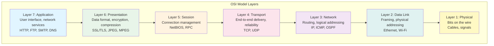
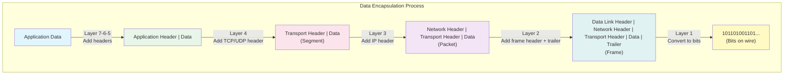

# The OSI Reference Model

The **Open Systems Interconnection (OSI) model** is a conceptual framework that standardizes network communication into seven distinct layers. Developed by the International Organization for Standardization (ISO) in the 1980s, it provides a universal language for discussing network architecture, even though real-world implementations often differ.

## Why Layered Architecture?

Networking is inherently complex—involving hardware, software, protocols, and diverse technologies. **Layering** manages this complexity through:

1. **Modularity**: Each layer handles specific functions independently
2. **Abstraction**: Higher layers use lower layers without knowing implementation details
3. **Interoperability**: Standardized interfaces allow different implementations to work together
4. **Easier debugging**: Problems can be isolated to specific layers
5. **Independent evolution**: Layers can be upgraded without affecting others

Think of layering like the postal system: you write a letter (application layer), put it in an envelope with an address (presentation/session), the postal service routes it (network), and mail carriers deliver it (physical). Each participant handles their task without needing to understand the others.

## The Seven OSI Layers



### Layer 7: Application Layer

The **Application layer** is closest to the end user, providing network services directly to applications. It's where users interact with network-aware software.

**Functions:**
- Network service interfaces for applications
- File transfer, email, web browsing
- Resource sharing and remote access

**Protocols:** HTTP, HTTPS, FTP, SMTP, DNS, SSH, Telnet

```python
# Application layer: Making an HTTP request
import requests

# The application layer handles the HTTP protocol
response = requests.get('https://api.example.com/data')
print(response.json())
```

### Layer 6: Presentation Layer

The **Presentation layer** handles data representation, ensuring that information sent by one system can be understood by another. It acts as a translator between application and network formats.

**Functions:**
- Data format translation (EBCDIC to ASCII, etc.)
- Encryption and decryption
- Compression and decompression
- Character encoding (UTF-8, Unicode)

**Examples:** SSL/TLS encryption, JPEG, MPEG, GIF formats

### Layer 5: Session Layer

The **Session layer** manages sessions—ongoing exchanges between applications. It establishes, maintains, and terminates connections between applications.

**Functions:**
- Session establishment, maintenance, termination
- Synchronization (checkpoints for long transfers)
- Dialog control (who transmits when)
- Authentication and authorization

**Examples:** NetBIOS, RPC (Remote Procedure Call), SQL sessions

### Layer 4: Transport Layer

The **Transport layer** provides end-to-end communication between applications on different hosts. It's responsible for reliable (or unreliable) data transfer.

**Functions:**
- Segmentation and reassembly of data
- End-to-end error recovery and flow control
- Connection-oriented (TCP) vs connectionless (UDP) service
- Port addressing to identify applications

**Protocols:** TCP, UDP, SCTP

```python
# Transport layer concepts: TCP vs UDP
import socket

# TCP - Connection-oriented, reliable
tcp_socket = socket.socket(socket.AF_INET, socket.SOCK_STREAM)
tcp_socket.connect(('server.com', 80))  # Establishes connection first

# UDP - Connectionless, fast but unreliable
udp_socket = socket.socket(socket.AF_INET, socket.SOCK_DGRAM)
udp_socket.sendto(data, ('server.com', 53))  # No connection needed
```

### Layer 3: Network Layer

The **Network layer** handles logical addressing and routing—determining the path data takes through the network.

**Functions:**
- Logical addressing (IP addresses)
- Routing (path determination)
- Packet forwarding
- Fragmentation and reassembly

**Protocols:** IP (IPv4, IPv6), ICMP, OSPF, BGP

```
Network layer routing:

Source: 192.168.1.10
    |
    v
[Router A] --> [Router B] --> [Router C]
                                  |
                                  v
                         Destination: 10.0.0.5
```

### Layer 2: Data Link Layer

The **Data Link layer** provides node-to-node data transfer—moving data between directly connected network nodes.

**Functions:**
- Framing (packaging data for transmission)
- Physical addressing (MAC addresses)
- Error detection (CRC, checksums)
- Media access control (who transmits when)

**Protocols/Technologies:** Ethernet, Wi-Fi (802.11), PPP

The Data Link layer is often divided into two sublayers:
- **LLC (Logical Link Control)**: Flow control, error handling
- **MAC (Media Access Control)**: Physical addressing, media access

### Layer 1: Physical Layer

The **Physical layer** deals with the actual transmission of raw bits over a communication channel.

**Functions:**
- Bit-by-bit transmission
- Physical characteristics of interfaces
- Encoding schemes (how bits become signals)
- Transmission mode (simplex, half-duplex, full-duplex)
- Physical topology

**Examples:** Ethernet cables, fiber optics, wireless radio frequencies, USB

## Data Encapsulation

As data travels down the layers, each layer adds its own header (and sometimes trailer) information—a process called **encapsulation**:



At the receiving end, each layer removes its corresponding header (**decapsulation**) and passes the data up in the reverse process.

## Layer Terminology

Different layers use specific terms for their data units:

| Layer | Data Unit Name |
|-------|---------------|
| Application, Presentation, Session | Data/Message |
| Transport | Segment (TCP) / Datagram (UDP) |
| Network | Packet |
| Data Link | Frame |
| Physical | Bits |

## Key Takeaways

- The OSI model divides networking into seven distinct layers
- Each layer has specific responsibilities and communicates only with adjacent layers
- Layering provides modularity, abstraction, and easier troubleshooting
- Data is encapsulated as it moves down layers and decapsulated going up
- While the OSI model is theoretical, it provides essential vocabulary for networking
- Real implementations (like TCP/IP) may combine or simplify some layers

Understanding the OSI model helps you reason about where problems occur, what protocols operate at which level, and how different network components interact.
