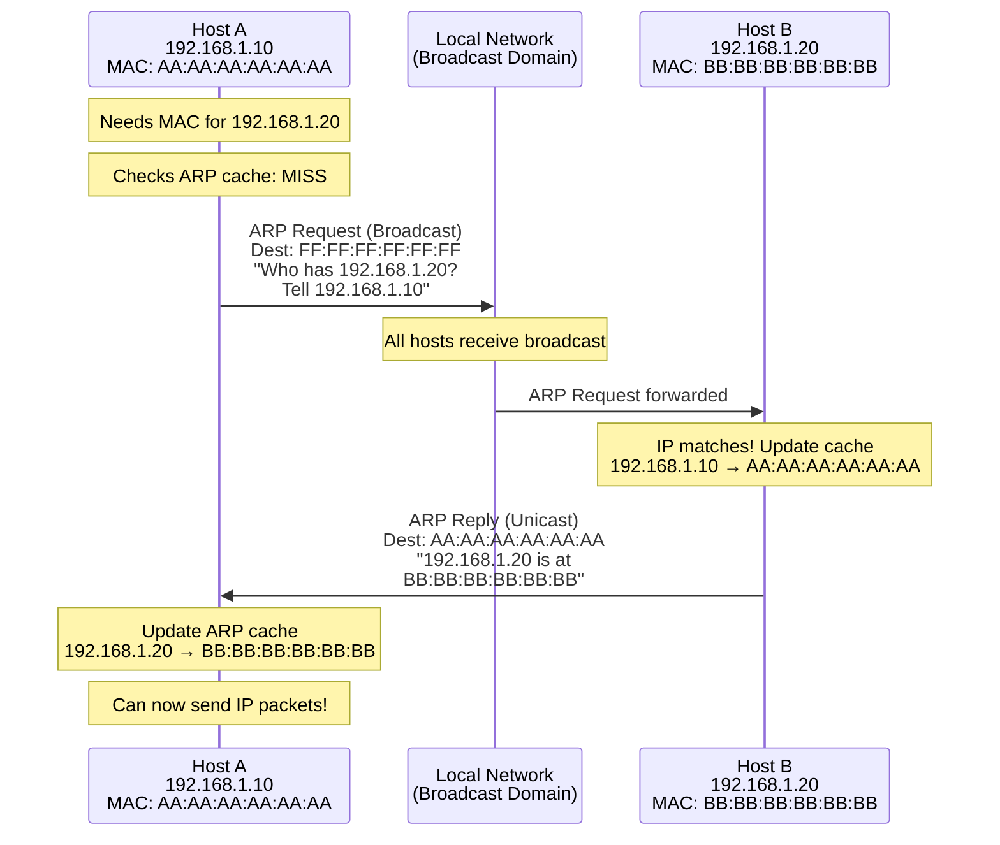

# Address Resolution Protocol (ARP)

The **Address Resolution Protocol (ARP)** is the critical glue connecting the Network layer (IP addresses) to the Data Link layer (MAC addresses). When a host wants to send an IP packet on the local network, it must first discover the destination's MAC address—ARP makes this possible.

## The Address Resolution Problem

```
The Challenge:

Host A wants to send to Host B (192.168.1.20)

Network Layer: "Send packet to IP 192.168.1.20"
                        |
                        v
Data Link Layer: "What MAC address should I use?"
                        |
                        v
                 ARP resolves this!
```

IP addresses are logical and configured; MAC addresses are physical and fixed. ARP bridges this gap on local networks.

## ARP Operation



### ARP Request (Broadcast)

**Step 1**: Host A broadcasts ARP Request asking "Who has 192.168.1.20? Tell 192.168.1.10"

**Packet Details**:
- Ethernet Dest MAC: `FF:FF:FF:FF:FF:FF` (broadcast)
- Ethernet Src MAC: `AA:AA:AA:AA:AA:AA` (Host A)
- ARP Operation: 1 (Request)
- Sender IP: `192.168.1.10`
- Target IP: `192.168.1.20`
- Target MAC: `00:00:00:00:00:00` (unknown)

All hosts on the segment receive this broadcast.

### ARP Reply (Unicast)

**Step 2**: Host B sends unicast ARP Reply stating "192.168.1.20 is at BB:BB:BB:BB:BB:BB"

**Packet Details**:
- Ethernet Dest MAC: `AA:AA:AA:AA:AA:AA` (Host A)
- Ethernet Src MAC: `BB:BB:BB:BB:BB:BB` (Host B)
- ARP Operation: 2 (Reply)
- Sender IP: `192.168.1.20`
- Sender MAC: `BB:BB:BB:BB:BB:BB`

## ARP Packet Format

```
ARP Packet Structure (28 bytes for IPv4/Ethernet):

+------------------+------------------+
| Hardware Type    | Protocol Type    |
|     2 bytes      |     2 bytes      |
+------------------+------------------+
| HW Addr | Proto  |    Operation     |
| Length  | Length |     2 bytes      |
| 1 byte  | 1 byte |                  |
+------------------+------------------+
|      Sender Hardware Address        |
|            6 bytes                  |
+-------------------------------------+
|      Sender Protocol Address        |
|            4 bytes                  |
+-------------------------------------+
|      Target Hardware Address        |
|            6 bytes                  |
+-------------------------------------+
|      Target Protocol Address        |
|            4 bytes                  |
+-------------------------------------+

Field Values:
Hardware Type: 1 (Ethernet)
Protocol Type: 0x0800 (IPv4)
HW Addr Length: 6 (MAC address)
Proto Addr Length: 4 (IPv4 address)
Operation: 1 (Request), 2 (Reply)
```

```python
import struct
from dataclasses import dataclass

@dataclass
class ARPPacket:
    hardware_type: int
    protocol_type: int
    hw_addr_len: int
    proto_addr_len: int
    operation: int
    sender_mac: bytes
    sender_ip: str
    target_mac: bytes
    target_ip: str

    @classmethod
    def from_bytes(cls, data: bytes) -> 'ARPPacket':
        hw_type, proto_type, hw_len, proto_len, op = struct.unpack(
            '!HHBBH', data[:8]
        )

        sender_mac = data[8:14]
        sender_ip = '.'.join(str(b) for b in data[14:18])
        target_mac = data[18:24]
        target_ip = '.'.join(str(b) for b in data[24:28])

        return cls(
            hw_type, proto_type, hw_len, proto_len, op,
            sender_mac, sender_ip, target_mac, target_ip
        )

    def is_request(self) -> bool:
        return self.operation == 1

    def is_reply(self) -> bool:
        return self.operation == 2

    @staticmethod
    def mac_to_str(mac: bytes) -> str:
        return ':'.join(f'{b:02X}' for b in mac)
```

## ARP Cache

Hosts maintain an **ARP cache** (or ARP table) to avoid repeated lookups:

```
ARP Cache Example:

$ arp -a  (Windows/Linux/Mac)

Address         HW Address            Type
192.168.1.1     00:11:22:33:44:55     dynamic
192.168.1.20    BB:BB:BB:BB:BB:BB     dynamic
192.168.1.50    CC:CC:CC:CC:CC:CC     static

Entry Types:
- Dynamic: Learned via ARP, expires after timeout
- Static: Manually configured, permanent

Typical timeout: 2-20 minutes (OS-dependent)
```

```python
import subprocess
import re
from typing import Dict

def get_arp_cache() -> Dict[str, str]:
    """Retrieve ARP cache entries."""
    cache = {}

    # Run arp command
    result = subprocess.run(['arp', '-a'], capture_output=True, text=True)

    # Parse output (varies by OS)
    for line in result.stdout.split('\n'):
        # Look for IP and MAC patterns
        match = re.search(
            r'(\d+\.\d+\.\d+\.\d+).*?([0-9a-fA-F:.-]{17})',
            line
        )
        if match:
            ip, mac = match.groups()
            cache[ip] = mac.replace('-', ':').upper()

    return cache

# Display ARP cache
for ip, mac in get_arp_cache().items():
    print(f"{ip} -> {mac}")
```

## ARP and Routing

### Local Destination

```
Same subnet - ARP for destination directly:

Host A (192.168.1.10) -> Host B (192.168.1.20)

1. A checks: Is 192.168.1.20 on my subnet? YES
2. A sends ARP for 192.168.1.20's MAC
3. A sends frame directly to B's MAC
```

### Remote Destination

```
Different subnet - ARP for gateway:

Host A (192.168.1.10) -> Server (10.0.0.100)

1. A checks: Is 10.0.0.100 on my subnet? NO
2. A looks up default gateway (192.168.1.1)
3. A sends ARP for gateway's MAC (not 10.0.0.100)
4. A sends frame to gateway's MAC
5. Router forwards packet toward destination

Key insight: ARP is always for the NEXT HOP,
not the final destination
```

## Proxy ARP

A router answers ARP requests on behalf of remote hosts:

```
Proxy ARP Scenario:

Network A: 192.168.1.0/24
Network B: 192.168.2.0/24

Host A (192.168.1.10) wants to reach 192.168.2.50
Host A has no route, thinks it's local

Router has Proxy ARP enabled:
1. Host A ARPs for 192.168.2.50
2. Router answers with its own MAC
3. Host A sends frames to router
4. Router forwards to Network B

Use cases:
- Legacy networks without proper routing
- Migration scenarios
- Generally discouraged (security concerns)
```

## Gratuitous ARP

An **unsolicited ARP announcement** where a host advertises its own IP-MAC mapping:

```
Gratuitous ARP uses:

1. IP Address Conflict Detection
   - Host sends ARP for its own IP
   - If reply received, conflict exists

2. Update Other Hosts' Caches
   - After IP address change
   - Failover scenarios

3. Announce Presence
   - Refresh mappings proactively

Format: ARP request with sender IP = target IP
```

## ARP Security Concerns

### ARP Spoofing/Poisoning

```
ARP Spoofing Attack:

Normal:
Host A: 192.168.1.10 → Gateway: 192.168.1.1

Attack:
Attacker sends fake ARP reply:
"192.168.1.1 is at ATTACKER_MAC"

Result:
Host A sends traffic to attacker instead of gateway
Man-in-the-Middle attack possible
```

### Defenses

```
1. Static ARP Entries
   - Manually configure critical entries
   - Doesn't scale

2. Dynamic ARP Inspection (DAI)
   - Switch validates ARP against DHCP bindings
   - Enterprise switches feature

3. ARP Watch/Detection Tools
   - Monitor for suspicious ARP activity
   - arpwatch, XArp

4. VPNs and Encryption
   - Even if traffic intercepted, it's encrypted
```

```python
from collections import defaultdict

class ARPMonitor:
    """Simple ARP spoofing detector."""

    def __init__(self):
        self.ip_to_mac = {}
        self.alerts = []

    def process_arp(self, sender_ip: str, sender_mac: str):
        """Check for suspicious ARP activity."""
        if sender_ip in self.ip_to_mac:
            old_mac = self.ip_to_mac[sender_ip]
            if old_mac != sender_mac:
                alert = (
                    f"ALERT: IP {sender_ip} changed from "
                    f"{old_mac} to {sender_mac}"
                )
                self.alerts.append(alert)
                return alert

        self.ip_to_mac[sender_ip] = sender_mac
        return None

# Example usage
monitor = ARPMonitor()
monitor.process_arp("192.168.1.1", "AA:BB:CC:DD:EE:FF")
alert = monitor.process_arp("192.168.1.1", "11:22:33:44:55:66")
if alert:
    print(alert)  # Potential spoofing detected!
```

## IPv6 and Neighbor Discovery

IPv6 replaces ARP with **Neighbor Discovery Protocol (NDP)**:

```
NDP uses ICMPv6 messages:
- Neighbor Solicitation (NS) ≈ ARP Request
- Neighbor Advertisement (NA) ≈ ARP Reply

Advantages over ARP:
- Part of ICMPv6, not separate protocol
- Uses multicast, not broadcast
- Includes duplicate address detection
- Built-in security extensions (SEND)
```

## Key Takeaways

- ARP maps IP addresses to MAC addresses on local networks
- ARP Request is broadcast; ARP Reply is unicast
- Hosts cache ARP entries to reduce network traffic
- Remote destinations require ARP for the gateway, not final destination
- ARP is vulnerable to spoofing attacks
- IPv6 uses Neighbor Discovery Protocol instead of ARP
- Understanding ARP is essential for network troubleshooting

ARP is simple but fundamental—virtually every IP packet on a LAN requires ARP to function.
