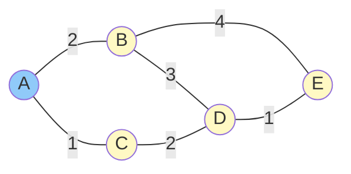

# Dijkstra's Algorithm

## Algorithm Overview

Dijkstra's algorithm finds the shortest path from a source node to all other nodes in a weighted graph. Developed by Edsger Dijkstra in 1956, it's fundamental to link state routing protocols like OSPF.

The algorithm works by iteratively selecting the unvisited node with the smallest known distance, then updating distances to its neighbors. It guarantees optimal paths when all edge weights are non-negative.

## Algorithm Steps

**Input**: Graph G with nodes V and weighted edges E, source node s

**Output**: Shortest distance to all nodes, predecessor for path reconstruction

```
1. Initialize:
   - dist[s] = 0
   - dist[v] = ∞ for all other nodes v
   - prev[v] = undefined for all v
   - unvisited = all nodes

2. While unvisited is not empty:
   a. u = node in unvisited with minimum dist[u]
   b. Remove u from unvisited
   c. For each neighbor v of u still in unvisited:
      - alt = dist[u] + weight(u, v)
      - If alt < dist[v]:
        - dist[v] = alt
        - prev[v] = u

3. Return dist[], prev[]
```

## Worked Example

Consider this network (edge labels are costs):



**Network topology**: Nodes A-E with weighted edges representing link costs.

Finding shortest paths from A:

**Initialization**:
| Node | Distance | Previous | Visited |
|------|----------|----------|---------|
| A | 0 | - | No |
| B | ∞ | - | No |
| C | ∞ | - | No |
| D | ∞ | - | No |
| E | ∞ | - | No |

**Iteration 1**: Select A (dist=0)
- Update B: 0+2=2
- Update C: 0+1=1

| Node | Distance | Previous | Visited |
|------|----------|----------|---------|
| A | 0 | - | Yes |
| B | 2 | A | No |
| C | 1 | A | No |
| D | ∞ | - | No |
| E | ∞ | - | No |

**Iteration 2**: Select C (dist=1)
- Update D: 1+2=3

| Node | Distance | Previous | Visited |
|------|----------|----------|---------|
| A | 0 | - | Yes |
| B | 2 | A | No |
| C | 1 | A | Yes |
| D | 3 | C | No |
| E | ∞ | - | No |

**Iteration 3**: Select B (dist=2)
- Update D: 2+3=5 > 3, no change
- Update E: 2+4=6

| Node | Distance | Previous | Visited |
|------|----------|----------|---------|
| A | 0 | - | Yes |
| B | 2 | A | Yes |
| C | 1 | A | Yes |
| D | 3 | C | No |
| E | 6 | B | No |

**Iteration 4**: Select D (dist=3)
- Update E: 3+1=4 < 6, update!

| Node | Distance | Previous | Visited |
|------|----------|----------|---------|
| A | 0 | - | Yes |
| B | 2 | A | Yes |
| C | 1 | A | Yes |
| D | 3 | C | Yes |
| E | 4 | D | No |

**Iteration 5**: Select E (dist=4)
- No unvisited neighbors

**Final result**:
- A→A: 0
- A→B: 2 (path: A→B)
- A→C: 1 (path: A→C)
- A→D: 3 (path: A→C→D)
- A→E: 4 (path: A→C→D→E)

## Path Reconstruction

To find the actual path, follow the prev[] pointers backward:

**Path to E**: prev[E]=D, prev[D]=C, prev[C]=A → Path: A→C→D→E

## Complexity Analysis

**Time Complexity**:
- Simple implementation: O(V²) where V is number of vertices
- With binary heap: O((V + E) log V)
- With Fibonacci heap: O(E + V log V)

**Space Complexity**: O(V) for distances and predecessors

For dense graphs (many edges), simple implementation works well. For sparse graphs (few edges), heap-based implementations are faster.

## Implementation Considerations

**Priority Queue**: Using a min-heap for unvisited nodes makes selecting the minimum-distance node efficient.

**Negative Weights**: Dijkstra's algorithm doesn't work correctly with negative edge weights. Use Bellman-Ford instead.

**Termination**: Can terminate early if only finding path to specific destination (when that node is visited).

## Application to Routing

In OSPF, each router:
1. Builds a graph from link state database
2. Runs Dijkstra with itself as source
3. Results become the routing table

**Considerations for routing**:
- Run after any topology change (new LSA received)
- SPF calculation can be CPU-intensive for large networks
- SPF delay/throttling prevents excessive recalculation
- Incremental SPF algorithms exist for efficiency

## Pseudocode Implementation

```python
def dijkstra(graph, source):
    dist = {v: float('infinity') for v in graph}
    prev = {v: None for v in graph}
    dist[source] = 0
    unvisited = set(graph.keys())

    while unvisited:
        # Find minimum distance unvisited node
        u = min(unvisited, key=lambda v: dist[v])
        unvisited.remove(u)

        # Update distances to neighbors
        for v, weight in graph[u].items():
            if v in unvisited:
                alt = dist[u] + weight
                if alt < dist[v]:
                    dist[v] = alt
                    prev[v] = u

    return dist, prev
```

Understanding Dijkstra's algorithm is essential for understanding how link state routing protocols compute optimal paths through complex networks.
