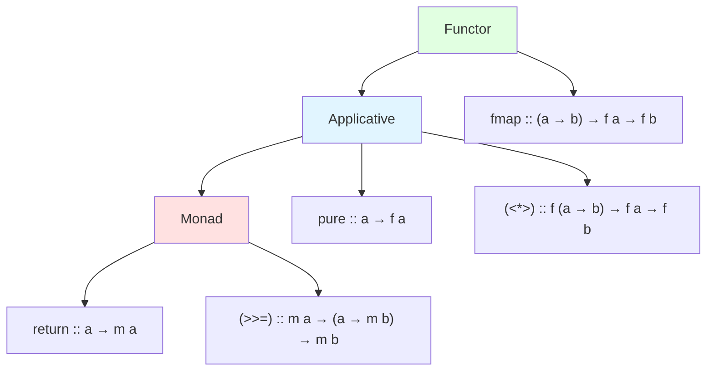

# Monads and Functors

Monads and functors are abstract patterns from category theory that have proven remarkably useful in functional programming. They provide a unified way to handle common programming patterns like optional values, error handling, state, and I/O while maintaining functional purity.

## Functors: Mapping Over Containers

A functor is any type that supports a mapping operation. If you have a container of values and a function, a functor lets you apply that function to the values inside.



### The Functor Type Class

```haskell
class Functor f where
    fmap :: (a -> b) -> f a -> f b
```

Functor laws ensure predictable behavior:

**Identity**: $\text{fmap} \, \text{id} = \text{id}$

**Composition**: $\text{fmap} \, (g \circ h) = \text{fmap} \, g \circ \text{fmap} \, h$

### Common Functor Instances

```haskell
-- Lists
instance Functor [] where
    fmap = map

fmap (+1) [1, 2, 3]  -- [2, 3, 4]

-- Maybe
instance Functor Maybe where
    fmap _ Nothing  = Nothing
    fmap f (Just x) = Just (f x)

fmap (*2) (Just 5)   -- Just 10
fmap (*2) Nothing    -- Nothing

-- Either (functor over the right value)
instance Functor (Either e) where
    fmap _ (Left e)  = Left e
    fmap f (Right x) = Right (f x)

-- Functions (functor over return type)
instance Functor ((->) r) where
    fmap = (.)

-- IO
instance Functor IO where
    fmap f action = do
        x <- action
        return (f x)
```

### Functor Laws in Practice

The laws ensure fmap behaves predictably:

```haskell
-- Identity: mapping id changes nothing
fmap id [1,2,3] == [1,2,3]        -- True
fmap id (Just 5) == Just 5        -- True

-- Composition: can combine or split maps
fmap (f . g) xs == fmap f (fmap g xs)
fmap ((*2) . (+1)) [1,2,3] == fmap (*2) (fmap (+1) [1,2,3])
-- [4, 6, 8] == [4, 6, 8]
```

## Applicative Functors

Applicative functors extend functors to allow applying functions that are themselves wrapped:

```haskell
class Functor f => Applicative f where
    pure  :: a -> f a
    (<*>) :: f (a -> b) -> f a -> f b

-- Laws:
-- Identity:     pure id <*> v = v
-- Composition:  pure (.) <*> u <*> v <*> w = u <*> (v <*> w)
-- Homomorphism: pure f <*> pure x = pure (f x)
-- Interchange:  u <*> pure y = pure ($ y) <*> u
```

### Applicative Examples

```haskell
-- Maybe
instance Applicative Maybe where
    pure = Just
    Nothing <*> _ = Nothing
    Just f <*> x  = fmap f x

pure (+) <*> Just 2 <*> Just 3  -- Just 5
pure (+) <*> Nothing <*> Just 3 -- Nothing

-- Lists (all combinations)
instance Applicative [] where
    pure x = [x]
    fs <*> xs = [f x | f <- fs, x <- xs]

[(+1), (*2)] <*> [1, 2, 3]  -- [2,3,4,2,4,6]
```

### Applicative Style

Applicative enables a lifted function application style:

```haskell
-- Without applicative
add :: Maybe Int -> Maybe Int -> Maybe Int
add mx my = case mx of
    Nothing -> Nothing
    Just x  -> case my of
        Nothing -> Nothing
        Just y  -> Just (x + y)

-- With applicative
add :: Maybe Int -> Maybe Int -> Maybe Int
add mx my = (+) <$> mx <*> my
-- or: pure (+) <*> mx <*> my
-- or: liftA2 (+) mx my
```

## Monads: Sequencing Computations

Monads extend applicative functors with the ability to sequence computations where each step can depend on previous results:

```haskell
class Applicative m => Monad m where
    return :: a -> m a
    (>>=)  :: m a -> (a -> m b) -> m b
```

Monad laws ensure composability and predictability:

**Left identity**: $\text{return} \, a \gg\!\!= f \equiv f \, a$

**Right identity**: $m \gg\!\!= \text{return} \equiv m$

**Associativity**: $(m \gg\!\!= f) \gg\!\!= g \equiv m \gg\!\!= (\lambda x. f \, x \gg\!\!= g)$

### The Key Insight

Monads allow sequencing where later computations can depend on earlier results:

```haskell
-- Applicative: arguments are independent
pure f <*> action1 <*> action2

-- Monad: second computation can depend on first result
action1 >>= \x -> action2 x
```

### Common Monad Instances

```haskell
-- Maybe: short-circuiting on Nothing
instance Monad Maybe where
    Nothing >>= _ = Nothing
    Just x  >>= f = f x

safeDivide :: Int -> Int -> Maybe Int
safeDivide _ 0 = Nothing
safeDivide x y = Just (x `div` y)

computation :: Maybe Int
computation = do
    x <- safeDivide 10 2    -- Just 5
    y <- safeDivide x 0     -- Nothing (short-circuits)
    return (y + 1)          -- Never reached

-- Either: error handling
instance Monad (Either e) where
    Left e  >>= _ = Left e
    Right x >>= f = f x

-- List: non-determinism
instance Monad [] where
    xs >>= f = concatMap f xs

pairs :: [(Int, Int)]
pairs = do
    x <- [1, 2, 3]
    y <- [4, 5]
    return (x, y)
-- [(1,4),(1,5),(2,4),(2,5),(3,4),(3,5)]

-- IO: sequencing effects
instance Monad IO where
    -- primitive implementation
```

### Do Notation

Do notation provides imperative-looking syntax for monadic code:

```haskell
-- Desugaring rules:
-- do { x }           =  x
-- do { x; stmts }    =  x >> do { stmts }
-- do { p <- x; stmts } = x >>= \p -> do { stmts }

-- This do block:
example :: IO ()
example = do
    putStrLn "Enter name:"
    name <- getLine
    putStrLn ("Hello, " ++ name)

-- Desugars to:
example :: IO ()
example =
    putStrLn "Enter name:" >>
    getLine >>= \name ->
    putStrLn ("Hello, " ++ name)
```

## The State Monad

State monad threads state through computations:

```haskell
newtype State s a = State { runState :: s -> (a, s) }

instance Monad (State s) where
    return x = State $ \s -> (x, s)
    (State f) >>= g = State $ \s ->
        let (a, s') = f s
        in runState (g a) s'

get :: State s s
get = State $ \s -> (s, s)

put :: s -> State s ()
put s = State $ \_ -> ((), s)

modify :: (s -> s) -> State s ()
modify f = State $ \s -> ((), f s)

-- Example: stack operations
type Stack = [Int]

push :: Int -> State Stack ()
push x = modify (x:)

pop :: State Stack Int
pop = do
    (x:xs) <- get
    put xs
    return x

stackOps :: State Stack Int
stackOps = do
    push 1
    push 2
    push 3
    x <- pop
    y <- pop
    return (x + y)  -- Returns 5

runState stackOps []  -- (5, [1])
```

## The Reader Monad

Reader provides read-only environment access:

```haskell
newtype Reader r a = Reader { runReader :: r -> a }

instance Monad (Reader r) where
    return x = Reader $ \_ -> x
    (Reader f) >>= g = Reader $ \r ->
        runReader (g (f r)) r

ask :: Reader r r
ask = Reader id

-- Example: configuration
data Config = Config { dbHost :: String, dbPort :: Int }

getConnection :: Reader Config String
getConnection = do
    config <- ask
    return $ dbHost config ++ ":" ++ show (dbPort config)
```

## The Writer Monad

Writer accumulates output alongside computation:

```haskell
newtype Writer w a = Writer { runWriter :: (a, w) }

instance Monoid w => Monad (Writer w) where
    return x = Writer (x, mempty)
    (Writer (x, w)) >>= f =
        let (y, w') = runWriter (f x)
        in Writer (y, w `mappend` w')

tell :: w -> Writer w ()
tell w = Writer ((), w)

-- Example: logging
computation :: Writer [String] Int
computation = do
    tell ["Starting computation"]
    let x = 2 + 2
    tell ["Computed x = " ++ show x]
    return x

runWriter computation  -- (4, ["Starting computation", "Computed x = 4"])
```

## Monad Transformers

Combine monads to get combined effects:

```haskell
-- MaybeT adds Maybe behavior to any monad
newtype MaybeT m a = MaybeT { runMaybeT :: m (Maybe a) }

-- Combine IO and Maybe
type IOMaybe a = MaybeT IO a

lookupUser :: UserId -> IOMaybe User
lookupUser uid = MaybeT $ do
    users <- readUsersFromDB  -- IO action
    return $ find ((== uid) . id) users  -- Returns Maybe
```

## Key Takeaways

- Functors allow mapping functions over wrapped values
- Applicative functors enable applying wrapped functions to wrapped values
- Monads enable sequencing where later steps depend on earlier results
- Functor → Applicative → Monad is a hierarchy of increasing power
- Common monads: Maybe (optional), Either (errors), List (nondeterminism), IO (effects)
- State, Reader, Writer monads handle common patterns
- Do notation provides imperative-style syntax for monadic code
- Monad transformers combine multiple effects
- Laws ensure consistent, predictable behavior

Monads are not magic—they're a design pattern for sequencing computations. Once you recognize the pattern, you'll see it everywhere: Promise chains in JavaScript, Option/Result in Rust, LINQ in C#. The abstraction provides vocabulary and laws that make reasoning about effectful code tractable.
