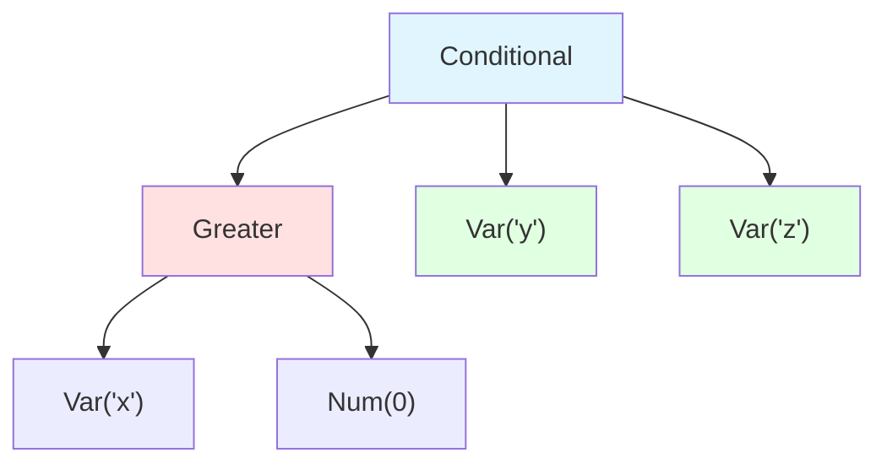
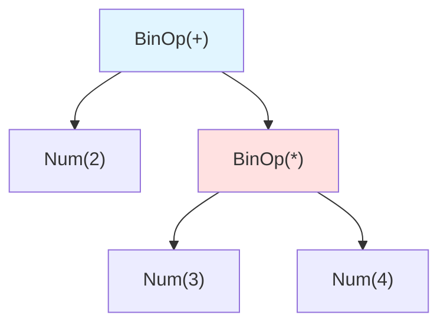

# Abstract Syntax and AST Representation

The Abstract Syntax Tree (AST) is the fundamental data structure for representing programs in interpreters and compilers. It captures the hierarchical structure of source code while abstracting away syntactic details that don't affect meaning, providing a clean interface between parsing and interpretation.

## From Concrete to Abstract Syntax

Source code is a linear sequence of characters, but programs have inherent hierarchical structure. The journey from text to executable representation passes through two key representations:

**Concrete Syntax** is the actual textual representation including all syntactic details: keywords, punctuation, whitespace, comments, and operator precedence. The concrete syntax for `2 + 3 * 4` includes the exact characters, spacing, and the implicit precedence rules.

**Abstract Syntax** strips away parsing artifacts and represents just the essential program structure. It captures what the program means, not how it's written. Parentheses, semicolons, and keywords like `then` and `fi` typically don't appear in abstract syntax because they're merely syntactic markers.

Consider these equivalent concrete expressions:
```
if x > 0 then y else z
x > 0 ? y : z
(if (> x 0) y z)
```

Despite different concrete syntax, they all map to the same abstract syntax tree:



This abstraction simplifies the interpreter: it operates on a canonical representation regardless of syntactic variations.

## AST Structure and Design

An AST is a tree where:
- **Leaf nodes** represent atomic values: literals (numbers, strings, booleans) and variables
- **Internal nodes** represent operations: arithmetic operators, function calls, control flow constructs
- **Children** of a node are its operands or subexpressions

The design of AST nodes profoundly affects interpreter implementation. Consider alternative designs for arithmetic expressions:

**Tagged Union Approach** (used in many functional languages):
```haskell
data Expr = Num Int
          | Var String
          | Add Expr Expr
          | Sub Expr Expr
          | Mul Expr Expr
          | Div Expr Expr
```

**Object-Oriented Approach** (common in Java/Python):
```python
class Expr:
    pass

class Num(Expr):
    def __init__(self, value):
        self.value = value

class BinOp(Expr):
    def __init__(self, left, op, right):
        self.left = left
        self.op = op  # operator enum or string
        self.right = right
```

**Generic Parameterized Approach**:
```rust
enum Expr {
    Literal(Value),
    Variable(String),
    Binary { left: Box<Expr>, op: BinOp, right: Box<Expr> },
    Unary { op: UnaryOp, operand: Box<Expr> },
}
```

Each design has trade-offs:
- **Extensibility**: Adding new node types
- **Type safety**: Catching errors at compile time
- **Pattern matching**: Ease of case analysis
- **Memory layout**: Cache efficiency and allocation overhead

## Statement vs Expression ASTs

Most languages distinguish between statements (executed for effect) and expressions (evaluated for value). This distinction appears in the AST design:

```python
# Expression AST nodes
class Expr:
    pass

class NumExpr(Expr):
    def __init__(self, value):
        self.value = value

class BinaryExpr(Expr):
    def __init__(self, left, op, right):
        self.left = left
        self.op = op
        self.right = right

# Statement AST nodes
class Stmt:
    pass

class Assignment(Stmt):
    def __init__(self, var, expr):
        self.var = var
        self.expr = expr  # Expression

class While(Stmt):
    def __init__(self, condition, body):
        self.condition = condition  # Expression
        self.body = body  # Statement

class Block(Stmt):
    def __init__(self, statements):
        self.statements = statements  # List of statements
```

Some languages blur this distinction. In Ruby and Scala, everything is an expression - even `if` and loops return values. This simplifies the AST:

```ruby
# Ruby: if is an expression
x = if y > 0 then 1 else -1 end
```

The corresponding AST is cleaner because there's only one evaluation mechanism, not separate statement execution and expression evaluation.

## From Parsing to AST

The parser transforms token streams into ASTs, handling operator precedence and associativity. Consider parsing `2 + 3 * 4`:

**Tokens**: `[NUM(2), PLUS, NUM(3), MULT, NUM(4)]`

A recursive descent parser might use these rules:
```python
def parse_expr():
    return parse_addition()

def parse_addition():
    left = parse_multiplication()
    while current_token == PLUS or current_token == MINUS:
        op = current_token
        advance()
        right = parse_multiplication()
        left = BinOp(left, op, right)
    return left

def parse_multiplication():
    left = parse_primary()
    while current_token == MULT or current_token == DIV:
        op = current_token
        advance()
        right = parse_primary()
        left = BinOp(left, op, right)
    return left

def parse_primary():
    if current_token.type == NUMBER:
        value = current_token.value
        advance()
        return Num(value)
    elif current_token.type == IDENTIFIER:
        name = current_token.value
        advance()
        return Var(name)
    elif current_token == LPAREN:
        advance()
        expr = parse_expr()
        expect(RPAREN)
        return expr
```

This produces the correctly structured AST respecting operator precedence:



The grammar's structure directly determines the AST shape. Multiplication binds tighter than addition, so `3 * 4` becomes a subtree that's the right operand of addition.

## Traversing and Transforming ASTs

Once we have an AST, we need to traverse it for various purposes: interpretation, type checking, optimization, code generation. Two fundamental patterns emerge:

**Visitor Pattern**: Separate tree traversal from operations on nodes.
```python
class ExprVisitor:
    def visit_num(self, node):
        pass

    def visit_var(self, node):
        pass

    def visit_binop(self, node):
        pass

class Interpreter(ExprVisitor):
    def __init__(self, env):
        self.env = env

    def visit_num(self, node):
        return node.value

    def visit_var(self, node):
        return self.env.get(node.name)

    def visit_binop(self, node):
        left = node.left.accept(self)
        right = node.right.accept(self)
        if node.op == '+':
            return left + right
        elif node.op == '*':
            return left * right
        # ...
```

**Direct Pattern Matching**: Modern languages support pattern matching on AST structure.
```rust
fn eval(expr: &Expr, env: &Environment) -> Value {
    match expr {
        Expr::Literal(v) => v.clone(),
        Expr::Variable(name) => env.get(name),
        Expr::Binary { left, op, right } => {
            let lval = eval(left, env);
            let rval = eval(right, env);
            match op {
                BinOp::Add => lval + rval,
                BinOp::Mul => lval * rval,
                // ...
            }
        }
    }
}
```

AST transformations optimize or desugar programs. Common transformations include:

**Constant Folding**: Replace `2 + 3` with `5` at compile time.
```python
def optimize(expr):
    if isinstance(expr, BinOp):
        left = optimize(expr.left)
        right = optimize(expr.right)

        # If both operands are constants, compute result
        if isinstance(left, Num) and isinstance(right, Num):
            if expr.op == '+':
                return Num(left.value + right.value)
            # ...

        return BinOp(left, expr.op, right)
    else:
        return expr
```

**Desugaring**: Transform complex constructs to simpler ones.
```python
# Transform: for item in list: body
# Into: iter = list.__iter__()
#       while iter.has_next():
#           item = iter.next()
#           body
```

## Annotated ASTs

As interpretation proceeds, we often need to attach information to AST nodes:
- **Type annotations**: Result of type checking
- **Source locations**: For error messages
- **Scope information**: Which declarations each name refers to
- **Optimization hints**: Frequently executed code

One approach adds fields to AST nodes:
```python
class Expr:
    def __init__(self):
        self.type = None      # Filled by type checker
        self.location = None  # Source file position
```

Another approach uses separate dictionaries mapping nodes to attributes:
```python
class Interpreter:
    def __init__(self):
        self.type_map = {}    # node -> type
        self.source_map = {}  # node -> location
```

The separate dictionary approach avoids modifying AST definitions but requires hashable AST nodes.

## Immutable vs Mutable ASTs

AST mutability significantly affects interpreter design.

**Immutable ASTs** cannot be modified after creation. Transformations create new trees:
```haskell
optimize :: Expr -> Expr
optimize (Add (Num x) (Num y)) = Num (x + y)
optimize (Add e1 e2) = Add (optimize e1) (optimize e2)
-- Returns new AST, original unchanged
```

Benefits:
- Thread-safe by default
- Easier to reason about
- Natural in functional languages
- Can share substructures safely

Drawbacks:
- Requires more allocation
- Transformations may be less efficient

**Mutable ASTs** can be modified in place:
```python
def optimize_in_place(node):
    if isinstance(node, BinOp):
        optimize_in_place(node.left)
        optimize_in_place(node.right)

        if isinstance(node.left, Num) and isinstance(node.right, Num):
            # Replace this node with constant
            node.__class__ = Num
            node.value = node.left.value + node.right.value
            # Clear unused fields
            del node.left, node.right, node.op
```

Benefits:
- Memory efficient
- Can modify large trees efficiently

Drawbacks:
- Error-prone (mutation can cause bugs)
- Thread-unsafe
- Harder to implement some analyses

## Representing Scope and Bindings

Variable references in source code are just names, but the AST often needs to record which declaration each name refers to:

```python
let x = 1 in
    let x = 2 in
        x + x  # Which x?
```

**Name Resolution** phase annotates the AST with binding information:

```python
class Var:
    def __init__(self, name):
        self.name = name
        self.binding = None  # Filled during name resolution

def resolve_names(expr, scope):
    if isinstance(expr, Var):
        expr.binding = scope.lookup(expr.name)
    elif isinstance(expr, Let):
        new_scope = scope.extend(expr.var, expr.binding_expr)
        resolve_names(expr.body, new_scope)
    # ...
```

Now the interpreter can directly access bindings without searching by name, improving performance and handling shadowing correctly.

Some languages convert names to De Bruijn indices, where each variable reference is a number indicating how many binders away its declaration is:
```
λx. λy. x y  becomes  λ λ 1 0
```

This eliminates name confusion entirely but makes the AST less readable.
