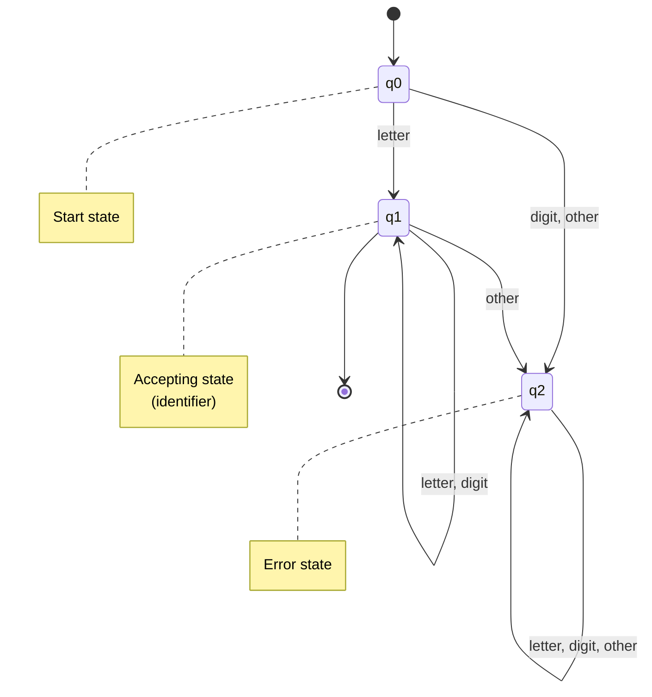
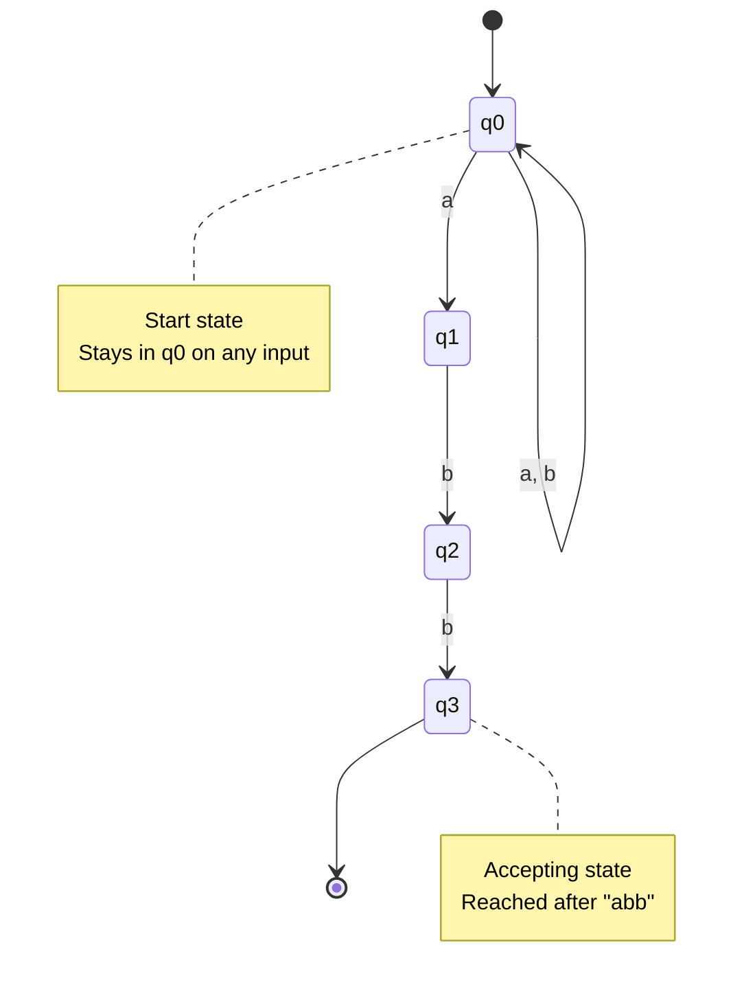
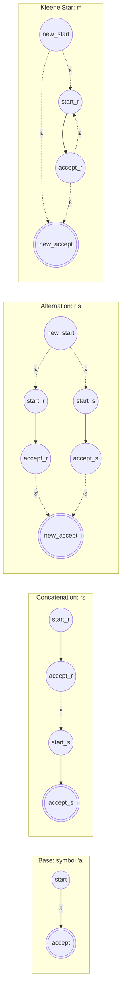

# Finite Automata for Pattern Matching

Finite automata are the computational models underlying lexical analysis. They provide an efficient, algorithmic method for recognizing patterns defined by regular expressions. While regular expressions offer a declarative way to specify token patterns, finite automata provide the executable mechanism for matching those patterns against input strings. Understanding finite automata is essential for implementing efficient scanners and appreciating how lexical analyzers achieve their performance.

## What are Finite Automata?

A finite automaton is an abstract machine that reads an input string symbol by symbol and either accepts or rejects the string based on a set of rules. The automaton has a finite number of states and transitions between states based on input symbols. Finite automata come in two main varieties: nondeterministic finite automata (NFAs) and deterministic finite automata (DFAs).

Both NFAs and DFAs recognize exactly the class of regular languages—the same languages described by regular expressions. This equivalence is fundamental: any pattern expressible as a regular expression can be recognized by a finite automaton, and vice versa.

## Deterministic Finite Automata (DFA)

A deterministic finite automaton is defined by a 5-tuple $M = (Q, \Sigma, \delta, q_0, F)$ where:
- $Q$ is a finite set of states
- $\Sigma$ is a finite alphabet (input symbols)
- $\delta: Q \times \Sigma \rightarrow Q$ is the transition function
- $q_0 \in Q$ is the start state
- $F \subseteq Q$ is the set of accepting (final) states

The key characteristic of a DFA is determinism: for each state and input symbol, there is exactly one next state. Formally, $\delta(q, a)$ yields exactly one state for any $q \in Q$ and $a \in \Sigma$. This makes DFAs straightforward to implement and efficient to execute.

### DFA Example: Recognizing Identifiers

Consider a DFA that recognizes identifiers (letter followed by letters or digits):

$$M = (\{q_0, q_1, q_2\}, \{\text{letter}, \text{digit}, \text{other}\}, \delta, q_0, \{q_1\})$$



The DFA accepts strings that begin with a letter followed by any sequence of letters or digits. The accepting state $q_1$ is marked with a double circle in traditional notation.

### DFA Execution

Executing a DFA on an input string is simple:

```python
def dfa_execute(dfa, input_string):
    current_state = dfa.start_state

    for symbol in input_string:
        current_state = dfa.transition(current_state, symbol)
        if current_state is None:  # No valid transition
            return False

    return current_state in dfa.accepting_states
```

Time complexity is $O(n)$ where $n$ is the input length, and space complexity is $O(1)$ (just tracking the current state). This efficiency makes DFAs ideal for lexical analysis.

## Nondeterministic Finite Automata (NFA)

A nondeterministic finite automaton relaxes the determinism requirement: from a given state on a given input symbol, there can be zero, one, or multiple possible next states. Additionally, NFAs support $\varepsilon$-transitions—transitions that occur without consuming any input symbol.

An NFA is defined similarly to a DFA but with a nondeterministic transition function:
$$\delta: Q \times (\Sigma \cup \{\varepsilon\}) \rightarrow \mathcal{P}(Q)$$

where $\mathcal{P}(Q)$ is the power set of $Q$ (the set of all subsets of $Q$), meaning $\delta$ returns a set of states rather than a single state.

### Why NFAs?

NFAs are generally easier to construct from regular expressions than DFAs. They require fewer states and have a simpler structure. However, they're more complex to execute because the automaton can be in multiple states simultaneously.

### NFA Example: Recognizing (a|b)*abb

Consider an NFA for the regular expression `(a|b)*abb`:



This NFA can be in multiple states simultaneously. After reading 'a', it's in both state $q_0$ (via the self-loop) and state $q_1$ (via the transition to match the pattern). The nondeterminism allows the automaton to "guess" when the final "abb" sequence begins.

### NFA Execution

Executing an NFA requires tracking all possible states:

```python
def nfa_execute(nfa, input_string):
    current_states = epsilon_closure({nfa.start_state})

    for symbol in input_string:
        next_states = set()
        for state in current_states:
            next_states.update(nfa.transition(state, symbol))
        current_states = epsilon_closure(next_states)

    return any(state in nfa.accepting_states for state in current_states)

def epsilon_closure(states):
    """Compute all states reachable via ε-transitions."""
    closure = set(states)
    stack = list(states)

    while stack:
        state = stack.pop()
        for next_state in nfa.epsilon_transitions(state):
            if next_state not in closure:
                closure.add(next_state)
                stack.append(next_state)

    return closure
```

NFA execution is less efficient than DFA execution, requiring $O(|Q|)$ space to track current states and potentially $O(|Q|)$ time per input symbol, where $|Q|$ is the number of states.

## Converting Regular Expressions to NFAs

Thompson's construction is a systematic algorithm for converting any regular expression to an equivalent NFA. It builds the NFA compositionally based on the structure of the regular expression:

### Base Cases

- For ε: Create two states with an ε-transition between them
- For symbol 'a': Create two states with an 'a'-transition between them

### Recursive Cases

- For r|s: Create NFAs for r and s, then add a new start state with ε-transitions to both sub-NFA start states, and a new accepting state with ε-transitions from both sub-NFA accepting states

- For rs: Create NFAs for r and s, then add ε-transitions from r's accepting states to s's start state

- For r*: Create an NFA for r, add a new start state with an ε-transition to r's start, add ε-transitions from r's accepting states back to r's start, and add an ε-transition from the new start directly to a new accepting state

Thompson's construction produces an NFA with at most $2|r|$ states, where $|r|$ is the length of the regular expression.



The diagram shows Thompson's construction templates for basic regular expression operations. Dashed arrows represent $\varepsilon$-transitions.

## Converting NFAs to DFAs

While NFAs are easier to construct, DFAs are more efficient to execute. The subset construction algorithm converts any NFA to an equivalent DFA:

### Subset Construction Algorithm

1. The DFA's start state is the ε-closure of the NFA's start state
2. For each DFA state D (a set of NFA states) and each input symbol a:
   - Compute the set of NFA states reachable from states in D on symbol a
   - Take the ε-closure of this set to get a new DFA state D'
   - Add a transition from D to D' on symbol a
3. A DFA state is accepting if it contains any NFA accepting state

```python
def nfa_to_dfa(nfa):
    dfa_start = epsilon_closure({nfa.start_state})
    dfa_states = {dfa_start}
    dfa_transitions = {}
    unmarked_states = [dfa_start]

    while unmarked_states:
        current = unmarked_states.pop()

        for symbol in nfa.alphabet:
            next_nfa_states = set()
            for nfa_state in current:
                next_nfa_states.update(nfa.transition(nfa_state, symbol))

            next_dfa_state = epsilon_closure(next_nfa_states)

            if next_dfa_state and next_dfa_state not in dfa_states:
                dfa_states.add(next_dfa_state)
                unmarked_states.append(next_dfa_state)

            dfa_transitions[(current, symbol)] = next_dfa_state

    dfa_accepting = {s for s in dfa_states if s & nfa.accepting_states}

    return DFA(dfa_states, dfa_transitions, dfa_start, dfa_accepting)
```

The resulting DFA may have up to $2^{|Q|}$ states in the worst case (exponential blowup), though practical NFAs from regular expressions typically produce much smaller DFAs. Each DFA state corresponds to a subset of NFA states, hence the name "subset construction."

## DFA Minimization

A DFA may have redundant states that can be merged without changing the language it accepts. DFA minimization algorithms reduce the automaton to its smallest equivalent form.

### Hopcroft's Algorithm

The standard approach partitions states into equivalence classes:

1. Initially partition states into accepting and non-accepting sets
2. Refine partitions: split any set where states differ in their transitions
3. Continue until no further refinement is possible
4. Each final partition becomes a state in the minimized DFA

Minimization is important for reducing memory usage and improving cache performance in table-driven scanners.

## Implementing Scanners with DFAs

A DFA can be implemented as:

### Table-Driven Scanner

Store transitions in a 2D array indexed by state and input symbol:

```c
int transition_table[NUM_STATES][ALPHABET_SIZE];

int scan(char* input) {
    int state = START_STATE;
    for (int i = 0; input[i] != '\0'; i++) {
        state = transition_table[state][input[i]];
        if (state == ERROR_STATE) return 0;
    }
    return is_accepting[state];
}
```

### Direct-Coded Scanner

Convert each state to code with explicit branching:

```c
int scan(char* input) {
    int pos = 0;
state0:
    if (input[pos] == 'a') { pos++; goto state1; }
    else if (input[pos] == 'b') { pos++; goto state2; }
    else goto error;
state1:
    if (input[pos] == 'a') { pos++; goto state1; }
    else if (input[pos] == '\0') return 1;  // accepting
    else goto error;
// ... more states ...
error:
    return 0;
}
```

Table-driven scanners are compact and easy to generate but may have cache locality issues. Direct-coded scanners are larger but potentially faster due to better branch prediction.

## Key Takeaways

- Finite automata provide the computational model for pattern matching in lexical analysis
- DFAs are deterministic (one next state per input symbol) and execute efficiently in O(n) time
- NFAs allow nondeterminism and ε-transitions, making them easier to construct from regular expressions
- Thompson's construction converts regular expressions to NFAs compositionally
- Subset construction converts NFAs to equivalent DFAs by treating sets of NFA states as DFA states
- DFA minimization reduces automata to their smallest equivalent form using partition refinement
- DFAs can be implemented as table-driven scanners or direct-coded scanners, each with performance trade-offs
