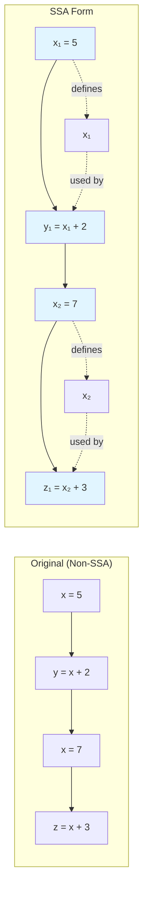
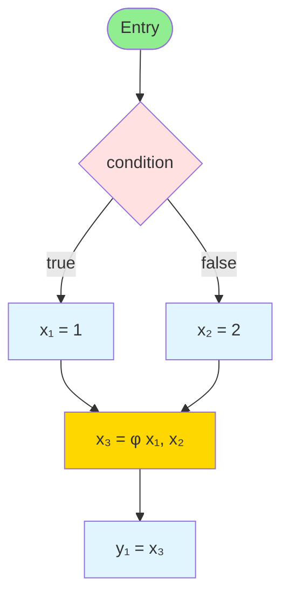
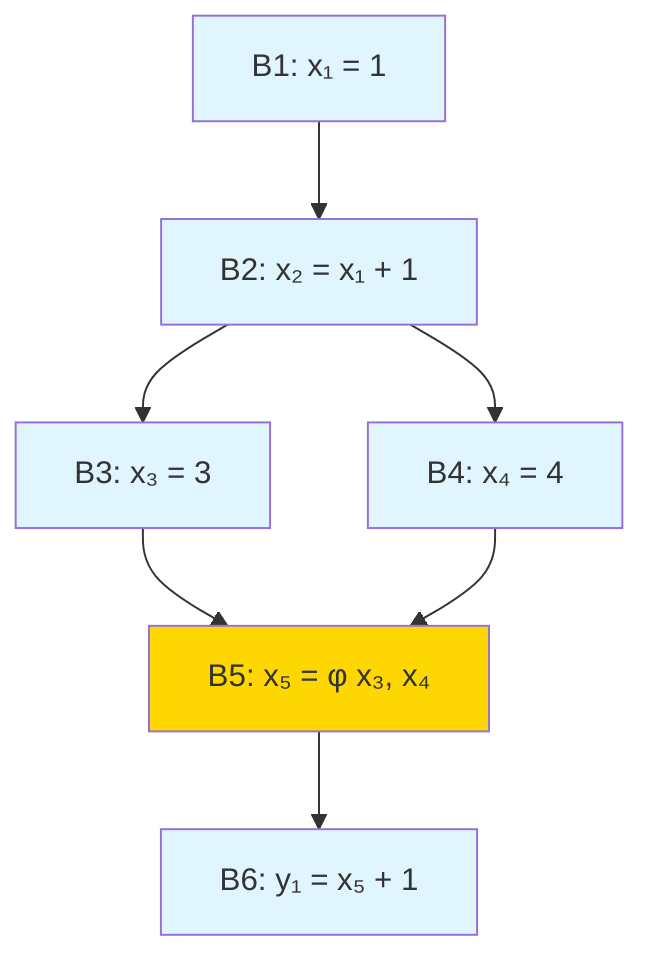
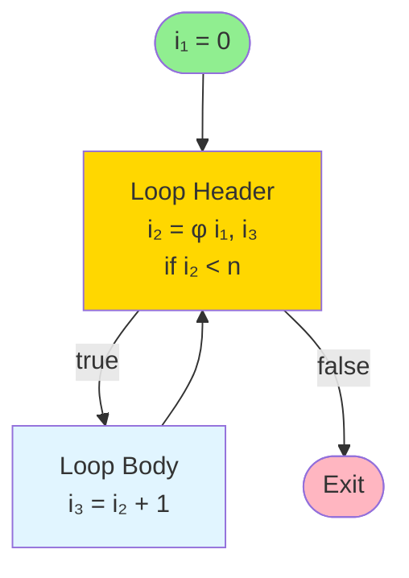

# Static Single Assignment Form

Static Single Assignment (SSA) form is a powerful intermediate representation that simplifies many compiler optimizations by imposing a crucial invariant: each variable is assigned exactly once in the program text. Since its introduction in the late 1980s, SSA has become the dominant IR in modern optimizing compilers, including GCC, LLVM, and the Java HotSpot VM. This section explores SSA's structure, benefits, construction algorithms, and practical applications.

## The SSA Property

In SSA form, every variable has exactly one static assignment point. When a variable would be assigned multiple times in conventional IR, SSA creates distinct versions of the variable.

### Example Transformation

**Original Code:**
```
x = 5
y = x + 2
x = 7
z = x + 3
```

**SSA Form:**
```
x₁ = 5
y₁ = x₁ + 2
x₂ = 7
z₁ = x₂ + 3
```



Each assignment creates a new variable version ($x_1, x_2$), and uses reference the appropriate version. This makes def-use chains (relationships between definitions and uses) explicit in variable names.

### Why SSA?

The single assignment property provides several advantages:

**Simplified Data Flow Analysis**: In conventional IR, determining which definition reaches which use requires iterative data flow analysis. In SSA, the reaching definition is encoded in the variable name itself—if you see a use of x₃, you know exactly which definition (the unique assignment to x₃) produces that value.

**More Effective Optimizations**: Many optimizations become more powerful or efficient in SSA:
- **Constant Propagation**: Track constant values per variable version, not per program point
- **Dead Code Elimination**: If a variable version is never used, its definition is dead
- **Common Subexpression Elimination**: Identical expressions using same SSA variables are guaranteed equivalent
- **Register Allocation**: SSA variables have clearer lifetimes

**Sparse Analysis**: SSA enables sparse analysis techniques that propagate information only along def-use edges, not through every program point, dramatically improving efficiency for large programs.

## Phi Functions

Control flow merges create a problem: when multiple paths assign different versions of a variable, which version should subsequent uses reference?

### The Merge Problem

```
if (condition) {
    x = 1    ; one definition
} else {
    x = 2    ; another definition
}
y = x        ; which x?
```

In SSA, we need distinct variable versions for each assignment:

```
if (condition) {
    x₁ = 1
} else {
    x₂ = 2
}
y₁ = ???     ; x₁ or x₂?
```

### Phi Functions: The Solution

SSA introduces $\varphi$ **(phi) functions** at merge points to select the appropriate variable version based on which control flow path was taken:



The $\varphi$ function is a pseudo-operation that "merges" variable versions from different control flow paths:

$$x_3 = \varphi(x_1, x_2) = \begin{cases} x_1 & \text{if came from true branch} \\ x_2 & \text{if came from false branch} \end{cases}$$

It conceptually executes on the control flow edge, selecting the version from the predecessor block that was executed.

### Phi Function Semantics

A $\varphi$ function at the start of block $B$ with $n$ predecessors has the form:

$$x = \varphi(x_1, x_2, \ldots, x_n)$$

The value of $x$ is $x_i$ if control reaches $B$ from the $i$-th predecessor.

**Multi-Predecessor Example:**



At B5, $x_5$ receives $x_3$ if coming from B3, or $x_4$ if coming from B4. The $\varphi$ function (shown in gold) merges the two possible values.

### Phi Functions and Loops

Loops introduce cyclic dependencies between phi functions and loop body assignments:

**Original:**
```
i = 0
while (i < n) {
    i = i + 1
}
```

**SSA:**
```
i₁ = 0
goto loop_header

loop_header:
    i₂ = φ(i₁, i₃)      ; i₁ from entry, i₃ from loop body
    if i₂ < n goto loop_body else goto exit

loop_body:
    i₃ = i₂ + 1
    goto loop_header

exit:
    ; ...
```



The $\varphi$ function at the loop header merges the initial value ($i_1$) with the updated value from the loop body ($i_3$), creating the cyclic data dependency characteristic of loops. The back edge from the loop body creates this cycle.

## Converting to SSA Form

The standard SSA construction algorithm involves two phases: inserting φ functions, then renaming variables.

### Phase 1: Phi Function Placement

**Naive Approach**: Insert φ functions for every variable at every merge point (blocks with multiple predecessors). This is correct but generates many unnecessary φ functions.

**Optimal Approach**: Use dominance frontiers. A φ function for variable v is needed at block B if:
1. v is defined in some block X
2. B is in the dominance frontier of X
3. There exists a use of v reachable from B

The dominance frontier criterion ensures φ functions are placed exactly where needed—where control flow from blocks with different definitions of v merges.

**Algorithm:**
```
for each variable v:
    worklist = all blocks that define v
    while worklist not empty:
        remove block X from worklist
        for each block B in DF(X):
            if B does not have φ for v:
                insert "v = φ(...)" at B
                if B does not define v (before phi):
                    add B to worklist  ; phi is a definition
```

**Example:**

```
      [B1: x = ...]
      / \
    [B2] [B3: x = ...]
      \ /
      [B4]
       |
      [B5: ... = x]
```

- x is defined in B1 and B3
- DF(B1) = {B4}, DF(B3) = {B4}
- Insert φ for x at B4: x = φ(x_from_B2, x_from_B3)

Note: B2 doesn't define x, but the φ function at B4 needs an argument from the B2 path. If no definition dominates B2, this indicates an error (use of uninitialized variable) or requires special handling.

### Phase 2: Variable Renaming

After φ placement, rename variable versions to enforce the single assignment property.

**Algorithm** (simplified):
```
Counters: count[v] = 0 for each variable v
Stacks: stack[v] = empty stack for each variable v

rename(block B):
    for each φ function "v = φ(...)" in B:
        push new version vᵢ (i = count[v]++)
        replace left-hand side with vᵢ

    for each instruction "v = ..." in B:
        for each use of variable w in right-hand side:
            replace w with top(stack[w])
        push new version vᵢ (i = count[v]++)
        replace left-hand side with vᵢ

    for each successor S of B:
        for each φ function "v = φ(...)" in S:
            fill in φ operand corresponding to edge B→S
            with top(stack[v])

    for each child C of B in dominator tree:
        rename(C)

    for each assignment to v in B (including φ):
        pop(stack[v])
```

The algorithm traverses the dominator tree, maintaining stacks of current versions for each variable. Definitions push new versions; uses reference the top version; φ operands from predecessors are filled in using the predecessor's top version.

**Example Walkthrough:**

Original:
```
B1: x = 1
    goto B3

B2: x = 2
    goto B3

B3: x = φ(?, ?)
    y = x
```

After renaming:
```
B1: x₁ = 1
    goto B3

B2: x₂ = 2
    goto B3

B3: x₃ = φ(x₁, x₂)
    y₁ = x₃
```

### Minimal vs. Pruned SSA

**Minimal SSA**: φ functions only where necessary based on dominance frontiers and liveness. This is what the standard algorithm produces.

**Maximal SSA**: φ functions for every variable at every join point. Correct but wasteful.

**Pruned SSA**: Minimal SSA with further removal of dead φ functions (those whose results are never used). Many compilers perform dead code elimination after SSA construction, achieving pruned SSA.

## Converting Out of SSA

Machine code doesn't support φ functions or variable versions, so compilers must convert SSA back to conventional form before final code generation.

### Naive Approach: Variable Elimination

Replace each φ function with copies on incoming edges:

```
; SSA
B1: x₁ = 1
    goto B3

B2: x₂ = 2
    goto B3

B3: x₃ = φ(x₁, x₂)
    y₁ = x₃

; After SSA destruction
B1: x = 1
    goto B3

B2: x = 2
    goto B3

B3: y = x
```

For more complex φ functions:
```
B3: x₃ = φ(x₁, x₂)

; Becomes
B1: ...
    x = x₁   ; copy at end of B1
    goto B3

B2: ...
    x = x₂   ; copy at end of B2
    goto B3

B3: ; no phi
```

**Problem**: This can generate many copies, potentially increasing code size and execution time.

### Optimized Approach: Coalescing

The goal is to assign the same storage location (register or memory) to φ-related variables when possible, eliminating copies.

**Copy Coalescing**: If x₃ = φ(x₁, x₂) and x₁, x₂, x₃ don't interfere (their live ranges don't overlap), assign them the same register/memory location.

**Interference**: Two SSA variables interfere if they are simultaneously live. SSA's single assignment property means SSA variables have short, well-defined lifetimes, reducing interference and improving coalescing opportunities.

**Lost-Copy Problem**: In some cases, φ operands interfere, requiring copies. Consider:

```
x₁ = ...
x₂ = ...
x₃ = φ(x₁, x₂)
... = x₁  ; x₁ still live
... = x₂  ; x₂ still live
```

x₁, x₂, and x₃ all interfere, so we need at least one copy. The compiler must insert copies strategically to minimize cost.

### Practical SSA Destruction

Modern compilers integrate SSA destruction with register allocation:
1. Construct interference graph for SSA variables
2. Attempt to coalesce φ-related variables
3. Allocate registers using graph coloring or linear scan
4. Insert copies only where coalescing failed

This approach minimizes the overhead of SSA form while preserving optimization benefits.

## SSA-Based Optimizations

SSA form enables or improves numerous optimizations:

### Sparse Conditional Constant Propagation (SCCP)

SCCP propagates constant values along SSA def-use edges, marking variables as constant, not-constant, or undefined. It's more powerful than traditional constant propagation because:
- It propagates through φ functions
- It discovers unreachable code
- It operates sparsely (only on SSA edges)

**Example:**
```
x₁ = 5
x₂ = 10
x₃ = φ(x₁, x₂)
if x₃ > 7 goto L1 else goto L2
```

SCCP determines: if the φ selects x₁ (value 5), the condition is false; if it selects x₂ (value 10), the condition is true. This enables precise dead code elimination.

### Global Value Numbering (GVN)

GVN assigns value numbers to SSA variables, recognizing when different variables compute the same value. SSA simplifies GVN because identical expressions using the same SSA variables are guaranteed equivalent (no intervening assignments possible).

### Dead Code Elimination

If an SSA variable version is never used, its defining instruction is dead (assuming no side effects). SSA makes def-use chains explicit, simplifying liveness analysis and dead code detection.

### Loop-Invariant Code Motion

SSA clarifies data dependencies in loops. If a computation within a loop uses only SSA variables defined outside the loop (or by loop-invariant φ functions), it's loop-invariant and can be hoisted.

## Key Takeaways

- Static Single Assignment (SSA) form requires each variable to be assigned exactly once in the program text, making def-use relationships explicit in variable names
- SSA simplifies data flow analysis by encoding reaching definitions in variable names, enables sparse analysis, and improves optimization effectiveness
- Phi (φ) functions merge variable versions at control flow join points, selecting the appropriate version based on which predecessor executed
- φ functions have one operand per predecessor block and conceptually execute on control flow edges; they're essential for handling loops and conditionals in SSA
- SSA construction has two phases: (1) insert φ functions at dominance frontiers of definition sites, (2) rename variables to enforce single assignment using dominator tree traversal
- The dominance frontier criterion ensures φ functions are placed exactly where needed—where control flow from blocks with different definitions merges
- Converting out of SSA involves replacing φ functions with copies on incoming edges, with optimization through coalescing to minimize copy overhead
- Register allocation and SSA destruction are often integrated, using interference graphs and coalescing to assign φ-related variables to the same storage when possible
- SSA enables powerful optimizations like Sparse Conditional Constant Propagation, Global Value Numbering, efficient Dead Code Elimination, and precise Loop-Invariant Code Motion
- Modern optimizing compilers (GCC, LLVM, HotSpot) use SSA as their primary IR because it fundamentally improves analysis precision and optimization effectiveness
