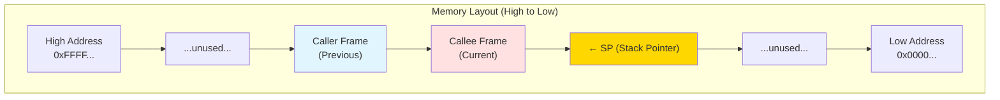
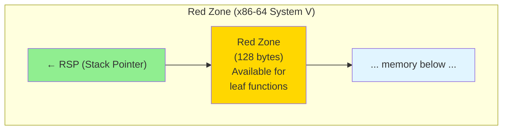

# Stack Management

The runtime stack is a fundamental mechanism for managing function calls, local variables, and control flow in compiled programs. Effective stack management ensures correct program execution while minimizing overhead and supporting features like recursion, nested functions, and exception handling.

## The Runtime Stack

The stack is a contiguous region of memory that grows and shrinks as functions are called and return. It operates in a last-in-first-out (LIFO) manner, making it ideal for managing function call hierarchies.

### Stack Growth Direction

On most architectures, the stack grows **downward** toward lower memory addresses:



**Stack Pointer (SP)**: Points to the top of the stack (lowest address in use)
**Frame Pointer (FP/BP)**: Points to the base of the current stack frame (optional)

The stack grows downward (toward decreasing addresses) as functions are called and shrinks upward as they return.

### Basic Stack Operations

**Push** (allocate and write):
```asm
; x86-64
push rax           ; Equivalent to: sub rsp, 8; mov [rsp], rax

; ARM64
str  x0, [sp, #-16]!   ; Pre-decrement store
```

**Pop** (read and deallocate):
```asm
; x86-64
pop  rax           ; Equivalent to: mov rax, [rsp]; add rsp, 8

; ARM64
ldr  x0, [sp], #16     ; Post-increment load
```

## Stack Frames (Activation Records)

Each function call creates a **stack frame** (or activation record) containing the function's local data.

### Frame Contents

A typical stack frame includes:

1. **Return address**: Where to resume execution after the function returns
2. **Saved frame pointer**: Previous frame's base address
3. **Saved registers**: Callee-saved registers that the function uses
4. **Local variables**: Function's automatic variables
5. **Temporary storage**: Intermediate computation results
6. **Outgoing arguments**: Arguments for called functions (if not in registers)
7. **Padding**: Alignment bytes

### x86-64 Stack Frame Layout

```mermaid
graph TB
    subgraph "Stack Frame Layout (x86-64)"
        HighAddr["Higher Address"]
        Args["Argument 7+<br/>(passed on stack)"]
        RetAddr["Return Address<br/>(pushed by CALL)"]
        RBP["← RBP"]
        SavedRBP["Saved RBP"]
        SavedRegs["Saved callee-saved<br/>registers (rbx, r12, ...)"]
        Locals["Local variables"]
        Temps["Temporaries"]
        OutArgs["Outgoing arguments<br/>(for called functions)"]
        RSP["← RSP"]
        LowAddr["Lower Address"]

        HighAddr --> Args
        Args --> RetAddr
        RetAddr --> RBP
        RBP --> SavedRBP
        SavedRBP --> SavedRegs
        SavedRegs --> Locals
        Locals --> Temps
        Temps --> OutArgs
        OutArgs --> RSP
        RSP --> LowAddr
    end

    style RetAddr fill:#FFD700
    style RBP fill:#90EE90
    style SavedRBP fill:#e1f5ff
    style SavedRegs fill:#e1f5ff
    style Locals fill:#ffe1e1
    style Temps fill:#ffe1e1
    style OutArgs fill:#DDA0DD
    style RSP fill:#90EE90
```



**Key pointers:**
- **RBP** (frame pointer): Points to saved RBP, providing fixed reference for locals
- **RSP** (stack pointer): Points to top of stack, moves as values pushed/popped

### Frame Setup and Teardown

**Function Prologue** (frame setup):
```asm
foo:
    push rbp           ; Save caller's frame pointer
    mov  rbp, rsp      ; Set up new frame pointer
    sub  rsp, 32       ; Allocate 32 bytes for locals
    push rbx           ; Save callee-saved registers
    push r12
    ; Function body...
```

**Function Epilogue** (frame teardown):
```asm
    ; ...function body
    pop  r12           ; Restore callee-saved registers
    pop  rbx
    mov  rsp, rbp      ; Restore stack pointer
    pop  rbp           ; Restore frame pointer
    ret                ; Return to caller
```

Alternatively, use `leave` instruction (x86):
```asm
    pop  r12
    pop  rbx
    leave              ; Equivalent to: mov rsp, rbp; pop rbp
    ret
```

## Frame Pointers vs Frame Pointer Omission

### With Frame Pointer (RBP)

Using a dedicated frame pointer simplifies access to local variables and parameters:

```asm
foo:
    push rbp
    mov  rbp, rsp
    sub  rsp, 16       ; Allocate 16 bytes for locals

    ; Access locals relative to RBP
    mov  eax, [rbp-4]  ; First local variable
    mov  ebx, [rbp-8]  ; Second local variable

    ; Access parameters relative to RBP
    mov  ecx, [rbp+16] ; First stack parameter (after return addr + saved rbp)

    mov  rsp, rbp
    pop  rbp
    ret
```

**Advantages**:
- Fixed offsets for variables (independent of stack adjustments)
- Simplifies debugging (frame chain traversal for backtraces)
- Required for some features (dynamic stack allocation, exceptions)

**Disadvantages**:
- Uses one register (RBP) that could otherwise be available
- Adds prologue/epilogue overhead

### Frame Pointer Omission (FPO)

Omitting the frame pointer frees up an extra register:

```asm
foo:
    sub  rsp, 16       ; Allocate locals directly

    ; Access locals relative to RSP
    mov  eax, [rsp+0]  ; First local
    mov  ebx, [rsp+4]  ; Second local

    ; Offsets change if stack is adjusted!
    push rcx           ; RSP changes
    mov  eax, [rsp+8]  ; Must adjust offset

    add  rsp, 16       ; Deallocate
    ret
```

**Advantages**:
- One more register available for allocation
- Slightly smaller code size (no frame pointer save/restore)

**Disadvantages**:
- Variable offsets (compiler must track stack depth)
- Complicates debugging and exception handling
- Cannot support dynamic stack allocation (alloca)

Modern compilers use FPO by default (`-fomit-frame-pointer`) and switch to frame pointers when needed.

## Dynamic Stack Allocation

Functions can allocate variable-sized data on the stack at runtime.

### alloca() / Variable-Length Arrays

C99 introduced variable-length arrays (VLAs):

```c
void process(int n) {
    int arr[n];  // Size determined at runtime
    // Use arr...
}
```

This requires a frame pointer:

```asm
process:
    push rbp
    mov  rbp, rsp          ; Must use frame pointer

    ; Compute size: n * sizeof(int)
    mov  eax, edi          ; n in edi
    sal  eax, 2            ; n * 4
    sub  rsp, rax          ; Allocate n*4 bytes
    and  rsp, -16          ; Align to 16 bytes

    ; arr is at [rsp]
    ; Access locals relative to rbp (not rsp, since rsp changed)

    mov  rsp, rbp          ; Deallocate
    pop  rbp
    ret
```

Without a frame pointer, the compiler couldn't maintain correct offsets after the dynamic allocation.

## Stack Alignment

Modern architectures require stack alignment for performance and correctness.

### Alignment Requirements

- **x86-64**: 16-byte alignment before `call` instructions (SSE/AVX requirements)
- **ARM64**: 16-byte alignment at all times
- **x86-32**: Traditionally 4-byte, but 16-byte for SSE

Misaligned stacks cause crashes with SIMD instructions:

```asm
; Assume RSP is 16-byte aligned
sub  rsp, 8            ; Now 8-byte aligned (misaligned!)
movaps xmm0, [rsp]     ; CRASH: movaps requires 16-byte alignment
```

### Maintaining Alignment

The compiler ensures alignment by:

1. Aligning stack frame sizes to 16 bytes
2. Padding local variable areas
3. Accounting for the return address push

Example:
```c
void foo() {
    char buf[5];  // 5 bytes needed
}
```

```asm
foo:
    ; Need 5 bytes, but allocate 16 for alignment
    sub  rsp, 16
    ; Use [rsp+0] through [rsp+4] for buf
    ; [rsp+5] through [rsp+15] are padding
    add  rsp, 16
    ret
```

### Call Alignment

Before a `call`, RSP must be 16-byte aligned:

```asm
main:
    ; On entry, RSP is 16-byte aligned + 8 (return address was pushed)
    ; So RSP is 8 mod 16 here

    sub  rsp, 8        ; Adjust to make RSP 16-byte aligned
    call foo           ; CALL pushes return address (8 bytes)
    ; Inside foo, RSP is 16-byte aligned again
    add  rsp, 8
    ret
```

## Red Zone (x86-64 System V ABI)

The System V ABI defines a 128-byte **red zone** below the stack pointer:



Leaf functions (functions that don't call other functions) can use this area without adjusting RSP:

```asm
leaf_function:
    ; No prologue needed
    mov  [rsp-8], rdi     ; Use red zone for temporary
    mov  [rsp-16], rsi
    ; Compute...
    mov  rax, [rsp-8]
    add  rax, [rsp-16]
    ret                    ; No epilogue needed
```

**Advantages**:
- Eliminates prologue/epilogue for simple leaf functions
- Reduces code size and overhead

**Limitations**:
- Signal handlers may clobber red zone
- Not available in kernel code
- Windows x86-64 ABI doesn't have a red zone

## Stack Overflow Protection

### Guard Pages

Operating systems place guard pages (unmapped pages) below the stack:

```
+------------------+
| Stack            |
+------------------+
| Guard Page       | ← Unmapped
+------------------+ ← Accessing causes segfault
```

Accessing the guard page triggers a page fault, caught as a stack overflow error.

### Stack Probing

Large stack allocations must be probed to trigger guard pages:

```c
void foo() {
    char buf[10000];  // Large allocation
}
```

Without probing:
```asm
foo:
    sub  rsp, 10000    ; Skip over guard page silently!
    ; May clobber memory beyond stack
```

With stack probes (Windows and large allocations):
```asm
foo:
    mov  eax, 10000
    call __chkstk      ; Probe each page down to final SP
    sub  rsp, rax
```

`__chkstk` touches each page to ensure guard pages are triggered.

### Stack Canaries

Compilers insert **stack canaries** to detect buffer overflows:

```c
void vulnerable() {
    char buf[10];
    gets(buf);  // Dangerous: may overflow
}
```

Protected code:
```asm
vulnerable:
    push rbp
    mov  rbp, rsp
    sub  rsp, 32

    ; Read canary from %fs:0x28 (thread-local storage)
    mov  rax, qword ptr [fs:0x28]
    mov  [rbp-8], rax     ; Place canary before locals

    lea  rdi, [rbp-24]    ; buf starts at rbp-24
    call gets

    ; Check canary
    mov  rax, [rbp-8]
    xor  rax, qword ptr [fs:0x28]
    je   .ok
    call __stack_chk_fail  ; Canary corrupted!
.ok:
    mov  rsp, rbp
    pop  rbp
    ret
```

Buffer overflow overwrites the canary, detected before return.

## Nested Functions and Trampolines

Some languages (GCC C extensions, Pascal, Ada) support nested functions:

```c
void outer(int x) {
    void inner(int y) {  // Nested function
        printf("%d\n", x + y);  // Accesses outer's variable
    }
    inner(5);
}
```

Nested functions need access to the enclosing function's stack frame.

### Static Chain

Pass a pointer to the parent frame:

```asm
outer:
    push rbp
    mov  rbp, rsp
    sub  rsp, 16
    mov  [rbp-4], edi     ; Store x

    ; Call inner, passing parent frame pointer in R10
    mov  r10, rbp         ; Static chain
    mov  rdi, 5           ; Argument y
    call inner

    mov  rsp, rbp
    pop  rbp
    ret

inner:
    ; R10 points to parent frame
    ; Access parent's x: [r10-4]
    mov  eax, [r10-4]     ; Load x from parent frame
    add  eax, edi         ; Add y
    ; ... printf call
    ret
```

### Trampolines

Taking the address of a nested function requires a **trampoline**:

```c
void outer(int x) {
    void inner(int y) {
        printf("%d\n", x + y);
    }
    void (*fptr)(int) = inner;  // Taking address
    fptr(5);
}
```

The trampoline is runtime-generated code on the stack:

```asm
; Trampoline (on stack):
mov  r10, <parent_frame_address>
jmp  inner

; Calling through pointer:
call [fptr]  ; Calls trampoline, which sets R10 and jumps to inner
```

**Security Issue**: Executable stack required for trampolines. Modern systems disable executable stacks, breaking this feature.

## Exception Handling and Stack Unwinding

Exceptions require unwinding the stack to find handlers.

### Stack Unwinding

When an exception is thrown, the runtime must:
1. Find the current function's exception handler (if any)
2. If none, unwind to the caller's frame and repeat
3. Execute cleanup code (destructors) in each unwound frame

This requires metadata describing frame layouts:

### DWARF Unwinding Information

DWARF `.eh_frame` sections describe how to unwind each frame:

```
CIE (Common Information Entry):
    - Default rules for unwinding
    - Register preservation information

FDE (Frame Description Entry) for each function:
    - PC range covered
    - How to find CFA (Canonical Frame Address)
    - How to restore registers

Example:
    PC=0x1000-0x1050: CFA = RSP + 16, RBP = [CFA-16]
```

The unwinder uses this information to reconstruct parent frames.

### x86-64 Structured Exception Handling (SEH)

Windows x86-64 uses SEH with `.pdata` and `.xdata` sections:

```
.pdata entry:
    - Function start address
    - Function end address
    - Pointer to unwind info in .xdata

.xdata unwind info:
    - Prologue size
    - Frame register
    - Stack allocation
    - Saved registers
```

The compact encoding allows fast unwinding without executing code.

## Key Takeaways

- The runtime stack manages function calls in LIFO order, with each call creating a stack frame containing local variables, saved registers, return address, and function parameters
- Stack frames contain return addresses, saved frame pointers, callee-saved registers, local variables, temporaries, and outgoing arguments, with layout determined by the ABI
- Frame pointers (RBP on x86-64) simplify local variable access with fixed offsets and enable debugging, but consume a register; frame pointer omission frees a register at the cost of variable offsets
- Stack alignment requirements (16-byte on x86-64, ARM64) ensure SIMD instruction correctness; compilers maintain alignment through padding and careful frame size calculations
- Dynamic stack allocation (alloca, VLAs) requires frame pointers since stack pointer changes unpredictably during execution
- Red zones (128 bytes on x86-64 System V) allow leaf functions to avoid prologue/epilogue overhead by using space below the stack pointer
- Stack protection includes guard pages (unmapped memory triggering faults), stack probing (for large allocations), and canaries (detecting buffer overflows)
- Exception handling requires stack unwinding metadata (DWARF .eh_frame on Unix, SEH on Windows) to traverse frames and find handlers during exception propagation

