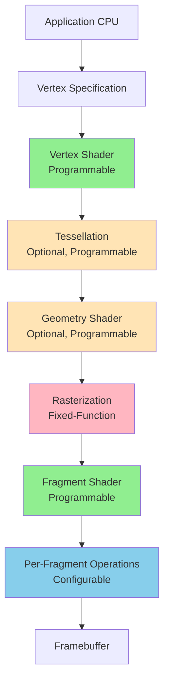
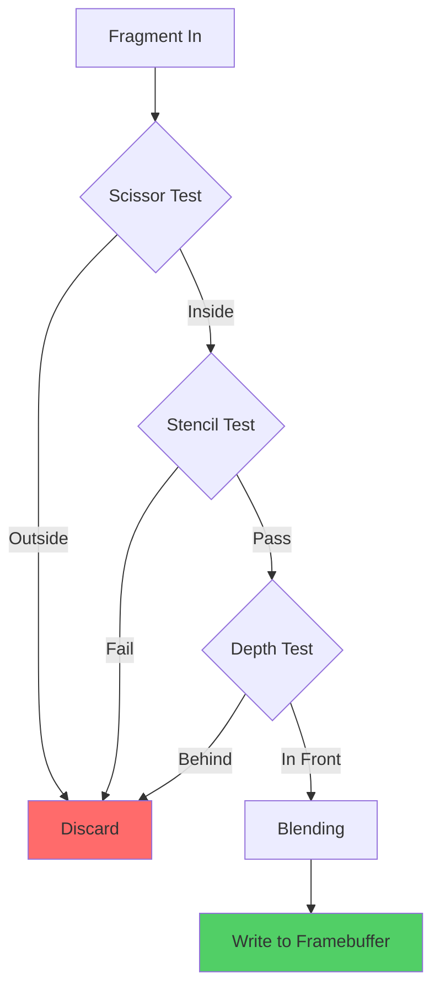

# The Graphics Rendering Pipeline

The rendering pipeline is the sequence of stages that transforms a 3D scene description into a 2D image on your screen. Understanding this pipeline is fundamental to computer graphics, as it defines how vertices become pixels, how colors are computed, and where programmability enables custom effects.

## Pipeline Overview

The modern graphics pipeline consists of several stages, some fixed-function (hardware-controlled) and others programmable (shader-controlled):



Each stage takes input from the previous stage, processes it, and passes results to the next. Let's examine each in detail.

## Application Stage (CPU)

Before data reaches the GPU, the CPU prepares the scene:

**Scene Management**:
- Determine what objects are visible (culling)
- Update object positions and animations
- Manage resources (textures, models)
- Process input and game logic

**Command Generation**:
- Issue draw calls to GPU
- Set rendering state (shaders, textures, blend modes)
- Upload vertex data and uniforms

```cpp
// Application stage pseudocode
void renderFrame() {
    // 1. Update scene
    updateCamera();
    updateAnimations(deltaTime);

    // 2. Frustum culling (remove invisible objects)
    visibleObjects = frustumCull(allObjects, camera);

    // 3. Sort objects (for transparency, state changes)
    sort(visibleObjects, BY_MATERIAL);

    // 4. For each object, issue draw call
    for (Object obj : visibleObjects) {
        // Set state
        setShader(obj.material.shader);
        setTextures(obj.material.textures);
        setUniforms(obj.worldMatrix, camera.viewMatrix, ...);

        // Draw command
        glDrawElements(GL_TRIANGLES, obj.indexCount, ...);
    }

    // 5. Present to screen
    swapBuffers();
}
```

The application stage bottleneck is often **draw call overhead**—the CPU cost of submitting commands to the GPU.

## Vertex Specification

Vertex data is organized in buffers and described by vertex attributes:

```cpp
// Vertex structure
struct Vertex {
    vec3 position;    // xyz coordinates
    vec3 normal;      // surface normal
    vec2 texCoord;    // texture coordinates
    vec4 color;       // vertex color
};

// Vertex buffer (array of vertices)
Vertex vertices[] = {
    {{-1, -1, 0}, {0, 0, 1}, {0, 0}, {1, 1, 1, 1}},
    {{ 1, -1, 0}, {0, 0, 1}, {1, 0}, {1, 1, 1, 1}},
    {{ 0,  1, 0}, {0, 0, 1}, {0.5, 1}, {1, 1, 1, 1}},
};

// Index buffer (triangle connectivity)
unsigned int indices[] = {0, 1, 2};  // One triangle
```

**Vertex Attributes**:
- Position (required)
- Normal (for lighting)
- Texture coordinates
- Color, tangent, bitangent, bone weights, etc.

**Primitive Types**:
- `GL_POINTS`: Individual points
- `GL_LINES`: Line segments (2 vertices each)
- `GL_TRIANGLES`: Triangles (3 vertices each)
- `GL_TRIANGLE_STRIP`: Connected triangles
- `GL_TRIANGLE_FAN`: Fan of triangles

## Vertex Shader Stage

The **vertex shader** is a programmable stage that processes each vertex independently. It must at minimum transform vertex positions from object space to clip space.

### Vertex Shader Responsibilities

**Required**:
- Transform position to clip space
- Set `gl_Position` output variable

**Optional**:
- Calculate lighting per-vertex
- Compute texture coordinates
- Pass data to fragment shader
- Perform animations (skinning, morphing)

### Example Vertex Shader

```glsl
#version 450 core

// Input vertex attributes
layout(location = 0) in vec3 aPosition;
layout(location = 1) in vec3 aNormal;
layout(location = 2) in vec2 aTexCoord;

// Uniform variables (constant for all vertices in draw call)
uniform mat4 uModel;       // Object-to-world transform
uniform mat4 uView;        // World-to-camera transform
uniform mat4 uProjection;  // Camera-to-clip transform

// Output to next stage (interpolated per fragment)
out vec3 vNormal;
out vec2 vTexCoord;
out vec3 vWorldPos;

void main() {
    // Transform position through MVP matrix
    vec4 worldPos = uModel * vec4(aPosition, 1.0);
    vec4 viewPos = uView * worldPos;
    vec4 clipPos = uProjection * viewPos;

    // Set required output
    gl_Position = clipPos;

    // Transform normal to world space (use inverse-transpose for non-uniform scaling)
    mat3 normalMatrix = mat3(transpose(inverse(uModel)));
    vNormal = normalize(normalMatrix * aNormal);

    // Pass through texture coordinates
    vTexCoord = aTexCoord;

    // Pass world position for lighting calculations
    vWorldPos = worldPos.xyz;
}
```

### Vertex Shader Execution

Each vertex shader invocation processes **one vertex**:

```
Vertex Buffer:           Vertex Shader Invocations:
  Vertex 0      →       Process vertex 0 → Output 0
  Vertex 1      →       Process vertex 1 → Output 1
  Vertex 2      →       Process vertex 2 → Output 2
  ...                   ...

All vertices processed in parallel (thousands simultaneously)
```

Vertex shaders **cannot**:
- Access other vertices
- Generate new vertices (use geometry shader for that)
- Know about primitives (triangles)
- Discard vertices

## Tessellation Stage (Optional)

Tessellation subdivides primitives into smaller pieces, useful for:
- Level-of-detail control
- Displacement mapping
- Curved surfaces

**Tessellation Control Shader (TCS)**: Determines subdivision level
**Tessellation Primitive Generator**: Creates new vertices (fixed-function)
**Tessellation Evaluation Shader (TES)**: Positions new vertices

```glsl
// Tessellation Control Shader
layout(vertices = 3) out;  // Output triangle patches

void main() {
    // Determine tessellation level based on distance
    float distance = length(cameraPos - worldPos);
    float tessLevel = mix(64.0, 1.0, distance / maxDistance);

    gl_TessLevelOuter[0] = tessLevel;
    gl_TessLevelOuter[1] = tessLevel;
    gl_TessLevelOuter[2] = tessLevel;
    gl_TessLevelInner[0] = tessLevel;
}

// Tessellation Evaluation Shader
layout(triangles, equal_spacing, ccw) in;

void main() {
    // Interpolate position using barycentric coordinates
    vec3 p0 = gl_in[0].gl_Position.xyz;
    vec3 p1 = gl_in[1].gl_Position.xyz;
    vec3 p2 = gl_in[2].gl_Position.xyz;

    vec3 pos = p0 * gl_TessCoord.x +
               p1 * gl_TessCoord.y +
               p2 * gl_TessCoord.z;

    // Apply displacement
    float height = texture(heightMap, texCoord).r;
    pos += normal * height * displacementScale;

    gl_Position = projection * view * vec4(pos, 1.0);
}
```

## Geometry Shader Stage (Optional)

The **geometry shader** can create or discard primitives. It receives complete primitives (triangles, lines, points) and can output different primitives.

**Capabilities**:
- Generate new geometry
- Change primitive type
- Discard primitives
- Emit multiple primitives

**Use cases**:
- Particle effects
- Shadow volumes
- Wireframe overlay
- Fur/grass generation

```glsl
#version 450 core
layout(triangles) in;  // Input: triangles
layout(line_strip, max_vertices = 6) out;  // Output: lines for wireframe

in vec3 vNormal[];  // Array of 3 normals (one per triangle vertex)

void main() {
    // Emit the triangle edges as lines
    for (int i = 0; i < 3; i++) {
        gl_Position = gl_in[i].gl_Position;
        EmitVertex();

        gl_Position = gl_in[(i+1) % 3].gl_Position;
        EmitVertex();

        EndPrimitive();  // Complete this line segment
    }
}
```

**Performance Note**: Geometry shaders can be slow; prefer compute shaders or mesh shaders for geometry generation when possible.

## Rasterization Stage

Rasterization is the **fixed-function** stage that converts vector primitives into discrete fragments (potential pixels).

### Rasterization Process

**Triangle Setup**: Compute edge equations
```
For triangle with vertices V0, V1, V2:

Edge equation for edge V0→V1:
  E(x, y) = (y0 - y1)x + (x1 - x0)y + (x0*y1 - x1*y0)

Point (x,y) is inside triangle if:
  E01(x,y) ≥ 0 AND E12(x,y) ≥ 0 AND E20(x,y) ≥ 0
```

**Scan Conversion**: Determine which pixels are covered
```
Triangle rasterization:

    V2 (0,2)
     *
    /│\
   / │ \         Covered fragments: ▓
  /  │  \        Empty: ░
 /   │   \
*────┼────*      Result:
V0   │    V1       ░░▓▓░░
   (0,0) (2,0)     ░▓▓▓▓░
                   ▓▓▓▓▓▓
```

**Attribute Interpolation**: Compute per-fragment values using barycentric coordinates

```
For fragment at position P inside triangle (V0, V1, V2):

Barycentric coordinates (λ0, λ1, λ2):
  P = λ0*V0 + λ1*V1 + λ2*V2
  λ0 + λ1 + λ2 = 1

Any vertex attribute A is interpolated:
  A(P) = λ0*A0 + λ1*A1 + λ2*A2

Examples:
  Color(P) = λ0*Color0 + λ1*Color1 + λ2*Color2
  TexCoord(P) = λ0*TexCoord0 + λ1*TexCoord1 + λ2*TexCoord2
```

**Perspective-Correct Interpolation**: Screen-space linear interpolation is incorrect for 3D. GPU performs perspective-correct interpolation:

```
Incorrect: Interpolate in screen space
Correct: Interpolate in 3D, divide by depth

Attribute' = (λ0*A0/w0 + λ1*A1/w1 + λ2*A2/w2) / (λ0/w0 + λ1/w1 + λ2/w2)

where w is the homogeneous coordinate (clip space w component)
```

### Rasterization Configuration

**Face Culling**: Discard back-facing or front-facing triangles
```cpp
glEnable(GL_CULL_FACE);
glCullFace(GL_BACK);  // Don't rasterize back faces
glFrontFace(GL_CCW);  // Counter-clockwise = front face
```

**Polygon Mode**: How to rasterize primitives
```cpp
glPolygonMode(GL_FRONT_AND_BACK, GL_FILL);  // Solid fill
glPolygonMode(GL_FRONT_AND_BACK, GL_LINE);  // Wireframe
glPolygonMode(GL_FRONT_AND_BACK, GL_POINT); // Just vertices
```

## Fragment Shader Stage

The **fragment shader** is a programmable stage that computes the color and depth for each fragment.

### Fragment Shader Responsibilities

**Required**:
- Output fragment color (and optionally depth)

**Typical tasks**:
- Texture sampling
- Lighting calculations
- Normal mapping
- Material evaluation
- Special effects

### Example Fragment Shader

```glsl
#version 450 core

// Interpolated inputs from vertex shader
in vec3 vNormal;
in vec2 vTexCoord;
in vec3 vWorldPos;

// Uniforms
uniform sampler2D uDiffuseTexture;
uniform sampler2D uNormalMap;
uniform vec3 uLightPos;
uniform vec3 uCameraPos;
uniform vec3 uLightColor;

// Output
out vec4 fragColor;

void main() {
    // Sample textures
    vec4 baseColor = texture(uDiffuseTexture, vTexCoord);
    vec3 normalMap = texture(uNormalMap, vTexCoord).rgb;

    // Convert normal from [0,1] to [-1,1]
    normalMap = normalize(normalMap * 2.0 - 1.0);

    // Lighting calculations (Blinn-Phong)
    vec3 N = normalize(vNormal);  // Could use normalMap with TBN matrix
    vec3 L = normalize(uLightPos - vWorldPos);
    vec3 V = normalize(uCameraPos - vWorldPos);
    vec3 H = normalize(L + V);

    // Diffuse
    float NdotL = max(dot(N, L), 0.0);
    vec3 diffuse = NdotL * uLightColor * baseColor.rgb;

    // Specular
    float NdotH = max(dot(N, H), 0.0);
    float specular = pow(NdotH, 32.0);
    vec3 specularColor = specular * uLightColor;

    // Ambient
    vec3 ambient = 0.1 * baseColor.rgb;

    // Combine
    vec3 finalColor = ambient + diffuse + specularColor;

    fragColor = vec4(finalColor, baseColor.a);
}
```

### Fragment Shader Execution

Fragment shaders run **once per fragment** (potentially millions per frame):

```
Rasterized fragments:      Fragment Shader:
  Fragment (100, 200) →    Compute color for (100, 200)
  Fragment (101, 200) →    Compute color for (101, 200)
  Fragment (102, 200) →    Compute color for (102, 200)
  ...

All fragments processed in parallel (warps of 32-64)
```

Fragment shaders **cannot**:
- Access other fragments' data
- Know final pixel coordinates (before per-fragment operations)
- Guarantee execution order

## Per-Fragment Operations

After the fragment shader, several **configurable** tests and operations occur:

### Scissor Test
Discard fragments outside rectangular region
```cpp
glEnable(GL_SCISSOR_TEST);
glScissor(x, y, width, height);
```

### Stencil Test
Conditional discard based on stencil buffer
```cpp
glEnable(GL_STENCIL_TEST);
glStencilFunc(GL_EQUAL, 1, 0xFF);  // Pass if stencil == 1
glStencilOp(GL_KEEP, GL_KEEP, GL_REPLACE);  // What to do with stencil
```

**Use cases**: Shadows, portals, decals, outlines

### Depth Test
Discard fragments behind already-drawn geometry
```cpp
glEnable(GL_DEPTH_TEST);
glDepthFunc(GL_LESS);  // Pass if depth < current depth buffer value
```

**Z-buffer algorithm**: Maintain per-pixel depth
```
For fragment at (x, y) with depth z:
  if (z < depthBuffer[x][y]) {
      depthBuffer[x][y] = z;
      colorBuffer[x][y] = fragmentColor;
  }
```

### Blending
Combine fragment color with framebuffer color
```cpp
glEnable(GL_BLEND);
glBlendFunc(GL_SRC_ALPHA, GL_ONE_MINUS_SRC_ALPHA);  // Alpha blending

// Result:
// finalColor = srcColor * srcAlpha + dstColor * (1 - srcAlpha)
```

**Blend equations**:
```
Alpha blending:     Src * A + Dst * (1-A)
Additive blending:  Src + Dst
Multiplicative:     Src * Dst
```

**Use cases**: Transparency, particles, UI, light accumulation

### Pipeline Flow



## Framebuffer

The **framebuffer** is the final destination for rendered pixels:

**Color Attachments**: Store color values (1-8 render targets)
**Depth Attachment**: Stores depth values (Z-buffer)
**Stencil Attachment**: Stores stencil values

```cpp
// Framebuffer with multiple attachments
Framebuffer fbo;
  ├── Color Attachment 0: RGBA8 texture (diffuse color)
  ├── Color Attachment 1: RGBA16F texture (normals)
  ├── Color Attachment 2: RGBA16F texture (position)
  ├── Depth Attachment: D24 texture
  └── Stencil Attachment: S8 (or combined D24S8)
```

**Multiple Render Targets (MRT)**: Fragment shader writes to multiple color buffers simultaneously:

```glsl
// Fragment shader with MRT
layout(location = 0) out vec4 outColor;
layout(location = 1) out vec4 outNormal;
layout(location = 2) out vec4 outPosition;

void main() {
    outColor = computeColor();
    outNormal = vec4(normalize(vNormal), 1.0);
    outPosition = vec4(vWorldPos, 1.0);
}
```

## Complete Pipeline Example

Let's trace a single triangle through the pipeline:

```cpp
// 1. Application: Submit draw call
glDrawElements(GL_TRIANGLES, 3, GL_UNSIGNED_INT, 0);

// 2. Vertex Shader: Process 3 vertices
//    Input: Object-space positions
//    Output: Clip-space positions
Vertex 0: (-1, -1, 0) → Clip: (-0.5, -0.5, 0.9, 1)
Vertex 1: ( 1, -1, 0) → Clip: ( 0.5, -0.5, 0.9, 1)
Vertex 2: ( 0,  1, 0) → Clip: ( 0.0,  0.5, 0.9, 1)

// 3. Rasterization: Generate fragments
//    Covers ~500 pixels at 1920×1080 resolution

// 4. Fragment Shader: Process each fragment
//    Inputs: Interpolated attributes
//    Output: Color
Fragment (960, 540): Color = texture(...) + lighting(...)
Fragment (961, 540): Color = texture(...) + lighting(...)
...

// 5. Per-Fragment Operations:
//    Depth test, blending, etc.

// 6. Framebuffer: Write final pixels
colorBuffer[960][540] = (0.8, 0.2, 0.3, 1.0)
depthBuffer[960][540] = 0.9
```

## Key Takeaways

- Pipeline transforms 3D scenes to 2D images through sequential stages
- Vertex shader: Transform vertices, prepare data for rasterization
- Tessellation: Optional subdivision of primitives
- Geometry shader: Optional primitive generation/modification
- Rasterization: Convert triangles to fragments (fixed-function)
- Fragment shader: Compute per-fragment color and effects
- Per-fragment operations: Tests and blending before framebuffer write
- Understanding pipeline stages essential for optimization and debugging
- Programmable stages (vertex/fragment shaders) enable custom effects
- Fixed-function stages (rasterization) are highly optimized in hardware

Mastering the graphics pipeline is fundamental to all modern graphics programming, from games to scientific visualization.
