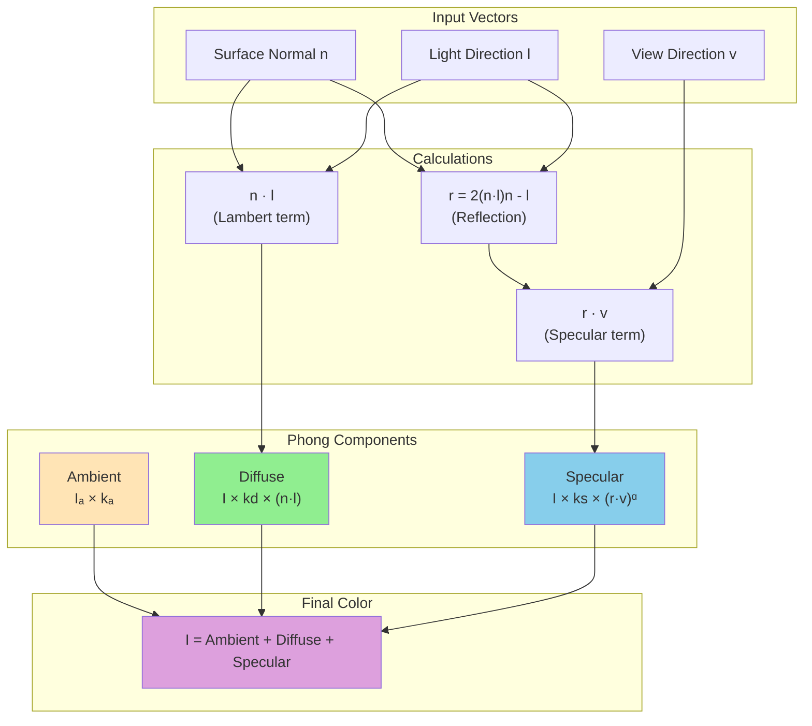

# The Phong Illumination Model

## Introduction

The Phong illumination model, developed by Bui Tuong Phong in 1975, is one of the most influential and widely-used local illumination models in computer graphics. Despite being nearly 50 years old, it remains popular due to its simplicity, efficiency, and ability to produce visually pleasing results.

The Phong model decomposes reflected light into three components: ambient, diffuse, and specular. This decomposition provides intuitive control over surface appearance while remaining computationally tractable for real-time rendering.

## The Complete Phong Equation

The Phong illumination model combines three reflection components:



$$I = I_a k_a + \sum_{lights} I_l \left( k_d (\mathbf{n} \cdot \mathbf{l}) + k_s (\mathbf{r} \cdot \mathbf{v})^{\alpha} \right)$$

Where:
- $I$ = final intensity (color)
- $I_a$ = ambient light intensity
- $k_a$ = ambient reflection coefficient (material property)
- $I_l$ = light source intensity
- $k_d$ = diffuse reflection coefficient (material color)
- $k_s$ = specular reflection coefficient (highlight color)
- $\mathbf{n}$ = surface normal (unit vector)
- $\mathbf{l}$ = light direction (unit vector toward light)
- $\mathbf{r}$ = reflection direction
- $\mathbf{v}$ = view direction (unit vector toward viewer)
- $\alpha$ = shininess exponent

```python
import numpy as np

class PhongMaterial:
    """
    Material properties for Phong illumination model.
    """
    def __init__(self, ambient, diffuse, specular, shininess):
        """
        Args:
            ambient: Ambient color (r, g, b) in [0, 1]
            diffuse: Diffuse color (r, g, b) in [0, 1]
            specular: Specular color (r, g, b) in [0, 1]
            shininess: Shininess exponent (typically 1-200)
        """
        self.ambient = np.array(ambient, dtype=np.float32)
        self.diffuse = np.array(diffuse, dtype=np.float32)
        self.specular = np.array(specular, dtype=np.float32)
        self.shininess = shininess

def phong_illumination(surface_point, surface_normal, view_dir,
                       material, lights, ambient_light):
    """
    Complete Phong illumination calculation.

    Args:
        surface_point: Point being shaded (x, y, z)
        surface_normal: Surface normal at point (unit vector)
        view_dir: Direction toward viewer (unit vector)
        material: PhongMaterial object
        lights: List of light sources
        ambient_light: Ambient light intensity (r, g, b)

    Returns:
        numpy.ndarray: Final color (r, g, b)
    """
    # Ambient component (constant, no light direction needed)
    ambient = material.ambient * ambient_light

    # Initialize diffuse and specular
    diffuse = np.zeros(3, dtype=np.float32)
    specular = np.zeros(3, dtype=np.float32)

    # Sum contributions from all lights
    for light in lights:
        # Get light direction and intensity
        light_dir, distance = light.get_light_direction(surface_point)
        light_intensity = light.get_intensity(surface_point)

        # Diffuse component (Lambert's cosine law)
        n_dot_l = max(0.0, np.dot(surface_normal, light_dir))

        if n_dot_l > 0:
            diffuse += material.diffuse * light_intensity * n_dot_l

            # Specular component (Phong reflection model)
            # Calculate reflection vector
            reflect_dir = 2.0 * n_dot_l * surface_normal - light_dir

            # Normalize (should already be unit length, but ensure)
            reflect_dir = reflect_dir / (np.linalg.norm(reflect_dir) + 1e-6)

            # Calculate specular term
            r_dot_v = max(0.0, np.dot(reflect_dir, view_dir))
            specular_intensity = r_dot_v ** material.shininess

            specular += material.specular * light_intensity * specular_intensity

    # Combine all components
    final_color = ambient + diffuse + specular

    # Clamp to valid range
    return np.clip(final_color, 0.0, 1.0)
```

## Ambient Component

The ambient component approximates indirect lighting - light that has bounced multiple times and comes from all directions.

$$I_{ambient} = k_a \cdot I_a$$

```python
def calculate_ambient(material_ambient, ambient_light):
    """
    Calculate ambient contribution.

    Args:
        material_ambient: Material's ambient reflectance (r, g, b)
        ambient_light: Scene ambient light (r, g, b)

    Returns:
        numpy.ndarray: Ambient contribution
    """
    return material_ambient * ambient_light

# Example materials
def create_red_plastic():
    """Red plastic material with low ambient."""
    return PhongMaterial(
        ambient=np.array([0.1, 0.0, 0.0]),    # Dark red ambient
        diffuse=np.array([0.8, 0.1, 0.1]),    # Bright red diffuse
        specular=np.array([1.0, 1.0, 1.0]),   # White highlights
        shininess=32.0                         # Moderately shiny
    )
```

**Properties:**
- Independent of light direction, view direction, and surface normal
- Prevents completely black areas in shadow
- Typically set to low values (0.1-0.3) to avoid washed-out appearance
- Same color as diffuse component, but darker

## Diffuse Component (Lambertian Reflection)

The diffuse component models matte, rough surfaces that scatter light equally in all directions.

$$I_{diffuse} = k_d \cdot I_l \cdot \max(0, \mathbf{n} \cdot \mathbf{l})$$

This follows **Lambert's cosine law**: perceived brightness is proportional to the cosine of the angle between surface normal and light direction.

```python
def calculate_diffuse(material_diffuse, light_intensity, normal, light_dir):
    """
    Calculate diffuse (Lambertian) reflection.

    Args:
        material_diffuse: Diffuse color (r, g, b)
        light_intensity: Light color and intensity (r, g, b)
        normal: Surface normal (unit vector)
        light_dir: Direction to light (unit vector)

    Returns:
        numpy.ndarray: Diffuse contribution
    """
    # Lambert's cosine law
    n_dot_l = max(0.0, np.dot(normal, light_dir))

    # Diffuse reflection
    return material_diffuse * light_intensity * n_dot_l

def visualize_lambert_law():
    """
    Demonstrate how n·l affects brightness.
    """
    import matplotlib.pyplot as plt

    angles = np.linspace(0, 180, 180)
    angles_rad = np.radians(angles)

    # Cosine falls off as angle increases
    brightness = np.maximum(0, np.cos(angles_rad))

    plt.figure(figsize=(10, 6))
    plt.plot(angles, brightness, linewidth=2)
    plt.xlabel('Angle between normal and light (degrees)')
    plt.ylabel('Brightness (n · l)')
    plt.title("Lambert's Cosine Law")
    plt.grid(True, alpha=0.3)
    plt.axhline(y=0, color='k', linestyle='-', linewidth=0.5)
    plt.axvline(x=90, color='r', linestyle='--', label='90° (perpendicular)')
    plt.legend()
```

**Properties:**
- View-independent (looks same from any viewing angle)
- Maximum when light is perpendicular to surface ($\mathbf{n} \cdot \mathbf{l} = 1$)
- Zero when light parallel to or behind surface ($\mathbf{n} \cdot \mathbf{l} \leq 0$)
- Defines the base color of the object

**Lambert's Cosine Law Visualization:**

```plot
{
  "title": "Lambert's Cosine Law: Diffuse Brightness vs Angle",
  "xAxis": {"domain": [0, 90], "label": "Angle from Normal (degrees)"},
  "yAxis": {"domain": [0, 1.1], "label": "Brightness (n·l)"},
  "data": [
    {"fn": "cos(x * PI / 180)", "color": "#22c55e", "title": "cos(θ)"}
  ]
}
```

This shows how diffuse brightness falls off as the light angle increases from perpendicular (0°) to grazing (90°).

## Specular Component (Phong Specular)

The specular component models shiny, mirror-like reflections that create bright highlights.

$$I_{specular} = k_s \cdot I_l \cdot \max(0, \mathbf{r} \cdot \mathbf{v})^{\alpha}$$

The reflection vector $\mathbf{r}$ is calculated as:

$$\mathbf{r} = 2(\mathbf{n} \cdot \mathbf{l})\mathbf{n} - \mathbf{l}$$

```python
def calculate_reflection_vector(normal, light_dir):
    """
    Calculate perfect reflection direction.

    Reflects light_dir across normal.

    Args:
        normal: Surface normal (unit vector)
        light_dir: Incident light direction (unit vector)

    Returns:
        numpy.ndarray: Reflection direction (unit vector)
    """
    n_dot_l = np.dot(normal, light_dir)
    reflect = 2.0 * n_dot_l * normal - light_dir

    # Normalize (should already be unit, but ensure)
    norm = np.linalg.norm(reflect)
    if norm > 1e-6:
        reflect /= norm

    return reflect

def calculate_specular(material_specular, light_intensity, shininess,
                       reflect_dir, view_dir):
    """
    Calculate specular (Phong) reflection.

    Args:
        material_specular: Specular color (r, g, b)
        light_intensity: Light color and intensity (r, g, b)
        shininess: Shininess exponent α
        reflect_dir: Reflection direction (unit vector)
        view_dir: View direction (unit vector)

    Returns:
        numpy.ndarray: Specular contribution
    """
    # Specular term
    r_dot_v = max(0.0, np.dot(reflect_dir, view_dir))
    specular_factor = r_dot_v ** shininess

    return material_specular * light_intensity * specular_factor

def visualize_shininess_effect():
    """
    Show how shininess exponent affects highlight size.
    """
    import matplotlib.pyplot as plt

    angles = np.linspace(0, 90, 180)
    angles_rad = np.radians(angles)

    shininess_values = [1, 5, 10, 32, 100, 200]

    plt.figure(figsize=(12, 6))

    for shininess in shininess_values:
        intensity = np.cos(angles_rad) ** shininess
        plt.plot(angles, intensity, label=f'α = {shininess}', linewidth=2)

    plt.xlabel('Angle from perfect reflection (degrees)')
    plt.ylabel('Specular intensity')
    plt.title('Effect of Shininess Exponent on Highlight Size')
    plt.legend()
    plt.grid(True, alpha=0.3)
    plt.xlim(0, 90)
    plt.ylim(0, 1)
```

**Properties:**
- View-dependent (highlights change as viewer moves)
- Maximum when view direction aligns with reflection direction
- Shininess $\alpha$ controls highlight size:
  - Low $\alpha$ (1-10): Large, soft highlights (rough surfaces)
  - Medium $\alpha$ (10-100): Moderate highlights (plastic, painted surfaces)
  - High $\alpha$ (100-1000): Small, sharp highlights (polished metal, glass)

**Shininess Exponent Effect:**

```plot
{
  "title": "Specular Highlight Falloff by Shininess",
  "xAxis": {"domain": [0, 90], "label": "Angle from Reflection (degrees)"},
  "yAxis": {"domain": [0, 1.1], "label": "Specular Intensity"},
  "data": [
    {"fn": "pow(cos(x * PI / 180), 5)", "color": "#ef4444", "title": "α = 5 (matte)"},
    {"fn": "pow(cos(x * PI / 180), 32)", "color": "#f97316", "title": "α = 32 (plastic)"},
    {"fn": "pow(cos(x * PI / 180), 128)", "color": "#22c55e", "title": "α = 128 (metal)"}
  ]
}
```

Higher shininess values create sharper, more concentrated highlights while lower values produce broader, softer reflections.

## Material Presets

Common materials with typical Phong parameters:

```python
class PhongMaterials:
    """Preset materials for common surfaces."""

    @staticmethod
    def brass():
        """Brass metal material."""
        return PhongMaterial(
            ambient=np.array([0.33, 0.22, 0.03]),
            diffuse=np.array([0.78, 0.57, 0.11]),
            specular=np.array([0.99, 0.91, 0.81]),
            shininess=27.8
        )

    @staticmethod
    def gold():
        """Gold metal material."""
        return PhongMaterial(
            ambient=np.array([0.25, 0.20, 0.07]),
            diffuse=np.array([0.75, 0.61, 0.23]),
            specular=np.array([0.63, 0.56, 0.37]),
            shininess=51.2
        )

    @staticmethod
    def silver():
        """Silver metal material."""
        return PhongMaterial(
            ambient=np.array([0.19, 0.19, 0.19]),
            diffuse=np.array([0.51, 0.51, 0.51]),
            specular=np.array([0.51, 0.51, 0.51]),
            shininess=51.2
        )

    @staticmethod
    def chrome():
        """Chrome metal material."""
        return PhongMaterial(
            ambient=np.array([0.25, 0.25, 0.25]),
            diffuse=np.array([0.40, 0.40, 0.40]),
            specular=np.array([0.77, 0.77, 0.77]),
            shininess=76.8
        )

    @staticmethod
    def rubber():
        """Black rubber material."""
        return PhongMaterial(
            ambient=np.array([0.02, 0.02, 0.02]),
            diffuse=np.array([0.01, 0.01, 0.01]),
            specular=np.array([0.40, 0.40, 0.40]),
            shininess=10.0
        )

    @staticmethod
    def jade():
        """Jade stone material."""
        return PhongMaterial(
            ambient=np.array([0.14, 0.22, 0.16]),
            diffuse=np.array([0.54, 0.89, 0.63]),
            specular=np.array([0.32, 0.32, 0.32]),
            shininess=12.8
        )

    @staticmethod
    def pearl():
        """Pearl material."""
        return PhongMaterial(
            ambient=np.array([0.25, 0.21, 0.21]),
            diffuse=np.array([1.00, 0.83, 0.83]),
            specular=np.array([0.30, 0.30, 0.30]),
            shininess=11.3
        )

    @staticmethod
    def plastic_red():
        """Red plastic material."""
        return PhongMaterial(
            ambient=np.array([0.0, 0.0, 0.0]),
            diffuse=np.array([0.5, 0.0, 0.0]),
            specular=np.array([0.7, 0.6, 0.6]),
            shininess=32.0
        )
```

## Blinn-Phong Modification

The Blinn-Phong model is a modification that's more efficient and physically plausible. Instead of reflection vector, it uses the **halfway vector**:

$$\mathbf{h} = \frac{\mathbf{l} + \mathbf{v}}{|\mathbf{l} + \mathbf{v}|}$$

The specular term becomes:

$$I_{specular} = k_s \cdot I_l \cdot \max(0, \mathbf{n} \cdot \mathbf{h})^{\alpha'}$$

```python
def blinn_phong_specular(material_specular, light_intensity, shininess,
                        normal, light_dir, view_dir):
    """
    Calculate specular using Blinn-Phong model.

    More efficient than Phong (no reflection vector calculation).
    Also more physically accurate.

    Args:
        material_specular: Specular color
        light_intensity: Light intensity
        shininess: Shininess exponent (typically 4x Phong shininess)
        normal: Surface normal
        light_dir: Light direction
        view_dir: View direction

    Returns:
        numpy.ndarray: Specular contribution
    """
    # Calculate halfway vector
    halfway = light_dir + view_dir
    norm = np.linalg.norm(halfway)

    if norm > 1e-6:
        halfway /= norm
    else:
        return np.zeros(3, dtype=np.float32)

    # Specular term using halfway vector
    n_dot_h = max(0.0, np.dot(normal, halfway))
    specular_factor = n_dot_h ** shininess

    return material_specular * light_intensity * specular_factor

def compare_phong_blinn(normal, light_dir, view_dir):
    """
    Compare Phong and Blinn-Phong specular highlights.

    Args:
        normal: Surface normal
        light_dir: Light direction
        view_dir: View direction
    """
    # Phong reflection
    reflect = calculate_reflection_vector(normal, light_dir)
    phong_factor = max(0.0, np.dot(reflect, view_dir))

    # Blinn halfway
    halfway = light_dir + view_dir
    halfway /= np.linalg.norm(halfway)
    blinn_factor = max(0.0, np.dot(normal, halfway))

    print(f"Phong (r·v): {phong_factor:.4f}")
    print(f"Blinn (n·h): {blinn_factor:.4f}")
```

**Advantages of Blinn-Phong:**
- More efficient (avoids reflection vector calculation)
- More physically plausible (halfway vector has better properties)
- Widely used in real-time rendering (OpenGL, DirectX default)
- Better behavior at grazing angles

**Note on Shininess:**
Blinn-Phong typically requires ~4x higher shininess value than Phong to achieve similar highlight size.

## Multiple Lights Example

```python
def render_scene_with_phong(objects, lights, ambient_light, camera_pos):
    """
    Render scene using Phong illumination with multiple lights.

    Args:
        objects: List of objects to render
        lights: List of light sources
        ambient_light: Scene ambient light (r, g, b)
        camera_pos: Camera position (for view direction)

    Returns:
        Rendered scene
    """
    for obj in objects:
        for vertex in obj.vertices:
            # Calculate view direction
            view_dir = camera_pos - vertex.position
            view_dir /= np.linalg.norm(view_dir)

            # Calculate Phong illumination
            color = phong_illumination(
                surface_point=vertex.position,
                surface_normal=vertex.normal,
                view_dir=view_dir,
                material=obj.material,
                lights=lights,
                ambient_light=ambient_light
            )

            vertex.color = color
```

## Limitations of Phong Model

While widely used, the Phong model has limitations:

1. **Not physically based**: Energy not conserved, no Fresnel effects
2. **No inter-reflection**: Only direct lighting
3. **Limited material variety**: Difficult to model complex materials
4. **Arbitrary parameters**: Shininess, component weights are artistic choices
5. **No area lights**: Only point/directional lights
6. **View direction issues**: Artifacts at grazing angles

Despite these limitations, Phong remains popular for:
- Real-time rendering (games, interactive applications)
- Learning illumination concepts
- Quick previews and prototyping
- Legacy applications and compatibility

Modern physically-based rendering (PBR) addresses many of these limitations while building on Phong's conceptual foundation.

## Conclusion

The Phong illumination model provides an elegant framework for computing surface shading:
- **Ambient**: Constant base illumination
- **Diffuse**: View-independent matte reflection (Lambert's law)
- **Specular**: View-dependent highlights with controllable sharpness

Understanding Phong is essential for:
- Implementing basic lighting in renderers
- Creating visually appealing materials
- Building intuition for more advanced models
- Communicating with artists about material appearance

The next sections explore how to apply these illumination calculations across surfaces using different shading models.
