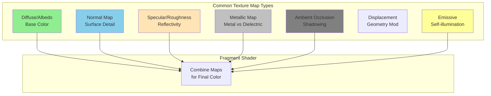

# Texture Basics

## Introduction to Textures

Textures are one of the most fundamental tools in computer graphics for adding detail and realism to 3D models without increasing geometric complexity. A texture is essentially an image that is mapped onto the surface of a 3D object, providing color, detail, and surface properties that would be prohibitively expensive to model with geometry alone.

The concept of texture mapping was introduced by Edwin Catmull in his 1974 PhD thesis, revolutionizing computer graphics by allowing rich surface detail with minimal geometric cost. Today, textures are used not just for color but also for normals, displacement, reflectivity, and countless other surface properties.

## What Are Textures?

A texture is a 2D image (or sometimes 1D or 3D data) that gets mapped onto a 3D surface. The simplest form is a color texture (also called a diffuse map or albedo map) that defines the base color of each point on the surface.

Textures are stored as regular 2D images with dimensions typically in powers of two (256x256, 512x512, 1024x1024, etc.) for efficient GPU memory management, though modern hardware is less strict about this requirement.

### Types of Textures



**Diffuse/Albedo Maps**: Define the base color of the surface
**Normal Maps**: Encode surface normal perturbations for lighting
**Specular Maps**: Control shininess and reflectivity
**Roughness Maps**: Define surface microsurface roughness
**Metallic Maps**: Indicate metallic vs dielectric surfaces
**Ambient Occlusion**: Pre-computed shadowing in crevices
**Displacement Maps**: Actually modify geometry
**Emissive Maps**: Define self-illuminating areas

## Texture Coordinates

To map a 2D texture onto a 3D surface, we need texture coordinates (also called UV coordinates). These are 2D coordinates assigned to each vertex of a 3D model that specify which part of the texture corresponds to that vertex.

### UV Coordinate System

The texture coordinate system is typically defined as:
- **U axis**: Horizontal direction (usually 0 to 1, left to right)
- **V axis**: Vertical direction (usually 0 to 1, bottom to top)

The origin (0, 0) is conventionally at the bottom-left corner of the texture, and (1, 1) is at the top-right corner. Some systems (like DirectX) use the top-left as the origin.

```python
import numpy as np

class TextureCoordinate:
    """Represents a UV texture coordinate."""

    def __init__(self, u, v):
        """
        Initialize texture coordinate.

        Args:
            u: Horizontal coordinate [0, 1]
            v: Vertical coordinate [0, 1]
        """
        self.u = u
        self.v = v

    def wrap(self, mode='repeat'):
        """
        Apply wrapping mode to coordinates.

        Args:
            mode: 'repeat', 'clamp', or 'mirror'

        Returns:
            TextureCoordinate: Wrapped coordinate
        """
        if mode == 'repeat':
            # Tile the texture
            u = self.u % 1.0
            v = self.v % 1.0
        elif mode == 'clamp':
            # Clamp to [0, 1]
            u = max(0.0, min(1.0, self.u))
            v = max(0.0, min(1.0, self.v))
        elif mode == 'mirror':
            # Mirror at boundaries
            u = self.u % 2.0
            v = self.v % 2.0
            if u > 1.0:
                u = 2.0 - u
            if v > 1.0:
                v = 2.0 - v
        else:
            u, v = self.u, self.v

        return TextureCoordinate(u, v)

    def __repr__(self):
        return f"UV({self.u:.3f}, {self.v:.3f})"
```

## Texture Mapping Process

The process of applying a texture to a surface involves several steps:

```mermaid
flowchart LR
    subgraph Model["3D Model"]
        V[Vertices with<br/>UV Coordinates]
    end

    subgraph Rasterize["Rasterization"]
        I[Interpolate UVs<br/>per Fragment]
    end

    subgraph Sample["Texture Lookup"]
        T[Sample Texture<br/>at (u, v)]
        F[Apply Filtering<br/>Bilinear/Trilinear]
    end

    subgraph Result["Output"]
        C[Fragment Color]
    end

    V --> I
    I --> T
    T --> F
    F --> C

    style V fill:#87ceeb
    style I fill:#ffe4b5
    style T fill:#90ee90
    style F fill:#dda0dd
    style C fill:#ff9999
```

1. **Vertex UV Assignment**: Each vertex in the 3D model has UV coordinates
2. **Interpolation**: UV coordinates are interpolated across triangle faces
3. **Texture Lookup**: The interpolated UV is used to sample the texture
4. **Filtering**: Multiple texels may be combined (covered in texture filtering)

### Mathematical Formulation

For a triangle with vertices V₀, V₁, V₂ and corresponding texture coordinates (u₀, v₀), (u₁, v₁), (u₂, v₂), any point P inside the triangle can be expressed using barycentric coordinates:

```
P = w₀V₀ + w₁V₁ + w₂V₂
```

where w₀ + w₁ + w₂ = 1 and all weights are non-negative.

The texture coordinate at P is then:

```
u = w₀u₀ + w₁u₁ + w₂u₂
v = w₀v₀ + w₁v₁ + w₂v₂
```

## Texture Sampling

Once we have UV coordinates, we need to sample the texture to get a color value. This involves converting from normalized UV coordinates to pixel coordinates (texels).

```python
class Texture:
    """Simple texture class for sampling."""

    def __init__(self, image_data):
        """
        Initialize texture with image data.

        Args:
            image_data: numpy array of shape (height, width, channels)
        """
        self.data = image_data
        self.height, self.width = image_data.shape[:2]

    def sample(self, u, v, wrap_mode='repeat'):
        """
        Sample texture at given UV coordinates.

        Args:
            u: U coordinate
            v: V coordinate
            wrap_mode: How to handle coordinates outside [0, 1]

        Returns:
            Color value at (u, v)
        """
        # Apply wrapping
        uv = TextureCoordinate(u, v).wrap(wrap_mode)

        # Convert to pixel coordinates
        # Note: V is flipped because images are stored top-to-bottom
        x = uv.u * (self.width - 1)
        y = (1.0 - uv.v) * (self.height - 1)

        # Nearest neighbor sampling (simple version)
        x_int = int(round(x))
        y_int = int(round(y))

        # Clamp to valid range
        x_int = max(0, min(self.width - 1, x_int))
        y_int = max(0, min(self.height - 1, y_int))

        return self.data[y_int, x_int]

    def sample_bilinear(self, u, v, wrap_mode='repeat'):
        """
        Sample texture using bilinear interpolation.

        Args:
            u: U coordinate
            v: V coordinate
            wrap_mode: How to handle coordinates outside [0, 1]

        Returns:
            Interpolated color value
        """
        uv = TextureCoordinate(u, v).wrap(wrap_mode)

        # Convert to continuous pixel coordinates
        x = uv.u * (self.width - 1)
        y = (1.0 - uv.v) * (self.height - 1)

        # Get integer and fractional parts
        x0 = int(np.floor(x))
        y0 = int(np.floor(y))
        x1 = min(x0 + 1, self.width - 1)
        y1 = min(y0 + 1, self.height - 1)

        fx = x - x0
        fy = y - y0

        # Sample four nearest texels
        c00 = self.data[y0, x0]
        c10 = self.data[y0, x1]
        c01 = self.data[y1, x0]
        c11 = self.data[y1, x1]

        # Bilinear interpolation
        c0 = c00 * (1 - fx) + c10 * fx
        c1 = c01 * (1 - fx) + c11 * fx
        color = c0 * (1 - fy) + c1 * fy

        return color
```

## Texture Wrapping Modes

When UV coordinates fall outside the [0, 1] range, we need to decide how to handle them:

### Repeat (Tile)

The texture repeats infinitely. UV coordinates are taken modulo 1:

```
u_wrapped = u % 1.0
v_wrapped = v % 1.0
```

This is useful for tiling patterns like brick walls or floor tiles.

### Clamp to Edge

Coordinates are clamped to [0, 1]:

```
u_wrapped = clamp(u, 0.0, 1.0)
v_wrapped = clamp(v, 0.0, 1.0)
```

This prevents repeating but can create visible seams.

### Mirror

The texture mirrors at each boundary:

```python
def mirror_wrap(coord):
    """Mirror wrap a coordinate."""
    coord = coord % 2.0
    if coord > 1.0:
        coord = 2.0 - coord
    return coord
```

### Border Color

Coordinates outside [0, 1] return a specified border color.

## Texture Resolution and Texels

A **texel** (texture element) is the fundamental unit of a texture, analogous to a pixel in an image. The resolution of a texture determines how much detail it can store:

- **256×256**: 65,536 texels - low resolution
- **512×512**: 262,144 texels - medium resolution
- **1024×1024**: 1,048,576 texels - high resolution
- **2048×2048**: 4,194,304 texels - very high resolution
- **4096×4096**: 16,777,216 texels - ultra high resolution

## Texture Memory Considerations

Texture memory usage is a critical concern in real-time graphics:

```python
def calculate_texture_memory(width, height, channels=3, bytes_per_channel=1):
    """
    Calculate memory usage for a texture.

    Args:
        width: Texture width in pixels
        height: Texture height in pixels
        channels: Number of color channels (3 for RGB, 4 for RGBA)
        bytes_per_channel: Bytes per channel (1 for 8-bit, 4 for 32-bit float)

    Returns:
        Memory usage in bytes
    """
    return width * height * channels * bytes_per_channel

# Examples
memory_512 = calculate_texture_memory(512, 512, 4)  # 1 MB for RGBA
memory_2k = calculate_texture_memory(2048, 2048, 4)  # 16 MB
memory_4k = calculate_texture_memory(4096, 4096, 4)  # 64 MB

print(f"512×512 RGBA: {memory_512 / (1024**2):.2f} MB")
print(f"2048×2048 RGBA: {memory_2k / (1024**2):.2f} MB")
print(f"4096×4096 RGBA: {memory_4k / (1024**2):.2f} MB")
```

## Perspective-Correct Interpolation

A critical issue in texture mapping is ensuring that UV coordinates are interpolated correctly in perspective projection. Simply interpolating UV coordinates linearly in screen space produces incorrect results.

### The Problem

When a textured triangle is projected to screen space, the relationship between screen position and texture coordinate is non-linear due to perspective division.

### The Solution

Perspective-correct interpolation requires dividing interpolated values by the interpolated inverse depth (w component):

```python
def perspective_correct_interpolation(u0, u1, u2, w0, w1, w2, weights):
    """
    Perform perspective-correct interpolation of texture coordinates.

    Args:
        u0, u1, u2: UV coordinates at triangle vertices
        w0, w1, w2: W (depth) values at vertices
        weights: Barycentric weights (λ₀, λ₁, λ₂)

    Returns:
        Perspective-correct interpolated UV coordinate
    """
    b0, b1, b2 = weights

    # Interpolate u/w
    u_over_w = (u0/w0) * b0 + (u1/w1) * b1 + (u2/w2) * b2

    # Interpolate 1/w
    one_over_w = (1/w0) * b0 + (1/w1) * b1 + (1/w2) * b2

    # Recover perspective-correct u
    u_correct = u_over_w / one_over_w

    return u_correct
```

## Texture Atlases

A texture atlas combines multiple textures into a single large texture. This reduces texture binding overhead and improves performance:

```python
class TextureAtlas:
    """Manages a texture atlas with multiple sub-textures."""

    def __init__(self, width, height):
        """Initialize empty atlas."""
        self.width = width
        self.height = height
        self.regions = {}
        self.data = np.zeros((height, width, 3))

    def add_texture(self, name, texture, x, y):
        """
        Add a texture to the atlas at position (x, y).

        Args:
            name: Identifier for this texture region
            texture: Image data to add
            x, y: Position in atlas
        """
        h, w = texture.shape[:2]

        # Store the texture data
        self.data[y:y+h, x:x+w] = texture

        # Store UV coordinates for this region
        u_min = x / self.width
        v_min = y / self.height
        u_max = (x + w) / self.width
        v_max = (y + h) / self.height

        self.regions[name] = {
            'uv_min': (u_min, v_min),
            'uv_max': (u_max, v_max)
        }

    def get_uv_for_region(self, name, local_u, local_v):
        """
        Convert local UV coordinates to atlas UV coordinates.

        Args:
            name: Region name
            local_u, local_v: UV coordinates within the region [0, 1]

        Returns:
            Global atlas UV coordinates
        """
        region = self.regions[name]
        u_min, v_min = region['uv_min']
        u_max, v_max = region['uv_max']

        global_u = u_min + local_u * (u_max - u_min)
        global_v = v_min + local_v * (v_max - v_min)

        return (global_u, global_v)
```

## Common Artifacts and Issues

### Seams

Visible discontinuities where texture coordinates wrap or where UV islands meet. Solutions include:
- Padding texture edges
- Using seamless textures
- Careful UV layout

### Texture Swimming

When textures appear to slide across surfaces during animation, usually due to incorrect interpolation or insufficient texture resolution.

### Aliasing

When texture detail is finer than pixel resolution, causing flickering and moiré patterns. Addressed through filtering and mipmapping.

## Practical Example: Textured Quad

```python
import numpy as np
import matplotlib.pyplot as plt

def render_textured_quad(texture, uv_coords):
    """
    Render a textured quad with specified UV coordinates.

    Args:
        texture: Texture object
        uv_coords: UV coordinates for quad corners [(u0,v0), (u1,v1), ...]

    Returns:
        Rendered image
    """
    width, height = 256, 256
    output = np.zeros((height, width, 3))

    # Define quad corners in screen space
    screen_coords = [
        (50, 50),    # Bottom-left
        (206, 50),   # Bottom-right
        (206, 206),  # Top-right
        (50, 206)    # Top-left
    ]

    # Rasterize the quad
    for y in range(height):
        for x in range(width):
            # Check if point is inside quad (simplified)
            if (x >= screen_coords[0][0] and x <= screen_coords[1][0] and
                y >= screen_coords[0][1] and y <= screen_coords[2][1]):

                # Calculate barycentric coordinates (simplified for axis-aligned quad)
                u_param = (x - screen_coords[0][0]) / (screen_coords[1][0] - screen_coords[0][0])
                v_param = (y - screen_coords[0][1]) / (screen_coords[2][1] - screen_coords[0][1])

                # Bilinear interpolation of UV coordinates
                u = (1 - u_param) * (1 - v_param) * uv_coords[0][0] + \
                    u_param * (1 - v_param) * uv_coords[1][0] + \
                    u_param * v_param * uv_coords[2][0] + \
                    (1 - u_param) * v_param * uv_coords[3][0]

                v = (1 - u_param) * (1 - v_param) * uv_coords[0][1] + \
                    u_param * (1 - v_param) * uv_coords[1][1] + \
                    u_param * v_param * uv_coords[2][1] + \
                    (1 - u_param) * v_param * uv_coords[3][1]

                # Sample texture
                output[y, x] = texture.sample_bilinear(u, v)

    return output

# Example usage
checkerboard = create_checkerboard_texture(64, 64)
tex = Texture(checkerboard)
uv_coords = [(0, 0), (2, 0), (2, 2), (0, 2)]  # Repeat 2x2
result = render_textured_quad(tex, uv_coords)
```

## Conclusion

Texture mapping is fundamental to modern computer graphics, enabling rich surface detail without geometric complexity. Understanding texture coordinates, sampling methods, and wrapping modes is essential for any graphics programmer. The next topics will explore more advanced aspects of texturing, including UV mapping techniques, filtering methods, and specialized texture types like normal maps and environment maps.
