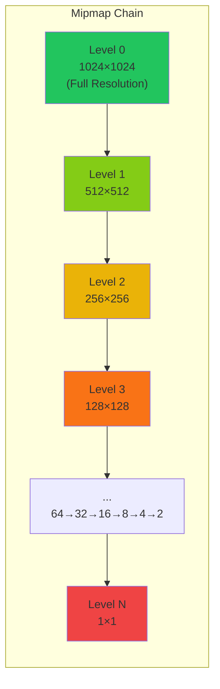

# Mipmapping

## Introduction to Mipmapping

Mipmapping is a technique for improving texture filtering quality and performance by pre-computing and storing multiple filtered versions of a texture at different resolutions. The term "mipmap" comes from the Latin phrase "multum in parvo" meaning "much in little," reflecting how multiple texture levels are stored together.

Introduced by Lance Williams in 1983, mipmapping has become a standard feature in graphics hardware and is essential for high-quality real-time rendering. Mipmaps solve the minification aliasing problem while also improving cache performance and rendering speed.

## The Minification Problem

When a texture is viewed from a distance, multiple texels may project onto a single pixel. Without mipmapping, this causes severe aliasing artifacts:

- **Moiré patterns**: Interference patterns from undersampling
- **Temporal aliasing**: Flickering as the camera moves
- **Shimmering**: Rapid changes in apparent texture detail
- **Performance degradation**: Reading many scattered texels is cache-inefficient

### Mathematical Analysis

Consider a pixel that covers an area in texture space. If we use only the full-resolution texture, we should theoretically average all texels within that area:

```
Color(pixel) = (1/A) ∫∫_A Texture(u, v) du dv
```

where A is the area covered by the pixel. This integral is expensive to compute in real-time.

## Mipmap Chain Structure

A mipmap chain is a sequence of textures, each half the resolution of the previous level:



- **Level 0**: Full resolution (e.g., 1024×1024)
- **Level 1**: Half resolution (512×512)
- **Level 2**: Quarter resolution (256×256)
- **Level 3**: 128×128
- ...
- **Level n**: 1×1 (single pixel)

```python
import numpy as np

def calculate_mipmap_levels(width, height):
    """
    Calculate the number of mipmap levels for a texture.

    Args:
        width: Texture width
        height: Texture height

    Returns:
        Number of mipmap levels
    """
    max_dimension = max(width, height)
    num_levels = int(np.floor(np.log2(max_dimension))) + 1
    return num_levels

# Examples
print(f"1024×1024: {calculate_mipmap_levels(1024, 1024)} levels")  # 11 levels
print(f"512×256: {calculate_mipmap_levels(512, 256)} levels")      # 10 levels
print(f"64×64: {calculate_mipmap_levels(64, 64)} levels")          # 7 levels
```

### Memory Overhead

The total memory used by a complete mipmap chain is approximately 1.33× the base level:

```
Total memory = base × (1 + 1/4 + 1/16 + 1/64 + ...) = base × 4/3
```

```python
def calculate_mipmap_memory(width, height, bytes_per_pixel=4):
    """
    Calculate total memory usage including all mipmap levels.

    Args:
        width: Base texture width
        height: Base texture height
        bytes_per_pixel: Bytes per pixel (4 for RGBA8)

    Returns:
        Total memory in bytes
    """
    total_memory = 0
    current_width = width
    current_height = height

    while current_width >= 1 and current_height >= 1:
        level_memory = current_width * current_height * bytes_per_pixel
        total_memory += level_memory

        current_width = max(1, current_width // 2)
        current_height = max(1, current_height // 2)

    return total_memory

# Example: 1024×1024 RGBA texture
base_memory = 1024 * 1024 * 4  # 4 MB
total_memory = calculate_mipmap_memory(1024, 1024, 4)  # ~5.33 MB
overhead = (total_memory - base_memory) / base_memory * 100
print(f"Memory overhead: {overhead:.1f}%")  # 33.3%
```

## Generating Mipmaps

### Box Filter Method

The simplest mipmap generation method averages 2×2 blocks of texels:

```python
def generate_mipmap_level_box(source):
    """
    Generate next mipmap level using box filter (2×2 average).

    Args:
        source: Source texture array (height, width, channels)

    Returns:
        Downsampled texture (height/2, width/2, channels)
    """
    height, width = source.shape[:2]
    new_height = max(1, height // 2)
    new_width = max(1, width // 2)

    # Handle odd dimensions
    if height == 1 and width == 1:
        return source

    result = np.zeros((new_height, new_width, source.shape[2]))

    for y in range(new_height):
        for x in range(new_width):
            # Source coordinates
            sy0 = y * 2
            sy1 = min(sy0 + 1, height - 1)
            sx0 = x * 2
            sx1 = min(sx0 + 1, width - 1)

            # Average 2×2 block
            result[y, x] = (
                source[sy0, sx0] +
                source[sy0, sx1] +
                source[sy1, sx0] +
                source[sy1, sx1]
            ) / 4.0

    return result

def generate_mipmap_chain_box(base_texture):
    """
    Generate complete mipmap chain using box filter.

    Args:
        base_texture: Base level texture

    Returns:
        List of mipmap levels [level0, level1, level2, ...]
    """
    mipmaps = [base_texture]
    current = base_texture

    while current.shape[0] > 1 or current.shape[1] > 1:
        current = generate_mipmap_level_box(current)
        mipmaps.append(current)

    return mipmaps
```

### Gaussian Filter Method

A Gaussian filter produces higher quality mipmaps with less aliasing:

```python
def generate_mipmap_level_gaussian(source, kernel_size=5):
    """
    Generate next mipmap level using Gaussian filter.

    Args:
        source: Source texture array
        kernel_size: Size of Gaussian kernel (odd number)

    Returns:
        Downsampled texture
    """
    from scipy.ndimage import gaussian_filter

    # Apply Gaussian blur before downsampling
    # Sigma chosen to prevent aliasing
    sigma = 0.5
    blurred = gaussian_filter(source, sigma=(sigma, sigma, 0))

    # Downsample by taking every other pixel
    height, width = source.shape[:2]
    new_height = max(1, height // 2)
    new_width = max(1, width // 2)

    downsampled = blurred[::2, ::2]

    # Handle odd dimensions
    if downsampled.shape[0] != new_height or downsampled.shape[1] != new_width:
        downsampled = downsampled[:new_height, :new_width]

    return downsampled
```

### Lanczos Filter Method

Lanczos resampling provides even higher quality with sharper results:

```python
def lanczos_kernel(x, a=3):
    """
    Lanczos kernel function.

    Args:
        x: Distance from center
        a: Lanczos parameter (typically 2 or 3)

    Returns:
        Kernel weight
    """
    if x == 0:
        return 1.0
    elif abs(x) < a:
        return (a * np.sin(np.pi * x) * np.sin(np.pi * x / a)) / (np.pi**2 * x**2)
    else:
        return 0.0

def generate_mipmap_level_lanczos(source, a=3):
    """
    Generate next mipmap level using Lanczos filter.

    Args:
        source: Source texture array
        a: Lanczos parameter

    Returns:
        Downsampled texture
    """
    height, width = source.shape[:2]
    new_height = max(1, height // 2)
    new_width = max(1, width // 2)

    result = np.zeros((new_height, new_width, source.shape[2]))

    # For each output pixel
    for y in range(new_height):
        for x in range(new_width):
            # Source center position
            src_x = (x + 0.5) * 2.0
            src_y = (y + 0.5) * 2.0

            # Accumulate weighted samples
            total_weight = 0.0
            accumulated = np.zeros(source.shape[2])

            # Sample in a window around the center
            for dy in range(-a, a + 1):
                for dx in range(-a, a + 1):
                    sx = int(src_x + dx)
                    sy = int(src_y + dy)

                    # Clamp to texture bounds
                    sx = max(0, min(width - 1, sx))
                    sy = max(0, min(height - 1, sy))

                    # Calculate weight
                    dist_x = abs(src_x - sx)
                    dist_y = abs(src_y - sy)
                    weight = lanczos_kernel(dist_x, a) * lanczos_kernel(dist_y, a)

                    accumulated += source[sy, sx] * weight
                    total_weight += weight

            if total_weight > 0:
                result[y, x] = accumulated / total_weight

    return result
```

## LOD Selection

Level of Detail (LOD) selection determines which mipmap level(s) to use for rendering a pixel.

### Basic LOD Calculation

The LOD is determined by the rate of change of texture coordinates with respect to screen coordinates:

```
λ = log₂(max(√((∂u/∂x)² + (∂v/∂x)²), √((∂u/∂y)² + (∂v/∂y)²)))
```

```python
def calculate_lod(du_dx, du_dy, dv_dx, dv_dy, texture_width, texture_height):
    """
    Calculate mipmap LOD based on texture coordinate derivatives.

    Args:
        du_dx: Change in u per screen x pixel
        du_dy: Change in u per screen y pixel
        dv_dx: Change in v per screen x pixel
        dv_dy: Change in v per screen y pixel
        texture_width: Width of base texture
        texture_height: Height of base texture

    Returns:
        LOD level (0 = full resolution, higher = lower resolution)
    """
    # Scale by texture dimensions
    du_dx_scaled = du_dx * texture_width
    du_dy_scaled = du_dy * texture_width
    dv_dx_scaled = dv_dx * texture_height
    dv_dy_scaled = dv_dy * texture_height

    # Calculate derivative magnitudes
    delta_max_sqr_x = du_dx_scaled**2 + dv_dx_scaled**2
    delta_max_sqr_y = du_dy_scaled**2 + dv_dy_scaled**2

    # Take maximum
    delta_max_sqr = max(delta_max_sqr_x, delta_max_sqr_y)

    # LOD is log2 of the magnitude
    if delta_max_sqr <= 1.0:
        return 0.0
    else:
        return 0.5 * np.log2(delta_max_sqr)
```

### Derivative Estimation

In rasterization, derivatives are estimated using differences between adjacent pixels:

```python
def estimate_texture_derivatives(uv_center, uv_right, uv_up):
    """
    Estimate texture coordinate derivatives using finite differences.

    Args:
        uv_center: (u, v) at current pixel
        uv_right: (u, v) at pixel to the right
        uv_up: (u, v) at pixel above

    Returns:
        (du_dx, du_dy, dv_dx, dv_dy)
    """
    # Derivatives with respect to screen x
    du_dx = uv_right[0] - uv_center[0]
    dv_dx = uv_right[1] - uv_center[1]

    # Derivatives with respect to screen y
    du_dy = uv_up[0] - uv_center[0]
    dv_dy = uv_up[1] - uv_center[1]

    return du_dx, du_dy, dv_dx, dv_dy
```

## Mipmap Sampling Modes

### Nearest Mipmap Selection

Select the single closest mipmap level:

```python
def sample_mipmap_nearest(mipmaps, u, v, lod):
    """
    Sample using nearest mipmap level selection.

    Args:
        mipmaps: List of mipmap levels
        u, v: Texture coordinates
        lod: Calculated LOD

    Returns:
        Sampled color
    """
    # Round to nearest integer level
    level = int(round(lod))
    level = max(0, min(len(mipmaps) - 1, level))

    # Sample from selected level (using bilinear)
    return BilinearFilter.sample(mipmaps[level], u, v)
```

### Trilinear Mipmap Selection

Interpolate between two adjacent mipmap levels (covered in detail in texture filtering):

```python
def sample_mipmap_trilinear(mipmaps, u, v, lod):
    """
    Sample using trilinear mipmap selection.

    Args:
        mipmaps: List of mipmap levels
        u, v: Texture coordinates
        lod: Calculated LOD

    Returns:
        Trilinearly filtered color
    """
    # Get two levels to interpolate between
    level0 = int(np.floor(lod))
    level1 = level0 + 1

    # Clamp to valid range
    level0 = max(0, min(len(mipmaps) - 1, level0))
    level1 = max(0, min(len(mipmaps) - 1, level1))

    # Interpolation factor
    frac = lod - int(np.floor(lod))

    # Sample both levels
    color0 = BilinearFilter.sample(mipmaps[level0], u, v)
    color1 = BilinearFilter.sample(mipmaps[level1], u, v)

    # Linear interpolation between levels
    result = color0 * (1.0 - frac) + color1 * frac

    return result
```

## LOD Bias

LOD bias allows adjusting the mipmap selection to make textures sharper (negative bias) or blurrier (positive bias):

```
LOD_final = LOD_calculated + LOD_bias
```

```python
class MipmapSampler:
    """Mipmap sampler with LOD bias control."""

    def __init__(self, mipmaps, lod_bias=0.0):
        """
        Initialize sampler.

        Args:
            mipmaps: Mipmap chain
            lod_bias: LOD bias (-∞ to +∞, typically -2 to +2)
        """
        self.mipmaps = mipmaps
        self.lod_bias = lod_bias

    def sample(self, u, v, lod):
        """Sample with LOD bias applied."""
        biased_lod = lod + self.lod_bias
        return sample_mipmap_trilinear(self.mipmaps, u, v, biased_lod)

# Negative bias = sharper (use higher resolution levels)
sharp_sampler = MipmapSampler(mipmaps, lod_bias=-0.5)

# Positive bias = blurrier (use lower resolution levels)
blurry_sampler = MipmapSampler(mipmaps, lod_bias=0.5)
```

## Special Cases

### Non-Power-of-Two Textures

Modern GPUs support NPOT (Non-Power-of-Two) textures, but mipmap generation requires care:

```python
def generate_npot_mipmap_level(source):
    """
    Generate mipmap level for non-power-of-two texture.

    Args:
        source: Source texture (any dimensions)

    Returns:
        Downsampled texture
    """
    height, width = source.shape[:2]

    # Always divide by 2, round down, minimum 1
    new_height = max(1, height // 2)
    new_width = max(1, width // 2)

    # Use high-quality resampling for NPOT textures
    from scipy.ndimage import zoom

    # Calculate zoom factors
    zoom_y = new_height / height
    zoom_x = new_width / width

    # Resample
    result = zoom(source, (zoom_y, zoom_x, 1), order=3)  # Cubic interpolation

    return result
```

### Anisotropic Mipmaps (Ripmaps)

Ripmaps extend mipmaps to allow independent scaling in each dimension, useful for anisotropic filtering:

```python
def generate_ripmap_chain(base_texture):
    """
    Generate ripmap chain (mipmaps in both dimensions independently).

    Args:
        base_texture: Base level texture

    Returns:
        2D list: ripmaps[x_level][y_level]
    """
    width, height = base_texture.shape[1], base_texture.shape[0]
    max_x_levels = int(np.log2(width)) + 1
    max_y_levels = int(np.log2(height)) + 1

    ripmaps = [[None] * max_y_levels for _ in range(max_x_levels)]
    ripmaps[0][0] = base_texture

    # Generate levels with reduced width
    for x_level in range(1, max_x_levels):
        ripmaps[x_level][0] = downsample_horizontal(ripmaps[x_level-1][0])

    # Generate levels with reduced height
    for y_level in range(1, max_y_levels):
        ripmaps[0][y_level] = downsample_vertical(ripmaps[0][y_level-1])

    # Generate combined levels
    for x_level in range(1, max_x_levels):
        for y_level in range(1, max_y_levels):
            ripmaps[x_level][y_level] = downsample_vertical(
                ripmaps[x_level][y_level-1]
            )

    return ripmaps
```

Note: Ripmaps use 3× memory instead of 1.33×, so they're rarely used in practice.

## Performance Benefits

### Cache Efficiency

Mipmaps improve cache performance by ensuring that nearby screen pixels access nearby texels:

```python
def estimate_cache_efficiency(lod, pixel_spacing):
    """
    Estimate texture cache efficiency.

    Args:
        lod: Mipmap level being used
        pixel_spacing: Distance between pixels in screen space

    Returns:
        Estimated cache hit rate
    """
    # At appropriate LOD, adjacent pixels access adjacent texels
    texels_per_pixel = 2 ** lod

    # If texels_per_pixel ≈ 1, cache efficiency is high
    if 0.5 <= texels_per_pixel <= 2.0:
        return 0.9  # ~90% hit rate
    else:
        return 0.5  # ~50% hit rate
```

### Bandwidth Reduction

Using appropriate mipmaps reduces memory bandwidth:

```python
def compare_bandwidth(use_mipmaps=True):
    """
    Compare memory bandwidth with and without mipmaps.

    Returns:
        Bandwidth reduction percentage
    """
    # Without mipmaps: must read many texels from full-res texture
    # With mipmaps: read fewer texels from appropriate level

    if use_mipmaps:
        # Average case: reading from level 2 (quarter resolution)
        texels_per_pixel = 4  # 4 texels for bilinear
        bandwidth_factor = 1.0
    else:
        # Must sample many texels from full resolution
        # Approximation: 16x16 area covered
        texels_per_pixel = 256
        bandwidth_factor = 64.0

    reduction = (1.0 - 1.0/bandwidth_factor) * 100
    return reduction

print(f"Bandwidth reduction: {compare_bandwidth():.1f}%")
```

## Conclusion

Mipmapping is one of the most important optimizations in texture mapping, providing both quality improvements (reduced aliasing) and performance benefits (better cache usage, reduced bandwidth). Modern graphics hardware includes dedicated circuitry for mipmap generation and sampling, making it essentially free in real-time applications. Understanding LOD calculation and mipmap generation is essential for any graphics programmer working with textured surfaces.
