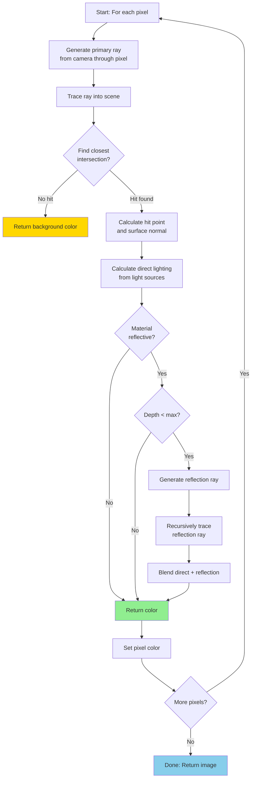

# Ray Tracing Introduction

## What is Ray Tracing?

Ray tracing is a rendering technique that simulates the physical behavior of light by tracing rays from a virtual camera through each pixel into a 3D scene. Unlike rasterization (the traditional real-time rendering approach), ray tracing follows rays as they bounce through the scene, naturally handling reflections, refractions, shadows, and global illumination.

The fundamental principle of ray tracing comes from geometric optics: light travels in straight lines (rays), and we can simulate its behavior by following these rays backward from the camera to light sources.

## Ray Tracing vs Rasterization

### Rasterization (Traditional Approach)

Rasterization projects 3D geometry onto a 2D screen by processing triangles:

**Process**:
1. Transform vertices to screen space
2. For each triangle, determine which pixels it covers
3. Interpolate attributes (color, normal, etc.) across pixels
4. Apply lighting and texturing per pixel

**Characteristics**:
- **Speed**: Very fast, heavily optimized in GPU hardware
- **Complexity**: O(n) where n = number of triangles
- **Limitations**: Difficult to handle reflections, refractions, shadows
- **Quality**: Approximations needed for realistic lighting

### Ray Tracing

Ray tracing casts rays from the camera through pixels into the scene:

**Process**:
1. For each pixel, generate a ray from camera through pixel
2. Find closest intersection with scene geometry
3. Calculate lighting, potentially casting additional rays
4. Recursively trace reflected and refracted rays

**Characteristics**:
- **Speed**: Slower, but improving with modern hardware (RTX)
- **Complexity**: O(n log n) with acceleration structures
- **Strengths**: Natural reflections, refractions, shadows, global illumination
- **Quality**: Physically accurate lighting

```python
import numpy as np

# Rasterization pseudocode
def rasterize_scene(triangles, camera):
    """Rasterization approach."""
    image = create_image()

    for triangle in triangles:
        # Project triangle to screen
        screen_triangle = project_to_screen(triangle, camera)

        # Find covered pixels
        for pixel in pixels_covered_by(screen_triangle):
            # Interpolate attributes
            color = interpolate_color(pixel, screen_triangle)

            # Simple lighting
            color = apply_lighting(color, pixel.normal)

            image[pixel] = color

    return image

# Ray tracing pseudocode
def ray_trace_scene(scene, camera, width, height):
    """Ray tracing approach."""
    image = create_image(width, height)

    for y in range(height):
        for x in range(width):
            # Generate ray through pixel
            ray = generate_camera_ray(camera, x, y, width, height)

            # Trace ray to find color
            color = trace_ray(ray, scene, depth=0, max_depth=5)

            image[y, x] = color

    return image

def trace_ray(ray, scene, depth, max_depth):
    """Recursively trace a ray."""
    if depth > max_depth:
        return background_color()

    # Find closest intersection
    hit = find_closest_intersection(ray, scene)

    if not hit:
        return background_color()

    # Calculate direct lighting
    color = calculate_lighting(hit, scene)

    # Trace reflection ray
    if hit.material.reflective:
        reflection_ray = calculate_reflection_ray(ray, hit)
        reflection_color = trace_ray(reflection_ray, scene, depth + 1, max_depth)
        color += hit.material.reflectivity * reflection_color

    return color
```

## The Ray Tracing Algorithm

### Algorithm Flow



### Core Algorithm

```python
class Ray:
    """Represents a ray in 3D space."""

    def __init__(self, origin, direction):
        """
        Initialize ray.

        Args:
            origin: Ray origin point (3D)
            direction: Ray direction (normalized 3D vector)
        """
        self.origin = np.array(origin, dtype=float)
        self.direction = np.array(direction, dtype=float)
        self.direction = self.direction / np.linalg.norm(self.direction)

    def point_at(self, t):
        """
        Get point along ray at parameter t.

        Args:
            t: Distance along ray

        Returns:
            Point at origin + t * direction
        """
        return self.origin + t * self.direction

class Camera:
    """Simple perspective camera."""

    def __init__(self, position, look_at, up, fov, aspect_ratio):
        """
        Initialize camera.

        Args:
            position: Camera position
            look_at: Point camera is looking at
            up: Up vector
            fov: Vertical field of view in degrees
            aspect_ratio: Width / height
        """
        self.position = np.array(position, dtype=float)

        # Calculate camera basis vectors
        self.forward = np.array(look_at) - self.position
        self.forward = self.forward / np.linalg.norm(self.forward)

        self.right = np.cross(self.forward, np.array(up))
        self.right = self.right / np.linalg.norm(self.right)

        self.up = np.cross(self.right, self.forward)

        # Calculate viewport dimensions
        theta = np.radians(fov)
        viewport_height = 2.0 * np.tan(theta / 2.0)
        viewport_width = aspect_ratio * viewport_height

        self.viewport_height = viewport_height
        self.viewport_width = viewport_width

    def generate_ray(self, u, v):
        """
        Generate ray through pixel at normalized coordinates (u, v).

        Args:
            u: Horizontal coordinate [0, 1]
            v: Vertical coordinate [0, 1]

        Returns:
            Ray through pixel
        """
        # Convert to [-1, 1] centered at origin
        x = (u - 0.5) * self.viewport_width
        y = (v - 0.5) * self.viewport_height

        # Calculate ray direction in world space
        direction = (self.forward +
                    x * self.right +
                    y * self.up)
        direction = direction / np.linalg.norm(direction)

        return Ray(self.position, direction)

def simple_ray_tracer(scene, camera, width, height, max_depth=5):
    """
    Simple ray tracer implementation.

    Args:
        scene: Scene containing objects
        camera: Camera object
        width: Image width
        height: Image height
        max_depth: Maximum recursion depth

    Returns:
        Rendered image (height × width × 3)
    """
    image = np.zeros((height, width, 3))

    for y in range(height):
        for x in range(width):
            # Calculate normalized pixel coordinates
            u = (x + 0.5) / width
            v = (y + 0.5) / height

            # Generate ray
            ray = camera.generate_ray(u, v)

            # Trace ray
            color = trace_ray_recursive(ray, scene, 0, max_depth)

            image[y, x] = color

    return image

def trace_ray_recursive(ray, scene, depth, max_depth):
    """
    Recursively trace ray through scene.

    Args:
        ray: Ray to trace
        scene: Scene objects
        depth: Current recursion depth
        max_depth: Maximum recursion depth

    Returns:
        Color (RGB)
    """
    # Termination condition
    if depth >= max_depth:
        return np.array([0, 0, 0])

    # Find closest intersection
    hit = find_closest_hit(ray, scene)

    if hit is None:
        # No intersection - return background color
        return get_background_color(ray.direction)

    # Calculate direct illumination
    direct_color = calculate_direct_lighting(hit, scene)

    # Handle reflective materials
    if hit.material.reflectivity > 0:
        # Generate reflection ray
        reflection_dir = reflect(ray.direction, hit.normal)
        reflection_ray = Ray(hit.point + hit.normal * 0.001, reflection_dir)

        # Recursively trace reflection
        reflection_color = trace_ray_recursive(
            reflection_ray, scene, depth + 1, max_depth
        )

        # Blend based on reflectivity
        direct_color = (direct_color * (1 - hit.material.reflectivity) +
                       reflection_color * hit.material.reflectivity)

    return direct_color
```

## Ray Generation

### Primary Rays

Primary rays originate from the camera and pass through image pixels:

```python
def generate_primary_rays(camera, width, height):
    """
    Generate all primary rays for an image.

    Args:
        camera: Camera object
        width: Image width
        height: Image height

    Yields:
        (x, y, ray) tuples
    """
    for y in range(height):
        for x in range(width):
            # Pixel center
            u = (x + 0.5) / width
            v = (y + 0.5) / height

            ray = camera.generate_ray(u, v)
            yield (x, y, ray)
```

### Anti-Aliasing with Multiple Samples

```python
def generate_antialiased_rays(camera, width, height, samples_per_pixel=4):
    """
    Generate multiple rays per pixel for anti-aliasing.

    Args:
        camera: Camera object
        width: Image width
        height: Image height
        samples_per_pixel: Number of samples per pixel

    Yields:
        (x, y, rays) tuples where rays is list of samples
    """
    for y in range(height):
        for x in range(width):
            rays = []

            for sample in range(samples_per_pixel):
                # Random offset within pixel
                offset_x = np.random.random()
                offset_y = np.random.random()

                u = (x + offset_x) / width
                v = (y + offset_y) / height

                ray = camera.generate_ray(u, v)
                rays.append(ray)

            yield (x, y, rays)

def render_with_antialiasing(scene, camera, width, height, samples=4):
    """Render with anti-aliasing."""
    image = np.zeros((height, width, 3))

    for x, y, rays in generate_antialiased_rays(camera, width, height, samples):
        color = np.zeros(3)

        # Average color from all samples
        for ray in rays:
            color += trace_ray_recursive(ray, scene, 0, 5)

        image[y, x] = color / len(rays)

    return image
```

## Reflection and Refraction

### Reflection Vector

The reflection vector formula:

$$\mathbf{R} = \mathbf{I} - 2(\mathbf{N} \cdot \mathbf{I})\mathbf{N}$$

where:
- $\mathbf{R}$ = reflection direction
- $\mathbf{I}$ = incident ray direction
- $\mathbf{N}$ = surface normal

```python
def reflect(incident, normal):
    """
    Calculate reflection vector.

    Args:
        incident: Incident ray direction (normalized)
        normal: Surface normal (normalized)

    Returns:
        Reflection direction (normalized)
    """
    # R = I - 2(N·I)N
    return incident - 2 * np.dot(incident, normal) * normal
```

### Refraction Vector

Snell's law for refraction:

$$\eta_1 \sin(\theta_1) = \eta_2 \sin(\theta_2)$$

where:
- $\eta_1$, $\eta_2$ = indices of refraction for the two media
- $\theta_1$ = angle of incidence
- $\theta_2$ = angle of refraction

The refraction vector can be computed as:

$$\mathbf{T} = \eta \mathbf{I} + (\eta \cos(\theta_1) - \cos(\theta_2))\mathbf{N}$$

where $\eta = \frac{\eta_1}{\eta_2}$

```python
def refract(incident, normal, eta):
    """
    Calculate refraction vector using Snell's law.

    Args:
        incident: Incident ray direction (normalized)
        normal: Surface normal (normalized)
        eta: Ratio of indices of refraction (n1/n2)

    Returns:
        Refraction direction or None if total internal reflection
    """
    cos_i = -np.dot(incident, normal)

    # Check if ray is entering or exiting
    if cos_i < 0:
        # Exiting - flip normal and eta
        cos_i = -cos_i
        normal = -normal
        eta = 1.0 / eta

    # Calculate discriminant
    sin_t_squared = eta * eta * (1.0 - cos_i * cos_i)

    # Total internal reflection
    if sin_t_squared > 1.0:
        return None

    cos_t = np.sqrt(1.0 - sin_t_squared)

    # Refraction vector
    refraction = eta * incident + (eta * cos_i - cos_t) * normal

    return refraction / np.linalg.norm(refraction)
```

## Direct Lighting

```python
def calculate_direct_lighting(hit, scene):
    """
    Calculate direct lighting at hit point.

    Args:
        hit: Hit information (point, normal, material)
        scene: Scene with lights and objects

    Returns:
        RGB color
    """
    color = np.zeros(3)

    # Ambient light
    color += hit.material.color * scene.ambient_light

    # For each light source
    for light in scene.lights:
        # Direction to light
        light_dir = light.position - hit.point
        distance = np.linalg.norm(light_dir)
        light_dir = light_dir / distance

        # Check if light is visible (shadow ray)
        shadow_ray = Ray(hit.point + hit.normal * 0.001, light_dir)

        if not is_in_shadow(shadow_ray, scene, distance):
            # Lambertian diffuse
            n_dot_l = max(0, np.dot(hit.normal, light_dir))
            diffuse = hit.material.color * light.color * n_dot_l

            # Attenuation
            attenuation = 1.0 / (distance * distance)

            color += diffuse * attenuation

    return np.clip(color, 0, 1)

def is_in_shadow(shadow_ray, scene, max_distance):
    """
    Check if point is in shadow.

    Args:
        shadow_ray: Ray from surface to light
        scene: Scene objects
        max_distance: Distance to light

    Returns:
        True if in shadow
    """
    hit = find_closest_hit(shadow_ray, scene)

    # Check if something blocks the light
    if hit and hit.t < max_distance:
        return True

    return False
```

## Background/Environment

```python
def get_background_color(direction):
    """
    Calculate background color (e.g., sky gradient).

    Args:
        direction: Ray direction

    Returns:
        RGB color
    """
    # Normalize direction
    direction = direction / np.linalg.norm(direction)

    # Use Y component for gradient
    t = 0.5 * (direction[1] + 1.0)

    # Lerp between colors
    color_bottom = np.array([1.0, 1.0, 1.0])  # White
    color_top = np.array([0.5, 0.7, 1.0])      # Sky blue

    return (1.0 - t) * color_bottom + t * color_top
```

## Advantages of Ray Tracing

1. **Physically Accurate**: Naturally simulates light transport
2. **Reflections**: Perfect reflections with no preprocessing
3. **Refractions**: Transparent materials handled correctly
4. **Shadows**: Accurate hard and soft shadows
5. **Global Illumination**: Can simulate indirect lighting
6. **Depth of Field**: Natural camera effects
7. **Caustics**: Light focusing through refractive materials

## Challenges

1. **Performance**: Much slower than rasterization
2. **Noise**: Requires many samples for smooth results
3. **Complexity**: Needs acceleration structures for speed
4. **Memory**: May require significant memory for complex scenes

## Modern Ray Tracing

Modern GPUs (NVIDIA RTX, AMD RDNA 2) include dedicated ray tracing hardware:

- **RT Cores**: Accelerate ray-triangle intersection tests
- **BVH Traversal**: Hardware-accelerated acceleration structure traversal
- **Denoising**: AI-based denoising to reduce required samples
- **Hybrid Rendering**: Combining rasterization with ray tracing

```python
# Pseudocode for hybrid approach
def hybrid_render(scene, camera):
    """Hybrid rasterization + ray tracing."""

    # Rasterize geometry (fast)
    gbuffer = rasterize_geometry(scene, camera)

    # Use ray tracing for specific effects
    for pixel in gbuffer:
        # Ray traced reflections
        if pixel.material.reflective:
            pixel.color += trace_reflection(pixel)

        # Ray traced shadows
        pixel.color *= trace_shadow(pixel, scene.lights)

    return gbuffer
```

## Conclusion

Ray tracing provides a physically accurate rendering approach that naturally handles effects difficult or impossible with rasterization. While traditionally too slow for real-time use, modern hardware acceleration and hybrid techniques are making ray tracing practical for interactive applications. Understanding the fundamental algorithm is essential for implementing advanced rendering techniques like path tracing, photon mapping, and physically-based rendering.
