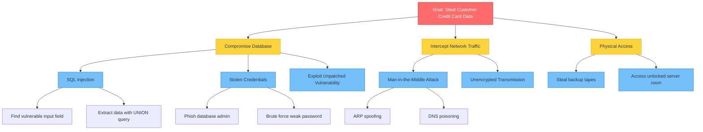

# Threat Modeling

## Introduction

Threat modeling is a structured approach to identifying, evaluating, and addressing potential security threats to a system. Rather than reacting to attacks after they occur, threat modeling enables proactive security by systematically analyzing how systems might be attacked and implementing defenses before deployment.

Think of threat modeling as defensive security planning: understanding your adversaries, identifying vulnerabilities, and building appropriate defenses before attackers can exploit them.

## Why Threat Modeling Matters

### Benefits of Threat Modeling

- **Early Detection**: Identify security issues during design, when fixes are cheaper
- **Prioritization**: Focus resources on the most critical threats
- **Communication**: Provide a framework for discussing security with stakeholders
- **Compliance**: Document security analysis for regulatory requirements
- **Risk Management**: Make informed decisions about security trade-offs

### Cost of Late-Stage Security Fixes

Studies show that fixing security vulnerabilities costs exponentially more as development progresses:

- **Design phase**: 1x cost
- **Development phase**: 5x cost
- **Testing phase**: 10x cost
- **Production**: 30x-100x cost (includes breach costs, emergency patches, reputation damage)

## The Threat Modeling Process

### Four Key Questions

Every threat modeling exercise answers these questions:

1. **What are we building?** Understanding system architecture and data flows
2. **What can go wrong?** Identifying potential threats
3. **What should we do about it?** Determining appropriate mitigations
4. **Did we do a good job?** Validating the threat model

### When to Threat Model

- **New systems**: Before development begins
- **Major changes**: When adding significant features or integrations
- **Periodic review**: Annually or after significant security events
- **Before deployment**: As part of security review process

## STRIDE Methodology

STRIDE is a widely-used threat modeling framework developed by Microsoft. It categorizes threats into six types based on the security property they violate.

### STRIDE Categories

#### 1. Spoofing (Attacks on Authentication)

Pretending to be someone or something you're not.

**Examples:**
- Using stolen credentials to access accounts
- Impersonating legitimate websites (phishing)
- MAC address spoofing on networks
- Session hijacking

**Mitigations:**
```python
# Strong authentication with multi-factor authentication
class AuthenticationSystem:
    def authenticate_user(self, username, password, mfa_token=None):
        """Multi-layered authentication to prevent spoofing"""

        # First factor: Something you know (password)
        user = self.verify_password(username, password)
        if not user:
            self.log_failed_attempt(username, 'invalid_password')
            return None

        # Second factor: Something you have (MFA token)
        if self.requires_mfa(user):
            if not mfa_token:
                return {'status': 'mfa_required', 'user_id': user.id}

            if not self.verify_mfa_token(user, mfa_token):
                self.log_failed_attempt(username, 'invalid_mfa')
                return None

        # Additional checks
        if self.is_suspicious_login(user):
            # Require additional verification for unusual login patterns
            return {'status': 'additional_verification_required', 'user_id': user.id}

        # Create secure session
        session = self.create_secure_session(user)
        self.log_successful_login(user)

        return {'status': 'success', 'session': session}

    def verify_password(self, username, password):
        """Verify password using secure hashing"""
        import bcrypt

        user = self.db.get_user_by_username(username)
        if not user:
            # Perform dummy hash to prevent timing attacks
            bcrypt.hashpw(b"dummy", bcrypt.gensalt())
            return None

        if bcrypt.checkpw(password.encode(), user.password_hash):
            return user

        return None
```

#### 2. Tampering (Attacks on Integrity)

Unauthorized modification of data or code.

**Examples:**
- Modifying data in transit (man-in-the-middle)
- Altering database records
- Changing configuration files
- Code injection attacks

**Mitigations:**
```python
import hashlib
import hmac

class IntegrityProtection:
    def __init__(self, secret_key):
        self.secret_key = secret_key

    def protect_data(self, data):
        """Add integrity protection to data"""
        # Serialize data
        import json
        data_bytes = json.dumps(data).encode('utf-8')

        # Calculate HMAC
        mac = hmac.new(
            self.secret_key,
            data_bytes,
            hashlib.sha256
        ).hexdigest()

        # Return data with integrity tag
        return {
            'data': data,
            'mac': mac
        }

    def verify_data(self, protected_data):
        """Verify data hasn't been tampered with"""
        import json

        data = protected_data['data']
        received_mac = protected_data['mac']

        # Recalculate HMAC
        data_bytes = json.dumps(data).encode('utf-8')
        expected_mac = hmac.new(
            self.secret_key,
            data_bytes,
            hashlib.sha256
        ).hexdigest()

        # Constant-time comparison to prevent timing attacks
        if not hmac.compare_digest(expected_mac, received_mac):
            raise ValueError("Data integrity check failed - possible tampering")

        return data

# Usage
protector = IntegrityProtection(secret_key=b'secret-key-here')

# Protect data
original_data = {'amount': 100, 'account': '12345'}
protected = protector.protect_data(original_data)

# Verify data integrity
try:
    verified_data = protector.verify_data(protected)
    print("Data integrity verified:", verified_data)
except ValueError as e:
    print("Tampering detected:", e)
```

#### 3. Repudiation (Attacks on Non-repudiation)

Denying that an action was performed.

**Examples:**
- Claiming you didn't send an email
- Denying a transaction occurred
- Disputing changes to a document

**Mitigations:**
```python
from datetime import datetime
import hashlib

class AuditLogger:
    """Comprehensive audit logging for non-repudiation"""

    def __init__(self, storage):
        self.storage = storage

    def log_action(self, user_id, action, resource, details=None):
        """Create immutable audit log entry"""

        # Previous log hash for chain integrity
        previous_hash = self.get_latest_log_hash()

        audit_entry = {
            'timestamp': datetime.utcnow().isoformat(),
            'user_id': user_id,
            'action': action,
            'resource': resource,
            'details': details or {},
            'ip_address': self.get_client_ip(),
            'user_agent': self.get_user_agent(),
            'previous_hash': previous_hash
        }

        # Calculate hash of this entry
        entry_hash = self.calculate_hash(audit_entry)
        audit_entry['hash'] = entry_hash

        # Store in append-only log
        self.storage.append(audit_entry)

        return entry_hash

    def calculate_hash(self, entry):
        """Calculate hash for audit entry"""
        import json

        # Create deterministic string representation
        entry_string = json.dumps(entry, sort_keys=True)
        return hashlib.sha256(entry_string.encode()).hexdigest()

    def verify_audit_trail(self):
        """Verify integrity of entire audit trail"""
        entries = self.storage.get_all_entries()

        for i in range(1, len(entries)):
            current = entries[i]
            previous = entries[i-1]

            # Verify chain integrity
            if current['previous_hash'] != previous['hash']:
                return False, f"Chain broken at entry {i}"

            # Verify entry hash
            entry_copy = current.copy()
            stored_hash = entry_copy.pop('hash')
            calculated_hash = self.calculate_hash(entry_copy)

            if stored_hash != calculated_hash:
                return False, f"Entry {i} has been tampered with"

        return True, "Audit trail is intact"

# Usage
logger = AuditLogger(storage=AuditStorage())

# Log critical actions
logger.log_action(
    user_id='user123',
    action='TRANSFER_FUNDS',
    resource='account:98765',
    details={'amount': 5000, 'destination': 'account:12345'}
)

# Later, verify the audit trail hasn't been tampered with
is_valid, message = logger.verify_audit_trail()
print(message)
```

#### 4. Information Disclosure (Attacks on Confidentiality)

Exposing information to unauthorized parties.

**Examples:**
- SQL injection revealing database contents
- Error messages exposing system details
- Unencrypted data transmission
- Verbose logging containing sensitive data

**Mitigations:**
```python
class SecureErrorHandler:
    """Handle errors without disclosing sensitive information"""

    def __init__(self, debug_mode=False):
        self.debug_mode = debug_mode

    def handle_error(self, error, request_id):
        """Return safe error messages to users, log details internally"""

        # Log full error details for administrators
        self.log_detailed_error(error, request_id)

        # Return sanitized error to user
        if self.debug_mode:
            # In development, show more details
            return {
                'error': 'An error occurred',
                'type': type(error).__name__,
                'request_id': request_id
            }
        else:
            # In production, show minimal information
            return {
                'error': 'An error occurred. Please contact support with reference ID.',
                'request_id': request_id
            }

    def log_detailed_error(self, error, request_id):
        """Log complete error details to secure location"""
        import traceback

        log_entry = {
            'request_id': request_id,
            'timestamp': datetime.utcnow().isoformat(),
            'error_type': type(error).__name__,
            'error_message': str(error),
            'stack_trace': traceback.format_exc()
        }

        # Log to secure, access-controlled location
        self.secure_logger.log(log_entry)

class DataMinimization:
    """Return only necessary data to prevent information disclosure"""

    def get_user_profile(self, requesting_user_id, target_user_id):
        """Return different data based on who's requesting"""

        user = self.db.get_user(target_user_id)

        # Public profile (minimal information)
        public_profile = {
            'user_id': user.id,
            'display_name': user.display_name,
            'avatar_url': user.avatar_url
        }

        # If user is requesting their own profile
        if requesting_user_id == target_user_id:
            return {
                **public_profile,
                'email': user.email,
                'phone': user.phone,
                'created_at': user.created_at,
                'preferences': user.preferences
            }

        # If requesting another user's profile
        return public_profile
```

#### 5. Denial of Service (Attacks on Availability)

Making systems unavailable to legitimate users.

**Examples:**
- Overwhelming servers with traffic (DDoS)
- Resource exhaustion attacks
- Application crashes
- Filling up disk space

**Mitigations:**
```python
from collections import defaultdict
from datetime import datetime, timedelta
import threading

class DoSProtection:
    """Multiple layers of DoS protection"""

    def __init__(self):
        self.rate_limiter = RateLimiter()
        self.resource_monitor = ResourceMonitor()
        self.request_validator = RequestValidator()

    def process_request(self, request):
        """Filter requests through multiple DoS protections"""

        # 1. Rate limiting
        if not self.rate_limiter.is_allowed(request.client_ip):
            return {'error': 'Rate limit exceeded', 'retry_after': 60}

        # 2. Request validation (detect malformed/malicious requests)
        if not self.request_validator.is_valid(request):
            return {'error': 'Invalid request'}

        # 3. Resource check
        if not self.resource_monitor.has_capacity():
            return {'error': 'Service temporarily unavailable', 'status': 503}

        # 4. Request size limits
        if request.size > self.max_request_size:
            return {'error': 'Request too large'}

        # Process legitimate request
        return self.handle_request(request)

class ResourceMonitor:
    """Monitor and limit resource usage"""

    def __init__(self, max_cpu=80, max_memory=80, max_connections=1000):
        self.max_cpu = max_cpu
        self.max_memory = max_memory
        self.max_connections = max_connections
        self.current_connections = 0
        self.lock = threading.Lock()

    def has_capacity(self):
        """Check if system has capacity for new requests"""
        import psutil

        # Check CPU usage
        if psutil.cpu_percent(interval=0.1) > self.max_cpu:
            return False

        # Check memory usage
        if psutil.virtual_memory().percent > self.max_memory:
            return False

        # Check connection limit
        with self.lock:
            if self.current_connections >= self.max_connections:
                return False

        return True

    def acquire_connection(self):
        """Track connection usage"""
        with self.lock:
            if self.current_connections >= self.max_connections:
                raise Exception("Connection limit reached")
            self.current_connections += 1

    def release_connection(self):
        """Release connection slot"""
        with self.lock:
            self.current_connections -= 1
```

#### 6. Elevation of Privilege (Attacks on Authorization)

Gaining higher privileges than authorized.

**Examples:**
- Exploiting buffer overflows to gain root access
- SQL injection to bypass authentication
- Exploiting misconfigurations to access admin functions
- Horizontal privilege escalation (accessing other users' data)

**Mitigations:**
```python
class AuthorizationEnforcement:
    """Enforce authorization at multiple levels"""

    def __init__(self):
        self.permissions = PermissionStore()

    def check_permission(self, user, action, resource):
        """Verify user has permission for action on resource"""

        # 1. Check if user is authenticated
        if not user.is_authenticated():
            raise PermissionError("Authentication required")

        # 2. Check if user account is active
        if not user.is_active():
            raise PermissionError("Account is not active")

        # 3. Check specific permission
        if not self.permissions.has_permission(user, action, resource):
            # Log unauthorized access attempt
            self.log_unauthorized_access(user, action, resource)
            raise PermissionError(f"User {user.id} not authorized for {action} on {resource}")

        # 4. Check for additional constraints
        if not self.check_time_based_access(user, action):
            raise PermissionError("Access not allowed at this time")

        if not self.check_location_based_access(user):
            raise PermissionError("Access not allowed from this location")

        return True

    def require_permission(self, action, resource_type):
        """Decorator to enforce permissions on functions"""
        def decorator(func):
            def wrapper(user, resource_id, *args, **kwargs):
                # Load resource
                resource = self.load_resource(resource_type, resource_id)

                # Check permission before executing
                self.check_permission(user, action, resource)

                # Execute function
                return func(user, resource, *args, **kwargs)

            return wrapper
        return decorator

# Usage
auth = AuthorizationEnforcement()

@auth.require_permission('delete', 'document')
def delete_document(user, document):
    """Can only be called if user has delete permission"""
    document.delete()
    return {'status': 'deleted'}

# Principle of least privilege
class LeastPrivilegeExample:
    """Grant minimum necessary permissions"""

    def create_database_user(self, app_name):
        """Create database user with minimal permissions"""

        # Don't use root credentials for applications
        # Create specific user with only needed permissions

        username = f"{app_name}_user"

        permissions = {
            'web_app': ['SELECT', 'INSERT', 'UPDATE'],  # No DELETE or DROP
            'reporting_app': ['SELECT'],  # Read-only
            'admin_tool': ['SELECT', 'INSERT', 'UPDATE', 'DELETE']
        }

        granted_permissions = permissions.get(app_name, ['SELECT'])

        sql = f"""
        CREATE USER '{username}'@'localhost' IDENTIFIED BY '{self.generate_strong_password()}';
        GRANT {', '.join(granted_permissions)} ON app_database.* TO '{username}'@'localhost';
        FLUSH PRIVILEGES;
        """

        return username
```

## Attack Trees

Attack trees are a structured way to model how attackers might compromise a system. The root of the tree is the attacker's goal, and branches represent different paths to achieve it.

### Creating an Attack Tree

Attack trees visualize all possible attack vectors and help prioritize defenses:



**Using Attack Trees for Risk Analysis:**
- Each node can be assigned a probability and cost
- AND nodes require all sub-attacks to succeed
- OR nodes require only one sub-attack to succeed
- Helps identify the most cost-effective defenses

### Analyzing Attack Trees

```python
class AttackTreeAnalyzer:
    """Analyze attack trees to prioritize defenses"""

    def analyze_path(self, attack_path):
        """Evaluate attack path difficulty and impact"""

        # Factors to consider
        analysis = {
            'likelihood': self.calculate_likelihood(attack_path),
            'impact': self.calculate_impact(attack_path),
            'cost_to_attacker': self.estimate_attacker_cost(attack_path),
            'cost_to_defend': self.estimate_defense_cost(attack_path),
            'detection_difficulty': self.assess_detection_difficulty(attack_path)
        }

        # Calculate risk score
        analysis['risk_score'] = analysis['likelihood'] * analysis['impact']

        # Calculate ROI of defending
        analysis['defense_roi'] = (
            analysis['risk_score'] * self.expected_loss
        ) / analysis['cost_to_defend']

        return analysis

    def prioritize_defenses(self, attack_tree):
        """Recommend which defenses to implement first"""

        # Analyze all attack paths
        path_analyses = [
            self.analyze_path(path) for path in attack_tree.get_all_paths()
        ]

        # Sort by defense ROI (highest first)
        path_analyses.sort(key=lambda x: x['defense_roi'], reverse=True)

        # Return prioritized recommendations
        recommendations = []
        for analysis in path_analyses:
            recommendations.append({
                'attack_path': analysis['path'],
                'risk_score': analysis['risk_score'],
                'recommended_controls': self.recommend_controls(analysis)
            })

        return recommendations
```

## Threat Assessment

### DREAD Scoring

DREAD is a risk assessment model for rating threats:

- **Damage Potential**: How severe is the impact?
- **Reproducibility**: How easy is it to reproduce the attack?
- **Exploitability**: How much effort is required to exploit?
- **Affected Users**: How many users are impacted?
- **Discoverability**: How easy is it to find the vulnerability?

```python
class ThreatAssessment:
    """Assess and prioritize threats using DREAD"""

    def calculate_dread_score(self, threat):
        """Calculate DREAD score (0-10 scale for each factor)"""

        # Each factor rated 0-10
        damage = self.rate_damage(threat)              # 0-10
        reproducibility = self.rate_reproducibility(threat)  # 0-10
        exploitability = self.rate_exploitability(threat)    # 0-10
        affected_users = self.rate_affected_users(threat)    # 0-10
        discoverability = self.rate_discoverability(threat)  # 0-10

        # Average score
        dread_score = (
            damage + reproducibility + exploitability +
            affected_users + discoverability
        ) / 5

        return {
            'overall_score': dread_score,
            'damage': damage,
            'reproducibility': reproducibility,
            'exploitability': exploitability,
            'affected_users': affected_users,
            'discoverability': discoverability,
            'priority': self.get_priority(dread_score)
        }

    def get_priority(self, score):
        """Convert DREAD score to priority level"""
        if score >= 8:
            return 'CRITICAL'
        elif score >= 6:
            return 'HIGH'
        elif score >= 4:
            return 'MEDIUM'
        else:
            return 'LOW'
```

## Practical Threat Modeling Exercise

### Example: E-Commerce Application

```python
class EcommerceThreatModel:
    """Threat model for an e-commerce system"""

    def identify_assets(self):
        """What are we protecting?"""
        return {
            'customer_pii': {
                'value': 'high',
                'data': ['names', 'addresses', 'emails', 'phone numbers']
            },
            'payment_data': {
                'value': 'critical',
                'data': ['credit cards', 'bank accounts']
            },
            'user_accounts': {
                'value': 'high',
                'data': ['credentials', 'order history']
            },
            'business_data': {
                'value': 'medium',
                'data': ['inventory', 'pricing', 'sales analytics']
            }
        }

    def identify_entry_points(self):
        """Where can attackers interact with the system?"""
        return [
            'web_application',
            'mobile_api',
            'admin_portal',
            'payment_gateway',
            'third_party_integrations'
        ]

    def apply_stride_to_components(self):
        """Apply STRIDE to each component"""

        components = {
            'login_system': {
                'spoofing': 'Stolen credentials, session hijacking',
                'tampering': 'Modify authentication tokens',
                'repudiation': 'Deny fraudulent purchases',
                'info_disclosure': 'Enumerate valid usernames',
                'dos': 'Brute force login attempts',
                'elevation': 'Bypass authentication'
            },
            'shopping_cart': {
                'spoofing': 'Not applicable',
                'tampering': 'Modify prices, quantities',
                'repudiation': 'Deny placing order',
                'info_disclosure': 'Access other users\' carts',
                'dos': 'Create excessive cart entries',
                'elevation': 'Access admin pricing functions'
            }
        }

        return components

    def determine_mitigations(self):
        """What controls should we implement?"""

        return {
            'login_system': {
                'spoofing': [
                    'Multi-factor authentication',
                    'Strong password requirements',
                    'Session timeout',
                    'Suspicious login detection'
                ],
                'dos': [
                    'Rate limiting on login attempts',
                    'CAPTCHA after failed attempts',
                    'Account lockout policies'
                ]
            },
            'shopping_cart': {
                'tampering': [
                    'Server-side price validation',
                    'Signed shopping cart data',
                    'Integrity checks before checkout'
                ],
                'elevation': [
                    'Strict authorization checks',
                    'Separation of user and admin functions',
                    'Audit logging of price overrides'
                ]
            }
        }
```

## Conclusion

Threat modeling is an essential practice for building secure systems. By systematically analyzing potential threats during the design phase, you can:

- Identify vulnerabilities before attackers do
- Build security into systems from the ground up
- Allocate security resources effectively
- Communicate security concerns to stakeholders
- Create more secure products

STRIDE provides a comprehensive framework for categorizing threats, attack trees help visualize attack paths, and risk assessment methodologies like DREAD help prioritize remediation efforts.

## Key Takeaways

- Threat modeling should begin during the design phase
- STRIDE categorizes threats: Spoofing, Tampering, Repudiation, Information Disclosure, Denial of Service, Elevation of Privilege
- Attack trees visualize different paths attackers might take
- Risk assessment helps prioritize which threats to address first
- Effective threat modeling requires understanding both the system and potential attackers
- Threat models should be living documents, updated as systems evolve
